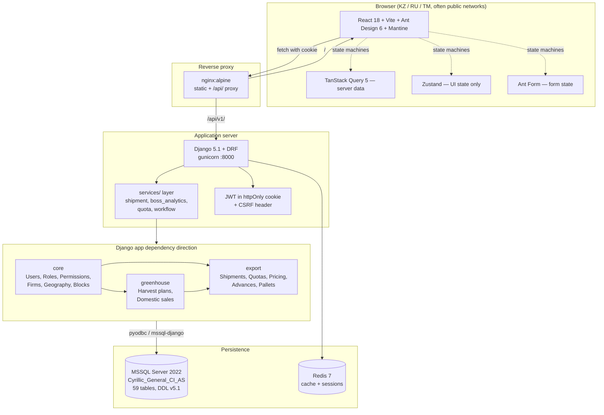

# YGT Platform — Onboarding

> Single entry point for understanding the codebase. Links the existing canonical sources in reading order; does not duplicate them.

**What this is:** Django + React platform replacing Excel-based greenhouse tomato export operations for YGT Holding. Used by 12 roles across Turkmenistan, Kazakhstan, and Russia. MSSQL backend (DDL v5.1). Current focus: P3 Export module.

**Scale today (verified 2026-04-27):**

| | Count |
|---|---|
| Django apps | 3 (`core`, `export`, `greenhouse`) |
| Model classes | 42 across 23 model files |
| API endpoints | 24 router-registered viewsets + 10 path() views |
| Management commands | 14 (data import + seeding) |
| Backend tests | ~116 across 6 test files |
| Frontend pages | 59 `.tsx` files across 5 modules |
| Shared components | 29 |
| TanStack Query hooks | 16 |
| Routes (React Router) | 33 |
| i18n keys per language | ~1,375 (3 languages: tk/ru/en) |
| Database tables (DDL) | 59 across 6 domains |
| Migration files | core 13 + export 20 + greenhouse 2 = 35 |

---

## 1. Read in this order

**Day 1 — orient yourself (1–2 hours):**

1. [`CLAUDE.md`](../CLAUDE.md) — project rules, critical "do not violate" list (MSSQL, AD-1, dependency direction)
2. [`docs/DOMAIN.md`](DOMAIN.md) — what the business actually does (roles, lifecycle, firms, quotas)
3. [`docs/obsidian/00-index.md`](obsidian/00-index.md) — knowledge base index (process map, role list, screen list)
4. This doc, sections 2–5 below — the codebase tour

**Day 2 — pick your specialism:**

| If you're working on… | Start here |
|---|---|
| Backend (Django, MSSQL) | `.claude/rules/backend-arch.md` → `docs/obsidian/reference/data-model-map.md` → `database/ygt_platform_ddl_v5_1.sql` |
| Frontend (React, TS) | `.claude/rules/frontend-arch.md` → `.claude/rules/api-contract.md` → `docs/obsidian/reference/api-endpoint-map.md` |
| Database / migrations | `database/ygt_platform_ddl_v5_1.sql` → `.claude/rules/mssql-compat.md` → `docs/ADR.md` (AD-1, AD-2, AD-3) |
| The shipment lifecycle | `docs/obsidian/processes/shipment-lifecycle.md` → `docs/obsidian/reference/status-codes.md` → `backend/apps/export/models/shipment.py` |
| Quota system | `docs/QUOTA_SYSTEM.md` → `docs/obsidian/processes/quota-management.md` → `backend/apps/export/models/quota.py` |
| Permissions / RBAC | `docs/obsidian/processes/permissions-system.md` → `backend/apps/core/permission_registry.py` |

**When you forget where something lives:** `CLAUDE.md` has a "Where to find things" table at the bottom that points to every authoritative source.

---

## 2. Architecture at a glance



**The hard rules (violations break production):**

- **Module dependency**: `core ← greenhouse ← export ← contracts ← finance` — never reverse
- **Cross-app FKs**: string references only, e.g. `'core.ExportFirm'` — never `from apps.core.models import ExportFirm`
- **No Django signals** — use explicit service calls
- **Status transitions**: only via `Shipment.transition_to()` — never direct `status_id = X`
- **AD-1 timestamps** (`departed_at`, `arrived_at`, etc.) on Shipment are written **only** by `transition_to()`
- **MSSQL forbidden**: `JSONField`, `ArrayField`, `.distinct('field')`, `bulk_create` without `batch_size=500`
- **Auth**: httpOnly cookie JWT — never localStorage
- **API field names ≠ DB columns** — serializers map `code → cargo_code`, `weight_net_kg → weight_net`

Full list: [`CLAUDE.md`](../CLAUDE.md) → "Critical rules" section.

---

## 3. Backend tour

**Stack:** Django 5.1 · DRF 3.15 · Python 3.12 · `mssql-django` 1.4 · `pyodbc` 5.1 · Redis 7

### 3.1 Apps and what they own

| App | Owns | Imports from |
|---|---|---|
| `core` | Users, roles, dynamic permission registry, reference data (countries, cities, firms, blocks, varieties, crate types, status types) | nothing |
| `greenhouse` | Block manager assignments, weekly harvest plans, domestic sales | `core` |
| `export` | Shipment lifecycle, quotas, pricing, advances, local sell plans, truck allocation, pallets, audit log, notifications | `core`, `greenhouse` |

`contracts/`, `finance/`, `transport/` exist in the dependency rules but are not yet built — current focus is the P3 Export module.

### 3.2 Where business logic lives

- **Model methods** — status transitions, validation, calculated properties. Example: `Shipment.transition_to()` in `backend/apps/export/models/shipment.py`
- **`services/` package** — multi-model operations. The `export/services/` directory was recently split out of the old monolithic `services.py`:
  - `export/services/shipment.py` — shipment CRUD + lifecycle transitions
  - `export/services/boss_analytics.py` — BI aggregations for the Boss dashboard
  - `export/services_quota.py` — quota issuance and FIFO usage allocation
  - `core/services_workflow.py` — workflow state transitions
- **Serializers** — DB→API field renaming, nested object assembly
- **Views/ViewSets** — thin; delegate to model methods or `services/`. **Never put logic here.**
- **`validators.py`** — shipment cargo-code, weight, and freshness validation (new module, currently uncommitted)

### 3.3 API surface

All endpoints under `/api/v1/{app}/{resource}/`. Pagination is `PageNumberPagination` (default 50, max 200). Errors return JSON `{ "error": "..." }` or DRF field-validation dicts. Timestamps are ISO 8601 with timezone.

- **Field-naming contract:** [`.claude/rules/api-contract.md`](../.claude/rules/api-contract.md)
- **Endpoint-to-page-to-model map:** [`docs/obsidian/reference/api-endpoint-map.md`](obsidian/reference/api-endpoint-map.md) ⚠ stale — see audit notes §6

Headline endpoints to know:

```
POST   /api/v1/auth/login/                      sets httpOnly cookie
GET    /api/v1/auth/me/                         { id, username, role, editable_fields[] }
GET    /api/v1/export/shipments/                list, supports ?my_work=true filter
GET    /api/v1/export/shipments/{id}/           detail with nested firm_splits, status_log, comments
POST   /api/v1/export/shipments/{id}/transition/ status machine — { new_status, comment }
POST   /api/v1/export/shipments/{id}/assign/    DRAFT → step 1 (per ADR-14)
POST   /api/v1/export/shipments/{id}/pallets/   pallet manifest entries
GET    /api/v1/export/quota-issuances/          government quotas
GET    /api/v1/export/boss-analytics/           BI rollups for Boss dashboard
```

### 3.4 Tests

```
backend/apps/export/
  tests.py                               17 tests (legacy, broad)
  tests_boss_analytics.py                43 tests
  tests_freshness.py                     11 tests
  tests_official_code_validator.py       17 tests
  tests_pallet_manifest.py               15 tests
  tests_shipment_sheet.py                13 tests
```

Run: `python manage.py test apps.export --verbosity=2`. Run a single class: `python manage.py test apps.export.tests_pallet_manifest.PalletManifestTests`.

### 3.5 Management commands

14 commands under `backend/apps/{core,export}/management/commands/`. The important ones:

| Command | Purpose |
|---|---|
| `seed_permissions` | Seed dynamic permission tables matching role defaults |
| `seed_crate_types` | Idempotent seed of CrateType reference data |
| `import_reference_data` | Firms, customers, cities from Excel |
| `import_shipments` | Bulk shipment import from `Export_contracts.xlsx` |
| `import_quotas`, `import_quota_usage` | Quota issuance + usage |
| `import_prices`, `import_domestic_prices` | Price tables |
| `import_harvest_plans`, `import_weekly_plans` | Greenhouse plans |
| `import_local_sales`, `import_sales_details` | Sales rollups |

Full list with one-line purposes: [`docs/obsidian/reference/data-imports.md`](obsidian/reference/data-imports.md).

---

## 4. Frontend tour

**Stack:** React 18.3 · TypeScript 5.6 (strict) · Vite 6 · Ant Design 6.3 · Mantine 7.17 · TanStack Query 5.6 · Zustand 5 · react-i18next · Dayjs

### 4.1 Pages by module (59 total)

| Module | Count | Notable pages |
|---|---|---|
| `pages/admin/` | 16 | Users, Permissions, ExportFirms, ImportFirms, Customers, Blocks, Seasons, TruckDestinations, ShipmentSettings (3 tabs) |
| `pages/auth/` | 2 | Login, Unauthorized |
| `pages/boss/` | 12 | BossDashboard + 11 widget components (KPIs, charts, drill-downs) |
| `pages/export/` | 28 | ShipmentList, ShipmentDetail, ShipmentDashboard, ShipmentSheet, KanbanBoard, DraftPool, AssignmentBoard, PalletManifest, QuotaDashboard (5 tabs), WeeklyPlanGrid, LocalSellPlanGrid, PricePanel, OverdueReports, AdvancesTracker, TruckForecast, BlockSummary, DomesticSales |
| `pages/` (root) | 1 | DashboardPage (post-login landing) |

### 4.2 State management — strict boundaries

| Data | Tool | Where |
|---|---|---|
| Server data | TanStack Query | `src/hooks/` (one file per resource) |
| Form state | Ant `Form.useForm()` | inline in component |
| URL filters | `useSearchParams` | inline in page |
| Cross-component UI state | Zustand | `src/stores/` (3 stores: auth, ui, sheet) |
| Single-component UI state | `useState` | inline |

**Never** put API data in Zustand. **Never** mirror form fields in `useState`. **Never** use React Context for cross-component state. Full rules: [`.claude/rules/frontend-arch.md`](../.claude/rules/frontend-arch.md).

### 4.3 Hooks (16 — one per API resource)

```
useAuth                useAdmin              useShipments
useShipmentDetail      useShipmentSheet      useDrafts
useNotifications       useQuotaDashboard     useQuotaUsage
usePlanning            useBossDashboard      usePallets
useAdvances            useOverdueShipments   useSheetCreate
useShipmentPatch
```

Each hook wraps a TanStack Query call. List queries return `{ count, next, previous, results }` to match the DRF pagination contract.

### 4.4 Shared components (29)

- **Self-fetching selects** (one query each, never duplicated in pages): `BlockSelect`, `CitySelect`, `CountrySelect`, `CrateTypeSelect`, `CustomerSelect`, `VarietySelect`
- **Layout**: `AppLayout`, `ProtectedRoute`
- **Domain widgets**: `StatusTag`, `DeadlineTimer`, `FreshnessPill`, `EChart`, `TransitionButton`, `CommentComposer`, `ShipmentCreateModal`
- **Subdirs**: `dashboard/` (7 files), `draft/` (2 files), `sheet/` (5 files)

### 4.5 i18n — strict three-language rule

Every user-visible string lives in `src/i18n/{tk,ru,en}.json` and is fetched via `useTranslation()`. Never hardcode. Never add a key to one file without all three. Keys use dot-notation namespaces: `shipment.create_button`, `users_admin.toast_created`. Full rules: [`.claude/rules/frontend-arch.md`](../.claude/rules/frontend-arch.md) → "Internationalisation" section.

### 4.6 Auth flow

- Login → `POST /api/v1/auth/login/` sets an httpOnly cookie
- Axios sends the cookie automatically; CSRF token added on POST/PUT/PATCH/DELETE via `X-CSRFToken` header
- 401 on any request → interceptor redirects to `/login`
- Role gating: `<ProtectedRoute roles={['export_manager']}>` wrapper around routes
- Role + editable-fields list: `GET /api/v1/auth/me/`

### 4.7 Mock mode

`VITE_USE_MOCK=true npm run dev` lets you build the frontend without the backend running. 10 mock files under `src/mock/` shaped to match real API responses.

---

## 5. Database tour

**Engine:** MSSQL Server 2022 · Database `YGT_Platform` · **Collation `Cyrillic_General_CI_AS`** (required for Turkmen/Russian text)

### 5.1 Schema source of truth

[`database/ygt_platform_ddl_v5_1.sql`](../database/ygt_platform_ddl_v5_1.sql) — 59 `CREATE TABLE` statements with all indexes and seed data. Read this when:
- A new model is being added — verify the column types match
- Migrating data — column names + max lengths matter
- Debugging a constraint violation

### 5.2 Tables by domain

| Domain | Count | Examples |
|---|---|---|
| `core` | 17 | seasons, countries, cities, border_points, loading_locations, varieties, product_types, status_types, blocks, export_firms, import_firms, customers, role_*_permissions, sys_users |
| `export` | 13 | shipments, shipment_status_log, shipment_firm_splits, shipment_block_sources, shipment_comments, sales_reports, quality_documents, quota_issuances, quota_issuance_firm_allocations, weekly_*, price_entries, finansist_advances |
| `contracts` | 8 | contracts, invoices, invoice_payments, pasport_sdelki, document_templates, generated_documents, firm/transport_documents |
| `finance` | 4 | payment_tracking, cash_planning, customer_ledgers, route_profitability |
| `greenhouse` | 8 | plant_registrations, pest_monitoring, fertilizer/chemical/irrigation/temperature records, fruit_weight_samples, daily_harvest, production_plans |
| `sys` | 2 | audit_log, notifications |

Domain table inventory + ER diagram: [`docs/obsidian/reference/data-model-map.md`](obsidian/reference/data-model-map.md) ⚠ stale — see §6.

### 5.3 MSSQL-specific landmines

These break production. Memorise them:

- No `JSONField`, no `ArrayField` — use a related table or a separate model
- No `.distinct('field_name')` (DISTINCT ON) — use a subquery with `ROW_NUMBER()`
- `bulk_create()` and `bulk_update()` always need `batch_size=500`
- Cyrillic CharField/TextField needs `db_collation='Cyrillic_General_CI_AS'`
- Money & weight: `DecimalField(max_digits=12, decimal_places=2)` — never `FloatField`
- `CharField(max_length=N)` — `max_length` is not optional

Full list with workarounds: [`.claude/rules/mssql-compat.md`](../.claude/rules/mssql-compat.md).

### 5.4 Architecture decisions to know before touching schema

[`docs/ADR.md`](ADR.md) — currently 14 entries (AD-001 through AD-014). The high-impact ones:

- **AD-1**: Denormalized timestamps on `shipment` (`departed_at`, `arrived_at`, …) — written **only** by `transition_to()`, never directly
- **AD-2**: `vehicle_status_note` is **deprecated** — use `vehicle_condition` enum + threaded comments
- **AD-3**: Status machine via the `TRANSITIONS` dict, validated server-side per role
- **AD-14**: Shipments are created in DRAFT (step_order=0) and transitioned to step 1 via `/assign/` — adds a 14th status to the original 13

### 5.5 Migrations

```
backend/apps/core/migrations/        13 files (0001_initial → 0013_add_boss_role)
backend/apps/export/migrations/      20 files (0001_initial → 0020_add_pallet_model)
backend/apps/greenhouse/migrations/   2 files
```

Recent additions (uncommitted as of 2026-04-27):
- `core/0010_add_variety_codes_and_seed`
- `core/0011_add_crate_type_and_weight_master_role`
- `core/0012_alter_rolefieldpermission_role_and_more`
- `core/0013_add_boss_role`
- `export/0019_add_dual_code_and_variety_confidence`
- `export/0020_add_pallet_model`

---

## 6. Audit findings — what's stale right now (2026-04-27)

The existing docs are mostly accurate but several recent additions haven't been written up. **Don't trust these specific claims until they're updated:**

### Drifted

1. `CLAUDE.md` and `obsidian/00-index.md` say **"13-step lifecycle"** → now **14** with the DRAFT step (AD-14)
2. `obsidian/00-index.md` says **"9 roles"** → code has **12** in `User.ROLE_CHOICES`: export_manager, warehouse_chief, weight_master, document_team, transport, sales_rep, finansist, director, accountant, greenhouse_manager, seller, boss
3. `CLAUDE.md` and `00-index.md` say **"AD-1 through AD-13"** → ADR.md has **AD-001 through AD-014**
4. `obsidian/reference/status-codes.md` says **"13 statuses"** → DRAFT (step 0) added; should be **14**

### Missing (code with no doc)

- **Pallet manifest** workflow — `export/models/pallet.py` + `pages/export/PalletManifest.tsx` exist; no `processes/pallet-manifest.md`
- **CrateType** reference model — not in `obsidian/reference/data-model-map.md`'s Core table
- **Weight Master role** (and Warehouse Chief, Director, Accountant, Seller) — no role doc under `obsidian/roles/`
- **`POST /shipments/{id}/assign/`** and **`POST /shipments/{id}/pallets/`** — not in `obsidian/reference/api-endpoint-map.md`
- **`export/services/` directory split** — architectural change from monolithic `services.py`, not in any doc
- **`export/validators.py`** — new validation module, undocumented

### Healthy (doc matches code)

- All 14 process docs in `obsidian/processes/` map cleanly to working code
- 8 of the 12 documented roles have accurate role-matrix entries
- ADR-001 through ADR-013 each have a clear code referent
- `.claude/rules/*` files (api-contract, backend-arch, frontend-arch, mssql-compat) are all current

---

## 7. Setup & run

### 7.1 Quickest path: Docker

```bash
# 1. Configure
cp .env.example .env             # change SECRET_KEY at minimum

# 2. Bring everything up
docker-compose up -d             # mssql + redis + backend + frontend + nginx

# 3. First-time database setup (only once)
docker-compose exec backend python manage.py migrate
docker-compose exec backend python manage.py seed_permissions
docker-compose exec backend python manage.py seed_crate_types
docker-compose exec backend python manage.py createsuperuser

# 4. Open
# Frontend:    http://localhost:3000   (or http://localhost via nginx)
# Backend API: http://localhost:8000/api/v1/
# Admin:       http://localhost:8000/admin/
```

Services exposed by `docker-compose.yml`:

| Service | Port | Notes |
|---|---|---|
| `db` (mssql/server:2022) | 1433 | `Cyrillic_General_CI_AS` collation, `mssql_data` volume |
| `redis` (7-alpine) | 6379 | `redis_data` volume |
| `backend` (gunicorn) | 8000 | mounts `./backend` for live reload |
| `frontend` (Vite build) | 3000 | served as static via nginx |
| `nginx` (alpine) | 80, 443 | proxies `/api/` to backend, `/` to frontend |

### 7.2 Local dev (no Docker)

Backend:

```bash
cd backend
python -m venv venv && source venv/bin/activate    # Linux/Mac
# or: .\venv\Scripts\activate                       # Windows PowerShell

pip install -r requirements.txt
cp ../.env.example .env                             # edit DB_HOST=localhost
python manage.py migrate
python manage.py seed_permissions
python manage.py seed_crate_types
python manage.py createsuperuser
python manage.py runserver                          # :8000
```

Frontend (in a second terminal):

```bash
cd frontend
npm install
# Mock mode (no backend needed):
VITE_USE_MOCK=true npm run dev
# Connected mode:
VITE_USE_MOCK=false VITE_API_URL=http://localhost:8000 npm run dev
```

You also need a running MSSQL — either via `docker-compose up -d db` or a native install. Database name `YGT_Platform`, user `sa`, default password from `.env.example`.

### 7.3 Environment variables

| Var | Default | Notes |
|---|---|---|
| `DB_PASSWORD` | `YgtPlatform2025!` | MSSQL `sa` password — change in production |
| `DB_NAME` | `YGT_Platform` | |
| `DB_USER` | `sa` | |
| `DB_HOST` | `localhost` (local) / `db` (compose) | |
| `DB_PORT` | `1433` | |
| `DJANGO_DEBUG` | `True` (local) / `False` (prod) | |
| `SECRET_KEY` | _(unset)_ | **must change** in production |
| `CORS_ALLOWED_ORIGINS` | `http://localhost:3000` | |
| `CSRF_TRUSTED_ORIGINS` | `http://localhost:3000` | |
| `VITE_API_URL` | (frontend) `http://localhost:8000` | |
| `VITE_USE_MOCK` | (frontend) `false` | `true` = no backend needed |

### 7.4 Pre-commit checks

```bash
python manage.py test apps.export --verbosity=0    # backend tests pass
python manage.py makemigrations --check            # no pending migrations
cd frontend && npm run type-check                  # no TypeScript errors
```

### 7.5 Login as each role

After `seed_permissions`, the seeded roles are: `export_manager`, `warehouse_chief`, `weight_master`, `document_team`, `transport`, `sales_rep`, `finansist`, `director`, `accountant`, `greenhouse_manager`, `seller`, `boss`. Create a test user per role via Django admin (`/admin/core/user/`) and assign the role to verify role-gated UI behaviour.

---

## 8. Where to file fixes

| If you change… | Also update… |
|---|---|
| A model | The corresponding entry in `docs/obsidian/reference/data-model-map.md` and DDL if shape changed |
| An API endpoint | `docs/obsidian/reference/api-endpoint-map.md` and the matching frontend hook |
| Status flow | `docs/obsidian/reference/status-codes.md` and `docs/obsidian/processes/shipment-lifecycle.md` |
| A page or component | The matching `docs/obsidian/processes/<process>.md` |
| Permissions | `docs/obsidian/processes/permissions-system.md` |
| Architectural decision | New entry in `docs/ADR.md` (next number) + reference it from this doc + `CLAUDE.md` |
| Anything | `CHANGELOG.md` — required after every feature/fix |

The convention: code is the source of truth, but `docs/obsidian/` is the canonical narrative. Don't let them drift.
