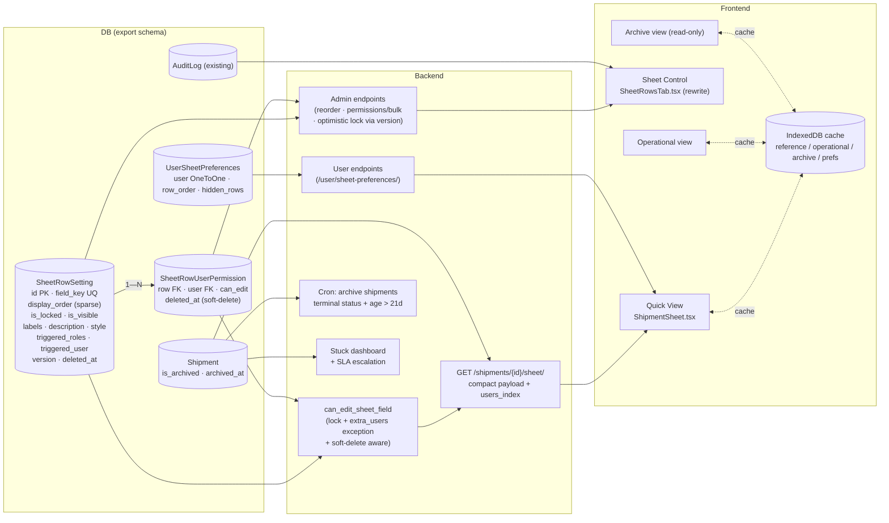

# Sheet Control — Master Plan v2

> **Single source of truth.** Этот документ полностью заменяет:
> - Оригинальный план "Sheet Quick View vs. Sheet Control"
> - Extension Spec
>
> Использовать вместе с `DECISIONS.md` (журнал архитектурных решений).

---

## 1. Context

Сегодня в системе один админский экран управляет настройками строк Shipment Sheet, но с серьёзными ограничениями:

- Админский tab (`SheetRowsTab`) ключует строки по `field_key` — нет стабильного surface ID, нельзя переупорядочивать без правки `field_key`.
- `row_number` "informational only"; реальный порядок — константа `DEFAULT_SHEET_ROWS` в коде. Админы не могут реордерить через UI.
- Права XOR (роль ИЛИ один пользователь). Нужно multi-user.
- Нет first-class замка; единственный способ — назначить inactive юзера триггером (хак, не явное действие).
- "Кто и когда редактировал" уже есть в `AuditLog` + `last_edits` в `/sheet/` payload — просто не показывается админу.
- Конфигурация строк (label, input_type, style) живёт только в коде → даже переименовать поле требует релиза.

**Цель:** разделить пользовательский Quick View и админский Sheet Control. Quick View почти не трогаем. `SheetRowsTab` переписываем в полноценный Sheet Control: stable IDs, drag-reorder, lock toggle, multi-user grants, multi-language labels, visibility, per-user порядок, "Last edited" колонки, soft-delete, optimistic locking. Параллельно вводим operational/archive разделение и IndexedDB-слой.

**Реальных production данных пока нет** → можно делать clean cut без legacy совместимости.

---

## 2. Architecture Shape



---

## 3. Backend Changes

### 3.1 Models

**File:** `backend/apps/export/models/sheet_settings.py`

```python
class SheetRowSetting(models.Model):
    # Identity (immutable after creation)
    field_key = models.CharField(max_length=100, unique=True)

    # Display (Tier 1 — runtime config)
    display_order = models.PositiveIntegerField(db_index=True)  # sparse, шаг 1024
    is_visible = models.BooleanField(default=True)
    is_locked = models.BooleanField(default=False)

    # Localization (BD-first, fallback на i18n-файл по field_key)
    labels = models.JSONField(default=dict)        # {tk, ru, en}
    description = models.JSONField(null=True, blank=True)  # tooltip {tk, ru, en}

    # Styling (whitelist + clean() validation)
    style = models.JSONField(default=dict)  # {width?: 50-500, align?: ..., color?: hex}

    # Behavior (Tier 2 — schema config, requires migration)
    INPUT_TYPES = [("text",...), ("number",...), ("date",...), ("select",...), ("boolean",...)]
    input_type = models.CharField(max_length=20, choices=INPUT_TYPES)
    options_source = models.CharField(max_length=50, null=True, blank=True)  # whitelist

    # Permissions
    triggered_roles = models.JSONField(default=list)  # ['warehouse_chief', ...]
    triggered_user = models.ForeignKey(
        'core.User', null=True, blank=True,
        on_delete=models.SET_NULL, related_name='+'
    )

    # Concurrency (optimistic locking)
    version = models.PositiveIntegerField(default=1)

    # Soft delete
    deleted_at = models.DateTimeField(null=True, blank=True, db_index=True)
    deleted_by = models.ForeignKey(
        'core.User', null=True, blank=True,
        on_delete=models.SET_NULL, related_name='+'
    )

    # Audit
    updated_at = models.DateTimeField(auto_now=True)
    updated_by = models.ForeignKey(
        'core.User', null=True, blank=True,
        on_delete=models.SET_NULL, related_name='+'
    )

    objects = SheetRowSettingManager()

    class Meta:
        db_table = 'export_sheet_row_setting'
        ordering = ['display_order']
        indexes = [
            models.Index(fields=['display_order']),
            models.Index(fields=['deleted_at']),
        ]

    def save(self, *args, **kwargs):
        # version increment + style validation
        ...


class SheetRowUserPermission(models.Model):
    row = models.ForeignKey(
        SheetRowSetting, on_delete=models.CASCADE,
        related_name='user_permissions'
    )
    user = models.ForeignKey('core.User', on_delete=models.SET_NULL, null=True)
    can_edit = models.BooleanField(default=True)

    deleted_at = models.DateTimeField(null=True, blank=True, db_index=True)
    deleted_by = models.ForeignKey('core.User', null=True, on_delete=models.SET_NULL, related_name='+')

    created_at = models.DateTimeField(auto_now_add=True)
    created_by = models.ForeignKey('core.User', null=True, on_delete=models.SET_NULL, related_name='+')

    class Meta:
        db_table = 'export_sheet_row_user_permission'
        constraints = [
            models.UniqueConstraint(
                fields=['row', 'user'],
                condition=models.Q(deleted_at__isnull=True),
                name='uq_active_row_user'
            )
        ]


class UserSheetPreferences(models.Model):
    user = models.OneToOneField('core.User', primary_key=True, on_delete=models.CASCADE)
    row_order = models.JSONField(default=list)        # [row_id, ...] — личный порядок
    hidden_rows = models.JSONField(default=list)       # [row_id, ...] — скрытые юзером
    updated_at = models.DateTimeField(auto_now=True)

    class Meta:
        db_table = 'export_user_sheet_preferences'
```

**File:** `backend/apps/export/models/__init__.py` — добавить re-export новых моделей.

**File:** `backend/apps/export/models/managers.py` (новый):
```python
class SheetRowSettingManager(models.Manager):
    def active(self):
        return self.filter(deleted_at__isnull=True)
    def visible(self):
        return self.active().filter(is_visible=True)
```

### 3.2 Shipment update

**File:** `backend/apps/export/models/shipment.py` — добавить:
```python
is_archived = models.BooleanField(default=False, db_index=True)
archived_at = models.DateTimeField(null=True, blank=True)
```

### 3.3 Migration (clean cut)

**File:** `backend/apps/export/migrations/000X_sheet_control_v2.py` (новая, ОДНА)

- Поскольку реальных данных нет → удалить старые миграции для `SheetRowSetting` (если они есть) и сделать одну с финальной схемой.
- Включить data migration, которая засевает таблицу из `DEFAULT_SHEET_ROWS` (фикстура).
- При backfill `display_order` использовать sparse: `1024, 2048, 3072, ...` (умножать `row_number` на 1024).
- `bulk_create(batch_size=500)` per MSSQL parameter limit rule.

После этого **удалить `DEFAULT_SHEET_ROWS` из кода** или оставить только как фикстуру для seeding.

### 3.4 Permission helpers

**File:** `backend/apps/core/permissions.py` (lines 200-330)

`can_edit_sheet_field(user, field_key)` финальная логика:

1. Загружаем row через `SheetRowSetting.objects.active().get(field_key=field_key)`. Если deleted → False.
2. Если `not row.is_visible` → False.
3. Если `user.is_superuser` или роль `admin`/`director` → **True** (immune).
4. Если `row.is_locked`:
   - Если user в активных `extra_users` (can_edit=True) → **True** (исключение)
   - Если любая роль user в `triggered_roles` → **True** (исключение)
   - Иначе → False
5. Если `row.is_locked=False`:
   - `user.id == triggered_user_id` → True
   - роль user в `triggered_roles` → True
   - user в активных `extra_users` (can_edit=True) → True
   - Иначе → False
6. AND с `user.has_perm('can_edit_field_X')` (поле-уровневое право).

`get_sheet_edit_map(user)` — prefetch `user_permissions` одним запросом, держим helper в 2 query'ях.

### 3.5 Endpoints

**File:** `backend/apps/export/views_sheet_settings.py` (rewrite)

Admin endpoints (только staff/director):
```
GET    /admin/sheet-rows/                   # active only by default
GET    /admin/sheet-rows/?include_deleted=1
GET    /admin/sheet-rows/{id}/
PATCH  /admin/sheet-rows/{id}/              # body: {patch..., version: N}
                                            # 409 если version mismatch
POST   /admin/sheet-rows/reorder/           # {order: [id, ...]}
                                            # sparse update — обычно 1 UPDATE
                                            # rebalance если расстояние < 2
POST   /admin/sheet-rows/permissions/bulk/  # {grants: [...], revokes: [...]}
DELETE /admin/sheet-rows/{id}/              # soft-delete
                                            # require is_visible=False ≥ 30 дней
POST   /admin/sheet-rows/{id}/restore/      # отмена soft-delete
```

User endpoints:
```
GET    /user/sheet-preferences/             # мои row_order + hidden_rows
PATCH  /user/sheet-preferences/             # сохранить (debounced 500ms на фронте)
```

Audit support:
```
POST   /admin/users/{id}/clear-cache/       # для саппорта (чистит IndexedDB через WS push)
```

### 3.6 Sheet payload (compact format)

**File:** `backend/apps/export/views.py:432-478` (rewrite)

```json
GET /shipments/{id}/sheet/

{
  "users_index": {
    "12": {"name": "Иванов А.", "active": true},
    "15": {"name": "Петров Б.", "active": true}
  },
  "current_user_id": 7,
  "current_user_lang": "ru",
  "rows": [
    {"id": 5, "field_key": "weight_net", "input_type": "number", ...}
  ],
  "row_settings": {
    "weight_net": {
      "id": 5,
      "is_locked": true,
      "is_visible": true,
      "labels": {"tk": "...", "ru": "...", "en": "..."},
      "description": {"tk": "...", "ru": "...", "en": "..."},
      "style": {"width": 120, "align": "right"},
      "extra_user_ids": [12, 15],
      "triggered_roles": ["warehouse_chief"],
      "can_current_user_edit": true,
      "version": 3,
      "settings_updated_at": "...",
      "settings_updated_by_id": 7
    }
  },
  "last_value_edits": {
    "weight_net": {"updated_at": "...", "user_id": 12}
  }
}
```

**Order resolution:**
1. Если у юзера непустой `UserSheetPreferences.row_order` → использовать его (fallback в конец для строк, которых там нет).
2. Иначе → `display_order` из `SheetRowSetting`.
3. Скрыть строки где `is_visible=False` ИЛИ `id` в `user.hidden_rows`.

### 3.7 Cron — auto archive

**File:** `backend/apps/export/management/commands/archive_shipments.py` (новый)

Запуск раз в сутки. Логика:
```
qs = Shipment.objects.filter(
    status__in=['shipped', 'closed', 'cancelled'],
    is_archived=False,
    updated_at__lte=now - 21d
)
qs.update(is_archived=True, archived_at=now)
```

Stale detection (отдельный отчёт, не auto-action):
```
stuck = Shipment.objects.filter(
    is_archived=False,
    updated_at__lte=now - 60d
)
# Уведомление директору, не auto-archive
```

### 3.8 Tests

Файлы:
- `apps/export/tests_sheet_settings_admin.py` — reorder (sparse), bulk permissions, optimistic lock (409), soft-delete, restore
- `apps/export/tests_sheet_perms.py` — lock + extra_user (allowed), lock без extra_user (blocked), multiple roles, soft-deleted permission ignored
- `apps/export/tests_shipment_sheet.py` — payload format, users_index, user-pref order, hidden_rows
- `apps/export/tests_archive.py` — cron logic, edge cases (terminal status + recently updated → not archived)
- `apps/export/tests_user_preferences.py` — sync, debounce, fallback на admin order

---

## 4. Frontend Changes

### 4.1 Types

**File:** `frontend/src/types/index.ts`

```typescript
export interface ISheetRowSetting {
  id: number;
  field_key: string;                              // immutable
  display_order: number;
  is_visible: boolean;
  is_locked: boolean;
  labels: { tk: string; ru: string; en: string };
  description: { tk: string; ru: string; en: string } | null;
  style: { width?: number; align?: 'left'|'center'|'right'; color?: string };
  input_type: 'text' | 'number' | 'date' | 'select' | 'boolean';
  options_source: string | null;
  triggered_roles: string[];
  triggered_user: number | null;
  version: number;
  settings_updated_at: string;
  settings_updated_by_id: number | null;
  deleted_at: string | null;
}

export interface ISheetRowSettingForUser {  // payload в /sheet/
  id: number;
  is_locked: boolean;
  is_visible: boolean;
  labels: { tk: string; ru: string; en: string };
  description: { tk: string; ru: string; en: string } | null;
  style: { width?: number; align?: string; color?: string };
  extra_user_ids: number[];
  triggered_roles: string[];
  can_current_user_edit: boolean;
  version: number;
  settings_updated_at: string;
  settings_updated_by_id: number | null;
}

export interface IUserSheetPreferences {
  row_order: number[];
  hidden_rows: number[];
}

export interface IShipmentSheetResponse {
  users_index: Record<string, { name: string; active: boolean }>;
  current_user_id: number;
  current_user_lang: 'tk' | 'ru' | 'en';
  rows: IRowConfig[];
  row_settings: Record<string, ISheetRowSettingForUser>;
  last_value_edits: Record<string, { updated_at: string; user_id: number }>;
}
```

### 4.2 Hooks

**File:** `frontend/src/hooks/useSheetRowSettings.ts`

```typescript
useSheetRowSettings()              // GET /admin/sheet-rows/
useSaveSheetRowSetting()           // PATCH с version, обработка 409
useReorderSheetRows()              // POST reorder
useBulkPermissions()               // POST permissions/bulk
useSoftDeleteSheetRow()            // DELETE
useRestoreSheetRow()               // POST restore
```

**File:** `frontend/src/hooks/useUserSheetPreferences.ts` (новый)

```typescript
useUserSheetPreferences()          // GET, читает из IndexedDB сначала, потом sync
useSaveSheetOrder(debounceMs=500)  // debounced PATCH
```

### 4.3 Sheet Control admin tab (rewrite)

**File:** `frontend/src/pages/admin/shipment-settings/SheetRowsTab.tsx`

Использовать Ant Design Table с drag-handle. Колонки:

| Колонка | Источник | UI |
|---|---|---|
| ⠿ | local | drag handle (sparse update on drop) |
| ID | `record.id` | mono, для саппорта |
| Поле | `field_key` | readonly badge |
| Название TK/RU/EN | `labels.{lang}` | inline edit, 3 input'а |
| Tooltip TK/RU/EN | `description.{lang}` | popover-edit, 3 input'а |
| Видимость | `is_visible` | Switch |
| Замок | `is_locked` | Switch + tooltip "extra_users — исключение" |
| Стиль | `style` | popover: width slider, align radio, color picker |
| Тип | `input_type` | readonly badge |
| Триггер-роли | `triggered_roles` | Select multiple |
| Extra users | через `useBulkPermissions` | Select multiple, diff old/new |
| Настройки изменены | `settings_updated_at` + by | "Иванов · 2ч назад" |
| Значение изменено | агрегат AuditLog | "по 3 отгрузкам · последняя: Петров · 5м" |

Плашка сверху таблицы:
> "Чтобы добавить новое поле — создайте задачу для разработчика. Изменить название, порядок, права, видимость, стиль — можно здесь."

Обработка 409 Conflict при PATCH: показать модалку "Кто-то изменил эту строку, обновите страницу".

### 4.4 Quick View update

**File:** `frontend/src/pages/export/ShipmentSheet.tsx`

Изменения:
- Удалить любые локальные сортировки по `row_number` — `rows` приходят в правильном порядке с бэка.
- Lock icon (🔒) рядом с label если `row_settings[fk].is_locked === true` И `can_current_user_edit === false`.
- Использовать `labels[current_user_lang]` для отображения, fallback на i18n-файл.
- Drag-handle на каждой строке Quick View → `useSaveSheetOrder` (per-user).
- Применять `style.width`, `style.align`, `style.color` к ячейкам.
- Toggle для скрытия строки → пишем в `hidden_rows`.

### 4.5 IndexedDB layer

**File:** `frontend/src/cache/indexeddb.ts` (новый)

Структура (см. ADR-0008 в DECISIONS.md):

```
db.ygt_v1
├── reference_data         # users_index, sheet_settings, contracts, dropdowns
│   TTL: 1ч, ETag invalidation, stale-while-revalidate
├── shipments_operational  # is_archived=false
│   TTL: 30s, всегда revalidate в фоне
├── shipments_archive      # is_archived=true
│   TTL: 7 дней, LRU вытеснение
└── user_preferences       # row_order, hidden_rows
    Source of truth локально, debounced sync в БД
```

Правила:
- Сервер authoritative для записи. PATCH → ответ → обновить кэш.
- ETag/If-None-Match на reference запросах. Бэк отвечает 304 → не меняем кэш.
- Stale-while-revalidate для reference и operational.
- BroadcastChannel API для multi-tab sync (`channel.postMessage({type, key})`).
- Bump версии БД при schema change → `db.ygt_v2`, старые сторы дропаются.
- НЕ кэшировать: решения по правам, real-time значения, `last_value_edits`, финансы.

### 4.6 Operational / Archive UI

**File:** `frontend/src/pages/export/ShipmentList.tsx`

Tab или toggle сверху:
- "Активные" → `?is_archived=false` (default)
- "Архив" → `?is_archived=true` (read-only для большинства, full для директора)

Archive view:
- Серверная пагинация
- Виртуализация скролла (`react-window` или AntD `Table` virtual)
- Фильтры: покупатель, контракт, период, статус
- Кнопка "Excel export"

### 4.7 Stuck Shipments dashboard

**File:** `frontend/src/pages/director/StuckShipments.tsx` (новый)

- Доступ: только director/admin
- Загружается с `?stuck=true` фильтром
- Колонки: code, status, days_in_status, last_actor, ответственная роль
- Цветовая шкала: 4-7 дней жёлтый, 8-14 оранжевый, 15+ красный
- Действия: "Назначить ответственного", "Пометить как cancelled", "Перейти к отгрузке"

### 4.8 i18n

**File:** `frontend/src/i18n/{tk,ru,en}.json`

Все новые видимые строки требуют ключи в трёх языках (CLAUDE.md frontend i18n rule). Для **labels** строк sheet — fallback chain:
1. `row.labels[lang]` из БД
2. `i18n.{lang}.sheet.{field_key}` из файла
3. `field_key` raw

---

## 5. Three-tier configuration (документация для админа)

| Tier | Что | Как меняется |
|---|---|---|
| **L1 Runtime** | display_order, is_visible, is_locked, labels, description, style, triggered_roles, triggered_user, extra_users | Через UI Sheet Control, мгновенно |
| **L2 Schema** | field_key (новая колонка в Shipment), input_type, options_source | Миграция от разработчика |
| **L3 Code** | новые типы виджетов, кросс-полевая валидация, новые источники dropdown | Разработка |

Плашка в UI Sheet Control:
> "Чтобы добавить новое поле — создайте задачу для разработчика. Изменить название, порядок, права, видимость, стиль — можно здесь."

---

## 6. Files to Touch

### Backend
- `backend/apps/export/models/sheet_settings.py` — расширить + 2 новые модели
- `backend/apps/export/models/managers.py` — новый
- `backend/apps/export/models/__init__.py` — re-export
- `backend/apps/export/models/shipment.py` — `is_archived`, `archived_at`
- `backend/apps/export/migrations/000X_sheet_control_v2.py` — clean cut, одна миграция
- `backend/apps/core/permissions.py` (200-330) — финальная логика
- `backend/apps/export/views_sheet_settings.py` — rewrite
- `backend/apps/export/views_user_preferences.py` — новый
- `backend/apps/export/views.py` (432-478) — compact payload
- `backend/apps/export/management/commands/archive_shipments.py` — новый
- `backend/apps/export/serializers.py` — обновить SheetRowSerializer
- `backend/apps/export/tests_sheet_settings_admin.py`
- `backend/apps/export/tests_sheet_perms.py`
- `backend/apps/export/tests_shipment_sheet.py`
- `backend/apps/export/tests_archive.py` — новый
- `backend/apps/export/tests_user_preferences.py` — новый

### Frontend
- `frontend/src/types/index.ts` — обновить интерфейсы
- `frontend/src/hooks/useSheetRowSettings.ts` — расширить
- `frontend/src/hooks/useUserSheetPreferences.ts` — новый
- `frontend/src/cache/indexeddb.ts` — новый (или библиотека `idb-keyval` + обёртка)
- `frontend/src/cache/broadcast.ts` — новый (multi-tab sync)
- `frontend/src/pages/admin/shipment-settings/SheetRowsTab.tsx` — rewrite
- `frontend/src/pages/export/ShipmentSheet.tsx` — обновить (lock, per-user order, style)
- `frontend/src/pages/export/ShipmentList.tsx` — operational/archive toggle
- `frontend/src/pages/export/ShipmentArchive.tsx` — новый
- `frontend/src/pages/director/StuckShipments.tsx` — новый
- `frontend/src/i18n/tk.json`, `ru.json`, `en.json` — новые ключи

### Docs
- `CHANGELOG.md` — записи под `[Unreleased]`
- `DECISIONS.md` — добавлять ADR при новых решениях
- `docs/admin-sheet-control.md` — гайд для админа

---

## 7. Verification

### Backend
- [ ] `python manage.py makemigrations apps.export` — одна миграция, clean state
- [ ] `python manage.py migrate` — миграция проходит, фикстура засевает данные
- [ ] `python manage.py test apps.export` — все тесты зелёные
- [ ] `python manage.py makemigrations --check` — нет pending миграций
- [ ] Manual: PATCH с устаревшим `version` → 409 Conflict
- [ ] Manual: reorder одной строки → один UPDATE в SQL логе (sparse работает)
- [ ] Manual: cron `archive_shipments` — переносит только terminal+old записи

### Frontend
- [ ] `npm run type-check` — clean
- [ ] `npm run lint` — clean
- [ ] Manual scenarios:
  1. Логин как director → /shipment-settings → Sheet Rows → drag row → reload → порядок сохранился. Quick View другого юзера видит этот же админский порядок (если у него нет личного).
  2. Юзер в Quick View перетаскивает строку → её личный порядок сохраняется → relogin → порядок остался → у других юзеров не изменился.
  3. Админ переименовал label на 3 языках → юзер видит новое название после рефреша.
  4. Админ выключил `is_visible` → строка пропала у всех.
  5. Замок ON + Иван в extra_users → Иван редактирует. Удалили Ивана → стало read-only.
  6. Двое админов одновременно меняют → второй получает 409 + модалку "обновите".
  7. Soft-delete пользователя → его permissions сохранились с user=null в БД.
  8. Отгрузка status=closed + 22 дня → попадает в archive view, исчезает из operational.
  9. Открыли отгрузку → мгновенно из IndexedDB → в фоне свежее → плавный update.
  10. Очистка кэша браузера → личный порядок строк восстанавливается из БД.
  11. Stuck dashboard: shipment висит 8 дней → оранжевый цвет, эскалация прошла.

---

## 8. Migration Strategy (Clean Cut)

Поскольку production данных нет:

1. **Снести старые миграции** для `SheetRowSetting`. Сделать одну новую с финальной схемой.
2. **Удалить `DEFAULT_SHEET_ROWS` из кода** или перенести в data migration / fixture, которая засевает таблицу при первом `migrate`.
3. **Все URL — только по `id`**. `field_key` остаётся как unique technical key.
4. **Старый фронтовый код выпиливать без feature flag**.
5. **Тесты переписать** под новую модель — не тащить старые testcase'ы.
6. **Координация:** если есть staging/dev окружения с тестовыми данными — сбросить БД одновременно с командой, иначе миграционные конфликты.

---

## 9. CHANGELOG entries

```markdown
## [Unreleased]

### Added
- Sheet Control admin tab (rewrite): drag-reorder, multi-language labels,
  multi-user permissions, lock toggle, visibility, style customization,
  optimistic locking
- Per-user row order with IndexedDB cache + DB sync
- Operational / Archive view split for shipments
- Stuck shipments dashboard with SLA escalation (director/admin only)
- IndexedDB cache layer with stale-while-revalidate, ETag invalidation,
  multi-tab sync via BroadcastChannel API
- Soft-delete on `SheetRowSetting` and `SheetRowUserPermission`
- New endpoints: /user/sheet-preferences/, /admin/sheet-rows/reorder/,
  /admin/sheet-rows/permissions/bulk/, /admin/sheet-rows/{id}/restore/
- Cron job for auto-archiving terminal-status shipments older than 21 days

### Changed
- `SheetRowSetting`: `id`-based URLs (was `field_key`), sparse `display_order`,
  multi-role `triggered_roles` (was single XOR), version field for
  optimistic locking, BD-stored localized labels
- `/shipments/{id}/sheet/` payload: compact format with root-level `users_index`
- Permission helpers: `extra_users` is now an exception to lock
  (previously locked = blocked all)

### Database
- New: `SheetRowUserPermission`, `UserSheetPreferences`
- New: `Shipment.is_archived`, `Shipment.archived_at`
- New: `SheetRowSetting.{is_visible, labels, description, style, version,
  triggered_roles, deleted_at, deleted_by}`
```

---

## 10. Implementation Order (Suggested)

Не пытаться всё сразу. Реалистичная последовательность:

**Sprint 1 (foundation):**
- Модели + миграция
- Permission helpers update
- Compact payload
- Sheet Control admin tab без IndexedDB и без archive

**Sprint 2 (per-user + cache):**
- UserSheetPreferences
- Per-user order в Quick View
- IndexedDB слой

**Sprint 3 (operational/archive):**
- `is_archived` поле + cron
- Archive view (read-only)
- Toggle в ShipmentList

**Sprint 4 (stuck + polish):**
- Stuck dashboard для директора
- SLA-эскалация
- Auto-archive stale (>60 дней)

Можно совмещать sprint 3 и 4 если команда позволяет. Sprint 1-2 — критический путь.
