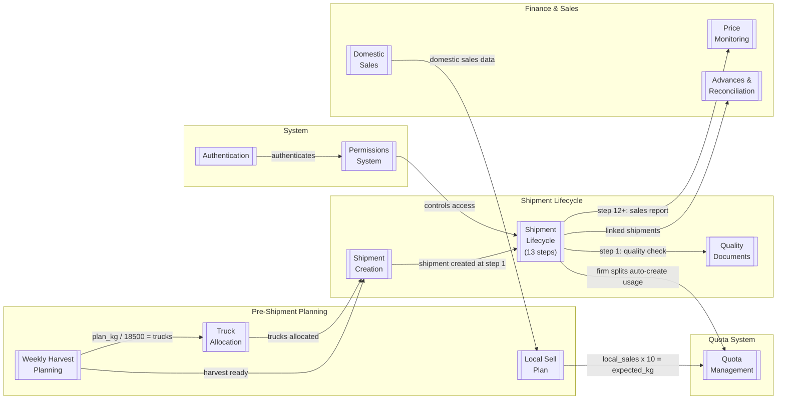

# YGT Platform Knowledge Base

> Django + React platform for greenhouse tomato export operations (YGT Holding).
> 40+ models | 43 pages | 13-step shipment lifecycle | 9 roles | 3 languages (TM/RU/EN)

## Process Map

## Core Processes

| Process | What It Does | Key Pages |
|---------|-------------|-----------|
| [[shipment-lifecycle]] | 13-step state machine from Loading to Completed | ShipmentList, ShipmentDetail, KanbanBoard, ShipmentSheet, ShipmentDashboard |
| [[shipment-creation]] | Legacy single-form path — direct creation at step 1 | ShipmentCreateModal |
| [[draft-shipments]] | Two-phase creation (DRAFT step 0) with multi-block composer | DraftPool, DraftComposerModal |
| [[assignment-board]] | Match drafts to demand (contracts / quota gaps / waiting) | AssignmentBoard |
| [[weekly-harvest-planning]] | Block managers plan Mon-Sat harvest per block | WeeklyPlanGrid |
| [[truck-allocation]] | Trucks allocated per day per destination | TruckForecast, TruckAllocationTable |
| [[quota-management]] | Government quota issuance, allocation, FIFO usage | QuotaDashboard (5 tabs) |
| [[local-sell-plan]] | Domestic sale basis for quota calculation | LocalSellPlanGrid |
| [[price-monitoring]] | Track tomato prices across 8 cities | PricePanel |
| [[advances-reconciliation]] | Finansist advance payments linked to shipments | AdvancesTracker |
| [[domestic-sales]] | Greenhouse domestic sales records | DomesticSales |
| [[quality-documents]] | Quality certificates and document tracking | ShipmentDetail (Document tab) |
| [[permissions-system]] | Dynamic RBAC: page/resource/field-level | PermissionsPage |
| [[authentication]] | JWT httpOnly cookie auth with CSRF | LoginPage |

## Roles

| Role | Primary Processes | Active Steps |
|------|-------------------|--------------|
| [[export-manager]] | All processes | 1-13 |
| [[document-team]] | Shipment lifecycle, quality docs | 1-6 |
| [[transport]] | Shipment lifecycle, trucks | 1-9 |
| [[sales-rep]] | Shipment lifecycle, prices | 7-12 |
| [[finansist]] | Advances, reconciliation | 1-13 |
| [[greenhouse-manager]] | Harvest planning, domestic sales | Plan grid only |
| [[support-roles]] | Read-only or limited scope | Varies |

See [[roles-matrix]] for the full capability matrix.

## Reference

- [[api-endpoint-map]] — Every API endpoint mapped to frontend hook, page, and backend model
- [[data-model-map]] — All 40+ models with ER diagram and field lists
- [[status-codes]] — 13 shipment statuses with codes, phases, timestamps, roles
- [[deployment-guide]] — Docker, MSSQL, env vars, seed commands
- [[data-imports]] — 14 management commands for data migration

## Operations

- [[known-issues]] — Bug reports, user feedback, workarounds (living log)
- [[decisions-log]] — Post-deployment decisions and rationale

## External Docs (canonical sources, not duplicated)

- [DOMAIN.md](../DOMAIN.md) — Full domain context (roles, lifecycle, firms)
- [ADR.md](../ADR.md) — Architecture Decision Records (AD-1 through AD-13)
- [SPRINT_PLAN.md](../SPRINT_PLAN.md) — Sprint roadmap
- [TECH_STACK.md](../TECH_STACK.md) — Technology choices
- [QUOTA_SYSTEM.md](../QUOTA_SYSTEM.md) — Quota code flow details
- [CHANGELOG.md](../../CHANGELOG.md) — Change history
- [API Contract](../../.claude/rules/api-contract.md) — Field naming, response shapes
- [Backend Architecture](../../.claude/rules/backend-arch.md) — Module dependencies, Django patterns
- [Frontend Architecture](../../.claude/rules/frontend-arch.md) — State management, component rules
- [MSSQL Compatibility](../../.claude/rules/mssql-compat.md) — Forbidden patterns
