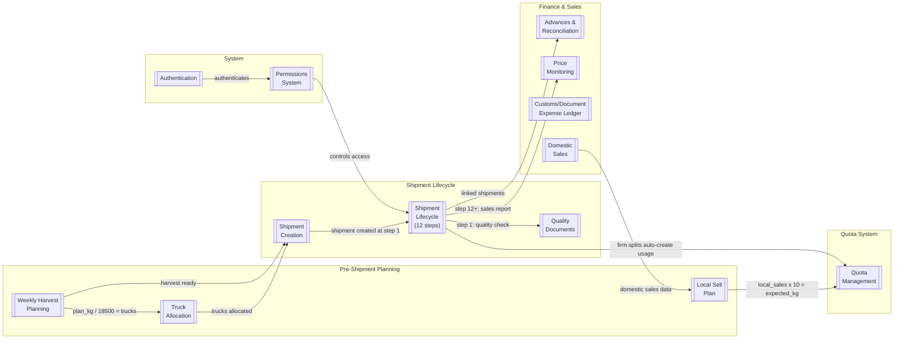

# YGT Platform Knowledge Base

> Django + React platform for greenhouse tomato export operations (YGT Holding).
> 40+ models | 43 pages | 12-step shipment lifecycle (state machine v2) | 14 roles (incl. `admin` per AD-15) | 3 languages (TM/RU/EN)

## Process Map

```mermaid
flowchart LR
    subgraph Planning["Pre-Shipment Planning"]
        WHP[["Weekly Harvest\nPlanning"]]
        TA[["Truck\nAllocation"]]
        LSP[["Local Sell\nPlan"]]
    end

    subgraph Lifecycle["Shipment Lifecycle"]
        SC[["Shipment\nCreation"]]
        SL[["Shipment\nLifecycle\n(12 steps)"]]
        QD[["Quality\nDocuments"]]
    end

    subgraph Quotas["Quota System"]
        QM[["Quota\nManagement"]]
    end

    subgraph Finance["Finance & Sales"]
        PM[["Price\nMonitoring"]]
        AR[["Advances &\nReconciliation"]]
        CEL[["Customs/Document\nExpense Ledger"]]
        DS[["Domestic\nSales"]]
    end

    subgraph System["System"]
        PS[["Permissions\nSystem"]]
        AU[["Authentication"]]
    end

    WHP -->|"plan_kg / 18500 = trucks"| TA
    WHP -->|"harvest ready"| SC
    TA -->|"trucks allocated"| SC
    SC -->|"shipment created at step 1"| SL
    LSP -->|"local_sales x 10 = expected_kg"| QM
    SL -->|"firm splits auto-create usage"| QM
    SL -->|"step 1: quality check"| QD
    SL -->|"step 12+: sales report"| PM
    SL -->|"linked shipments"| AR
    DS -->|"domestic sales data"| LSP
    PS -->|"controls access"| SL
    AU -->|"authenticates"| PS
```

## Core Processes

| Process | What It Does | Key Pages |
|---------|-------------|-----------|
| [[shipment-lifecycle]] | State machine v2 — 12 steps `draft` → `tamamlandy`, advanced by filling Sheet cells | ShipmentList, ShipmentDetail, ShipmentBoard, ShipmentSheet, ShipmentDashboard |
| [[shipment-creation]] | Legacy single-form path — direct creation at step 1 | ShipmentCreateModal |
| [[draft-shipments]] | Two-phase creation (DRAFT step 0) with multi-block composer | DraftPool, DraftComposerModal |
| [[assignment-board]] | Match drafts to demand (contracts / quota gaps / waiting) | AssignmentBoard |
| [[weekly-harvest-planning]] | Block managers plan Mon-Sat harvest per block | WeeklyPlanGrid |
| [[pomidor-dukany]] | Planned vs achieved production per block (week/month/season, kg/m², domestic vs export) | PomidorDukany |
| [[truck-allocation]] | Trucks allocated per day per destination | TruckForecast, TruckAllocationTable |
| [[quota-management]] | Government quota issuance, allocation, FIFO usage | QuotaDashboard (7 tabs) |
| [[local-sell-plan]] | Domestic sale basis for quota calculation | LocalSellPlanGrid |
| [[price-monitoring]] | Track tomato prices across 8 cities | PricePanel |
| [[advances-reconciliation]] | Finansist advance payments linked to shipments | AdvancesTracker |
| [[customs-expense-ledger]] | Customs/document cash-float expenses (money-out) + advances balance | AdvancesTracker (Customs expenses tab), ShipmentDetail |
| [[domestic-sales]] | Greenhouse domestic sales records | DomesticSales |
| [[quality-documents]] | Quality certificates and document tracking | ShipmentDetail (Document tab) |
| [[document-generation]] | Auto-fill export documents (Invoice + CMR, RU/EN, .docx + PDF) from contract/sale/shipment data | ContractSaleList (Generate) |
| [[sales-report]] | Rich structured sales report with line items + itemized expenses + Kurs | ShipmentDetail (Sales Report section) |
| [[comments-tasks]] | Cell-anchored threaded comments with @user/@role mentions and single-assignee tasks | ShipmentSheet (Comments Drawer), ShipmentDetail (Changes tab) |
| [[realtime-presence]] | WebSocket presence avatars showing who is on the Sheet right now (Channels + Redis + uvicorn workers) | ShipmentSheet (toolbar) |
| [[worklog]] | Per-user work-time logging over the same WS (heartbeat → core.work_sessions + reaper cron); visible to everyone | WorklogPage, header chip |
| [[fleet-map]] | Live truck GPS positions from Traccar + TIR fleet registry (TruckHead/Trailer) driving shipment truck selection — standalone transport app, 2-min poller, read-only API | FleetMap (`/transport/map`), ShipmentTruckSelector, FleetAdminPage (`/admin/fleet`) |
| [[detail-vs-sheet]] | Process flow on Detail page vs the Sheet — what each surface optimises for, decision matrix | ShipmentDetail, ShipmentSheet |
| [[permissions-system]] | Dynamic RBAC: page/resource/field-level | PermissionsPage |
| [[authentication]] | JWT httpOnly cookie auth with CSRF | LoginPage |

## Roles

| Role | Primary Processes | Active Steps |
|------|-------------------|--------------|
| [[export-manager]] | All processes | 1-13 |
| [[document-team]] | Shipment lifecycle, quality docs | 1-6 |
| [[transport]] | Shipment lifecycle, trucks | 1-9 |
| [[sales-rep]] | Shipment lifecycle, prices | 7-12 |
| [[finansist]] | Advances, reconciliation | 1-13 |
| [[greenhouse-manager]] | Harvest planning, domestic sales | Plan grid only |
| [[support-roles]] | Read-only or limited scope | Varies |
| [[boss]] | Executive dashboard + full process reach (2026-08-05) | 1-13 |

See [[roles-matrix]] for the full capability matrix.

## Analytics

- [[screens/boss-dashboard]] — Boss / Director executive dashboard at `/boss/dashboard` — KPIs, charts, drill-down, Excel/PDF export
- [[screens/clients-report]] — Clients Report at `/analytics/clients-report` — customer×month truck/tonnage matrix + 3 ECharts pies; live replacement for `by_clients.xlsx`

## Operational Screens

- [[screens/main-dashboard]] — Main dashboard at `/` — stat cards, alerts panel, routes overview, active shipments table wired to `GET /api/v1/export/dashboard/summary/`
- [[screens/shipment-sheet]] — Excel-style spreadsheet at `/export/shipments/sheet/` — virtualised columns, inline cell edit, dynamic field permissions
- [[screens/self-board]] — Personal task board at `/me/board` — inline task completion with editable fields and SheetCellEditor integration
- [[screens/feedback-module]] — Centralised in-app feedback at `/feedback/*` and `/admin/feedback` — bug/suggestion/question tickets with screenshot attachments, three reply modes, public knowledge feed
- [[screens/contract-list]] — Contracts list page at `/contracts` — ProTable with grouped columns, create modal, show-ended toggle (P4 Slice A)
- [[screens/contract-detail]] — Contract detail page at `/contracts/:id` — header Descriptions + four tabs; Faktura tab with contract-sale CRUD (P4 Slice B)
- [[screens/contract-sale-list]] — All-sales list page at `/sales` — cross-contract ProTable with search, status filter, full CRUD (P4 Slice C)
- [[screens/sales-report-page]] — Full-page Excel-like sales report at `/export/sales-reports/:shipmentId` — Sale + Processing tabs over one SalesReport
- [[screens/expense-template-admin]] — Expense-template CRUD at `/admin/expense-template` — categories, tk/ru/en names, logo_code, is_active
- [[screens/fleet-admin]] — TIR fleet CRUD at `/admin/fleet` — TruckHead + Trailer tabs (incl. inactive), create/edit/activate-deactivate; role-gated (no page_code); backs ShipmentTruckSelector
- [[screens/team-kpi]] — Team KPI leaderboard at `/team/kpi` — per-user tasks-completed ranking with on-time %, overdue-now, active hours, period switcher; visible to every role, wired to `GET /api/v1/core/team-kpi/`
- [[screens/permissions-admin]] — Role-first permission editor at `/admin/permissions` — pages / resources / fields for one role on one screen, plus the ⚠ list of resources the matrix does not actually enforce
- [[screens/season-switcher]] — Header season switcher, read-only mode, and admin Close/Open on `/admin/seasons` (AD-16) — close a season (frozen + hidden), open the next one, browse a closed season read-only

## Reference

- [[api-endpoint-map]] — Every API endpoint mapped to frontend hook, page, and backend model
- [[data-model-map]] — All 40+ models with ER diagram and field lists
- [[contracts-contract-model]] — Contract model (P4 Slice A): fields, status enum, computed properties, API endpoints
- [[contracts-contract-sale-model]] — Contract Sale model (P4 Slice B): fields, status enum, rollup service, auto-compute total_usd, API endpoints
- [[status-codes]] — 12 active statuses + `cancelled` + 3 retired: codes, phases, trigger fields, roles
- [[deployment-guide]] — Docker, MSSQL, env vars, seed commands
- [[data-imports]] — 14 management commands for data migration

## Operations

- [[known-issues]] — Bug reports, user feedback, workarounds (living log)
- [[decisions-log]] — Post-deployment decisions and rationale
- [[operations/pwa]] — Progressive Web App setup, install flow, caching strategy, connection indicator
- [[operations/beta-runbook]] — Production beta launch runbook (2026-05-15): deploy, smoke tests, rollback, daily routine

## External Docs (canonical sources, not duplicated)

- [DOMAIN.md](../DOMAIN.md) — Full domain context (roles, lifecycle, firms)
- [ADR.md](../ADR.md) — Architecture Decision Records (AD-1 through AD-16)
- [SPRINT_PLAN.md](../SPRINT_PLAN.md) — Sprint roadmap
- [TECH_STACK.md](../TECH_STACK.md) — Technology choices
- [QUOTA_SYSTEM.md](../QUOTA_SYSTEM.md) — Quota code flow details
- [CHANGELOG.md](../../CHANGELOG.md) — Change history
- [API Contract](../../.claude/rules/api-contract.md) — Field naming, response shapes
- [Backend Architecture](../../.claude/rules/backend-arch.md) — Module dependencies, Django patterns
- [Frontend Architecture](../../.claude/rules/frontend-arch.md) — State management, component rules
- [MSSQL Compatibility](../../.claude/rules/mssql-compat.md) — Forbidden patterns
