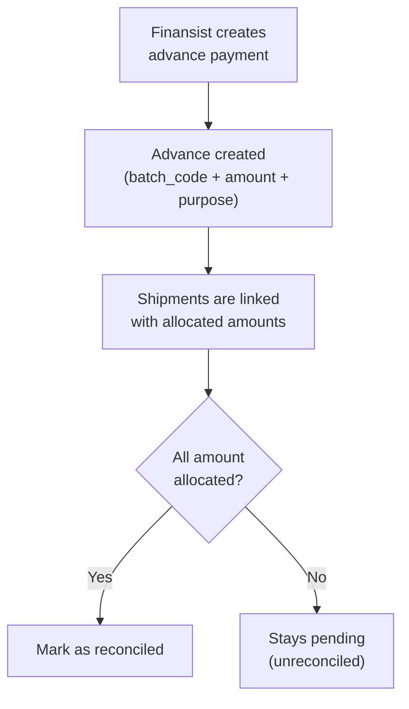
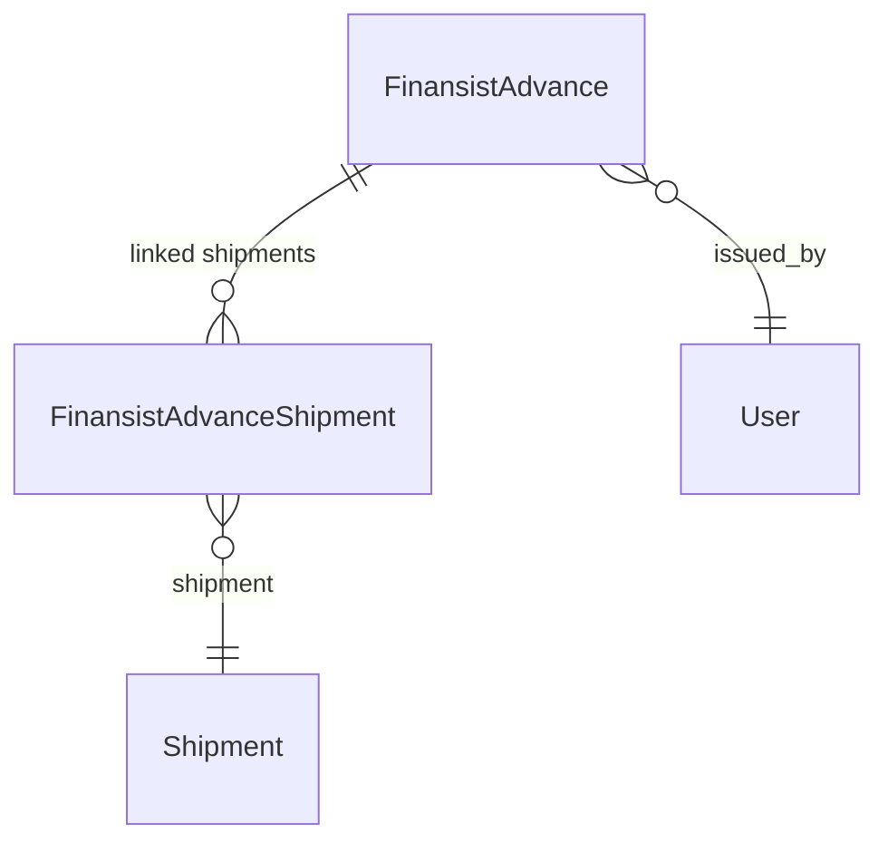

# Advances & Reconciliation

## What Is This Process?

The finansist (Babageldi) issues cash advances for export operations — truck fuel, border fees, market expenses. Each advance has a total amount and is later reconciled by linking it to specific shipments with allocated amounts. The system tracks unreconciled advances and total exposure.

## How It Works (Business Flow)

## Database

### Tables

| Table | Purpose | Key Columns |
|-------|---------|-------------|
| `export.finansist_advances` | Advance payment record | batch_code, advance_date, total_amount, currency, purpose, reconciled, issued_by |
| `export.finansist_advance_shipments` | Links advance to shipments | advance_id, shipment_id, allocated_amount |

### Relationships

## Backend Implementation

### ViewSet & Endpoints

| Method | Endpoint | Action |
|--------|----------|--------|
| GET | `/api/v1/export/advances/` | List advances (filterable by reconciled status) |
| GET | `/api/v1/export/advances/{id}/` | Detail with linked shipments |
| POST | `/api/v1/export/advances/` | Create new advance |
| PATCH | `/api/v1/export/advances/{id}/reconcile/` | Mark as reconciled |

**Filters**: `?reconciled=true/false`, `?search=` (batch_code)

## Frontend Implementation

### Page: AdvancesTracker

**File**: `frontend/src/pages/export/AdvancesTracker.tsx`

**Stat Cards** (4-column grid):
| Card | Value | Color |
|------|-------|-------|
| Total Advances | Count | Default |
| Total Amount | Sum ($) | Default |
| Unreconciled | Count | Orange if > 0 |
| Unreconciled Amount | Sum ($) | Orange if > 0 |

**Filter**: Segmented control: All / Pending / Reconciled

**Table Columns**:
| # | Column | Width | Notes |
|---|--------|-------|-------|
| 1 | Batch Code | 150px | Monospace, optional |
| 2 | Date | 110px | DD.MM.YYYY |
| 3 | Amount | 130px | Bold, USD |
| 4 | Currency | 90px | |
| 5 | Purpose | variable | |
| 6 | Shipments | 100px | Blue badge with count |
| 7 | Allocated Total | 130px | Red text if over-allocated |
| 8 | Status | 120px | "Reconciled" (green) / "Pending" (orange) |
| 9 | Issued By | 120px | |
| 10 | Actions | 100px | Reconcile button (if not reconciled + canCreate) |

**Row Expansion**: Chevron → sub-table showing linked shipments (cargo_code, allocated_amount)

**New Advance Modal**:
| Field | Component | Required |
|-------|-----------|----------|
| batch_code | Input | No |
| advance_date | DatePicker | Yes |
| total_amount | InputNumber | Yes |
| currency | Select | Yes |
| purpose | Input | Yes |
| notes | TextArea | No |

### Hooks

| Hook | Endpoint | Params | Returns | Stale Time |
|------|----------|--------|---------|------------|
| `useAdvances` | `GET /export/advances/` | page, reconciled, search | `IApiListResponse<IFinansistAdvance>` | 30s |
| `useAdvanceDetail` | `GET /export/advances/{id}/` | id | `IFinansistAdvanceDetail` | 30s |
| `useReconcileAdvance` | `PATCH /export/advances/{id}/reconcile/` | id | `IFinansistAdvanceDetail` | mutation |

### TypeScript Types

**`IFinansistAdvance`**: id, batch_code, advance_date, total_amount, currency, purpose, issued_by_name, reconciled, shipment_count, allocated_total

**`IFinansistAdvanceDetail`** (extends above): notes, shipment_links[] (shipment, shipment_cargo_code, allocated_amount)

## Roles & Permissions

| Role | View | Create | Reconcile |
|------|------|--------|-----------|
| `finansist` | Yes | Yes | Yes |
| `export_manager` | Yes | Yes | Yes |
| `director` | Yes | Yes | Yes |
| Others | No | No | No |

## Connections to Other Processes

- **[[shipment-lifecycle]]** — Advances are linked to specific shipments via FinansistAdvanceShipment
- **[[finansist]]** — Primary workflow for the finansist role
