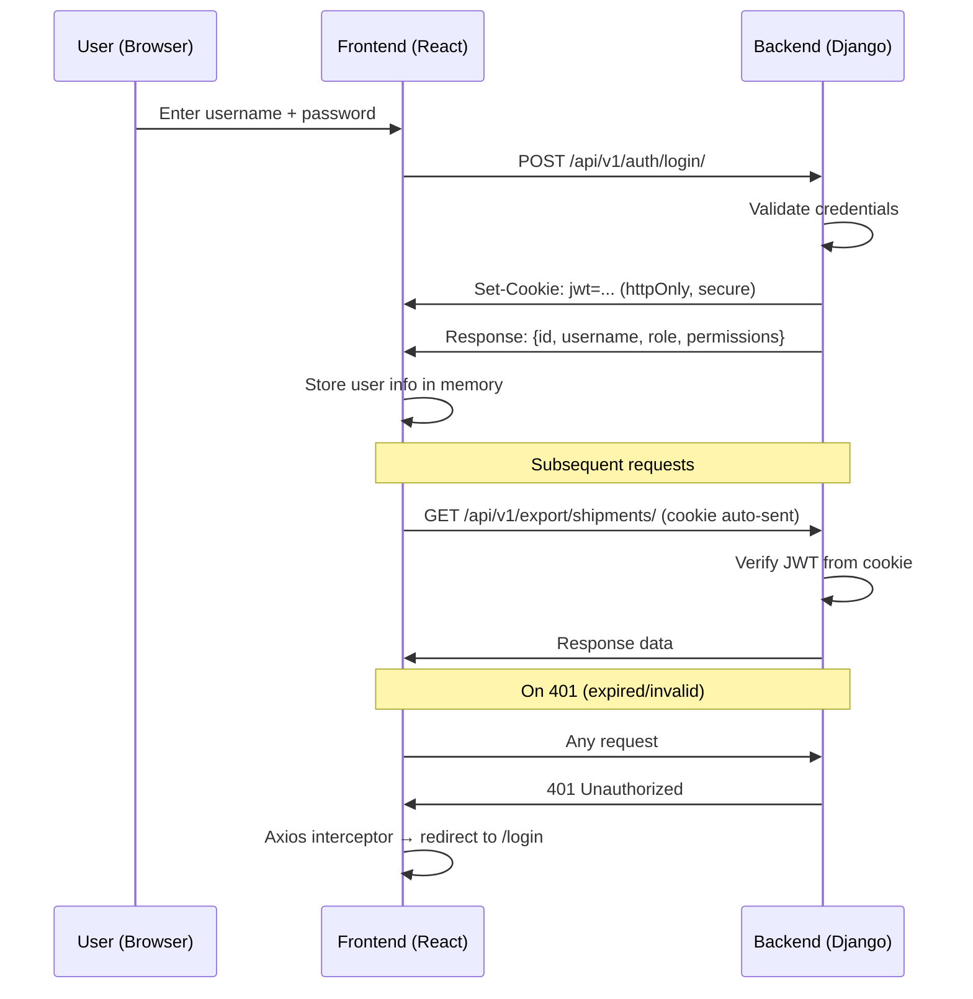

# Authentication

## What Is This Process?

YGT uses JWT (JSON Web Token) authentication with httpOnly cookies. Users log in with username/password, receive a JWT stored in a secure httpOnly cookie (never localStorage — users operate on public networks in KZ/RU), and all subsequent API requests include the cookie automatically. CSRF protection is required for state-changing requests.

## How It Works (Business Flow)



## Backend Implementation

### Endpoints

| Method | Endpoint | Action |
|--------|----------|--------|
| POST | `/api/v1/auth/login/` | Authenticate, set httpOnly cookie |
| POST | `/api/v1/auth/logout/` | Clear cookie |
| GET | `/api/v1/auth/me/` | Return current user info + permissions |

### Login Response

```json
{
  "id": 1,
  "username": "gadam",
  "role": "export_manager",
  "page_permissions": {"export.shipments": true, ...},
  "resource_permissions": {"shipment": {"can_view": true, "can_create": true, ...}},
  "field_permissions": {"shipment": {"weight_net": true, ...}}
}
```

### Security Rules (ADR-009)

- JWT stored in **httpOnly cookie** — JavaScript cannot read it
- **Secure** flag on cookie (HTTPS only in production)
- **CSRF protection**: Axios includes `X-CSRFToken` header on POST/PUT/PATCH/DELETE
- Never expose JWT in localStorage, sessionStorage, or JavaScript variables
- Token refresh handled server-side

## Frontend Implementation

### Page: LoginPage

**File**: `frontend/src/pages/auth/LoginPage.tsx`

**Form Fields**:
- Username (input)
- Password (input, type=password)
- Submit button

**On Submit**: POST to `/api/v1/auth/login/`, on success store user info and redirect to dashboard.

### Axios Configuration

**File**: `frontend/src/services/api.ts`

- `withCredentials: true` — sends cookies with every request
- `X-CSRFToken` header included on mutating requests
- **401 interceptor**: on any 401 response, redirect to `/login`

### Auth Hook

**`useAuth()`** (`frontend/src/hooks/useAuth.ts`):
- `login(username, password)` — POST login, store user
- `logout()` — POST logout, clear state, redirect
- `user` — current user object (`ICurrentUser`)
- `isAuthenticated` — boolean

### Route Protection

**ProtectedRoute** component (`frontend/src/components/ProtectedRoute.tsx`):
- Checks `isAuthenticated` — redirects to `/login` if not
- Checks `canSeePage(pageCode)` — redirects to `/unauthorized` if no access

### TypeScript Types

**`ICurrentUser`**: id, username, email, role (UserRole), page_permissions, resource_permissions, field_permissions

**`UserRole`**: 'export_manager' | 'warehouse_chief' | 'document_team' | 'transport' | 'sales_rep' | 'finansist' | 'director' | 'accountant' | 'greenhouse_manager' | 'seller'

## Roles & Permissions

All 10 roles can log in. What they see after login is controlled by [[permissions-system]].

## Connections to Other Processes

- **[[permissions-system]]** — Login response includes all permission data; ProtectedRoute uses permission helpers
- All processes — Every API call requires authentication via httpOnly cookie
