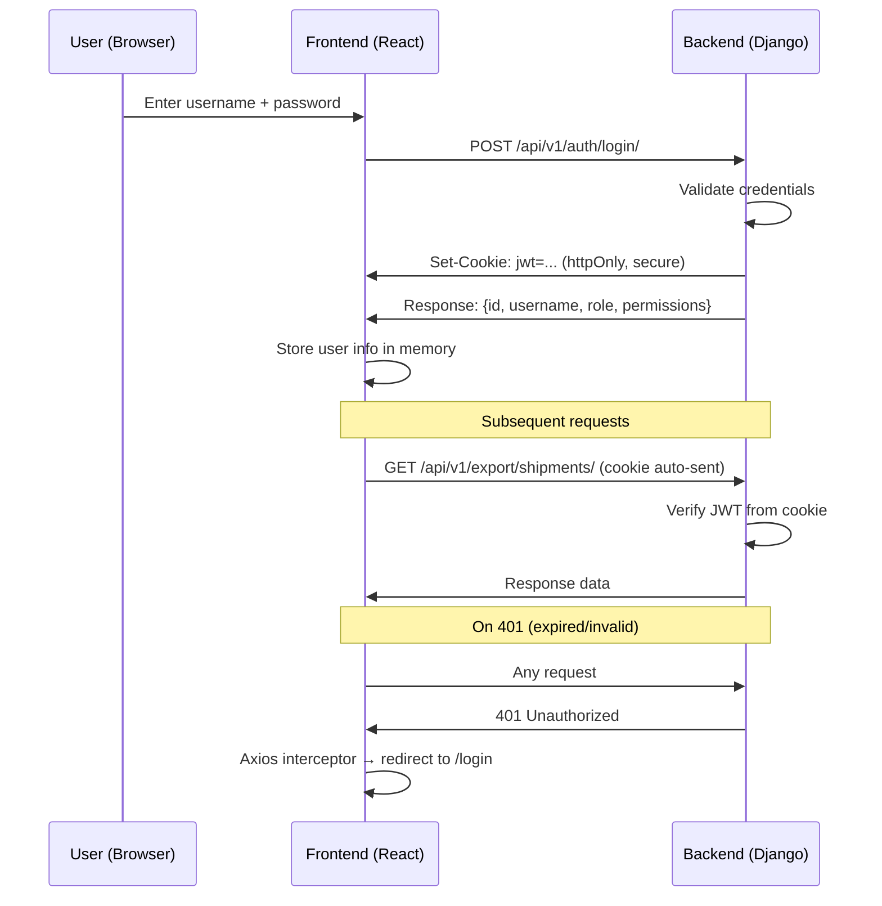

# Authentication

## What Is This Process?

YGT uses JWT (JSON Web Token) authentication with httpOnly cookies. Users log in with username/password, receive a JWT stored in a secure httpOnly cookie (never localStorage — users operate on public networks in KZ/RU), and all subsequent API requests include the cookie automatically. CSRF protection is required for state-changing requests.

## How It Works (Business Flow)


```mermaid
sequenceDiagram
    participant U as User (Browser)
    participant F as Frontend (React)
    participant B as Backend (Django)
    
    U->>F: Enter username + password
    F->>B: POST /api/v1/auth/login/
    B->>B: Validate credentials
    B->>F: Set-Cookie: jwt=... (httpOnly, secure)
    B->>F: Response: {id, username, role, permissions}
    F->>F: Store user info in memory
    
    Note over F,B: Subsequent requests
    F->>B: GET /api/v1/export/shipments/ (cookie auto-sent)
    B->>B: Verify JWT from cookie
    B->>F: Response data
    
    Note over F,B: On 401 (expired/invalid)
    F->>B: Any request
    B->>F: 401 Unauthorized
    F->>F: Axios interceptor → redirect to /login
```

## Backend Implementation

### Endpoints

| Method | Endpoint | Action |
|--------|----------|--------|
| POST | `/api/v1/auth/login/` | Authenticate, set httpOnly cookie |
| POST | `/api/v1/auth/logout/` | Clear cookie |
| GET | `/api/v1/auth/me/` | Return current user info + permissions |

### Login Response

```json
{
  "id": 1,
  "username": "gadam",
  "role": "export_manager",
  "page_permissions": {"export.shipments": true, ...},
  "resource_permissions": {"shipment": {"can_view": true, "can_create": true, ...}},
  "field_permissions": {"shipment": {"weight_net": true, ...}}
}
```

### Security Rules (ADR-009)

- JWT stored in **httpOnly cookie** — JavaScript cannot read it
- **Secure** flag on cookie (HTTPS only in production)
- **CSRF protection**: Axios includes `X-CSRFToken` header on POST/PUT/PATCH/DELETE
- Never expose JWT in localStorage, sessionStorage, or JavaScript variables
- Token refresh handled server-side

### Brute-force lockout (django-axes)

The login endpoint is protected against password guessing by **django-axes**
with a custom **escalating** ladder. Config lives in `config/settings.py`
(the `AXES_*` block) and the logic in `apps/core/security_axes.py`.

- **Key**: the `(username, IP)` pair (`AXES_LOCKOUT_PARAMETERS = [['username','ip_address']]`).
  Combining both resists distributed guessing against one account *and* a single
  IP spraying many accounts, without letting an attacker lock a victim out just
  by knowing their username.
- **Ladder** (`AXES_FAILURE_LIMIT = 3`): 3 failed logins → **30 min** block; if
  they fail 3 more after it lifts → **5 h**; any further episode → **1 day**.
  Each tier grants a fresh 3 attempts. The tier is tracked in a Redis counter
  (`axes:episode:{username}:{ip}`, 48 h sliding TTL); the block length comes from
  `escalating_cooloff` wired to `AXES_COOLOFF_TIME`. The counter is bumped once
  per episode by `on_user_locked_out` (axes' `user_locked_out` signal), and
  cleared on a successful login (`reset_lockout`) so a legitimate user restarts
  at tier 1. Because our JWT login never calls Django `login()`, the reset is
  done explicitly in `LoginView`, not via axes' `RESET_ON_SUCCESS` signal.
- **Real client IP** comes from nginx's `X-Real-IP` header via
  `AXES_CLIENT_IP_CALLABLE = apps.core.security_axes.client_ip` (checked before
  django-ipware). In production the backend is **not** published to the host
  (`docker-compose.prod.yml` resets `ports`), so the header can't be spoofed by
  hitting `:8000` directly.
- **Locked response**: HTTP **429** with `{"error", "detail":"locked_out",
  "retry_after": <seconds>}` and a `Retry-After` header (`lockout_response`,
  wired to `AXES_LOCKOUT_CALLABLE`). The login page shows a localized countdown.
- **Audit**: `AXES_ENABLE_ACCESS_FAILURE_LOG = True` keeps a per-attempt trail
  (`AccessAttempt` / `AccessFailureLog`), visible in Django admin.
- **Shared cache**: the tier counters live in the Redis Django cache
  (`CACHES` default), required because the 3 uvicorn workers each hold a separate
  LocMemCache. Disabled under tests (`AXES_ENABLED = not RUNNING_TESTS`); the
  lockout tests opt in with `@override_settings(AXES_ENABLED=True)`.
- Passwords require a minimum length of **8** (`AUTH_PASSWORD_VALIDATORS`);
  raising this only affects new/changed passwords, not existing ones.

## Frontend Implementation

### Page: LoginPage

**File**: `frontend/src/pages/auth/LoginPage.tsx`

**Form Fields**:
- Username (input)
- Password (input, type=password)
- Submit button

**On Submit**: POST to `/api/v1/auth/login/`, on success store user info and redirect to dashboard.

### Axios Configuration

**File**: `frontend/src/services/api.ts`

- `withCredentials: true` — sends cookies with every request
- `X-CSRFToken` header included on mutating requests
- **401 interceptor**: on any 401 response, redirect to `/login`

### Auth Hook

**`useAuth()`** (`frontend/src/hooks/useAuth.ts`):
- `login(username, password)` — POST login, store user
- `logout()` — POST logout, clear state, redirect
- `user` — current user object (`ICurrentUser`)
- `isAuthenticated` — boolean

### Route Protection

**ProtectedRoute** component (`frontend/src/components/ProtectedRoute.tsx`):
- Checks `isAuthenticated` — redirects to `/login` if not
- Checks `canSeePage(pageCode)` — redirects to `/unauthorized` if no access

### TypeScript Types

**`ICurrentUser`**: id, username, email, role (UserRole), page_permissions, resource_permissions, field_permissions

**`UserRole`**: 'export_manager' | 'warehouse_chief' | 'document_team' | 'transport' | 'sales_rep' | 'finansist' | 'director' | 'accountant' | 'greenhouse_manager' | 'seller'

## Roles & Permissions

All 10 roles can log in. What they see after login is controlled by [[permissions-system]].

## Connections to Other Processes

- **[[permissions-system]]** — Login response includes all permission data; ProtectedRoute uses permission helpers
- All processes — Every API call requires authentication via httpOnly cookie
