# Comments and Tasks

## What Is This Process?

A first-class discussion + task layer attached to shipments. Lives in a right-side **Drawer** on the [[../screens/shipment-sheet]] (and on `ShipmentDetail`'s Changes tab). Each comment can:

- Pin to a specific cell (`field_key`) or stay shipment-level
- `@user` or `@role:export_manager` mention — fans out to the existing `Notification` polling system
- Reference a cell inline via `#cell:vehicle_condition` token (renders as a clickable chip)
- Be turned into a single-assignee task (assignee marks Done)

Replaces the deprecated `vehicle_status_note` (see ADR-011 / AD-2) and the old "post a note in the Changes tab and hope someone reads it" workflow.

## How It Works (Business Flow)

```mermaid
flowchart LR
    A["User clicks cell on Sheet"] --> B["Comments Drawer opens<br/>filter='this cell'"]
    B --> C["Type @user / @role / #cell<br/>pick assignee (optional)"]
    C --> D["POST /export/comments/"]
    D --> E["Comment saved<br/>+ field_key anchor"]
    E --> F["Fan-out:<br/>1 Notification per recipient<br/>(deduped)"]
    F --> G["Bell badges users<br/>via 30s polling"]
    G --> H["Recipient clicks notification"]
    H --> I["Sheet opens with cell selected<br/>+ drawer auto-opens<br/>+ comment highlighted"]
    I --> J["If task: assignee clicks 'Mark done'"]
    J --> K["Author gets task_done notification"]
```



## Database

### Tables

| Table | Purpose | Key Columns |
|-------|---------|-------------|
| `export.shipment_comments` | Threaded comments + tasks | `shipment_id`, `user_id`, `content`, `field_key`, `mentions`, `role_mentions`, `parent_comment_id`, `assignee_id`, `is_done`, `done_at`, `done_by_id`, `is_deleted`, `is_system` |
| `export.notifications` | Bell-icon inbox | `user_id`, `kind`, `message`, `link`, `read_at` |

### New columns (migration `0021_comment_cells_tasks`)

| Column | Type | Notes |
|---|---|---|
| `field_key` | `NVARCHAR(64)` NULL | Cell anchor; NULL = shipment-level |
| `role_mentions` | `NVARCHAR(500)` NOT NULL DEFAULT '' | CSV of role codes; separate from `mentions` (CSV of user IDs) |
| `assignee_id` | `BIGINT` FK NULL | Task assignee. NULL = plain comment |
| `is_done` | `BIT` NOT NULL DEFAULT 0 | Only meaningful when `assignee_id` set |
| `done_at` | `DATETIMEOFFSET` NULL | |
| `done_by_id` | `BIGINT` FK NULL | Usually = assignee; admin can also close |
| `is_deleted` | `BIT` NOT NULL DEFAULT 0 | Soft delete keeps reply threads coherent |

### Indexes
- `ix_comments_shipment_field` on `(shipment_id, field_key)` — drawer's per-cell filter query
- `ix_comments_assignee_open` on `(assignee_id, is_done)` — "my open tasks" query

### Notification kinds

`Notification.kind` extended with three values:

| Kind | When fired | Recipient |
|---|---|---|
| `mention` | `@user` or `@role:X` resolves to a user | The mentioned user (deduped across user + role mentions) |
| `task_assigned` | A new comment has `assignee` set | The assignee (replaces the mention notification if also @-mentioned) |
| `task_done` | Assignee marks task done | The original comment author (only if author ≠ done_by) |

`link` for all three: `/export/shipments/sheet?shipment={id}&row={fieldKey}&comment={commentId}` — the Sheet page parses these query params on mount and auto-opens the drawer to the right thread.

## Mention semantics — STRICT

### Tokens stored in `content`
- `@user:42` — verbatim token; user ID also written to `mentions` CSV
- `@role:warehouse_chief` — role code also written to `role_mentions` CSV
- `#cell:vehicle_condition` — render-only; no separate column (cell anchor is `field_key`)

### Fan-out rules
1. Start with explicit `@user` IDs
2. Add all active members of each `@role`
3. Remove the comment author (no self-notify)
4. If `assignee` is set: emit one `task_assigned` notification to the assignee, then **remove the assignee from the mention pool** so they get one notification, not two
5. Emit one `mention` notification per remaining recipient
6. `Notification.objects.bulk_create(rows, batch_size=500)` — single DB call per comment (MSSQL batch rule)

### Why not a JSON column?
MSSQL forbids `JSONField` (ADR-001). `mentions` and `role_mentions` are CSV strings (existing pattern, already used by the legacy `mentions` column). Helper properties on the model parse to lists: `comment.mentions_ids`, `comment.role_mentions_list`.

## Tasks (single assignee)

A comment with `assignee_id` set is a task. Rules:
- **Tasks live on root comments only.** Replies cannot have an assignee — `services.comments.create_comment` raises `ValueError` if you try.
- **Replies inherit `field_key` from parent.** If you POST a reply with a different `field_key`, the service silently uses the parent's value.
- **Idempotent done.** `mark_task_done(comment, by_user)` is a no-op if already done — no duplicate `task_done` notifications.
- **Reopen permission.** Only the original author or the assignee may reopen a done task.

## Backend implementation

### Service layer
`apps/export/services/comments.py` — keeps fan-out logic out of the view (per `backend-arch.md`):

| Function | Purpose |
|---|---|
| `create_comment(shipment, user, *, content, field_key=None, mentions=[], role_mentions=[], parent_comment=None, assignee=None)` | Validates, persists, calls `_fan_out_notifications`. Wrapped in `@transaction.atomic`. |
| `_fan_out_notifications(comment)` | Computes recipient set with dedup; bulk_creates with `batch_size=500` |
| `mark_task_done(comment, by_user)` | Idempotent; emits `task_done` if `by_user != author` |
| `reopen_task(comment, by_user)` | Permission check (author or assignee); no notification |

Validation:
- `field_key` must be in `SHEET_FIELD_KEYS` frozenset (mirrors `frontend/src/constants/sheetRowConfig.ts`)
- Role codes must be valid `ROLE_CHOICES` values
- All mentioned user IDs must exist (`User.objects.filter(id__in=...).count()` check)

### API endpoints

`/api/v1/export/comments/` (`CommentViewSet`)

| Method | Path | Purpose |
|---|---|---|
| `GET` | `/comments/?shipment=&field_key=&assignee=me&is_done=&parent_comment=null` | List + filter |
| `POST` | `/comments/` | Create (delegates to service) |
| `PATCH` | `/comments/{id}/` | Edit `content` only; own or `delete_any` |
| `DELETE` | `/comments/{id}/` | Soft delete (sets `is_deleted=True`) |
| `POST` | `/comments/{id}/done/` | Mark task done; assignee permission |
| `POST` | `/comments/{id}/reopen/` | Reopen task; author or assignee |

`/api/v1/core/users/mentionable/?q=&limit=10` — autocomplete for the @ popover. Returns mixed list:
```json
[
  {"type":"user","id":42,"name":"Ahmet","role":"export_manager"},
  {"type":"role","code":"warehouse_chief","label":"Warehouse Chief","member_count":4}
]
```

`GET /api/v1/export/shipments/sheet/` — wrapped response now carries:
- `comment_counts: { "<shipment_id>": { "<field_key>": n, "__shipment__": n } }` — per-cell badges
- `task_counts: { "<shipment_id>": { open, done, assigned_to_me_open } }` — toolbar badge

**Backward compat:** `POST /api/v1/export/shipments/{id}/comment/` (legacy action on `ShipmentViewSet`) still exists; it now delegates to `services.comments.create_comment` so behaviour matches.

### Permissions

Resource code: `shipment_comment` (registered in `permission_registry.py`). Standard view/create/edit grants are seeded for all roles in `seed_permissions`. Specific actions used in the viewset:
- `view`, `create`, `edit_own`, `delete_own` — default for all roles
- `delete_any` — director, boss
- `assign_task`, `mention_role` — default for all roles

Granular actions can be revoked per-role from `/admin/permissions`.

## Frontend implementation

### State (Zustand `sheetStore.ts`)
- `commentsDrawerOpen: boolean`
- `commentsFilter: { fieldKey?, assigneeMe?, taskStatus? }`
- `pendingHighlightCommentId: number | null` — set by deep-link, cleared after scroll-into-view
- Actions: `setCommentsDrawerOpen`, `setCommentsFilter`, `openCommentsForCell(shipmentId, fieldKey)`

### Components
All under `frontend/src/components/sheet/`:
- `CommentsDrawer.tsx` — Ant `Drawer` (`mask=false`, 360px right). Header filter chips: This cell / All cells / My tasks
- `CommentList.tsx` — root comments + replies; scrolls highlighted comment into view + adds 2s ring
- `CommentItem.tsx` — header (avatar, name, role, time, pinned-cell chip, task badge), body (parsed mention chips), footer actions
- `CommentComposer.tsx` — textarea with `@`/`#` triggers, cell-anchor toggle, assignee picker, Ctrl+Enter submit
- `MentionPopover.tsx` — floating popover at caret; tabs: Users / Roles / Cells; arrow-key navigation
- `CommentMarker.tsx` — small floating badge in cell corner (blue=comment, orange=open task, green=done)

### Hooks
- `useComments(filters)` — list, with `staleTime: 30_000` (matches notification polling)
- `useCreateComment`, `useUpdateComment`, `useDeleteComment`, `useMarkTaskDone`, `useReopenTask` — mutations; invalidate `['comments']` AND `['sheet']` on success so per-cell counts refresh
- `useMentionable(query)` — debounced (150ms) autocomplete

### No mention library
Custom popover in ~80 lines. Tokens stored verbatim in `content`; the renderer in `CommentItem` splits by regex `/(@user:\d+|@role:[a-z_]+|#cell:[a-z_]+)/g` and replaces with chips. This matches the codebase's "no JSONField, no heavy deps" stance.

### Deep-link
`ShipmentSheet.tsx` parses `?shipment=&row=&comment=` on mount → sets `activeCell`, opens drawer, scrolls to comment, fades highlight after 2s.

## i18n

All `comments.*` keys exist in [tk](../../../frontend/src/i18n/tk.json), [ru](../../../frontend/src/i18n/ru.json), and [en](../../../frontend/src/i18n/en.json) — added together per the strict three-language rule. New `notifications.*` keys: `kind_mention`, `kind_task_assigned`, `kind_task_done`.

## Known limits (v1)

- Polling cadence is 30s (no WebSockets / SSE). Acceptable for human-pace ops.
- No edit history on comments — `updated_at` records last edit only.
- No reactions / file attachments.
- Multi-assignee tasks not supported. If multiple people need to act, create multiple comments.
- No rate limiting on `@role` mentions. A 12-role tenant with 100 active users could in theory get a 100-row notification fan-out per comment — fine in practice.
- Cross-shipment "task inbox" is not a separate page. Use the drawer's "My tasks" filter from any shipment, or click a `task_assigned` notification to deep-link.

## Related

- [[shipment-lifecycle]] — Comments do NOT trigger AD-1 timestamps
- [[../screens/shipment-sheet]] — Cell markers, drawer, deep-link, R17/R18 legacy comment-count rows
- [[permissions-system]] — `shipment_comment` resource granular actions
- [[../reference/api-endpoint-map]] — `/comments/` and `/users/mentionable/` shapes
