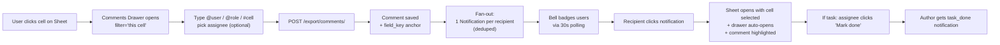

# Comments and Tasks

## What Is This Process?

A first-class discussion + task layer attached to shipments. Lives in a right-side **Drawer** on the [[../screens/shipment-sheet]] (and on `ShipmentDetail`'s Changes tab). Each comment can:

- Pin to a specific cell (`field_key`) or stay shipment-level
- `@user` or `@role:export_manager` mention — fans out to the existing `Notification` polling system
- Reference a cell inline via `#cell:vehicle_condition` token (renders as a clickable chip)
- Be turned into a single-assignee task (assignee marks Done)

Replaces the deprecated `vehicle_status_note` (see ADR-011 / AD-2) and the old "post a note in the Changes tab and hope someone reads it" workflow.

## How It Works (Business Flow)


```mermaid
flowchart LR
    A["User clicks cell on Sheet"] --> B["Comments Drawer opens<br/>filter='this cell'"]
    B --> C["Type @user / @role / #cell<br/>pick assignee (optional)"]
    C --> D["POST /export/comments/"]
    D --> E["Comment saved<br/>+ field_key anchor"]
    E --> F["Fan-out:<br/>1 Notification per recipient<br/>(deduped)"]
    F --> G["Bell badges users<br/>via 30s polling"]
    G --> H["Recipient clicks notification"]
    H --> I["Sheet opens with cell selected<br/>+ drawer auto-opens<br/>+ comment highlighted"]
    I --> J["If task: assignee clicks 'Mark done'"]
    J --> K["Author gets task_done notification"]
```

## Database

### Tables

| Table | Purpose | Key Columns |
|-------|---------|-------------|
| `export.shipment_comments` | Threaded comments + tasks | `shipment_id`, `user_id`, `content`, `field_key`, `mentions`, `role_mentions`, `parent_comment_id`, `assignee_id`, `is_done`, `done_at`, `done_by_id`, `is_deleted`, `is_system` |
| `export.notifications` | Bell-icon inbox | `user_id`, `kind`, `message`, `link`, `read_at` |

### New columns (migration `0021_comment_cells_tasks`)

| Column | Type | Notes |
|---|---|---|
| `field_key` | `NVARCHAR(64)` NULL | Cell anchor; NULL = shipment-level |
| `role_mentions` | `NVARCHAR(500)` NOT NULL DEFAULT '' | CSV of role codes; separate from `mentions` (CSV of user IDs) |
| `assignee_id` | `BIGINT` FK NULL | Task assignee. NULL = plain comment |
| `is_done` | `BIT` NOT NULL DEFAULT 0 | Only meaningful when `assignee_id` set |
| `done_at` | `DATETIMEOFFSET` NULL | |
| `done_by_id` | `BIGINT` FK NULL | Usually = assignee; admin can also close |
| `is_deleted` | `BIT` NOT NULL DEFAULT 0 | Soft delete. Deleting a root **cascades** to its replies so orphaned replies don't linger in `comment_counts` (a badge with an empty thread behind it) |

### Indexes
- `ix_comments_shipment_field` on `(shipment_id, field_key)` — drawer's per-cell filter query
- `ix_comments_assignee_open` on `(assignee_id, is_done)` — "my open tasks" query

### Notification kinds

`Notification.kind` extended with three values:

| Kind | When fired | Recipient |
|---|---|---|
| `mention` | `@user` or `@role:X` resolves to a user | The mentioned user (deduped across user + role mentions) |
| `task_assigned` | A new comment has `assignee` set | The assignee (replaces the mention notification if also @-mentioned) |
| `task_done` | Assignee marks task done | The original comment author (only if author ≠ done_by) |

`link` for all three: `/export/shipments/sheet?shipment={id}&row={fieldKey}&comment={commentId}` — the Sheet page parses these query params on mount and auto-opens the drawer to the right thread.

## Mention semantics — STRICT

### Tokens stored in `content`
- `@user:42` — verbatim token; user ID also written to `mentions` CSV
- `@role:warehouse_chief` — role code also written to `role_mentions` CSV
- `#cell:vehicle_condition` — render-only; no separate column (cell anchor is `field_key`)

### Fan-out rules
1. Start with explicit `@user` IDs
2. Add all active members of each `@role`
3. Remove the comment author (no self-notify)
4. If `assignee` is set: emit one `task_assigned` notification to the assignee, then **remove the assignee from the mention pool** so they get one notification, not two
5. Emit one `mention` notification per remaining recipient
6. `Notification.objects.bulk_create(rows, batch_size=500)` — single DB call per comment (MSSQL batch rule)

### Why not a JSON column?
MSSQL forbids `JSONField` (ADR-001). `mentions` and `role_mentions` are CSV strings (existing pattern, already used by the legacy `mentions` column). Helper properties on the model parse to lists: `comment.mentions_ids`, `comment.role_mentions_list`.

## Tasks (single assignee)

A comment with `assignee_id` set is a task. Rules:
- **Tasks live on root comments only.** Replies cannot have an assignee — `services.comments.create_comment` raises `ValueError` if you try.
- **Replies inherit `field_key` from parent.** If you POST a reply with a different `field_key`, the service silently uses the parent's value.
- **Idempotent done.** `mark_task_done(comment, by_user)` is a no-op if already done — no duplicate `task_done` notifications.
- **Reopen permission.** Only the original author or the assignee may reopen a done task.

## Backend implementation

### Service layer
`apps/export/services/comments.py` — keeps fan-out logic out of the view (per `backend-arch.md`):

| Function | Purpose |
|---|---|
| `create_comment(shipment, user, *, content, field_key=None, mentions=[], role_mentions=[], parent_comment=None, assignee=None)` | Validates, persists, calls `_fan_out_notifications`. Wrapped in `@transaction.atomic`. |
| `_fan_out_notifications(comment)` | Computes recipient set with dedup; bulk_creates with `batch_size=500` |
| `mark_task_done(comment, by_user)` | Idempotent; emits `task_done` if `by_user != author` |
| `reopen_task(comment, by_user)` | Permission check (author or assignee); no notification |

Validation:
- `field_key` must be in `SHEET_FIELD_KEYS` frozenset (mirrors `frontend/src/constants/sheetRowConfig.ts`)
- Role codes must be valid `ROLE_CHOICES` values
- All mentioned user IDs must exist (`User.objects.filter(id__in=...).count()` check)

### API endpoints

`/api/v1/export/comments/` (`CommentViewSet`)

| Method | Path | Purpose |
|---|---|---|
| `GET` | `/comments/?shipment=&field_key=&assignee=me&is_done=&parent_comment=null` | List + filter |
| `POST` | `/comments/` | Create (delegates to service) |
| `PATCH` | `/comments/{id}/` | Edit `content` only; own or `delete_any` |
| `DELETE` | `/comments/{id}/` | Soft delete (sets `is_deleted=True`); cascades to the comment's non-deleted replies |
| `POST` | `/comments/{id}/done/` | Mark task done; assignee permission |
| `POST` | `/comments/{id}/reopen/` | Reopen task; author or assignee |

`/api/v1/core/users/mentionable/?q=&limit=10` — autocomplete for the @ popover. Returns mixed list:
```json
[
  {"type":"user","id":42,"name":"Ahmet","role":"export_manager"},
  {"type":"role","code":"warehouse_chief","label":"Warehouse Chief","member_count":4}
]
```

`GET /api/v1/export/shipments/sheet/` — wrapped response now carries:
- `comment_counts: { "<shipment_id>": { "<field_key>": n, "__shipment__": n } }` — per-cell badges
- `task_counts: { "<shipment_id>": { open, done, assigned_to_me_open } }` — toolbar badge

**Backward compat:** `POST /api/v1/export/shipments/{id}/comment/` (legacy action on `ShipmentViewSet`) still exists; it now delegates to `services.comments.create_comment` so behaviour matches.

### Permissions

Resource code: `shipment_comment` (registered in `permission_registry.py`). Standard view/create/edit grants are seeded for all roles in `seed_permissions`. Specific actions used in the viewset:
- `view`, `create`, `edit_own`, `delete_own` — default for all roles
- `delete_any` — director, boss
- `assign_task`, `mention_role` — default for all roles

Granular actions can be revoked per-role from `/admin/permissions`.

## Frontend implementation

### State (Zustand `sheetStore.ts`)
- `commentsDrawerOpen: boolean`
- `commentsFilter: { fieldKey?, assigneeMe?, taskStatus? }`
- `pendingHighlightCommentId: number | null` — set by deep-link, cleared after scroll-into-view
- Actions: `setCommentsDrawerOpen`, `setCommentsFilter`, `openCommentsForCell(shipmentId, fieldKey)`

### Components
All under `frontend/src/components/sheet/`:
- `CommentsDrawer.tsx` — Ant `Drawer` (`mask=false`, 360px right). Header filter chips: This cell / All cells / My tasks
- `CommentList.tsx` — root comments + replies; scrolls highlighted comment into view + adds 2s ring
- `CommentItem.tsx` — header (avatar, name, role, time, pinned-cell chip, task badge), body (parsed mention chips), footer actions
- `CommentComposer.tsx` — textarea with `@`/`#` triggers, cell-anchor toggle, assignee picker, Ctrl+Enter submit
- `MentionPopover.tsx` — floating popover at caret; tabs: Users / Roles / Cells; arrow-key navigation
- `CommentMarker.tsx` — small floating badge in cell corner (blue=comment, orange=open task, green=done)

### Hooks
- `useComments(filters)` — list, with `staleTime: 30_000` (matches notification polling)
- `useCreateComment`, `useUpdateComment`, `useDeleteComment`, `useMarkTaskDone`, `useReopenTask` — mutations; invalidate `['comments']` AND `['sheet']` on success so per-cell counts refresh
- `useMentionable(query)` — debounced (150ms) autocomplete

### No mention library
Custom popover in ~80 lines. Tokens stored verbatim in `content`; the renderer in `CommentItem` splits by regex `/(@user:\d+|@role:[a-z_]+|#cell:[a-z_]+)/g` and replaces with chips. This matches the codebase's "no JSONField, no heavy deps" stance.

### Deep-link
`ShipmentSheet.tsx` parses `?shipment=&row=&comment=` on mount → sets `activeCell`, opens drawer, scrolls to comment, fades highlight after 2s.

## i18n

All `comments.*` keys exist in [tk](../../../frontend/src/i18n/tk.json), [ru](../../../frontend/src/i18n/ru.json), and [en](../../../frontend/src/i18n/en.json) — added together per the strict three-language rule. New `notifications.*` keys: `kind_mention`, `kind_task_assigned`, `kind_task_done`.

## Known limits (v1)

- Polling cadence is 30s (no WebSockets / SSE). Acceptable for human-pace ops.
- No edit history on comments — `updated_at` records last edit only.
- No reactions / file attachments.
- Multi-assignee tasks not supported. If multiple people need to act, create multiple comments.
- No rate limiting on `@role` mentions. A 12-role tenant with 100 active users could in theory get a 100-row notification fan-out per comment — fine in practice.
- Cross-shipment "task inbox" is not a separate page for *comment* tasks. Use the drawer's "My tasks" filter from any shipment, or click a `task_assigned` notification to deep-link. Structured tasks have their own per-user kanban at `/me/board`; clicking a card opens an inline drawer (`SelfBoardTaskDrawer`) that reuses `MyTaskCard` so the task can be started, fields filled, and marked done without navigating to the shipment detail page.

## Structured Task Engine (B-engine — plan §B2–B4, §B7)

The above describes *ad-hoc* tasks created manually via a comment's assignee field. The structured task engine provides **rule-driven task generation** tied to the shipment status lifecycle.

### How it differs from comment tasks

| | Comment task | Structured task (`Task` model) |
|---|---|---|
| Creation | Manual — user picks assignee | Automatic — engine fires on status change |
| Recipe | None | `TaskRule` row (step + condition + target_fields) |
| Completion | User clicks "Mark done" button | Auto via field fill, or manual for `MANUAL_DONE` rules |
| Deadline | None | Grammar-based: `4h_after_status`, `friday_eow`, etc. |
| i18n title | Free-text comment content | i18n key e.g. `tasks.fill_loading_data` |

### TaskRule + Task models

`TaskRule` — seed table (seeded by `seed_task_rules` management command):
- `step` — shipment status code that triggers the rule (e.g. `yuklenme`)
- `title_key` — i18n key for the task title
- `assignee_role` — role that owns the task
- `target_fields` — CSV of Shipment field paths (supports dotted e.g. `quality.azyk_maglumatnama`)
- `completion_rule` — `ALL_FIELDS_FILLED` / `ANY_FIELD_FILLED` / `MANUAL_DONE`
- `deadline_rule` — grammar string parsed by `parse_deadline_rule()`
- `condition_field` / `condition_value` — conditional activation (e.g. `is_gapy_satys=True`)

`Task` — one per (shipment, rule), created when the shipment enters the rule's step:
- `state` — `OPEN` → `IN_PROGRESS` → `DONE` (or `BLOCKED` / `CANCELLED`)
- `started_at` — set by `mark_started_for_changed_fields()` when a related field is patched
- `completed_at` — set by `resolve_for_shipment()` when completion rule is satisfied
- `completed_by` — FK to `core.User` (`SET_NULL`, `related_name='completed_tasks'`), the user
  credited with finishing the task; `null` when no user was in scope for the completion. Set
  at all five completion sites: `resolve_for_shipment()` (credits `shipment.updated_by`),
  `close_sales_report_task()` (credits the report-saving user), `TaskViewSet.complete`
  (credits `request.user`), and the local-sell-plan / weekly-plan task resolvers (credit
  `task.assignee_user`). Backs the per-user `completed`/`on_time_rate` columns on the
  [[../screens/team-kpi|Team KPI leaderboard]] (`/team/kpi`).
- `deadline` — absolute datetime computed from `deadline_rule` at task creation time

### Engine entry points (in `apps/export/services/task_rules.py`)

| Function | Called from | Purpose |
|---|---|---|
| `generate_tasks_for_status(shipment, status_code)` | `transition_to()` after status log write | Creates tasks for the new status (idempotent) |
| `resolve_for_shipment(shipment)` | `Shipment.save()` override | Auto-marks tasks DONE when completion rule met |
| `mark_started_for_changed_fields(shipment, keys)` | `ShipmentViewSet.partial_update` after save | Sets `started_at` + `IN_PROGRESS` on tasks whose `target_fields` overlap the patched field set |
| `parse_deadline_rule(rule, reference)` | `generate_tasks_for_status` | Converts grammar string to absolute `datetime` |

### Deadline grammar

| Rule | Meaning |
|---|---|
| `''` or `'none'` | No deadline |
| `'HH:MM_same_day'` | Same day as status change at HH:MM Asia/Ashgabat |
| `'HH:MM_next_business_day'` | Next Mon–Fri at HH:MM; skips Sat/Sun |
| `'Nh_after_status'` | N hours after status change (e.g. `4h_after_status`) |
| `'friday_eow'` | Coming Friday 18:00 Asia/Ashgabat (same day if already Friday) |

### Initial seed (13 rules)

Run once per environment: `python manage.py seed_task_rules`. Idempotent.

| Step | title_key | Assignee role | Completion |
|---|---|---|---|
| draft | tasks.set_destination | export_manager | ALL_FIELDS_FILLED (country,customer,import_firm) |
| draft | tasks.pick_export_firms | document_team | ANY_FIELD_FILLED (firm_splits) |
| draft | tasks.assign_driver | transport | ALL_FIELDS_FILLED (driver_id), only if not is_gapy_satys |
| draft | tasks.give_documents | transport | MANUAL_DONE, only if not is_gapy_satys |
| draft | tasks.give_documents_gapy | export_manager | MANUAL_DONE, only if is_gapy_satys |
| draft | tasks.start_documents_prep | document_team | ALL_FIELDS_FILLED (documents_status,customs_clearance_planned_day) |
| yuklenme | tasks.fill_loading_data | warehouse_chief | ALL_FIELDS_FILLED (shipment_code,block_sources,variety,weight_net,weight_gross) |
| yuklenme | tasks.quality_inspection | greenhouse_manager | ALL_FIELDS_FILLED (quality.azyk_maglumatnama,...) |
| gumruk_girish | tasks.send_documents_to_customs | document_team | MANUAL_DONE |
| gumruk_chykysh | tasks.docs_back_to_office | document_team | MANUAL_DONE |
| bardy | tasks.confirm_destination | sales_rep | ALL_FIELDS_FILLED (city) |
| satyldy | tasks.finalize_sale | sales_rep | MANUAL_DONE |
| hasabat | tasks.submit_sales_report | sales_rep | MANUAL_DONE |

### Task REST API (B-api)

The `TaskViewSet` at `/api/v1/export/tasks/` exposes the structured task engine to frontend consumers. It is a read-only ViewSet with five state-change actions.

**Authentication**: all endpoints require `IsAuthenticated`. State-change actions additionally gate by `IsTaskActor` (see Permissions below).

#### Endpoints

| Method | Path | Purpose |
|---|---|---|
| `GET` | `/tasks/?assignee_role=&state=&shipment=&step=&overdue=true` | Paginated list (lightweight serializer) |
| `GET` | `/tasks/{id}/` | Full detail with `blocked_by`, `duration_seconds` |
| `POST` | `/tasks/{id}/start/` | Transition `OPEN → IN_PROGRESS` |
| `POST` | `/tasks/{id}/block/` + `{reason}` | Transition `IN_PROGRESS → BLOCKED` |
| `POST` | `/tasks/{id}/unblock/` | Transition `BLOCKED → IN_PROGRESS` |
| `POST` | `/tasks/{id}/complete/` | Transition to `DONE` (only for `MANUAL_DONE` completion rules) |
| `POST` | `/tasks/{id}/cancel/` | Transition to `CANCELLED` (admin/director only) |

`GET /api/v1/export/shipments/{id}/tasks/` — nested action on `ShipmentViewSet`; returns tasks for a single shipment grouped by `step` code as a dict `{step_code: [TaskListSerializer items]}`.

`GET /api/v1/me/tasks/` — current-user scoped list (see [[../reference/api-endpoint-map]] Me Endpoints section). **Season-scoped** on `shipment__season` with `include_null_link`, identical to `TaskViewSet` — this is the endpoint the My Tasks screen actually lists from, so scoping only the viewset left that screen unaffected by the season switcher until 2026-08-06.

`GET /api/v1/me/kpi-today/` — today's KPI for the current user (see [[../reference/api-endpoint-map]] Me Endpoints section).

#### Permissions

`IsTaskActor` (`apps/export/permissions.py`):
- Superusers bypass all checks.
- `cancel` action: only `admin` or `director` roles.
- All other state actions: requester's role matches `task.assignee_role`, OR requester has a supervisor role (`export_manager`, `boss`, `admin`, `director`).

#### Query performance

`get_queryset()` calls `select_related('shipment', 'rule', 'assignee_user')` — collapses all joins into a single SQL query. The list endpoint executes at most 2 queries (auth session + tasks with joins). Verified by `test_list_query_count_bounded` (`assertLessEqual(num_queries, 6)`).

**Soft-deleted shipments are excluded.** Both `/api/v1/export/tasks/` (`TaskViewSet`) and `/api/v1/me/tasks/` filter `Q(shipment__isnull=True) | Q(shipment__deleted_at__isnull=True)` — a task whose parent shipment was soft-deleted (`deleted_at IS NOT NULL`) never reaches the task board (its sheet-backed field editors would be dead anyway, since the sheet endpoint also hides deleted shipments). Non-shipment plan tasks (`shipment IS NULL`) are kept. The Shipment Kanban `board` action already scopes to live shipments, so it was unaffected.

**SelfBoard pagination.** The SelfBoard renders ALL of a user's tasks (active columns + done-today + history) from a single `/me/tasks/` fetch. The default `StandardPagination` 200-cap silently dropped the newest tasks once a role's backlog (incl. done history) crossed the page — with `deadline ASC` ordering, the freshest/just-created tasks sorted last and fell off. `/me/tasks/` now uses `TaskBoardPagination` (`page_size=1000`, `max_page_size=2000`) and the `useMyTasks` hook requests `?page_size=1000`. If a single role ever exceeds that, the board would need true multi-page loading or a history split.

### Backfill

For existing shipments: `python manage.py backfill_tasks [--dry-run] [--limit N]`. Idempotent.

### Non-shipment tasks — `kind`

`Task.shipment` is **nullable**; a `kind` column (`shipment` | `weekly_plan` | `local_sell_plan`, default `shipment`) discriminates task families. Non-shipment tasks carry `link` (the frontend route the card opens) and `scope_year` / `scope_week` / `scope_block` instead of a parent shipment. SelfBoard routes any non-shipment task (`isPlanTask`) to `PlanTaskCard`. See [[../../ADR|ADR-021]].

**`weekly_plan`** — a **per-(manager, block)** reminder to fill that block's weekly harvest-plan grid (see [[weekly-harvest-planning]]). A manager assigned to K and L gets two tasks; each resolves independently:

- **Generation (on-demand)**: `POST /api/v1/export/tasks/generate-weekly-plan/` body `{year, week}`, supervisors only (`PRIVILEGED_ROLES`). Surfaced as a **"Generate plan tasks"** button on the WeeklyPlanGrid toolbar for admin / export_manager / director. Creates one task per **active `BlockManagerAssignment` (user, block) pair** for that ISO week (`assignee_user` = the manager, `scope_block` = the block, `assignee_role='greenhouse_manager'`, `completion_rule=MANUAL_DONE`, `link=/export/plan?week=…&year=…&block=…`). Idempotent — re-running skips pairs that already have one for the week. Service: `apps/export/services/weekly_plan_tasks.py`. Known limit: generation is a read-then-write check, so two truly concurrent calls can race into a duplicate for the same (manager, block, week); the cleanup path de-dupes.
- **Click → navigate**: the SelfBoard renders these via `PlanTaskCard` (block code shown as a tag); clicking opens the plan grid at the task's week (`navigate(task.link)`).
- **Auto-complete (lazy)**: resolved on the `/me/tasks/` read path (`resolve_weekly_plan_tasks_for_user`), NOT on plan-save — greenhouse (where `set_plan_value` lives) may not call into export. To keep latency low the plan grid's day-entry mutation invalidates the `my-tasks` query, forcing a `/me/tasks/` refetch right after a cell save (otherwise worst-case latency = the 60 s nav-badge poll). A block's task flips to DONE once its **Mon–Sat** plan cells are filled (≥1 `HarvestDayEntry` row in Mon–Sat and none with `plan_value IS NULL`; explicit `0` counts as filled). **Sunday is excluded** — it is not measured, so a blank Sunday cell never blocks completion. `python manage.py resolve_weekly_plan_tasks` does the same across all users for cron/backfill.
- **Scoping**: `/me/tasks/` shows a non-supervisor their role's shipment tasks (null `assignee_user`) **plus** tasks personally assigned to them — so manager A never sees manager B's weekly task.
- **Coexists** with the dispatcher's P1/P2/P3 plan-reminder notifications (those are kept; the task is additive).

**`local_sell_plan`** — a **shared, role-wide** reminder for the `seller` role to fill that ISO week's domestic (local) sell-plan grid (see [[../screens/contract-detail|Quota → Local Sell]]). Unlike `weekly_plan`, there is **one task per week** (not per user/firm): `assignee_role='seller'`, `assignee_user=null`, `scope_block=null`, `completion_rule=MANUAL_DONE`, `link=/export/quota?week=…&year=…`. Any seller sees it; finishing the week clears it for all (sellers lack the `export.quota` page, so the Quota dashboard defaults them to the Local Sell tab; `LocalSellPlanGrid` reads `?week`/`?year` to open the right week).

- **Generation**: created as a side effect of `POST /api/v1/export/local-sell-plans/initialize-week/` (the manager action that seeds the week's firm rows), and by the cron-backstop command `python manage.py generate_local_sell_plan_tasks` (defaults to the current ISO week; `--year`/`--week` to override). Both idempotent — one task per `(year, week)`. Service: `apps/export/services/local_sell_plan_tasks.py`.
- **Auto-complete (lazy)**: resolved on the `/me/tasks/` read path (`resolve_local_sell_plan_tasks`, global since the task has no `assignee_user`). The week flips to DONE once **≥1** row is `submitted`/`approved` **and every** row is `submitted`/`approved` **or** a zero-total `draft` (a firm with nothing to sell can never be submitted, so an all-zero draft must not block). A `rejected` row or a **non-zero draft** (entered but not submitted) keeps it OPEN. The "≥1 submitted/approved" gate is required because `initialize-week` seeds the week as all-zero drafts, which would otherwise read as already-complete and mark the task done before the seller acts.
- **Known limit**: a week where *no* firm ever submits (genuinely nothing sells anywhere) stays OPEN indefinitely — like `weekly_plan`, role-wide plan cards have no manual-done affordance (the SelfBoard blocks dragging plan tasks to DONE). The dominant case (some firms sell, empties left as zero drafts) resolves correctly.

### Known limits

- Reverse-FK targets (`firm_splits`, `block_sources`) won't auto-resolve until the next event that calls `Shipment.save()` on the parent. Adding a `ShipmentFirmSplit` row does NOT trigger parent save.
- `transition_to()` calls `generate_tasks_for_status` outside an explicit atomic block. If task generation fails after the status log row is committed, the status change is NOT rolled back. This is a documented gap; ATOMIC_REQUESTS is not set.
- Bulk QuerySet operations (`update()`, `bulk_update()`) bypass `Shipment.save()` and therefore bypass `resolve_for_shipment()`.

## Related

- [[shipment-lifecycle]] — Comments do NOT trigger status transitions; only the step's trigger fields do
- [[../screens/shipment-sheet]] — Cell markers, drawer, deep-link, R17/R18 freeform note rows (warehouse_note, document_note)
- [[permissions-system]] — `shipment_comment` resource granular actions
- [[../reference/api-endpoint-map]] — `/comments/` and `/users/mentionable/` shapes
