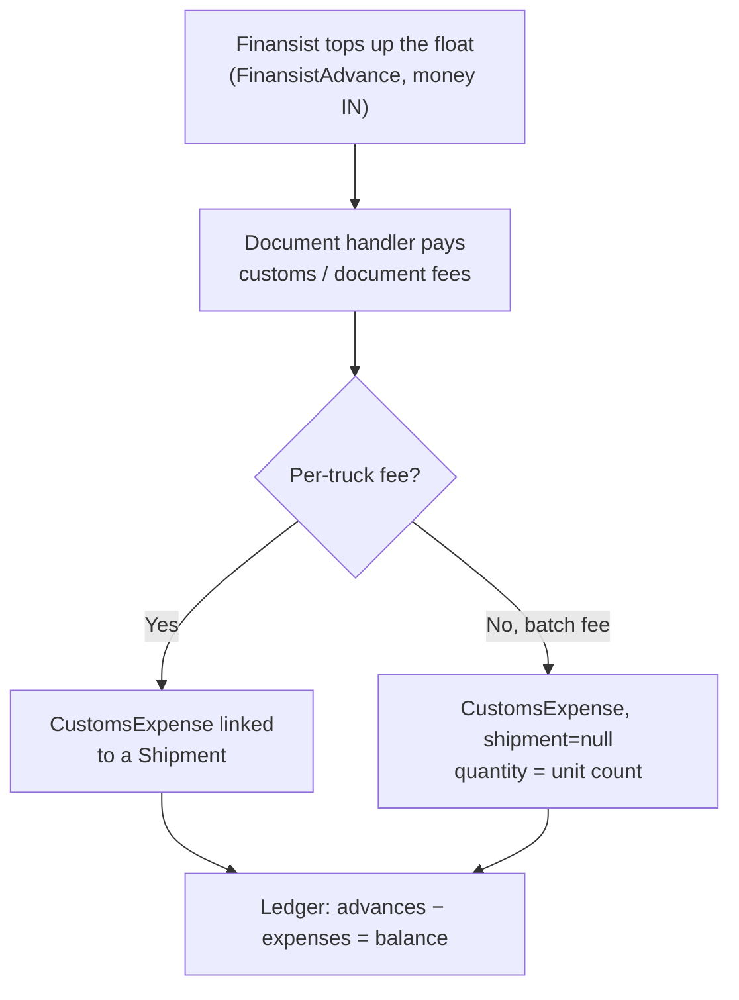
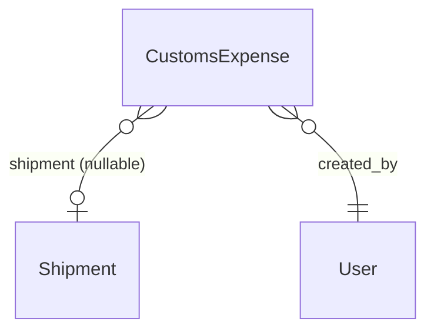

# Customs / Document Cash-Advance Ledger

## What Is This Process?

The document handler (e.g. Hangeldi) holds a **cash float** for export paperwork. Money comes
**in** as periodic work-advance top-ups ("HANGELDI IS AVANS") and goes **out** as customs and
document fees — customs clearance per truck, quarantine, CT-1 / phytosanitary certificates, lab
analysis, deal-passport registration, postage, etc. The source-of-truth was `data/avans.xlsx`,
a running ledger that reconciles to zero (money in = money out).

- The money-**in** side is the existing [[advances-reconciliation|FinansistAdvance]] feature.
- This process adds the money-**out** side: the **`CustomsExpense`** ledger, plus a combined
  balance view (advances − expenses).

Most expenses link to a specific shipment (the per-truck `GUMRUKLEME` clearance fee). **Batch
fees** — e.g. quarantine paid for 19 trucks at once, or a lab-analysis batch — leave `shipment`
null and record a `quantity` (unit count) instead.

## How It Works (Business Flow)



## Database

### Tables

| Table | Purpose | Key Columns |
|-------|---------|-------------|
| `export.customs_expenses` | One money-out row (customs/document fee) | expense_date, category, amount, currency, shipment_id, export_code_raw, vehicle_plate, route_label, label_raw, quantity, created_by |
| `export.finansist_advances` | Money-in float top-ups (existing) | advance_date, total_amount, currency, purpose, issued_by |

`amount` is `DecimalField(12,2)`; **currency defaults to `TMT`** (manat — local cash). `export_code_raw`
is **Latin-only (no Cyrillic collation)** so it can be compared to `Shipment.shipment_code` without an
MSSQL collation conflict; the Cyrillic text fields (`route_label`, `label_raw`, `notes`) carry the
collation.

### Categories (`CustomsExpenseCategory`)

`GUMRUKLEME` (customs clearance, per truck) · `KARANTIN` (quarantine) · `CT1` (certificate of
origin) · `FITO` (phytosanitary) · `ANALIZ` (lab analysis) · `PASPORT_SDELKA` (deal passport) ·
`PLATYOSKA` (payment-order registration) · `DOC_POST` (document postage) · `YUZLENME_HAT`
(reference letter) · `GUMRUK_AMAL` (customs operation fee) · `BORDER_RETURN` (truck returned —
border closed) · `SERTNAMA` (contract fee) · `OTHER`.

Display labels are localized on the frontend via `customs_expense.category.<CODE>`; the code is the
stable key.

### Relationships



## API

Base: `/api/v1/export/customs-expenses/`

| Method | Path | Notes |
|--------|------|-------|
| GET | `customs-expenses/` | List. Filters `?category=&shipment=&currency=&date_from=&date_to=&search=` |
| POST | `customs-expenses/` | Create (writer roles only) |
| PATCH | `customs-expenses/{id}/` | Update |
| DELETE | `customs-expenses/{id}/` | Delete |
| GET | `customs-expenses/ledger/` | Cash-float summary (see below) |

**Writer roles** (`CUSTOMS_EXPENSE_WRITE`): `finansist`, `admin`, `director`, `document_team`,
`export_manager`, plus superusers. Reads are open to any authenticated user. Gating is inline in
the viewset (no `DynamicResourcePermission` — avoids a dependency on seeded `RoleResourcePermission`
rows).

### Ledger summary

`GET customs-expenses/ledger/?currency=TMT&date_from=&date_to=` returns:

```json
{
  "currency": "TMT",
  "advances_total": "12500.00",
  "expenses_total": "9800.00",
  "balance": "2700.00",
  "by_category": [ { "category": "GUMRUKLEME", "category_display": "...", "total": "5000.00", "count": 10 } ],
  "by_date":     [ { "date": "2026-06-01", "advances": "2500.00", "expenses": "1200.00" } ]
}
```

`FinansistAdvance` rows default to **USD** while customs expenses default to **TMT**, so the ledger
**scopes both sides to a single currency** (`?currency=`, default `TMT`) before aggregating — rows in
other currencies are excluded from that window. All aggregation is DB-side; an empty window returns
zeros. `balance = advances_total − expenses_total`.

### Shipment detail nesting

`GET /api/v1/export/shipments/{id}/` includes a read-only `customs_expenses[]` array (per-shipment
fees only; batch fees with `shipment=null` do not appear — query the list endpoint with
`?shipment={id}` for everything tied to a shipment). The detail queryset prefetches it (N+1-safe).

## Frontend

- **`/export/advances`** (`AdvancesTracker`) is a tabbed page: **Advances** (the existing money-in
  table) + **Customs expenses** (this ledger). A summary header shows in / out / balance tiles and a
  by-category breakdown over a date range (`useCustomsLedger`). The expenses tab is a CRUD ProTable
  (`components/customsExpense/CustomsExpensesTab.tsx`) with an add/edit modal
  (`CustomsExpenseModal.tsx`) and a summary card (`CustomsLedgerSummary.tsx`).
- **Shipment Detail** has a "Customs / Document expenses" section listing that shipment's expenses
  with a total and an **Add expense** button (pre-fills the shipment).
- Hooks live in `hooks/useCustomsExpenses.ts`. Writer-role gating uses one shared constant
  (`CUSTOMS_EXPENSE_WRITE_ROLES`, exported from `CustomsExpensesTab`) reused by ShipmentDetail.

## Import (`import_avans`)

The June 2026 ledger was loaded from `data/avans.xlsx` by the management command:

```bash
python manage.py import_avans            # load (idempotent)
python manage.py import_avans --dry-run  # parse + report, no writes
python manage.py import_avans --user gadam   # set created_by/issued_by (default: first superuser)
```

- Money-IN rows (col H, "HANGELDI IS AVANS") → `FinansistAdvance`; money-OUT rows (col I) →
  `CustomsExpense`. Category is classified from the Turkmen `Acyklama` text; `quantity` is parsed
  from batch labels (`19 AD KARANTIN` → 19).
- **Shipment link** is a *unique full truck-plate match* of `Masyn nomeri` against
  `Shipment.truck_plate` — the trip codes (`MY471`) do **not** match `shipment_code`. June load: 16
  advances + 210 expenses (634,176 TMT each side, balance 0); **76** linked, the rest left null.
- **Idempotent**: every imported row carries `[import:avans]` in `notes`; a run deletes those rows
  first, then reloads — re-run anytime to reflect the current sheet.

## Notes & Limits

- Per-issuance expiry / FIFO is not modelled here — this is a flat float ledger, not the quota
  ledger.
- Currency conversion is not performed; the ledger simply scopes to one currency at a time.
- Unlinked rows (no/ambiguous plate) stay `shipment=null` with verbatim raw fields — re-running the
  import re-links any that now have a matching plate on a shipment.
