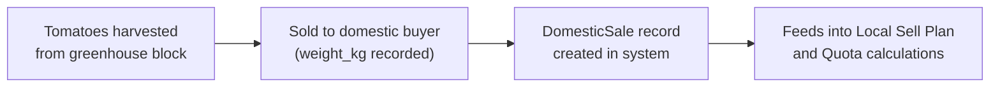
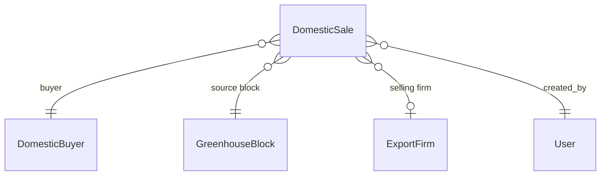

# Domestic Sales

## What Is This Process?

Not all tomatoes are exported. Some are sold domestically to local buyers. Each domestic sale record tracks: date, buyer, block, weight, variety, and optional pricing. Domestic sales data feeds into [[local-sell-plan]] figures and ultimately into [[quota-management]] (domestic sales × 10 = expected export quota).

## How It Works (Business Flow)

## Database

### Tables

| Table | Purpose | Key Columns |
|-------|---------|-------------|
| `greenhouse.domestic_sales` | One row per sale event | date, buyer (FK DomesticBuyer), block (FK GreenhouseBlock), export_firm (FK, nullable), weight_kg, variety, price_per_kg, tabel_no |

### Relationships

## Backend Implementation

### Model

**File**: `backend/apps/greenhouse/models/domestic_sale.py`

**DomesticSale**:
- `date` (DateField), `buyer` (FK DomesticBuyer PROTECT), `block` (FK GreenhouseBlock PROTECT)
- `export_firm` (FK ExportFirm, nullable), `weight_kg` (Decimal), `variety` (CharField)
- `price_per_kg` (Decimal, nullable), `tabel_no` (CharField), `notes` (Text)
- `created_by` (FK User), `created_at`

### ViewSet & Endpoints

**File**: `backend/apps/greenhouse/views.py` — `DomesticSaleViewSet`

| Method | Endpoint | Action |
|--------|----------|--------|
| GET | `/api/v1/greenhouse/domestic-sales/` | List (page_size=1000) |
| POST | `/api/v1/greenhouse/domestic-sales/` | Create |
| PATCH | `/api/v1/greenhouse/domestic-sales/{id}/` | Update |

**Filters**: `?block=`, `?buyer=`, `?export_firm=`, `?date_from=`, `?date_to=`
**Search**: tabel_no, variety

## Frontend Implementation

### Page: DomesticSales

**File**: `frontend/src/pages/export/DomesticSales.tsx`

**Stat Cards** (3-column):
| Card | Value |
|------|-------|
| Total Sales | Count |
| Total Weight | Sum of weight_kg |
| Unique Buyers | Distinct buyer count |

**Table Columns**:
| # | Column | Width |
|---|--------|-------|
| 1 | Date | 110px |
| 2 | Buyer Name | 120px |
| 3 | Block Code | 80px |
| 4 | Variety | 110px |
| 5 | Weight (kg) | 120px |
| 6 | Price per kg | 100px |
| 7 | Tabel No | 100px |
| 8 | Firm Name | variable |

No pagination — loads all records (page_size=1000).

### Hooks

| Hook | Endpoint | Returns | Stale Time |
|------|----------|---------|------------|
| `useDomesticSales` | `GET /greenhouse/domestic-sales/?page_size=1000` | `IDomesticSale[]` | 60s |

### TypeScript Types

**`IDomesticSale`**: id, date, buyer, buyer_name, block, block_code, export_firm_name, weight_kg, variety, price_per_kg, tabel_no

## Roles & Permissions

| Role | View | Create/Edit |
|------|------|-------------|
| `export_manager` | Yes | Yes |
| `director` | Yes | Yes |
| `greenhouse_manager` | Own blocks | Own blocks |
| Others | Read-only | No |

## Connections to Other Processes

- **[[local-sell-plan]]** — Domestic sales inform the weekly local sell plan figures
- **[[quota-management]]** — Domestic sales × 10 = expected export quota baseline
- **[[weekly-harvest-planning]]** — Part of harvest goes to domestic, part to export
