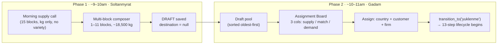
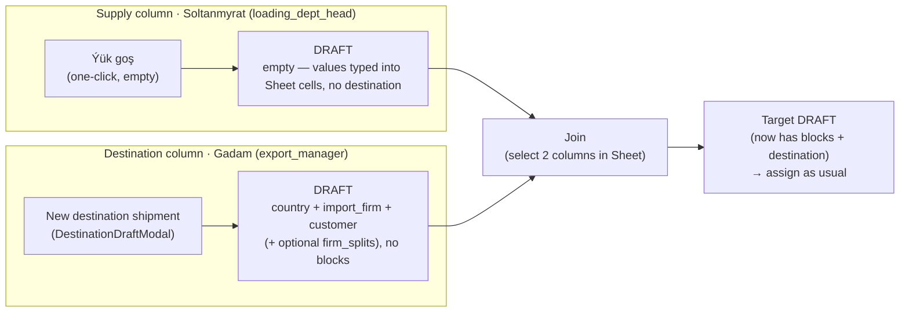

# Draft Shipments

## What Is This Process?

Shipment creation is split across **two people, two moments, two data contexts** — Soltanmyrat fixes supply composition in the morning, Gadam assigns a destination later the same morning. The intermediate state is a **draft shipment** (`status.code = 'draft'`, `step_order = 0`).

Origin: Kaka site visit (Apr 2026), Findings #1 and #2. See [[../../../data/kaka_greenhouse_findings/Kaka_Findings_v1.md|Kaka Findings v1]] for the operational rationale.

## How It Works (Business Flow)



**Key facts**:
- Standard truck target: 18,500 kg. Composer supports ±5% variance with colour-coded warnings.
- Historical precedent: one real shipment was composed from 11 source blocks.
- **Variety is not captured at draft creation** (Finding #3 — block managers cannot give morning variety breakdown). Demand cards with `strict: true` show an amber "variety confirmed at packaging" warning.
- Freshness: draft cards show age (🟢 today / 🟡 yesterday / 🔴 2+ days). Assignment Board sorts oldest first — tomato has an expiration clock.

## Database

No new table. Draft shipments reuse `export.shipments` with `status_id = (ShipmentStatusType where code='draft')`. Block sources use existing `export.shipment_block_sources`.

| Field on `shipments` | Draft | After assign (`yuklenme`) |
|---------------------|-------|--------------------------|
| `status_id` | `draft` | `yuklenme` |
| `country_id`, `customer_id`, `city_id` | null allowed | required |
| `loading_started_at` | null | set by `transition_to()` (AD-1) |

`ShipmentStatusLog` records both the initial draft entry and the assign transition.

## Backend Implementation

### Status seeding

**File**: `backend/apps/export/migrations/0017_shipment_draft_status_seed.py` (data migration) and `backend/apps/export/management/commands/seed_data.py`.

Row: `{code: 'draft', name_tk: 'Garalama', name_ru: 'Черновик', name_en: 'Draft', step_order: 0, phase: 'DRAFT', is_terminal: false}`.

### TRANSITIONS dict

**File**: `backend/apps/export/services.py`

```python
TRANSITIONS = {
    None:             [('draft',    ['warehouse_chief'])],
    'draft':          [('yuklenme', ['export_manager'])],
    'yuklenme':       [('gumruk_girish', ['warehouse_chief'])],
    # ... remaining 13-step edges unchanged
}
```

`draft` has **no entry** in `STATUS_TIMESTAMP_MAP` — AD-1 `loading_started_at` is still only written when the shipment transitions into `yuklenme`.

### Create draft

**Endpoint**: `POST /api/v1/export/shipments/` with `{"is_draft": true, "cargo_code": "...", "date": "...", "block_sources": [{"block": 1, "weight_kg": "12000.00"}, ...]}`.

**Service**: `ShipmentViewSet._create_draft_shipment(data, user)` in `backend/apps/export/views.py`:

1. `transaction.atomic()`:
   1. Look up `ShipmentStatusType(code='draft')`.
   2. `Shipment.objects.create(status=draft_row, cargo_code=..., date=..., created_by=user)`.
   3. `ShipmentBlockSource.objects.bulk_create([...], batch_size=500)` — MSSQL requires explicit batch_size.
   4. `ShipmentStatusLog.objects.create(shipment, status=draft_row, changed_by=user, comment='Draft created')`.
2. Return `ShipmentDetailSerializer(shipment).data`.

### Assign draft → yuklenme

**Endpoint**: `POST /api/v1/export/shipments/{id}/assign/` with `{"country": 1, "customer": 5, "city": null, "import_firm": 2}`.

**ViewSet action**: `ShipmentViewSet.assign(request, pk)`:

1. Load shipment; if `shipment.status.code != 'draft'` → 400 `{"error": "Shipment is not a draft"}`.
2. Apply destination fields via `ShipmentAssignSerializer`.
3. `transition_to(shipment, 'yuklenme', request.user, comment='assigned from draft')`.
   - Enforces `export_manager` role (or `PRIVILEGED_ROLES`).
   - Writes AD-1 `loading_started_at = timezone.now()`.
   - Appends `ShipmentStatusLog` row.
4. Return `ShipmentDetailSerializer(shipment).data`.

### Forecast-first flow (2026-05-22) — drafts draw down a per-block harvest pool

A draft is **one truck** (≤18,500 kg). It draws from a **per-block daily harvest pool** entered up front as a forecast. (This replaced an earlier "draft = whole harvest, split at assignment" attempt, which was reverted.)

**The pool needs no new table:** `remaining(block, date) = HarvestDayEntry.forecast_value − Σ ShipmentBlockSource.weight_kg` (block, `shipment.date`, non-cancelled), computed live. Leftover is "saved" automatically — the forecast persists; remaining just decreases as drafts are created.

**Step 1 — Enter forecast** (renamed "New Draft" button → "Enter Forecast"; `ForecastEntryModal`): per block, kg, for **today or +1 day**. `POST /api/v1/export/harvest-forecast/` body `{date, entries:[{block_id, forecast_kg}]}` (roles: admin / loading_dept_head / greenhouse_manager). Orchestrated in the **export** app (lazy-imports greenhouse): get-or-creates the `WeeklyHarvestPlan` + `HarvestDayEntry`, writes `forecast_value` via greenhouse `set_forecast_value` (reuses its role×window matrix — loading_dept_head: day-before 00:00 → 12:00 day-of), then creates a `Notification(kind='forecast_handoff')` to `loading_dept_head` (excluding the submitter).

**Step 2 — Build drafts** (Soltanmyrat, `DraftComposerModal`): pick a block → composer shows **"available: X kg"** (`GET /api/v1/export/harvest-forecast/remaining/?date=`), caps the row at `min(remaining, 18500)`. On create, `_create_draft_shipment` calls `assert_draw_within_pool(...)` inside its `transaction.atomic()` — a `select_for_update` lock on the forecast rows makes concurrent creates serialize so the pool can't be over-allocated (rejects a block with no forecast, over-remaining, or >18,500). A block with no forecast cannot be drafted (forecast-first).

**Step 3 — Assign** (unchanged): `POST /shipments/{id}/assign/` sets destination + `transition_to('gumruk_girish')`.

Service: `apps/export/services/harvest_forecast.py` (`get_remaining_for_date`, `get_remaining_for_block`, `assert_draw_within_pool` — all lazy-import greenhouse). Endpoints: `apps/export/views_harvest_forecast.py`. Tests: `tests_harvest_forecast.py` (24). **Deferred (Phase 2):** a formal "build drafts" task on Soltanmyrat's My Work Board (needs `Task.shipment` nullable); pool re-validation on the draft *edit* path (`set_block_sources`). Frontend: `useHarvestForecastRemaining` / `useSubmitForecast` (`useDrafts.ts`).

### Two-column Join flow (coexisting alternative)

A **second way to create shipments**, working directly in the [[../screens/shipment-sheet|Sheet]] and mirroring the old Google-Sheet manual process. It **coexists with** the forecast-first flow above — it does not replace it. In the Sheet each shipment is a **column**, so two half-built drafts are created and then merged.



**Step 1 — Supply column** (Soltanmyrat, role `loading_dept_head`): **"Ýük goş"** toolbar button → **one-click** creation of an **empty** draft column. No modal: a single click `POST`s `{is_draft: true}` (hook `useCreateEmptyColumn`); the backend auto-generates `cargo_code` and defaults `date` to today, with **no blocks, no variety, no destination**. Soltanmyrat then types the column's values (blocks, weights, official export code, …) **directly into the Sheet cells**, and the column is later merged with Gadam's destination column via Join. The column renders **green** because `created_by_role ∈ {loading_dept_head, warehouse_chief}` (see Sheet tint below). Visible to the same roles as before (`loading_dept_head`, `warehouse_chief`, `export_manager`, `director`, superuser).

> Replaces the earlier `SupplyDraftModal` (forecast-pool block picker). The modal and its forecast-pool workflow were removed in favour of the simpler empty-column + Sheet-cell entry flow. Note: the Join endpoint still requires the source column to have ≥1 block, so blocks must be entered in the Sheet before joining.

**Step 2 — Destination column** (Gadam, role `export_manager`): "New destination shipment" toolbar button → `DestinationDraftModal`. Picks country + import_firm + customer (+ optional firm_splits), **no blocks**. Also saved as a `draft`.

**Step 3 — Join** (Gadam): "Join" toolbar button arms a **column-selection mode** — Gadam clicks two draft columns directly in the Sheet (they highlight). The `JoinActionBar` auto-detects which selected column is the destination (target) vs the supply (source), shows a supply→destination preview, and confirms via a Popconfirm (the source is hard-deleted). No modal.

**Endpoint**: `POST /api/v1/export/shipments/{target_id}/join/` body `{"source_id": <int>}`. Caller must be `export_manager`/`director`. Gates: both must be `draft`; target ≠ source; target must have country + customer; target must **not** already have blocks; source must have ≥1 block. Effect:
- `source.block_sources` (and `firm_splits` if the target has none) move to the target.
- `variety` + `official_export_code` are copied to the target if the target's are empty.
- The source's full set of sorts (`varieties_dominant`) is copied onto the target when the target has none.
- `target.weight_net` is recomputed.
- One `ShipmentStatusLog` audit row is written on the target ("Joined supply from {source.cargo_code} …").
- The source creator gets a `Notification`.
- The **source is hard-deleted**.

The target stays `draft` and is then assigned via the existing assign action (Step 3 of the forecast-first flow). Returns the updated target detail (200); errors as `{error}` with 400/403/404.

**Sheet tint**: supply columns are visually tinted in the Sheet by `created_by_role ∈ {loading_dept_head, warehouse_chief}`. A manual `column_color` still takes precedence over the tint. See [[../screens/shipment-sheet#Supply-column tint|Shipment Sheet]] for the toolbar buttons and tint rendering.

### Permissions

Registered in `backend/apps/core/permission_registry.py`:
- Page: `export.drafts` — warehouse_chief, export_manager, director.
- Page: `export.assign` — export_manager, director.
- Resource: `shipment_assign` — export_manager, director.

`warehouse_chief.shipment` resource permission bumped to `_VCE` (view + create + edit) so drafts can be created.

## Frontend Implementation

### Pages

| Page | Route | Role |
|------|-------|------|
| DraftPool | `/export/drafts` | warehouse_chief, export_manager |
| AssignmentBoard | `/export/assign` | export_manager |

**Files**: `frontend/src/pages/export/DraftPool.tsx`, `frontend/src/pages/export/AssignmentBoard.tsx`.

### Components

- `DraftComposerModal` (`src/components/draft/DraftComposerModal.tsx`) — 1–11 rows, block selector. 3 numbered sections, **harvest-first**: **1. Harvest** — per block it shows **"available: X kg"** from the forecast pool (`useHarvestForecastRemaining`) and caps each row at `min(remaining, 18500)`; a block with no forecast is disabled; **2. Shipment Code** (collapsed `Collapse`, optional — Export Code on the panel header, `?` popover with the dual-code explainer); **3. Notes**. 3-column table (Block · Allocate · delete); the old "Leftover" column, yellow "sort notice", and the brief "≈ N trucks" reframe were all removed. Surfaces backend pool-rejection errors (both `{block_sources}` and `{error}` shapes).
- `OfficialCodeEditor` (`src/components/draft/OfficialCodeEditor.tsx`) — the 6-field Shipment Code (Day · Month · Seq · Block · Year). The 6th field (variety) is **omitted from the draft UI** per Finding #3, but the stored `official_export_code` keeps all 6 `|`-separated fields with the variety slot empty (backend validator requires exactly 6). The preview renders each field as a labelled slot, never the raw `21|MY|||26|` pipe string. (Used only inside the composer's collapsed "Shipment Code" section.)
- `BlockSelect` (`src/components/BlockSelect.tsx`) — self-fetching `Select` of `IGreenhouseBlock`, supports `excludeIds` for multi-row deduplication.

### Hooks

**File**: `frontend/src/hooks/useDrafts.ts`

- `useDrafts()` — GET shipments filtered by draft status; client-side sort oldest-first.
- `useCreateDraft()` — POST with `is_draft: true`.
- `useAssignDraft()` — POST `/shipments/{id}/assign/`.

All three respect `VITE_USE_MOCK` via `src/mock/drafts.ts`.

### i18n

Namespaces: `draft.*` (37 keys), `assign.*` (29 keys). Present in tk.json / ru.json / en.json per STRICT i18n rule.

## Connections to Other Processes

- **[[shipment-creation]]** — describes the legacy single-form path (`is_draft=false`). Still supported for direct shipment creation.
- **[[shipment-lifecycle]]** — 13 steps begin at `yuklenme`. Draft is step 0 (pre-lifecycle).
- **[[weekly-harvest-planning]]** — blocks shown in composer come from the same reference table used by the weekly plan.

## Deferred (Kaka Findings follow-up)

Tracked in [[../operations/known-issues|known-issues]]:
- **Finding #3**: variety-at-packaging rule (no variety field on morning supply — enforced once supply board lands).
- **Finding #4**: pallet manifest, `weight_master` role, `CrateType` reference, sub-blocks (F1/F2), `is_experimental` flag on `TomatoVariety`.
- **Finding #5**: Soltanmyrat's 5-function role expansion, truck dispatch board, truck swap flow, freshness attribute on shipment.
- **Finding #5c**: Mergen/Dispatcher role decision.
- **Finding #6**: Received-weight productivity integration (Logo Tiger handoff, receipt-act source-of-truth).
