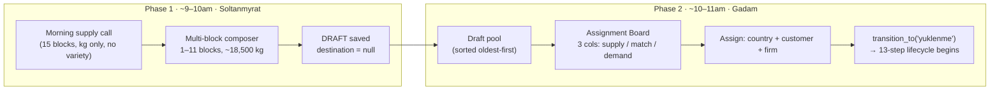

# Draft Shipments

## What Is This Process?

Shipment creation is split across **two people, two moments, two data contexts** — Soltanmyrat fixes supply composition in the morning, Gadam assigns a destination later the same morning. The intermediate state is a **draft shipment** (`status.code = 'draft'`, `step_order = 0`).

Origin: Kaka site visit (Apr 2026), Findings #1 and #2. See [[../../../data/kaka_greenhouse_findings/Kaka_Findings_v1.md|Kaka Findings v1]] for the operational rationale.

## How It Works (Business Flow)



**Key facts**:
- Standard truck target: 18,500 kg. Composer supports ±5% variance with colour-coded warnings.
- Historical precedent: one real shipment was composed from 11 source blocks.
- **Variety is not captured at draft creation** (Finding #3 — block managers cannot give morning variety breakdown). Demand cards with `strict: true` show an amber "variety confirmed at packaging" warning.
- Freshness: draft cards show age (🟢 today / 🟡 yesterday / 🔴 2+ days). Assignment Board sorts oldest first — tomato has an expiration clock.

## Database

No new table. Draft shipments reuse `export.shipments` with `status_id = (ShipmentStatusType where code='draft')`. Block sources use existing `export.shipment_block_sources`.

| Field on `shipments` | Draft | After assign (`yuklenme`) |
|---------------------|-------|--------------------------|
| `status_id` | `draft` | `yuklenme` |
| `country_id`, `customer_id`, `city_id` | null allowed | required |
| `loading_started_at` | null | set by `transition_to()` (AD-1) |

`ShipmentStatusLog` records both the initial draft entry and the assign transition.

## Backend Implementation

### Status seeding

**File**: `backend/apps/export/migrations/0017_shipment_draft_status_seed.py` (data migration) and `backend/apps/export/management/commands/seed_data.py`.

Row: `{code: 'draft', name_tk: 'Garalama', name_ru: 'Черновик', name_en: 'Draft', step_order: 0, phase: 'DRAFT', is_terminal: false}`.

### TRANSITIONS dict

**File**: `backend/apps/export/services.py`

```python
TRANSITIONS = {
    None:             [('draft',    ['warehouse_chief'])],
    'draft':          [('yuklenme', ['export_manager'])],
    'yuklenme':       [('gumruk_girish', ['warehouse_chief'])],
    # ... remaining 13-step edges unchanged
}
```

`draft` has **no entry** in `STATUS_TIMESTAMP_MAP` — AD-1 `loading_started_at` is still only written when the shipment transitions into `yuklenme`.

### Create draft

**Endpoint**: `POST /api/v1/export/shipments/` with `{"is_draft": true, "cargo_code": "...", "date": "...", "block_sources": [{"block": 1, "weight_kg": "12000.00"}, ...]}`.

**Service**: `ShipmentViewSet._create_draft_shipment(data, user)` in `backend/apps/export/views.py`:

1. `transaction.atomic()`:
   1. Look up `ShipmentStatusType(code='draft')`.
   2. `Shipment.objects.create(status=draft_row, cargo_code=..., date=..., created_by=user)`.
   3. `ShipmentBlockSource.objects.bulk_create([...], batch_size=500)` — MSSQL requires explicit batch_size.
   4. `ShipmentStatusLog.objects.create(shipment, status=draft_row, changed_by=user, comment='Draft created')`.
2. Return `ShipmentDetailSerializer(shipment).data`.

### Assign draft → yuklenme

**Endpoint**: `POST /api/v1/export/shipments/{id}/assign/` with `{"country": 1, "customer": 5, "city": null, "import_firm": 2}`.

**ViewSet action**: `ShipmentViewSet.assign(request, pk)`:

1. Load shipment; if `shipment.status.code != 'draft'` → 400 `{"error": "Shipment is not a draft"}`.
2. Apply destination fields via `ShipmentAssignSerializer`.
3. `transition_to(shipment, 'yuklenme', request.user, comment='assigned from draft')`.
   - Enforces `export_manager` role (or `PRIVILEGED_ROLES`).
   - Writes AD-1 `loading_started_at = timezone.now()`.
   - Appends `ShipmentStatusLog` row.
4. Return `ShipmentDetailSerializer(shipment).data`.

### Split draft → N trucks (whole-harvest batch model)

A draft now holds the **whole daily harvest** of its block(s) — it is **not** capped at one truck (the composer shows "≈ N trucks" instead of an 18,500 target). At the Assignment Board the user splits it **by hand** into trucks.

**Endpoint**: `POST /api/v1/export/shipments/{id}/split/` — role `{export_manager, director}`. Body:
```json
{ "trucks": [ { "weight_kg": 18000, "country": 3, "city": null, "customer": 7,
  "import_firm": 2, "firm_splits": [{ "export_firm_id": 5, "weight_kg": null }] }, ... ] }
```
**ViewSet action** `ShipmentViewSet.split` (one `transaction.atomic()`, `select_for_update` on the draft):
1. Assert `status == 'draft'`; validate each `weight_kg ≤ 18500` and `Σ ≤ draft_total` (= Σ block_sources).
2. **Block-source sequential draw-down**: each truck draws `min(block_remaining, need)` from the draft's blocks (carrying `harvest_date`); per-block sums are preserved.
3. Per truck: `create_shipment(...)` → set `city`/`import_firm`/`official_export_code` (shared batch code) / `previous_platform_id = draft` / `harvest_date`; `bulk_create` its block_sources; firm splits + draft `QuotaUsageRecord` (⚠️ **ADR-016**: `ShipmentFirmSplit.weight_kg` & `kg_used` use the OFFICIAL `get_default_truck_weight(num_firms)`, NOT the real truck weight, which lives on `ShipmentBlockSource.weight_kg`); `transition_to(truck, 'gumruk_girish', …)`.
4. Finalize draft: delete its block_sources/draft firm_splits/draft quota usage; `transition_to(draft, 'cancelled', …)` + `_cancel_open_tasks(draft)`; AuditLog any discarded leftover.
5. Return `{ created_truck_ids: [...], cancelled_draft_id }`.

All trucks from one draft **share** the batch `official_export_code` (the Shipment Code, non-unique) but each gets its own unique `cargo_code` (`generate_cargo_codes(n)`). Leftover after splitting is discarded (Phase 2 will preserve it as a residual draft). Code/codes: `generate_cargo_code` now delegates to `generate_cargo_codes`. Tests: `backend/apps/export/tests_split.py` (26).

**Frontend**: `SplitTrucksPanel` (`src/pages/export/assignment/`) renders in the Assignment Board centre column for a selected draft — truck rows (weight + destination + optional 1–3 export firms via `ExportFirmSelect`/`ImportFirmSelect`), a live **Remaining = Σ block_sources − Σ truck weights** counter that blocks over-allocation. Hook `useSplitDraft` (`useDrafts.ts`).

### Permissions

Registered in `backend/apps/core/permission_registry.py`:
- Page: `export.drafts` — warehouse_chief, export_manager, director.
- Page: `export.assign` — export_manager, director.
- Resource: `shipment_assign` — export_manager, director.

`warehouse_chief.shipment` resource permission bumped to `_VCE` (view + create + edit) so drafts can be created.

## Frontend Implementation

### Pages

| Page | Route | Role |
|------|-------|------|
| DraftPool | `/export/drafts` | warehouse_chief, export_manager |
| AssignmentBoard | `/export/assign` | export_manager |

**Files**: `frontend/src/pages/export/DraftPool.tsx`, `frontend/src/pages/export/AssignmentBoard.tsx`.

### Components

- `DraftComposerModal` (`src/components/draft/DraftComposerModal.tsx`) — 1–11 rows, live sum validation, block selector. Reorganized into 3 numbered sections, **harvest-first** (the draft is the single harvest-entry point now): **1. Harvest** (target weight + block/kg table + over/under badge), **2. Shipment Code** (in a collapsed `Collapse`, optional — Export Code stays visible on the panel header, `?` popover carries the dual-code explainer), **3. Notes**. The block table is 3 columns (Block · Allocate · delete) — the always-empty "Leftover" column and the old yellow "sort notice" banner were removed.
- `OfficialCodeEditor` (`src/components/draft/OfficialCodeEditor.tsx`) — the 6-field Shipment Code (Day · Month · Seq · Block · Year). The 6th field (variety) is **omitted from the draft UI** per Finding #3, but the stored `official_export_code` keeps all 6 `|`-separated fields with the variety slot empty (backend validator requires exactly 6). The preview renders each field as a labelled slot, never the raw `21|MY|||26|` pipe string. (Used only inside the composer's collapsed "Shipment Code" section.)
- `BlockSelect` (`src/components/BlockSelect.tsx`) — self-fetching `Select` of `IGreenhouseBlock`, supports `excludeIds` for multi-row deduplication.

### Hooks

**File**: `frontend/src/hooks/useDrafts.ts`

- `useDrafts()` — GET shipments filtered by draft status; client-side sort oldest-first.
- `useCreateDraft()` — POST with `is_draft: true`.
- `useAssignDraft()` — POST `/shipments/{id}/assign/`.

All three respect `VITE_USE_MOCK` via `src/mock/drafts.ts`.

### i18n

Namespaces: `draft.*` (37 keys), `assign.*` (29 keys). Present in tk.json / ru.json / en.json per STRICT i18n rule.

## Connections to Other Processes

- **[[shipment-creation]]** — describes the legacy single-form path (`is_draft=false`). Still supported for direct shipment creation.
- **[[shipment-lifecycle]]** — 13 steps begin at `yuklenme`. Draft is step 0 (pre-lifecycle).
- **[[weekly-harvest-planning]]** — blocks shown in composer come from the same reference table used by the weekly plan.

## Deferred (Kaka Findings follow-up)

Tracked in [[../operations/known-issues|known-issues]]:
- **Finding #3**: variety-at-packaging rule (no variety field on morning supply — enforced once supply board lands).
- **Finding #4**: pallet manifest, `weight_master` role, `CrateType` reference, sub-blocks (F1/F2), `is_experimental` flag on `TomatoVariety`.
- **Finding #5**: Soltanmyrat's 5-function role expansion, truck dispatch board, truck swap flow, freshness attribute on shipment.
- **Finding #5c**: Mergen/Dispatcher role decision.
- **Finding #6**: Received-weight productivity integration (Logo Tiger handoff, receipt-act source-of-truth).
