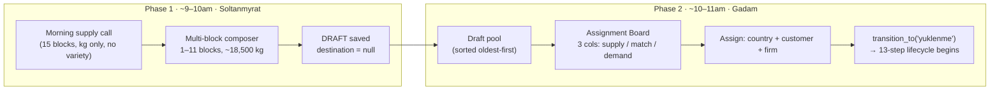

# Draft Shipments

## What Is This Process?

Shipment creation is split across **two people, two moments, two data contexts** — Soltanmyrat fixes supply composition in the morning, Gadam assigns a destination later the same morning. The intermediate state is a **draft shipment** (`status.code = 'draft'`, `step_order = 0`).

Origin: Kaka site visit (Apr 2026), Findings #1 and #2. See [[../../../data/kaka_greenhouse_findings/Kaka_Findings_v1.md|Kaka Findings v1]] for the operational rationale.

## How It Works (Business Flow)



**Key facts**:
- Standard truck target: 18,500 kg. Composer supports ±5% variance with colour-coded warnings.
- Historical precedent: one real shipment was composed from 11 source blocks.
- **Variety is not captured at draft creation** (Finding #3 — block managers cannot give morning variety breakdown). Demand cards with `strict: true` show an amber "variety confirmed at packaging" warning.
- Freshness: draft cards show age (🟢 today / 🟡 yesterday / 🔴 2+ days). Assignment Board sorts oldest first — tomato has an expiration clock.

## Database

No new table. Draft shipments reuse `export.shipments` with `status_id = (ShipmentStatusType where code='draft')`. Block sources use existing `export.shipment_block_sources`.

| Field on `shipments` | Draft | After assign (`yuklenme`) |
|---------------------|-------|--------------------------|
| `status_id` | `draft` | `yuklenme` |
| `country_id`, `customer_id`, `city_id` | null allowed | required |
| `loading_started_at` | null | set by `transition_to()` (AD-1) |

`ShipmentStatusLog` records both the initial draft entry and the assign transition.

## Backend Implementation

### Status seeding

**File**: `backend/apps/export/migrations/0017_shipment_draft_status_seed.py` (data migration) and `backend/apps/export/management/commands/seed_data.py`.

Row: `{code: 'draft', name_tk: 'Garalama', name_ru: 'Черновик', name_en: 'Draft', step_order: 0, phase: 'DRAFT', is_terminal: false}`.

### TRANSITIONS dict

**File**: `backend/apps/export/services.py`

```python
TRANSITIONS = {
    None:             [('draft',    ['warehouse_chief'])],
    'draft':          [('yuklenme', ['export_manager'])],
    'yuklenme':       [('gumruk_girish', ['warehouse_chief'])],
    # ... remaining 13-step edges unchanged
}
```

`draft` has **no entry** in `STATUS_TIMESTAMP_MAP` — AD-1 `loading_started_at` is still only written when the shipment transitions into `yuklenme`.

### Create draft

**Endpoint**: `POST /api/v1/export/shipments/` with `{"is_draft": true, "cargo_code": "...", "date": "...", "block_sources": [{"block": 1, "weight_kg": "12000.00"}, ...]}`.

**Service**: `ShipmentViewSet._create_draft_shipment(data, user)` in `backend/apps/export/views.py`:

1. `transaction.atomic()`:
   1. Look up `ShipmentStatusType(code='draft')`.
   2. `Shipment.objects.create(status=draft_row, cargo_code=..., date=..., created_by=user)`.
   3. `ShipmentBlockSource.objects.bulk_create([...], batch_size=500)` — MSSQL requires explicit batch_size.
   4. `ShipmentStatusLog.objects.create(shipment, status=draft_row, changed_by=user, comment='Draft created')`.
2. Return `ShipmentDetailSerializer(shipment).data`.

### Assign draft → yuklenme

**Endpoint**: `POST /api/v1/export/shipments/{id}/assign/` with `{"country": 1, "customer": 5, "city": null, "import_firm": 2}`.

**ViewSet action**: `ShipmentViewSet.assign(request, pk)`:

1. Load shipment; if `shipment.status.code != 'draft'` → 400 `{"error": "Shipment is not a draft"}`.
2. Apply destination fields via `ShipmentAssignSerializer`.
3. `transition_to(shipment, 'yuklenme', request.user, comment='assigned from draft')`.
   - Enforces `export_manager` role (or `PRIVILEGED_ROLES`).
   - Writes AD-1 `loading_started_at = timezone.now()`.
   - Appends `ShipmentStatusLog` row.
4. Return `ShipmentDetailSerializer(shipment).data`.

### Permissions

Registered in `backend/apps/core/permission_registry.py`:
- Page: `export.drafts` — warehouse_chief, export_manager, director.
- Page: `export.assign` — export_manager, director.
- Resource: `shipment_assign` — export_manager, director.

`warehouse_chief.shipment` resource permission bumped to `_VCE` (view + create + edit) so drafts can be created.

## Frontend Implementation

### Pages

| Page | Route | Role |
|------|-------|------|
| DraftPool | `/export/drafts` | warehouse_chief, export_manager |
| AssignmentBoard | `/export/assign` | export_manager |

**Files**: `frontend/src/pages/export/DraftPool.tsx`, `frontend/src/pages/export/AssignmentBoard.tsx`.

### Components

- `DraftComposerModal` (`src/components/draft/DraftComposerModal.tsx`) — 1–11 rows, live sum validation, block selector.
- `BlockSelect` (`src/components/BlockSelect.tsx`) — self-fetching `Select` of `IGreenhouseBlock`, supports `excludeIds` for multi-row deduplication.

### Hooks

**File**: `frontend/src/hooks/useDrafts.ts`

- `useDrafts()` — GET shipments filtered by draft status; client-side sort oldest-first.
- `useCreateDraft()` — POST with `is_draft: true`.
- `useAssignDraft()` — POST `/shipments/{id}/assign/`.

All three respect `VITE_USE_MOCK` via `src/mock/drafts.ts`.

### i18n

Namespaces: `draft.*` (37 keys), `assign.*` (29 keys). Present in tk.json / ru.json / en.json per STRICT i18n rule.

## Connections to Other Processes

- **[[shipment-creation]]** — describes the legacy single-form path (`is_draft=false`). Still supported for direct shipment creation.
- **[[shipment-lifecycle]]** — 13 steps begin at `yuklenme`. Draft is step 0 (pre-lifecycle).
- **[[weekly-harvest-planning]]** — blocks shown in composer come from the same reference table used by the weekly plan.

## Deferred (Kaka Findings follow-up)

Tracked in [[../operations/known-issues|known-issues]]:
- **Finding #3**: variety-at-packaging rule (no variety field on morning supply — enforced once supply board lands).
- **Finding #4**: pallet manifest, `weight_master` role, `CrateType` reference, sub-blocks (F1/F2), `is_experimental` flag on `TomatoVariety`.
- **Finding #5**: Soltanmyrat's 5-function role expansion, truck dispatch board, truck swap flow, freshness attribute on shipment.
- **Finding #5c**: Mergen/Dispatcher role decision.
- **Finding #6**: Received-weight productivity integration (Logo Tiger handoff, receipt-act source-of-truth).
