# Fleet Map (Traccar GPS)

## What Is This Feature?

Live truck positions on a map, sourced from the office's existing **Traccar** GPS server
(`10.10.11.79:8082`). Lives in a new standalone Django app, `apps.transport` — a registry
of trucks/drivers/devices plus a poller (Celery beat, every 120s) that keeps a
"last known position" table in our own DB. The `/api/v1/transport/live-positions/`
endpoint and the `/transport/map` page **never** call Traccar in the request path; they
only ever read our DB, so a slow or down Traccar server cannot slow down or break the app
for users looking at the map.

`apps.transport` depends **only on `apps.core`** (for the shared `schema_table` /
`cyrillic_collation` DB helpers) — it does not touch `greenhouse`/`export`/`contracts`/
`finance`, and nothing in those apps depends on it. It hangs off `core` as its own leaf,
a sibling of `greenhouse` in the `core ← greenhouse ← export ← contracts ← finance` chain.
`Truck` is a new, separate registry; it is **not** linked to `Shipment` in this slice (see
Out of Scope).

## How It Works (Business Flow)

```mermaid
flowchart LR
    A["seed_traccar_devices<br/>(one-time, idempotent)"] --> B["Truck + TraccarDevice rows<br/>created from Traccar's /api/devices"]
    B --> C["Celery beat every 120s:<br/>apps.transport.tasks.poll_traccar"]
    C --> D1["sync_devices():<br/>refresh status/last_seen,<br/>auto-register new devices"]
    D1 --> D["TraccarClient.get_positions()<br/>GET /api/positions"]
    D --> E["sync_positions():<br/>upsert latest DevicePosition<br/>per known device, speed knots→km/h"]
    E --> F["GET /api/v1/transport/live-positions/<br/>reads DB only, never Traccar"]
    F --> G["FleetMap page<br/>(react-leaflet, 30s refetch)"]
```



Every poll now calls **both** `sync_devices()` and `sync_positions()` (in that order), so
`TraccarDevice.status`/`last_seen` stay live (not frozen at the one-time seed) and trucks
added to Traccar after the initial seed are picked up automatically — `sync_positions`
only skips a `deviceId` that still has no `TraccarDevice` row, which `sync_devices` now
prevents by re-registering every poll. `sync_devices` is idempotent (`update_or_create`),
so running it every minute for ~95 devices is cheap.

If Traccar is unreachable, `TraccarClient` raises `TraccarUnavailable`; both management
commands **and** the Celery task catch it, log a warning, and return/exit non-fatally —
the last-known `DevicePosition` rows stay as-is and the next scheduled poll retries. In
`poll_traccar_positions` and in `poll_traccar` (the Celery task), if `sync_devices()`
raises, `sync_positions()` is never called that cycle (both share the same `try`); either
failure still exits 0 / returns `{'devices': 0, 'positions': 0, 'ok': False}`.

## Data Model

Four models in `backend/apps/transport/models/registry.py`, table prefix `transport.*`
(`schema_table('transport', ...)`).

### `Truck`

| Field | Type | Notes |
|---|---|---|
| `plate` | CharField(20), unique | |
| `fleet_no` | CharField(10), unique, null | `TR##` token parsed off the Traccar device name |
| `category` | CharField(20), choices `truck`/`trailer`/`unknown` | default `unknown` |
| `is_active` | Boolean | default `True` |

### `Driver`

| Field | Type | Notes |
|---|---|---|
| `name` | CharField(100), Cyrillic collation | |
| `phone` | CharField(30), null | |
| `is_active` | Boolean | default `True` |

Not yet linked to `Truck`/`TraccarDevice` — see Out of Scope.

### `TraccarDevice`

| Field | Type | Notes |
|---|---|---|
| `traccar_id` | IntegerField, unique | Traccar's own device `id` |
| `imei` | CharField(32), null | Traccar's `uniqueId` |
| `name` | CharField(100), Cyrillic collation | raw Traccar device name, e.g. `"12 AB 3456 TR07"` |
| `category` | CharField(20), null | |
| `truck` | FK → `Truck`, PROTECT, null | set by `sync_devices` |
| `status` | CharField(10) | Traccar's own `online`/`offline`/`unknown` |
| `last_seen` | DateTimeField, null | Traccar's `lastUpdate` |

### `DevicePosition`

Latest known position for a device — **one row per device**, upserted (not a history table).

| Field | Type | Notes |
|---|---|---|
| `device` | OneToOne → `TraccarDevice`, CASCADE, `related_name='position'` | |
| `latitude` / `longitude` | Decimal(9,6) | |
| `speed` | Decimal(6,2), null | km/h, from Traccar |
| `course` | Decimal(5,1), null | heading in degrees |
| `address` | CharField(300), null, Cyrillic collation | reverse-geocoded by Traccar, truncated to 300 |
| `ignition` | Boolean, null | from Traccar's `attributes.ignition` |
| `fix_time` | DateTimeField, null | when Traccar fixed the position (not when we polled) |
| `valid` | Boolean | default `True`; the API only serves `valid=True` rows |
| `updated_at` | DateTimeField, `auto_now` | when we last upserted this row |

## Traccar Client (read-only)

`backend/apps/transport/services/traccar_client.py` — `TraccarClient` wraps two read-only
Traccar REST calls, `GET /api/devices` and `GET /api/positions`, both via
`Authorization: Bearer {TRACCAR_TOKEN}`. `TraccarClient` never issues a write to Traccar.
Any network error, non-2xx status, or non-JSON body raises `TraccarUnavailable`.

### Settings (`.env`)

| Var | Default | Purpose |
|---|---|---|
| `TRACCAR_BASE_URL` | `''` | e.g. `http://10.10.11.79:8082` |
| `TRACCAR_TOKEN` | `''` | Bearer token for a **dedicated read-only** Traccar account — never a personal login, never exposed to the browser |
| `TRACCAR_STALE_MINUTES` | `15` | age threshold for `is_stale` in the API response |

## Sync Service

`backend/apps/transport/services/sync.py`:

- **`parse_device_name(name)`** — splits a Traccar device name of the form
  `"<PLATE> TR<NN>"` (case-insensitive `TR\d+` suffix) into `(plate, fleet_no)`. No
  trailing `TR##` token → returns `(whole_name, None)`.
- **`sync_devices(client=None)`** — pulls `get_devices()`, `update_or_create`s a `Truck`
  per parsed plate and a `TraccarDevice` per Traccar device id. Idempotent — safe to
  re-run.
- **`sync_positions(client=None)`** — pulls `get_positions()`, upserts one
  `DevicePosition` per **known** device (looked up by `traccar_id`). Positions for a
  `deviceId` with no matching `TraccarDevice`, or with a null `latitude`, are skipped and
  logged as a warning — they never raise. Traccar reports `speed` in **knots**;
  `sync_positions` converts to km/h at write time (`speed * 1.852`, rounded to 2dp) so it
  matches the `DevicePosition.speed` field's km/h label — a `None`/absent speed stays
  `None` (not converted).

## Scheduling — Celery beat (primary)

`poll_traccar` (`backend/apps/transport/tasks.py`) is the primary, live scheduler —
registered in `CELERY_BEAT_SCHEDULE` (`backend/config/settings.py`) and run by **Celery
beat every 120 seconds**:

```python
CELERY_BEAT_SCHEDULE = {
    'poll-traccar-positions': {
        'task': 'apps.transport.tasks.poll_traccar',
        'schedule': 120.0,
        'options': {'expires': 110},
    },
}
```

The task calls `sync_devices()` then `sync_positions()` (same order/behaviour as the
management command below) and returns `{'devices': N, 'positions': M, 'ok': True/False}`
— nothing reads the result (`CELERY_RESULT_BACKEND = None`, fire-and-forget). `expires:
110` drops a task that's still queued (not yet started) after 110s rather than running it
late with a stale window. `CELERY_TASK_TIME_LIMIT = 110` (with `CELERY_TASK_SOFT_TIME_LIMIT
= 100`) kills a hung run *before* the next 120s tick fires, so two overlapping
`poll_traccar` runs can never hit the same `update_or_create` rows on MSSQL at once
(overlap = deadlock/IntegrityError risk). Running the worker/beat processes
(`celery -A config worker`, `celery -A config beat`) is deploy/docker-compose wiring —
tracked separately, not covered here.

## Management Commands

| Command | Type | Schedule |
|---|---|---|
| `seed_traccar_devices` | one-time, idempotent | run manually once for an explicit initial load — the poller now keeps devices in sync on its own, so re-running this is optional |
| `poll_traccar_positions` | **manual, one-shot** | superseded by Celery beat (above) as the live scheduler; kept for manual ad-hoc runs (e.g. debugging, forcing a refresh outside the 120s cadence) — calls `sync_devices()` then `sync_positions()`, reporting both counts (`"Synced N devices, updated M positions."`) |

```
python manage.py poll_traccar_positions
```

Both commands, and the `poll_traccar` Celery task, catch `TraccarUnavailable` and exit/return
non-fatally (warning for the poller and the task, error for the seed command) — a down
Traccar server never crashes the schedule, it just means positions go stale until Traccar
comes back.

## REST Surface

`GET /api/v1/transport/live-positions/` — `IsAuthenticated`, no role gate, no pagination
(bare list — bounded to one row per device). Reads `DevicePosition.objects.filter(valid=True)`
with `select_related('device', 'device__truck')`; never calls Traccar.

Response item shape (`LivePositionSerializer`, DB columns → API field names per
`api-contract`):

```jsonc
{
  "device_id": 42,       // device.traccar_id
  "plate": "12 AB 3456", // device.truck.plate, null if unmatched
  "fleet_no": "TR07",    // device.truck.fleet_no, null if unmatched
  "status": "online",    // device.status (Traccar's own value)
  "lat": 37.95,          // latitude, float
  "lon": 58.39,          // longitude, float
  "speed": 62.5,         // float or null
  "course": 184.0,       // float or null
  "address": "…",        // string or null
  "fix_time": "2026-07-30T09:14:00Z",
  "is_online": true,     // status == 'online'
  "is_stale": false      // now - fix_time > TRACCAR_STALE_MINUTES
}
```

## Fleet Map Page

Route `/transport/map`, nav entry "Fleet Map" (`nav.fleet_map`, Turkmen/Russian/English —
`fleet_map.*` keys in all three locale files). **No `transport.map` page_code registered
yet** — same bypass as `worklog`/`team/kpi`: `ProtectedRoute` with no `pageCode`, open to
every authenticated role (see `frontend/src/App.tsx`, `AppLayout.tsx`).

`react-leaflet@4.2.1` + OpenStreetMap tiles (`VITE_MAP_TILE_URL` env override, default
`{s}.tile.openstreetmap.org`), default view centred on Ashgabat
(`[37.95, 58.39]`, zoom 5, matching the Traccar server's own coverage). A searchable
sidebar (plate / fleet_no / address) list next to the `MapContainer`; each truck is a
`CircleMarker` colour-coded by state:

| Colour | Meaning |
|---|---|
| Grey | `is_stale` (no recent fix, regardless of online/offline) |
| Green | `is_online` and not stale |
| Amber | known but offline, not stale |

## Code Map

| Concern | File |
|---|---|
| Models | [`backend/apps/transport/models/registry.py`](../../../backend/apps/transport/models/registry.py) |
| Migration | [`backend/apps/transport/migrations/0001_initial.py`](../../../backend/apps/transport/migrations/0001_initial.py) |
| Traccar client | [`backend/apps/transport/services/traccar_client.py`](../../../backend/apps/transport/services/traccar_client.py) |
| Sync service | [`backend/apps/transport/services/sync.py`](../../../backend/apps/transport/services/sync.py) |
| Seed command | [`backend/apps/transport/management/commands/seed_traccar_devices.py`](../../../backend/apps/transport/management/commands/seed_traccar_devices.py) |
| Poll command (manual one-shot) | [`backend/apps/transport/management/commands/poll_traccar_positions.py`](../../../backend/apps/transport/management/commands/poll_traccar_positions.py) |
| Celery task (beat-scheduled, live) | [`backend/apps/transport/tasks.py`](../../../backend/apps/transport/tasks.py) |
| Celery app + beat schedule | [`backend/config/celery.py`](../../../backend/config/celery.py), `CELERY_*` settings in [`backend/config/settings.py`](../../../backend/config/settings.py) |
| Serializer | [`backend/apps/transport/serializers.py`](../../../backend/apps/transport/serializers.py) |
| ViewSet | [`backend/apps/transport/views.py`](../../../backend/apps/transport/views.py) |
| URLs | [`backend/apps/transport/urls.py`](../../../backend/apps/transport/urls.py) (mounted at `api/v1/transport/`) |
| Tests | `backend/apps/transport/tests/` (`test_models.py`, `test_traccar_client.py`, `test_sync.py`, `test_commands.py`, `test_api.py`, `test_tasks.py` — 27 cases) |
| Query hook | [`frontend/src/hooks/useLivePositions.ts`](../../../frontend/src/hooks/useLivePositions.ts) — `ILivePosition`, 30s `refetchInterval` |
| Page | [`frontend/src/pages/transport/FleetMap.tsx`](../../../frontend/src/pages/transport/FleetMap.tsx) |
| Route + nav | `frontend/src/App.tsx` (`transport/map`), `frontend/src/components/AppLayout.tsx` (`nav.fleet_map`) |

## Out of Scope (this slice)

- **No `Shipment` ↔ `Truck` link** — the transport registry is standalone; a truck on the
  map is not (yet) tied to a shipment/trip.
- **No position history** — `DevicePosition` is upsert-latest-only, one row per device.
  A trail/history table would be a separate model + endpoint.
- **No geofence-driven timestamps** — AD-1's shipment lifecycle timestamps are still
  written only by `transition_to()`; this feature does not auto-advance shipment status
  from GPS geofence events.
- **No reefer temperature/humidity** — Traccar can carry these as device attributes, not
  wired in this slice.
- **No trips/routes** — no start/end/route replay, just a live snapshot.
- **`transport.map` page_code** — not registered; the page is open-to-all-authenticated
  as a deliberate interim choice, matching `worklog`/`team/kpi`. Restricting it to
  specific roles is a future backend follow-up (add the page_code + permission entries).

## Verification

1. **Seed**: `python manage.py seed_traccar_devices` — creates `Truck`/`TraccarDevice`
   rows from Traccar; re-running is a no-op (idempotent `update_or_create`).
2. **Poll**: `python manage.py poll_traccar_positions` — refreshes `TraccarDevice`
   status/last_seen (incl. auto-registering any new device) and updates `DevicePosition`
   rows; stop Traccar (or point `TRACCAR_BASE_URL` at nothing) and re-run — command prints
   a warning and exits 0, existing rows untouched.
3. **API**: `GET /api/v1/transport/live-positions/` as an authenticated user returns the
   JSON list above; unauthenticated → 401/403.
4. **Page**: `/transport/map` shows the sidebar + map, pins colour-matching device state;
   typing in the search box filters both the list and the pins; wait 30s and confirm the
   list quietly refetches (no full-page reload).
5. **Backend tests**: `python manage.py test apps.transport` — 27 cases across 6 files.
