# Fleet Map (Traccar GPS)

## What Is This Feature?

Live truck positions on a map, sourced from the office's existing **Traccar** GPS server
(`10.10.11.79:8082`). Lives in a new standalone Django app, `apps.transport` — a registry
of trucks/drivers/devices plus a poller (Celery beat, every 120s) that keeps a
"last known position" table in our own DB. The `/api/v1/transport/live-positions/`
endpoint and the `/transport/map` page **never** call Traccar in the request path; they
only ever read our DB, so a slow or down Traccar server cannot slow down or break the app
for users looking at the map.

`apps.transport` depends on `apps.core` (for the shared `schema_table` /
`cyrillic_collation` DB helpers) and, as of the Shipment↔Truck link below, on
`apps.export` (a lazy `'export.Shipment'` FK from `ShipmentDeviceLink`, and
`views.py` imports `apps.export.models.Shipment`). The dependency is one-way —
`export`/`greenhouse`/`contracts`/`finance` still import nothing from `transport`,
so the `core ← greenhouse ← export ← contracts ← finance` chain is unbroken;
`transport` just also sits downstream of `export` now instead of being a pure
`core` leaf.

## How It Works (Business Flow)

```mermaid
flowchart LR
    A["seed_traccar_devices<br/>(one-time, idempotent)"] --> B["Truck + TraccarDevice rows<br/>created from Traccar's /api/devices"]
    B --> C["Celery beat every 120s:<br/>apps.transport.tasks.poll_traccar"]
    C --> D1["sync_devices():<br/>refresh status/last_seen,<br/>auto-register new devices"]
    D1 --> D["TraccarClient.get_positions()<br/>GET /api/positions"]
    D --> E["sync_positions():<br/>upsert latest DevicePosition<br/>per known device, speed knots→km/h"]
    E --> F["GET /api/v1/transport/live-positions/<br/>reads DB only, never Traccar"]
    F --> G["FleetMap page<br/>(react-leaflet, 30s refetch)"]
```



Every poll now calls **both** `sync_devices()` and `sync_positions()` (in that order), so
`TraccarDevice.status`/`last_seen` stay live (not frozen at the one-time seed) and trucks
added to Traccar after the initial seed are picked up automatically — `sync_positions`
only skips a `deviceId` that still has no `TraccarDevice` row, which `sync_devices` now
prevents by re-registering every poll. `sync_devices` is idempotent (`update_or_create`),
so running it every 120s for ~95 devices is cheap.

If Traccar is unreachable, `TraccarClient` raises `TraccarUnavailable`; both management
commands **and** the Celery task catch it, log a warning, and return/exit non-fatally —
the last-known `DevicePosition` rows stay as-is and the next scheduled poll retries. In
`poll_traccar_positions` and in `poll_traccar` (the Celery task), if `sync_devices()`
raises, `sync_positions()` is never called that cycle (both share the same `try`); either
failure still exits 0 / returns `{'devices': 0, 'positions': 0, 'ok': False}`.

## Data Model

Four models in `backend/apps/transport/models/registry.py`, table prefix `transport.*`
(`schema_table('transport', ...)`).

### `Truck`

| Field | Type | Notes |
|---|---|---|
| `plate` | CharField(20), unique | |
| `fleet_no` | CharField(10), unique, null | `TR##` token parsed off the Traccar device name |
| `category` | CharField(20), choices `truck`/`trailer`/`unknown` | default `unknown` |
| `is_active` | Boolean | default `True` |

### `Driver`

| Field | Type | Notes |
|---|---|---|
| `name` | CharField(100), Cyrillic collation | `full_name` in `Z_TIRWEB`; longest actual value is 38 chars |
| `phone` | CharField(30), null | **Always NULL today** — `Z_TIRWEB` stores no phone for any of the 152 drivers |
| `is_active` | Boolean | default `True` |

Seeded from `Z_TIRWEB.drivers` with the source `id` preserved — **152 rows, ids 5–158**, all
active — because `Shipment.driver_id` is a raw integer pointing into that same id space.

Managed from the **Drivers** tab of [[../screens/fleet-admin|Fleet Admin]]
(`GET/POST /transport/drivers/`, `PATCH /transport/drivers/{id}/`).
Not yet linked to `Truck`/`TraccarDevice` — see Out of Scope.

### `TraccarDevice`

| Field | Type | Notes |
|---|---|---|
| `traccar_id` | IntegerField, unique | Traccar's own device `id` |
| `imei` | CharField(32), null | Traccar's `uniqueId` |
| `name` | CharField(100), Cyrillic collation | raw Traccar device name, e.g. `"12 AB 3456 TR07"` |
| `category` | CharField(20), null | |
| `truck` | FK → `Truck`, PROTECT, null | set by `sync_devices` |
| `status` | CharField(10) | Traccar's own `online`/`offline`/`unknown` |
| `last_seen` | DateTimeField, null | Traccar's `lastUpdate` |

### `DevicePosition`

Latest known position for a device — **one row per device**, upserted (not a history table).

| Field | Type | Notes |
|---|---|---|
| `device` | OneToOne → `TraccarDevice`, CASCADE, `related_name='position'` | |
| `latitude` / `longitude` | Decimal(9,6) | |
| `speed` | Decimal(6,2), null | km/h, from Traccar |
| `course` | Decimal(5,1), null | heading in degrees |
| `address` | CharField(300), null, Cyrillic collation | reverse-geocoded by Traccar, truncated to 300 |
| `ignition` | Boolean, null | from Traccar's `attributes.ignition` |
| `fix_time` | DateTimeField, null | when Traccar fixed the position (not when we polled) |
| `valid` | Boolean | default `True`; the API only serves `valid=True` rows |
| `updated_at` | DateTimeField, `auto_now` | when we last upserted this row |

## Traccar Client (read-only)

`backend/apps/transport/services/traccar_client.py` — `TraccarClient` wraps two read-only
Traccar REST calls, `GET /api/devices` and `GET /api/positions`, both via
`Authorization: Bearer {TRACCAR_TOKEN}`. `TraccarClient` never issues a write to Traccar.
Any network error, non-2xx status, or non-JSON body raises `TraccarUnavailable`.

### Settings (`.env`)

| Var | Default | Purpose |
|---|---|---|
| `TRACCAR_BASE_URL` | `''` | e.g. `http://10.10.11.79:8082` |
| `TRACCAR_TOKEN` | `''` | Bearer token for a **dedicated read-only** Traccar account — never a personal login, never exposed to the browser |
| `TRACCAR_STALE_MINUTES` | `15` | age threshold for `is_stale` in the API response |

## Sync Service

`backend/apps/transport/services/sync.py`:

- **`parse_device_name(name)`** — splits a Traccar device name of the form
  `"<PLATE> TR<NN>"` (case-insensitive `TR\d+` suffix) into `(plate, fleet_no)`. No
  trailing `TR##` token → returns `(whole_name, None)`.
- **`sync_devices(client=None)`** — pulls `get_devices()`, `update_or_create`s a `Truck`
  per parsed plate and a `TraccarDevice` per Traccar device id. Idempotent — safe to
  re-run.
- **`sync_positions(client=None)`** — pulls `get_positions()`, upserts one
  `DevicePosition` per **known** device (looked up by `traccar_id`). Positions for a
  `deviceId` with no matching `TraccarDevice`, or with a null `latitude`, are skipped and
  logged as a warning — they never raise. Traccar reports `speed` in **knots**;
  `sync_positions` converts to km/h at write time (`speed * 1.852`, rounded to 2dp) so it
  matches the `DevicePosition.speed` field's km/h label — a `None`/absent speed stays
  `None` (not converted).

## Scheduling — Celery beat (primary)

`poll_traccar` (`backend/apps/transport/tasks.py`) is the primary, live scheduler —
registered in `CELERY_BEAT_SCHEDULE` (`backend/config/settings.py`) and run by **Celery
beat every 120 seconds**:

```python
CELERY_BEAT_SCHEDULE = {
    'poll-traccar-positions': {
        'task': 'apps.transport.tasks.poll_traccar',
        'schedule': 120.0,
        'options': {'expires': 110},
    },
}
```

The task calls `sync_devices()` then `sync_positions()` (same order/behaviour as the
management command below) and returns `{'devices': N, 'positions': M, 'ok': True/False}`
— nothing reads the result (`CELERY_RESULT_BACKEND = None`, fire-and-forget). `expires:
110` drops a task that's still queued (not yet started) after 110s rather than running it
late with a stale window. `CELERY_TASK_TIME_LIMIT = 110` (with `CELERY_TASK_SOFT_TIME_LIMIT
= 100`) kills a hung run *before* the next 120s tick fires, so two overlapping
`poll_traccar` runs can never hit the same `update_or_create` rows on MSSQL at once
(overlap = deadlock/IntegrityError risk).

> **Caveat:** the `time_limit`/`soft_time_limit` overlap guard applies to the Linux
> prefork worker used in production; the Windows `-P solo` dev pool (see below) does
> not enforce them, so avoid overlapping runs there by not lowering the interval.

### Running the scheduler

**Production (Ubuntu/Docker):** two new compose services, `celery-worker` and
`celery-beat`, both reuse the `backend` image/build context (`./backend`, same
`Dockerfile`) — no separate image to maintain. Start them alongside the rest of the
stack:

```bash
docker compose -f docker-compose.yml -f docker-compose.prod.yml up -d celery-worker celery-beat
```

`celery-beat` runs with `--schedule /tmp/celerybeat-schedule` — `/app` is the baked
image's read-only source dir in prod (no bind mount), so the schedule file has to live
somewhere writable. Neither service publishes a port; they only need `db`/`redis`
reachability, same as `backend`.

**Dev (Windows):** from `backend/` with the venv active, two terminals:

```bash
celery -A config worker -l info -P solo
celery -A config beat -l info
```

`-P solo` is **required** on Windows — Celery's default `prefork` pool uses `os.fork()`,
which Windows doesn't have; the worker won't start without it. (Not needed in
docker-compose — those containers run Linux.)

**DEPLOY-ORDER WARNING:** `backend/config/__init__.py` imports the Celery app on every
Django process boot (not just the worker/beat containers) — `manage.py`, gunicorn, and
any management command all import Celery at startup now. On the beta server's
`update.sh` flow, `pip install -r requirements.txt` (which installs `celery`) **must run
before** restarting Django/gunicorn, or the process fails to boot entirely — this breaks
the whole app, not just Fleet Map.

**Env vars:** the worker/beat containers get `TRACCAR_BASE_URL` / `TRACCAR_TOKEN` /
`TRACCAR_STALE_MINUTES` from the **compose-project-root `.env`** (interpolated into
their `environment:` blocks in `docker-compose.prod.yml`). They are **not** on the
`backend` service — so `manage.py poll_traccar_positions` must be run inside the
`celery-worker` container, not `backend`. In local dev they come from `backend/.env`
via `load_dotenv()`. If unset/wrong: the poll still runs on schedule but logs
`Traccar unavailable` (or `MissingSchema '/api/devices'` when the URL is empty) every
cycle, and `DevicePosition` rows go stale.

### Verifying the schedule (poll history)

Confirm beat is firing every 120s and the worker is polling. **Note:** the scheduled
Celery task does *not* print `"Synced N devices…"` (that line is only from the manual
`poll_traccar_positions` command) — look for `received` / `succeeded` (worker) and
`Sending due task` (beat) instead.

```bash
CO="docker compose -f docker-compose.yml -f docker-compose.prod.yml"

# History of scheduled runs (worker) — pairs ~120s apart, with the result dict:
$CO logs --since=30m celery-worker | grep -E "poll_traccar.*(received|succeeded)"
#   ... Task apps.transport.tasks.poll_traccar[..] succeeded in 1.2s: {'devices': 95, 'positions': 93, 'ok': True}

# Proof beat emits every 120s:
$CO logs --since=30m celery-beat | grep "Sending due task"
#   ... Scheduler: Sending due task poll-traccar-positions (apps.transport.tasks.poll_traccar)

# Watch it tick live (Ctrl+C to stop):
$CO logs -f --tail=0 celery-beat celery-worker | grep --line-buffered -E "Sending due task|poll_traccar.*succeeded"

# One-shot manual poll (runs in the worker, which has TRACCAR_* env):
$CO exec celery-worker python manage.py poll_traccar_positions   # -> "Synced 95 devices, updated N positions."
```

Read it: interval between consecutive `received` / `Sending due task` ≈ **120s** → schedule
healthy. `{'ok': True}` → poll succeeded. `{'ok': False}` / `Traccar unavailable` → firing on
schedule but can't reach Traccar (token/network/env). No `Sending due task` at all → beat not
running (`$CO ps` — is `celery-beat` Up?).

## Management Commands

| Command | Type | Schedule |
|---|---|---|
| `seed_traccar_devices` | one-time, idempotent | run manually once for an explicit initial load — the poller now keeps devices in sync on its own, so re-running this is optional |
| `poll_traccar_positions` | **manual, one-shot** | superseded by Celery beat (above) as the live scheduler; kept for manual ad-hoc runs (e.g. debugging, forcing a refresh outside the 120s cadence) — calls `sync_devices()` then `sync_positions()`, reporting both counts (`"Synced N devices, updated M positions."`) |

```
python manage.py poll_traccar_positions
```

Both commands, and the `poll_traccar` Celery task, catch `TraccarUnavailable` and exit/return
non-fatally (warning for the poller and the task, error for the seed command) — a down
Traccar server never crashes the schedule, it just means positions go stale until Traccar
comes back.

## REST Surface

`GET /api/v1/transport/live-positions/` — `IsAuthenticated`, no role gate, no pagination
(bare list — bounded to one row per device). Reads `DevicePosition.objects.filter(valid=True)`
with `select_related('device', 'device__truck')`; never calls Traccar.

Response item shape (`LivePositionSerializer`, DB columns → API field names per
`api-contract`):

```jsonc
{
  "device_id": 42,       // device.traccar_id
  "plate": "12 AB 3456", // device.truck.plate, null if unmatched
  "fleet_no": "TR07",    // device.truck.fleet_no, null if unmatched
  "status": "online",    // device.status (Traccar's own value)
  "lat": 37.95,          // latitude, float
  "lon": 58.39,          // longitude, float
  "speed": 62.5,         // float or null
  "course": 184.0,       // float or null
  "address": "…",        // string or null
  "fix_time": "2026-07-30T09:14:00Z",
  "is_online": true,     // status == 'online'
  "is_stale": false      // now - fix_time > TRACCAR_STALE_MINUTES
}
```

## Fleet Map Page

Route `/transport/map`, nav entry "Fleet Map" (`nav.fleet_map`, Turkmen/Russian/English —
`fleet_map.*` keys in all three locale files). **No `transport.map` page_code registered
yet** — same bypass as `worklog`/`team/kpi`: `ProtectedRoute` with no `pageCode`, open to
every authenticated role (see `frontend/src/App.tsx`, `AppLayout.tsx`).

`react-leaflet@4.2.1` + OpenStreetMap tiles (`VITE_MAP_TILE_URL` env override, default
`{s}.tile.openstreetmap.org`), default view centred on Ashgabat
(`[37.95, 58.39]`, zoom 5, matching the Traccar server's own coverage). A searchable
sidebar (plate / fleet_no / address) list next to the `MapContainer`; each truck is a
`CircleMarker` colour-coded by state:

| Colour | Meaning |
|---|---|
| Grey | `is_stale` (no recent fix, regardless of online/offline) |
| Green | `is_online` and not stale |
| Amber | known but offline, not stale |

## Shipment ↔ Truck link

Links a `Shipment` to the `TraccarDevice` carrying its GPS, so `ShipmentDetail` can show
the truck's live position without duplicating the position pipeline above. Lives entirely
in `apps.transport` (models, resolver, endpoints); this is the one place `apps.transport`
depends on `apps.export` (see Architecture note above) — `export` still imports nothing
from `transport`.

### `ShipmentDeviceLink` (model)

`backend/apps/transport/models/link.py`, table `transport.shipment_device_links`. Stores
**only manual overrides** — an auto-match is never written here, it's computed live by the
resolver on every read.

| Field | Type | Notes |
|---|---|---|
| `shipment` | OneToOne → `export.Shipment`, CASCADE, `related_name='device_link'` | lazy `'export.Shipment'` string FK |
| `device` | FK → `TraccarDevice`, PROTECT | |
| `created_by` | FK → `core.User`, SET_NULL, null | who set the override |
| `created_at` | DateTimeField, `auto_now_add` | |

### Resolver: `resolve_device_for_shipment(shipment)`

`backend/apps/transport/services/matching.py` — `resolve_device_for_shipment(shipment) ->
(device: TraccarDevice | None, resolved_by: 'manual' | 'auto' | 'none')`. Order:

1. **Manual** — a `ShipmentDeviceLink` row for the shipment, if one exists.
2. **Explicit truck-head** — if `Shipment.truck_head_id` is set, return that `TruckHead`'s
   `traccar_device` (as `'auto'`). If the truck-head has **no** device, return `(None,
   'none')` — an explicit fleet selection means "this is the truck", so the resolver does
   **not** fall through to a plate guess; no device just means that truck has no GPS unit.
   (Added with the TIR fleet registry below — this step sits ahead of plate-matching.)
3. **Auto (plate-match)** — extract the tractor plate from `Shipment.truck_plate` via `_tractor_token`
   (the token before the first `/` or whitespace — a combined tractor+trailer plate like
   `"4378AHF/2602TAH"` yields `"4378AHF"`). If that token contains any Cyrillic letter, bail
   out to `(None, 'none')` immediately — `normalize_plate` (uppercase, strip everything but
   `[A-Z0-9]`) silently drops Cyrillic characters, which can shrink a homoglyph plate (e.g. a
   Cyrillic `А` in `"4378АHF"`) into a token that collides with a *different* Latin
   `Truck.plate`; the fleet's registry plates are all Latin, so a Cyrillic-containing shipment
   plate can never be trusted to match correctly. Otherwise normalize both sides and match
   against `Truck.objects.filter(is_active=True)` (retired trucks are excluded so a
   decommissioned truck's stale GPS can't surface). If the matched truck has ≥1
   `TraccarDevice`, `_pick_device` prefers (a) a device that already has a stored
   `DevicePosition` row (**not** filtered to `valid=True` — any stored fix counts), then (b) a
   device with `category='truck'`, then (c) the first device found (by
   `TraccarDevice.Meta.ordering = ['name']`).
4. **None** — no manual link, no truck-head (or a truck-head with no device), a Cyrillic
   plate, an inactive-truck match, or no plate match at all (or the matched truck has no
   device).

`resolved_by='auto'` or `'manual'` with `position: null` is a real, distinct state — the
device resolved but has no stored `DevicePosition` (e.g. never polled yet, or its rows are
all `valid=False`). The frontend card renders this differently from `resolved_by='none'`.

### REST endpoints

All under `/api/v1/transport/`, `IsAuthenticated`, read our DB only — never call Traccar in
the request path (same rule as `live-positions/`). Full response shapes: `reference/api-endpoint-map.md`.

- `GET shipments/<id>/position/` — resolves the shipment's device and returns
  `{resolved_by, device, position}`; `position` is the same row shape as
  `live-positions/`'s `LivePositionSerializer` (filtered `valid=True`), or `null`.
- `PUT|DELETE shipments/<id>/device/` — set or clear the manual `ShipmentDeviceLink`.
  Gated by `CanEditShipment` (`backend/apps/transport/permissions.py`) to
  `SHIPMENT_EDITOR_ROLES = PRIVILEGED_ROLES` (`admin`/`export_manager`/`director`) `|
  {warehouse_chief, loading_dept_head, loading_dept_head_deputy}`, or superuser — the same
  set `ShipmentDetail`'s variety-override uses.
- `GET devices/` — every registry `TraccarDevice` (not just positioned ones), for the
  override picker: `{traccar_id, plate, fleet_no, name}`.

### ShipmentDetail card

`ShipmentTruckLocationCard` (`frontend/src/components/shipment/ShipmentTruckLocationCard.tsx`)
sits on `ShipmentDetail` right after the customs-expenses card. Backed by
`useShipmentTruckPosition` (30s `refetchInterval`, same cadence as the fleet map) /
`useSetShipmentDevice` / `useTransportDevices`. The mini map's `MapContainer` reads
`center`/`zoom` only once at mount (react-leaflet v4 behavior), so a module-scope `Recenter`
child (`useMap()` + a `useEffect` keyed on `[lat, lon]`) calls `map.setView(...)` on every
resolved-position change — this is what keeps the viewport following the truck across the 30s
poll drift and across an editor switching the shipment to a different device (the pin alone
would otherwise move off-screen). Shows a mini `react-leaflet` map + address +
speed/online/stale line when a position exists, a `resolved_by` tag (manual vs auto), an
`Empty` "No GPS device linked" state with a picker when `resolved_by='none'`, and (for
editors) a searchable device picker plus a "reset to auto" button that clears the manual
override. Non-editors see the position read-only, no picker. On a query error the card shows
an inline `Alert`; mutation errors surface as a `sonner` toast. The frontend edit-gate
(`TRANSPORT_EDIT_ROLES` in `ShipmentDetail.tsx`) is a literal mirror of the backend
`SHIPMENT_EDITOR_ROLES` set above — kept in sync by comment, not by importing shared code
(frontend/backend can't share a Python set).

### Coverage note

With the TIR fleet registry (below), the primary path to GPS is now an **explicit truck-head
selection**: picking a `TruckHead` in `ShipmentTruckSelector` resolves GPS via that head's
`traccar_device` (step 2), so it doesn't depend on the shipment's `truck_plate` string
matching a `Truck`. Plate auto-match (step 3) remains the fallback for shipments with no
truck-head set — as of 2026-08-01 that lit up for roughly 30 of 79 shipments' trucks (a
point-in-time measurement against live data, not a guarantee). Foreign/hired trucks with no
Traccar unit show the "No GPS device linked" empty state and the manual picker; an editor
can still link any registry device by hand even if plate-matching would never have found it
(e.g. the plate on the shipment is stale/mistyped).

## TIR Fleet Registry & Shipment Truck Selection

Turns the shipment's truck from a free-text `truck_plate` string into a pick from a real
**company fleet** — a registry of tractors (`TruckHead`) and trailers (`Trailer`) seeded from
the office's existing TIR system. Picking a truck-head is also what feeds the GPS resolver's
new step 2 above (so a selected truck resolves its Traccar device without needing a plate
match). Built as SP3a (detail/drawer selectors), SP3c (inline add), SP3b (the same picker in
the Sheet grid cell), SP4 (admin page — see [[../screens/fleet-admin|Fleet Admin]]).

### Registry models (`backend/apps/transport/models/fleet.py`)

Platform-owned tables (`transport.truck_heads`, `transport.trailers`), separate from the
Traccar registry models above.

#### `TruckHead`

| Field | Type | Notes |
|---|---|---|
| `id` | (preserved from source) | assigned explicitly on import to keep `Shipment.truck_head_id` valid — **not** auto-only |
| `plate_number` | CharField(50), unique | |
| `owner_type` | CharField(20), blank | |
| `owner_name` | CharField(200), blank, Cyrillic collation | |
| `status` | CharField(20), blank | free-text status carried from TIR |
| `capacity` | Decimal(12,2), null | |
| `traccar_device` | FK → `TraccarDevice`, SET_NULL, null | plate-matched at import/create; drives `has_gps` and the resolver's step 2 |
| `is_active` | Boolean | default `True`; pickers show active-only |

#### `Trailer`

| Field | Type | Notes |
|---|---|---|
| `id` | (preserved from source) | keeps `Shipment.trailer_id` valid |
| `plate_number` | CharField(50), unique | |
| `owner_type` | CharField(20), blank | |
| `status` | CharField(20), blank | |
| `is_active` | Boolean | default `True` |

Trailers have **no** `traccar_device` — trailers carry no GPS unit.

### One-time import from Z_TIRWEB

> **Needs `TIR_DB_CONN_STR`.** The command raises `TirUnavailable` unless that env var is set,
> and it is **not** in this checkout's `backend/.env` — the read-only `Z_TIRWEB` credentials
> live outside the repo pending rotation. Set it in the environment for the run; see
> `backend/.env.example` for the connection-string shape.

`python manage.py import_tir_fleet` → `import_fleet()` (`services/tir_import.py`) reads the
external **`Z_TIRWEB`** TIR fleet DB **read-only** (`TirClient`, pyodbc) and upserts
`TruckHead`/`Trailer`/`Driver` by preserved `id` (`update_or_create(id=...)`; mssql-django auto-wraps
the explicit-`id` insert in `SET IDENTITY_INSERT`, and SQL Server then auto-advances the
identity counter above the imported max, so later app-created rows never collide). Each head
is plate-matched to a `TraccarDevice` at import via `_pick_device()` — the same matcher the
resolver uses. The one-time run imported **91 truck heads (90 GPS-linked) and 74 trailers**
(point-in-time — a re-run reflects whatever `Z_TIRWEB` holds then).

Drivers were added later (2026-08-20) as a third upsert, `_import_drivers()`, reading
`SELECT id, full_name, phone, is_active FROM drivers` — **152 rows, ids 5–158**. Empty source
phones are stored as `NULL`, never `''`, so a real value later is distinguishable from "known
to have no phone". The driver load deliberately **did not backfill `Shipment.driver_id`** on
the 146 existing shipments; `driver_name`/`driver_phone` stay the operator-entered text they
have always been. See [[#Drivers vs Shipment.driver_id]].

> **"Idempotent" with a caveat.** Re-running is idempotent *with respect to `Z_TIRWEB`*, but
> for heads/trailers the upsert `defaults` include `plate_number, owner_type, owner_name,
> status, capacity, traccar_device` — so a re-import **overwrites any admin edits to those
> fields** on existing rows. For drivers the only default is `name`. None of the three touch
> `is_active` (absent from every `defaults`), so manual activate/deactivate survives a re-run,
> and a driver's `phone` survives too — the source has none to supply, so including it could
> only ever null an operator's entry. Treat the import as one-time; use the admin page for
> ongoing edits.

### Shipment truck selectors (SP3a / SP3c / SP3b)

`Shipment.truck_head_id` / `trailer_id` are loose `BigIntegerField`s (**not** FKs — export
must not import transport), so the selector is a frontend concern that writes ids by PATCH.
`ShipmentTruckSelector` (`frontend/src/components/shipment/ShipmentTruckSelector.tsx`, hooks
in `useFleet.ts`) is two AntD `Select`s (truck head + trailer) fed by `useTruckHeads()` /
`useTrailers()`. On change it PATCHes **three** fields together via `useShipmentPatchMulti`:
`truck_head_id`, `trailer_id`, and a derived `truck_plate = "{head}/{trailer}"` — so
downstream consumers (GPS resolver's plate fallback, sheet, PDFs) keep reading the same
combined plate string.

Rendered in three places, all behind the same `is_gapy_satys` branch (gapy → plain text, no
selects, no GPS):
- **ShipmentDetail** — `ShipmentTransportBody.tsx` (transport card).
- **Shipment-list row edit / dashboard detail slide** — `ShipmentEditDrawer.tsx`.
- **Sheet grid cell (SP3b)** — the `truck_plate` cell. `SheetCellEditor.tsx` special-cases
  `field_key === 'truck_plate' && !is_gapy_satys` (mirroring the R26 `transit_days_temp`
  virtual cell) and renders `SheetTruckSelectEditor.tsx` — a two-select overlay **portaled to
  `document.body`** (the cell's `contain: layout paint` + grid scroll would otherwise clip it),
  committed once on Done / click-outside. Saves the same three fields via `patchMultiMutation`
  with Sheet **undo capture** (`recordMultiEntry` → `setEntryAfter`). Gapy cells fall through to
  the ordinary `input_type: 'text'` `<Input>`.

### Shipment driver selector (2026-08-20)

`driver_name` gets the identical treatment one field down, for the identical reason: edited as
free text it left `driver_id` pointing at whoever was picked before, so the link became **wrong
rather than merely absent**. Rendered in the same three places behind the same `is_gapy_satys`
branch — `ShipmentTransportBody.tsx`, `ShipmentEditDrawer.tsx`, and the Sheet R27 cell — and
each writes `driver_id` + `driver_name` in one PATCH.

`DRIVER_NAME_FIELD` is exported from `shipmentEditConfig.ts` and listed in `excludeKeys`
alongside `TRUCK_PLATE_FIELD`, so the field group renders it once, standalone, and the
completeness chip still counts it. `driver_phone` deliberately stays an ordinary text row.

The option list, filtering and inline "+ Add" live in one self-fetching control,
`components/DriverSelect.tsx` (frontend/CLAUDE.md's STRICT rule for selects that own their
query). It feeds on `useDrivers()` — **active-only**, unlike the admin tab's
`include_inactive=true` — and its `onChange` emits `(id, name)` rather than the id alone,
because every consumer must write both columns and they must never drift apart. Clearing emits
`(null, '')`. `ShipmentDriverSelector` wraps it for the card/drawer (saves on change, with an
early return when the pick is unchanged so a no-op costs no PATCH or audit row);
`SheetDriverSelectEditor` wraps it in the portal/scroll-commit overlay and defers to Done.

**Known limitation, shared by all three:** the "+ Add" guard compares names exactly (trim +
uppercase), like the truck picker — correct for plates, which are codes, but driver names
disagree on transliteration (`Abayev`/`Abayew`), so an operator can still create a duplicate of
someone already in the registry. Fixing it means normalising the dropdown filter and the
exists-check together.

The `"{head}/{trailer}"` composition is a shared helper, `composeTruckPlate()`
(`frontend/src/utils/truckPlate.ts`), used by both the drawer selector and the Sheet editor so
the two surfaces can't diverge on the string.

**Inline "+ Add" (SP3c, on all three surfaces):** typing a plate that isn't in the list surfaces
a "+ Add {plate}" button in the dropdown; clicking it POSTs a new fleet row (`useCreateTruckHead`
/ `useCreateTrailer`, plate upper-cased) and immediately selects it (passing the returned plate
directly, since the list refetch hasn't landed yet).

### HARD RULE — Gapy-Satys shipments keep free text

If `shipment.is_gapy_satys` is **true**, the truck field stays a plain **text input** — no
truck-head/trailer dropdowns, no "+ Add", no GPS. These are local buyers' own trucks, not the
company fleet, so they are never fleet-linked and never appear on the Fleet Map. Both
`ShipmentTransportBody` and `ShipmentEditDrawer` gate on `is_gapy_satys` and fall back to the
free-text `truck_plate` `DetailFieldRow`. Only **non-Gapy-Satys** shipments get the fleet
selectors.

**The rule covers the driver cell too** (extended 2026-08-20). A local buyer's own truck comes
with the buyer's own driver, so Sheet R27 `driver_name` falls through to the plain text input
for a gapy shipment exactly as R23 does — otherwise operators would inline-add a `Driver` row
per local buyer and bury the 152-row company registry.

### Drivers vs `Shipment.driver_id`

`Shipment` carries **four** raw-integer transport pointers into the `Z_TIRWEB` id space —
`truck_head_id`, `trailer_id`, `driver_id`, `trip_id` (`apps/export/models/shipment.py`,
"=== Transport ==="; they are `BigIntegerField`s, not FKs, because export must not import
transport). `driver_id` therefore already *means* `Z_TIRWEB.drivers.id` — the 2026-08-20
import made those values resolvable for the first time, without any schema change.

`driver_id` is **NULL on all 146 existing shipments** and was deliberately left that way. The
only driver identity in operational data is the free text `driver_name` (85/146) and
`driver_phone` (80/146), written on Sheet rows 27/28.

**`driver_id` is written from all three driver pickers** (2026-08-20) — Sheet R27, the
ShipmentDetail transport card, and the edit drawer — each committing it together with
`driver_name` in one PATCH. See *Shipment driver selector* below and
[[../screens/shipment-sheet]]. The 146 pre-existing shipments were **not** backfilled
(owner's call): their `driver_id` stays NULL and `driver_name` stays the text it always was,
so expect a long mixed period where some rows are registry-linked and some are not. Nothing
reads `driver_id` yet — it is a link for later joins, not a display source.

> **✅ Resolved — the old wrong-list defect.** `TaskCardEditor.helpers.ts` used to bind
> `driver_id` to `optionsSource: 'transportUsers'`, which resolves not to platform users but to
> `optionsByCategory('transport_responsible')` — the seeded 6-row transport-coordinator list
> (Malik, Haltaç, Gapy Satyş, Serwi, Gadam, Aganazar,
> `core/migrations/0002_seed_shipment_option_types.py`), correct for `vehicle_responsible`
> (Sheet R22) and copy-pasted onto `driver_id`. Picking there wrote a `ShipmentOptionType` id of
> **1–6** into a column that means `Z_TIRWEB.drivers.id`, ambiguous with real `Driver` ids 5 and
> 6. It was harmless only while the column was NULL everywhere — making the Sheet write it would
> have made it live. **The entry was dead config**: `TaskCardEditor`'s `FIELD_MAP` is keyed off
> `TaskRule.target_fields`, and **no** TaskRule targets `driver_id` (they target
> `driver_name,driver_phone,truck_plate`); its `labelKey`,
> `shipment_edit_drawer.field.driver`, did not exist in any of the three locale files either.
> The line was deleted rather than rewired. If you re-add a `driver_id` editor anywhere, point
> it at `useDrivers()`, never at an option category.

### REST surface

`GET/POST /api/v1/transport/truck-heads/` (+ `/trailers/`, `/drivers/`) on the collection,
`PATCH /api/v1/transport/truck-heads/<id>/` (+ `/trailers/<id>/`, `/drivers/<id>/`) on the
detail — `list` is `IsAuthenticated` and **active-only** by default (`?include_inactive=true`
returns inactive rows too, used by the admin page); `create`/`update` are gated to
`CanEditShipment` (`SHIPMENT_EDITOR_ROLES`). All three are unpaginated with `?search=`
(`plate_number`, or `name`/`phone` for drivers). **None expose `destroy`** — the `Shipment.*_id`
columns are loose integers with no FK to protect them, so rows are deactivated, never deleted.
`DriverSerializer` exposes `id, name, phone, is_active` with `id` read-only: it is the
`Z_TIRWEB.drivers.id` that `Shipment.driver_id` points at, so a client must not be able to move
a row to another id. `has_gps` is a read-only computed field; `traccar_device` is not
client-writable. On **create**, and on a **PATCH that changes the plate**, the serializer
plate-matches a Traccar device via `device_for_plate()`; a PATCH that leaves the plate
unchanged does **not** re-match (guards against wiping a working GPS link when another field
is edited). Full shapes: [[../reference/api-endpoint-map|API endpoint map]].

## Code Map

| Concern | File |
|---|---|
| Models | [`backend/apps/transport/models/registry.py`](../../../backend/apps/transport/models/registry.py), [`backend/apps/transport/models/link.py`](../../../backend/apps/transport/models/link.py) (`ShipmentDeviceLink`) |
| Migrations | [`backend/apps/transport/migrations/0001_initial.py`](../../../backend/apps/transport/migrations/0001_initial.py), [`0002_shipmentdevicelink.py`](../../../backend/apps/transport/migrations/0002_shipmentdevicelink.py) |
| Traccar client | [`backend/apps/transport/services/traccar_client.py`](../../../backend/apps/transport/services/traccar_client.py) |
| Sync service | [`backend/apps/transport/services/sync.py`](../../../backend/apps/transport/services/sync.py) |
| Shipment↔device resolver | [`backend/apps/transport/services/matching.py`](../../../backend/apps/transport/services/matching.py) — `resolve_device_for_shipment` |
| Permissions | [`backend/apps/transport/permissions.py`](../../../backend/apps/transport/permissions.py) — `CanEditShipment` |
| Seed command | [`backend/apps/transport/management/commands/seed_traccar_devices.py`](../../../backend/apps/transport/management/commands/seed_traccar_devices.py) |
| Poll command (manual one-shot) | [`backend/apps/transport/management/commands/poll_traccar_positions.py`](../../../backend/apps/transport/management/commands/poll_traccar_positions.py) |
| Celery task (beat-scheduled, live) | [`backend/apps/transport/tasks.py`](../../../backend/apps/transport/tasks.py) |
| Celery app + beat schedule | [`backend/config/celery.py`](../../../backend/config/celery.py), `CELERY_*` settings in [`backend/config/settings.py`](../../../backend/config/settings.py) |
| Serializer | [`backend/apps/transport/serializers.py`](../../../backend/apps/transport/serializers.py) |
| ViewSet | [`backend/apps/transport/views.py`](../../../backend/apps/transport/views.py) |
| URLs | [`backend/apps/transport/urls.py`](../../../backend/apps/transport/urls.py) (mounted at `api/v1/transport/`) |
| Tests | `backend/apps/transport/tests/` (`test_models.py`, `test_traccar_client.py`, `test_sync.py`, `test_commands.py`, `test_api.py`, `test_tasks.py`, `test_matching.py`, `test_shipment_api.py` — 44 cases across 8 files) |
| Query hook (live map) | [`frontend/src/hooks/useLivePositions.ts`](../../../frontend/src/hooks/useLivePositions.ts) — `ILivePosition`, 30s `refetchInterval` |
| Query hooks (shipment link) | [`frontend/src/hooks/useShipmentTruckPosition.ts`](../../../frontend/src/hooks/useShipmentTruckPosition.ts) — `useShipmentTruckPosition` (30s refetch), `useSetShipmentDevice`; [`frontend/src/hooks/useTransportDevices.ts`](../../../frontend/src/hooks/useTransportDevices.ts) |
| Page | [`frontend/src/pages/transport/FleetMap.tsx`](../../../frontend/src/pages/transport/FleetMap.tsx) |
| ShipmentDetail card | [`frontend/src/components/shipment/ShipmentTruckLocationCard.tsx`](../../../frontend/src/components/shipment/ShipmentTruckLocationCard.tsx) |
| Route + nav | `frontend/src/App.tsx` (`transport/map`), `frontend/src/components/AppLayout.tsx` (`nav.fleet_map`) |
| TIR fleet models | [`backend/apps/transport/models/fleet.py`](../../../backend/apps/transport/models/fleet.py) — `TruckHead`, `Trailer` |
| Z_TIRWEB import | [`backend/apps/transport/management/commands/import_tir_fleet.py`](../../../backend/apps/transport/management/commands/import_tir_fleet.py), [`services/tir_import.py`](../../../backend/apps/transport/services/tir_import.py) (`import_fleet`), [`services/tir_client.py`](../../../backend/apps/transport/services/tir_client.py) (`TirClient`, read-only pyodbc) |
| Fleet serializers/views | `TruckHeadSerializer`/`TrailerSerializer` in [`serializers.py`](../../../backend/apps/transport/serializers.py), `TruckHeadViewSet`/`TrailerViewSet` in [`views.py`](../../../backend/apps/transport/views.py) |
| Shipment truck selector | [`frontend/src/components/shipment/ShipmentTruckSelector.tsx`](../../../frontend/src/components/shipment/ShipmentTruckSelector.tsx); injected in `ShipmentTransportBody.tsx` + `ShipmentEditDrawer.tsx` |
| Fleet hooks | [`frontend/src/hooks/useFleet.ts`](../../../frontend/src/hooks/useFleet.ts) (pickers + inline create), [`frontend/src/hooks/useFleetAdmin.ts`](../../../frontend/src/hooks/useFleetAdmin.ts) (admin CRUD, list incl. inactive) |
| Fleet admin page | [`frontend/src/pages/admin/FleetAdminPage.tsx`](../../../frontend/src/pages/admin/FleetAdminPage.tsx) (route `admin/fleet`, `nav.admin_fleet`) — see [[../screens/fleet-admin]] |
| Fleet tests | `backend/apps/transport/tests/test_fleet_models.py`, `test_fleet_api.py`, `test_tir_import.py`; `frontend/src/components/shipment/ShipmentTruckSelector.test.tsx`, `frontend/src/pages/admin/FleetAdminPage.test.tsx` |

## Out of Scope (this slice)

- **No position history** — `DevicePosition` is upsert-latest-only, one row per device.
  A trail/history table would be a separate model + endpoint.
- **No geofence-driven timestamps** — AD-1's shipment lifecycle timestamps are still
  written only by `transition_to()`; this feature does not auto-advance shipment status
  from GPS geofence events.
- **No reefer temperature/humidity** — Traccar can carry these as device attributes, not
  wired in this slice.
- **No trips/routes** — no start/end/route replay, just a live snapshot.
- **`transport.map` page_code** — not registered; the page is open-to-all-authenticated
  as a deliberate interim choice, matching `worklog`/`team/kpi`. Restricting it to
  specific roles is a future backend follow-up (add the page_code + permission entries).

## Verification

1. **Seed**: `python manage.py seed_traccar_devices` — creates `Truck`/`TraccarDevice`
   rows from Traccar; re-running is a no-op (idempotent `update_or_create`).
2. **Poll**: `python manage.py poll_traccar_positions` — refreshes `TraccarDevice`
   status/last_seen (incl. auto-registering any new device) and updates `DevicePosition`
   rows; stop Traccar (or point `TRACCAR_BASE_URL` at nothing) and re-run — command prints
   a warning and exits 0, existing rows untouched.
3. **API**: `GET /api/v1/transport/live-positions/` as an authenticated user returns the
   JSON list above; unauthenticated → 401/403.
4. **Page**: `/transport/map` shows the sidebar + map, pins colour-matching device state;
   typing in the search box filters both the list and the pins; wait 30s and confirm the
   list quietly refetches (no full-page reload).
5. **Backend tests**: `python manage.py test apps.transport` — 27 cases across 6 files.
