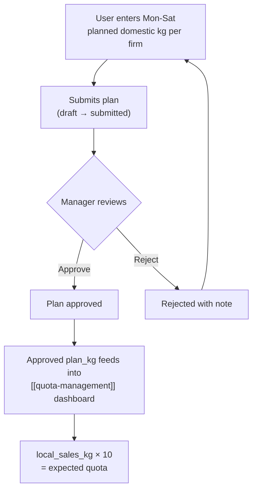

# Local Sell Plan

## What Is This Process?

Each export firm plans how many kg of tomatoes it will sell domestically per day of the week. These local sales are the basis for government export quota calculation — domestic sales × 10 = expected export quota. Plans go through an approval workflow (draft → submitted → approved/rejected), same pattern as [[weekly-harvest-planning]].

## How It Works (Business Flow)

### Approval Workflow

Same `PLAN_TRANSITIONS` pattern as harvest plans:
- `draft` → `submitted`
- `submitted` → `approved`, `rejected`
- `rejected` → `submitted` (resubmit)

## Database

### Tables

| Table | Purpose | Key Columns |
|-------|---------|-------------|
| `export.weekly_local_sell_plans` | Per-firm weekly domestic sale plan | season, export_firm, week_number, year, Mon-Sat plan_kg, Mon-Sat actual_kg, status, approval fields |

### Fields (AD-3 pattern: 12 columns)

- `season` (FK), `export_firm` (FK), `week_number`, `year`
- `monday_plan_kg` through `saturday_plan_kg` (6 plan fields, Decimal, default=0)
- `monday_actual_kg` through `saturday_actual_kg` (6 actual fields, nullable)
- `status` ('draft'/'submitted'/'approved'/'rejected')
- `submitted_at/by`, `approved_at/by`, `rejected_at/by`, `rejection_note`
- `buyer_name` (CharField, nullable) — optional domestic buyer reference

## Backend Implementation

### Services

**File**: `backend/apps/export/services.py`

| Function | Logic |
|----------|-------|
| `submit_local_sell_plan(plan, user)` | Validates transition, requires ≥1 day with positive plan_kg, clears rejection fields, applies status change, creates audit entry |
| `approve_local_sell_plan(plan, user)` | Validates transition to 'approved', applies status change, creates audit entry |
| `reject_local_sell_plan(plan, user, rejection_note)` | Validates transition, requires non-empty rejection note, applies status change, creates audit entry |

These use the shared `core/services_workflow.py` helpers: `validate_transition()`, `apply_status_change()`, `create_audit_entry()`.

### ViewSet & Endpoints

| Method | Endpoint | Action |
|--------|----------|--------|
| GET | `/api/v1/export/local-sell-plans/` | List (filterable) |
| POST | `/api/v1/export/local-sell-plans/` | Create |
| PATCH | `/api/v1/export/local-sell-plans/{id}/` | Update |
| POST | `/api/v1/export/local-sell-plans/{id}/submit/` | Submit |
| POST | `/api/v1/export/local-sell-plans/{id}/approve/` | Approve |
| POST | `/api/v1/export/local-sell-plans/{id}/reject/` | Reject |

## Frontend Implementation

### Component: LocalSellPlanGrid

**File**: `frontend/src/pages/export/LocalSellPlanGrid.tsx`

Embedded within the [[quota-management]] QuotaDashboard page (not a standalone route).

**Grid structure**: Rows = export firms, Columns = Mon-Sat (plan + actual), Total, Status

**User interactions**: Same as [[weekly-harvest-planning]] but per firm instead of per block.

### How It Feeds Quota Dashboard

The `services_quota.py` functions `fetch_plan_rows()` and `aggregate_local_sales()` sum all approved local sell plan kg per firm, then multiply by 10 to get `expected_kg` — the baseline for quota coverage calculations.

## Roles & Permissions

| Role | View | Edit | Submit | Approve/Reject |
|------|------|------|--------|----------------|
| `export_manager` | Yes | Yes | Yes | Yes |
| `director` | Yes | Yes | Yes | Yes |
| `seller` | Own firm only | Own firm | Yes | No |
| Others | No | No | No | No |

## Connections to Other Processes

- **[[quota-management]]** — `local_sales_kg × 10 = expected_kg` (the input to quota calculation)
- **[[domestic-sales]]** — Actual domestic sale records validate/inform planned figures
- **[[weekly-harvest-planning]]** — Harvest plan determines total available tomatoes, part goes to domestic, part to export
