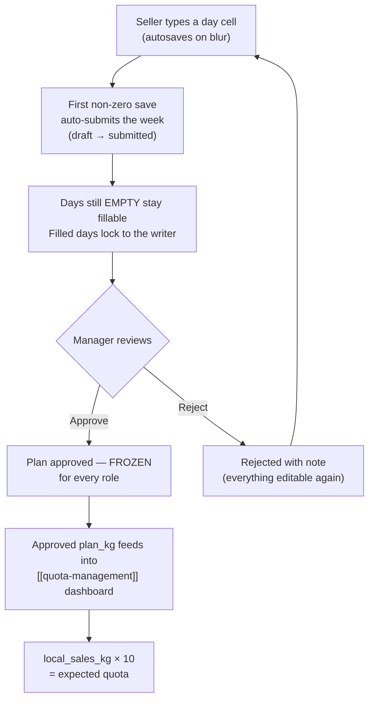

# Local Sell Plan

## What Is This Process?

Each export firm plans how many kg of tomatoes it will sell domestically per day of the week. These local sales are the basis for government export quota calculation — domestic sales × 10 = expected export quota. Plans go through an approval workflow (draft → submitted → approved/rejected), same pattern as [[weekly-harvest-planning]].

## How It Works (Business Flow)

```mermaid
flowchart TD
    A["Seller types a day cell\n(autosaves on blur)"] --> B["First non-zero save\nauto-submits the week\n(draft → submitted)"]
    B --> H["Days still EMPTY stay fillable\nFilled days lock to the writer"]
    H --> C{"Manager reviews"}
    C -->|Approve| D["Plan approved — FROZEN\nfor every role"]
    C -->|Reject| E["Rejected with note\n(everything editable again)"]
    E --> A
    D --> F["Approved plan_kg feeds into\n[[quota-management]] dashboard"]
    F --> G["local_sales_kg × 10\n= expected quota"]
```

### Approval Workflow

Same `PLAN_TRANSITIONS` pattern as harvest plans:
- `draft` → `submitted`
- `submitted` → `approved`, `rejected`
- `rejected` → `submitted` (resubmit)
- `approved` → **nothing** (terminal)

### Autosave, auto-submit, and the two locks (2026-08-23)

Two owner reports (`docs/IDEAS.md` #3 and #4) turned PATCH into the only write path
that matters. There is **no Send button** any more, and the edit rule is per CELL,
not per row:

| Row status | What a writer (`LOCAL_SELL_WRITE`) may do | What an approver (`LOCAL_SELL_APPROVE`) may do |
|---|---|---|
| `draft` / `rejected` | Edit every day. The first save carrying a value > 0 **auto-submits the week**. | Same. |
| `submitted` | Fill days still at **0**; days that already hold a value are locked. | Everything, via the grid's double-click override (audited as `local_sell_edit`). |
| `approved` | **Nothing.** | **Nothing** — admin included. |

Both refusals are **409**, not 400 — nothing is wrong with the payload, the row's
state forbids the write:

| `error` | Meaning |
|---|---|
| `plan_approved_locked` | The plan is approved. Checked before any field comparison, so a PATCH of `export_firm` or `week_number` is refused too. Fixing a wrongly-approved week now needs Django admin or SQL — there is deliberately no un-approve action. |
| `cell_locked_after_submit` | At least one day in the payload already holds a value on a submitted row. Body carries `fields` with the offending column names; **nothing is written** — one locked field refuses the whole PATCH. |

> [!note] "Empty" means `0`, not NULL
> The six `*_plan_kg` columns are `default=0` NOT NULL, so `0` is the only way the DB
> can spell "never filled in". A deliberate *zero kg on Wednesday* is indistinguishable
> from an untouched day and stays editable until approval. Two older consumers already
> read `0` that way — `submit_local_sell_plan` (needs ≥1 day `> 0`) and
> `_week_is_complete` (an all-zero draft is "nothing to sell", not a blocker) — so the
> lock rule reuses their convention rather than adding a nullable encoding.

> [!warning] The cell that sends the week locks itself
> `autosave + auto-submit` and `fill-empties` combine into one sharp edge: the first
> value a seller types both submits the week and locks that cell. Only an approver can
> change it afterwards (double-click override), or a reject, which reopens the row. The
> grid's lock tooltip names who to ask; that naming is the whole difference between
> "locked" and "broken".

**Where it lives**: the rule itself is the pure model method
`WeeklyLocalSellPlan.locked_day_fields(is_approver=...)`
(`backend/apps/export/models/local_sell_plan.py`); `perform_update` applies it and raises
`LocalSellPlanLocked` (`views_planning.py`). The frontend mirror is
`frontend/src/pages/export/LocalSellPlanGrid.cells.ts` — its `value > 0` predicate must
stay byte-for-byte identical or cells render editable and then 409 on blur.

## Database

### Tables

| Table | Purpose | Key Columns |
|-------|---------|-------------|
| `export.weekly_local_sell_plans` | Per-firm weekly domestic sale plan | season, export_firm, week_number, year, Mon-Sat plan_kg, Mon-Sat actual_kg, status, approval fields |

### Fields (AD-3 pattern: 12 columns)

- `season` (FK), `export_firm` (FK), `week_number`, `year`
- `monday_plan_kg` through `saturday_plan_kg` (6 plan fields, Decimal, default=0)
- `monday_actual_kg` through `saturday_actual_kg` (6 actual fields, nullable)
- `status` ('draft'/'submitted'/'approved'/'rejected')
- `submitted_at/by`, `approved_at/by`, `rejected_at/by`, `rejection_note`
- `buyer_name` (CharField, nullable) — optional domestic buyer reference

## Backend Implementation

### Services

**File**: `backend/apps/export/services.py`

| Function | Logic |
|----------|-------|
| `submit_local_sell_plan(plan, user)` | Validates transition, requires ≥1 day with positive plan_kg, clears rejection fields, applies status change, creates audit entry |
| `approve_local_sell_plan(plan, user)` | Validates transition to 'approved', applies status change, creates audit entry |
| `reject_local_sell_plan(plan, user, rejection_note)` | Validates transition, requires non-empty rejection note, applies status change, creates audit entry |

These use the shared `core/services_workflow.py` helpers: `validate_transition()`, `apply_status_change()`, `create_audit_entry()`.

### ViewSet & Endpoints

| Method | Endpoint | Action |
|--------|----------|--------|
| GET | `/api/v1/export/local-sell-plans/` | List (filterable) |
| POST | `/api/v1/export/local-sell-plans/` | Create |
| PATCH | `/api/v1/export/local-sell-plans/{id}/` | Update one or more day cells. Autosave path. Enforces the two locks (409 `plan_approved_locked` / `cell_locked_after_submit`) and **auto-submits** a draft/rejected row whose save leaves ≥1 day > 0 |
| POST | `/api/v1/export/local-sell-plans/{id}/submit/` | Submit |
| POST | `/api/v1/export/local-sell-plans/{id}/approve/` | Approve |
| POST | `/api/v1/export/local-sell-plans/{id}/reject/` | Reject |
| POST | `/api/v1/export/local-sell-plans/bulk-submit/` | Submit every draft/rejected row by id |
| POST | `/api/v1/export/local-sell-plans/bulk-approve/` | Approve every submitted row by id |
| POST | `/api/v1/export/local-sell-plans/initialize-week/` | Seed an all-zero draft row per active export firm |

> [!note] `submit/` and `bulk-submit/` are UI-dead but still live
> PATCH auto-submits, so nothing in the grid calls them any more. The endpoints, the
> `submit_local_sell_plan` service and the `useBulkSubmitLocalSellPlans` hook all stay —
> they are still covered by `tests_local_sell_plan_tasks` and `tests_season_freeze`, and
> the service is what PATCH itself calls to auto-submit.

> [!warning] An ISO week belongs to exactly ONE season, and the season FK can drift from it
> `weekly_local_sell_plans` is **UNIQUE (export_firm_id, week_number, year)** — no season in
> the key. So a week entered under season A physically cannot be re-created under season B,
> while the LIST is season-scoped. Those two facts collided on 2026-08-23: all 25 W34/2026
> rows carried `season_id = 1` (2025-2026) because they were written before 2026-2027 existed,
> so the seller's season-3 grid showed nothing, and `initialize-week` returned **200 with those
> 25 invisible rows in the payload** — its dedupe and its response were both unscoped, so it
> found the week "already initialized" and reported success. It now returns
> **409 `week_exists_in_other_season`** (naming the season) and scopes its response to the
> season written. The dedupe itself stays unscoped **on purpose** — scoping it would build
> rows that violate the unique constraint on `bulk_create`.
>
> Re-stamping is a data fix, not a code one, and `backfill_season_fks` will NOT do it — that
> command only fills `season IS NULL`. Use
> `python manage.py fix_local_sell_plan_seasons [--dry-run]` (idempotent; skips and reports
> weeks no season covers rather than guessing). Run against live on 2026-08-23: 25 rows.
>
> The same drift was audited across every season-scoped table: **1 `QuotaIssuance` and
> 6 `WeeklyTruckAllocation`** rows still disagree with their own dates (owner decision: log,
> don't sweep), and **14 rows sit in the July 2026 calendar gap** between season 1's `end_date`
> (2026-06-30) and season 3's `start_date` (2026-08-01), which no season covers at all. Both are
> tracked as **S1 / S2** in [`docs/FINDINGS_BACKLOG.md`](../../FINDINGS_BACKLOG.md).

### Role gates (`backend/apps/core/roles.py`)

| Gate | Roles | Guards |
|------|-------|--------|
| `LOCAL_SELL_WRITE` | admin, export_manager, director, **seller** | create, update, `bulk-submit`, **`initialize-week`** |
| `LOCAL_SELL_APPROVE` | admin, export_manager, director | `approve`, `reject`, `bulk-approve`, and overriding an **already-filled** day on a *submitted* row |

> **An approved row is not an APPROVE-role privilege — it is closed to everyone**
> (2026-08-23, `docs/IDEAS.md` #3). `LOCAL_SELL_APPROVE` used to double as "may edit a
> locked row", which is exactly the defect that was reported: export_manager and
> document_team could still rewrite an approved week. The role now buys the *submitted*
> override only.

> **`initialize-week` moved APPROVE → WRITE on 2026-08-23** (owner request). The seller
> owns the sell plan and must be able to open their own week rather than wait for an
> export_manager to seed it. Seeding all-zero drafts commits to nothing — every gate that
> *decides* something (submit-for-me, approve, reject) stays on `LOCAL_SELL_APPROVE`.
> `boss` is in neither set, which is why the grid uses `canDoBackendGated` rather than
> `canDo` (see [[permissions-system]]).

## Frontend Implementation

### Component: LocalSellPlanGrid

**File**: `frontend/src/pages/export/LocalSellPlanGrid.tsx`

Embedded within the [[quota-management]] QuotaDashboard page (not a standalone route).

**Grid structure**: Rows = export firms, Columns = Mon-Sat plan, Total, Status

**User interactions**: type in a cell, blur saves (`useUpsertLocalSellPlan` → PATCH). No
Send button. A cell renders in one of three modes, decided by `cellMode()` in
`LocalSellPlanGrid.cells.ts`:

| Mode | Renders as | When |
|---|---|---|
| `edit` | `InputNumber`, placeholder `—` for an untouched day | draft/rejected, or a still-empty day on a submitted row |
| `unlockable` | Muted number, **double-click** to edit | submitted + already filled + viewer is an approver |
| `locked` | Muted number with a tooltip naming the reason **and who can change it** | approved (everyone), or submitted + filled + viewer is the writer, or no write permission / closed season |

A 409 on save is decoded by `saveErrorKey()` — the endpoint answers 409 for three
different reasons (`plan_approved_locked`, `cell_locked_after_submit`, and core's
`season_closed`), and each sends the operator to a different person.

**A closed season beats every role.** `canEdit` and `isManager` are both ANDed with
`useSeasonReadOnly()`, the same rule the Sheet, the Weekly Plan grid and the shipment
screens apply. This grid had no such gate at all until 2026-08-23; it became load-bearing
when initialize-week started targeting the BROWSED season (see below) — without it the
button renders enabled on a closed season and `assert_season_id_open` 409s on click.

**Toolbar**: week stepper (◀ / week picker / ▶). "Initialize Week" appears only for a
current-or-future week with **zero** rows and is gated on `canEdit`
(`canDoBackendGated(user, 'local_sell_plan', 'edit')`) — the frontend mirror of
`LOCAL_SELL_WRITE`, so the seller sees it. **"Submit all" was removed on 2026-08-23** —
cells autosave and the first non-zero save sends the week. "Approve all" stays `isManager`.

**Which season it writes to**: `useSelectedSeason()` — the season the header switcher is
pointed at, the same id `useLocalSellPlans` lists by. It previously read
`useSeasons().find(is_active)`, which seeded rows into the ACTIVE season while the grid
listed the BROWSED one — an initialize that appeared to do nothing whenever the two
differed. It also cost a `GET /export/admin/seasons/` that **403s for the seller** (no
`season.can_view`); `useSelectedSeason()` reads `active_season` off `/auth/me/` instead,
so the grid needs no extra permission.

### How It Feeds Quota Dashboard

The `services_quota.py` functions `fetch_plan_rows()` and `aggregate_local_sales()` sum all approved local sell plan kg per firm, then multiply by 10 to get `expected_kg` — the baseline for quota coverage calculations.

## Roles & Permissions

| Role | View | Edit a draft/rejected day | Edit a **filled** day on a submitted row | Edit an **approved** row | Approve/Reject |
|------|------|------|------|------|----------------|
| `export_manager` | Yes | Yes | Yes (override, audited) | **No** | Yes |
| `director` | Yes | Yes | Yes (override, audited) | **No** | Yes |
| `admin` | Yes | Yes | Yes (override, audited) | **No** | Yes |
| `seller` | Own firm only | Own firm | No — empty days only | **No** | No |
| Others | No | No | No | No | No |

Submit is no longer a column: every writer submits implicitly, by typing.

`seller` may also **initialize a week** (since 2026-08-23) — see the role-gate table above.

### The seller's panel

`seller` is the narrowest role in the system: 5 pages, of which exactly one is real work —
`export.quota.local_sell`. It reaches that grid through the [[quota-management]] route
`/export/quota`, which since 2026-08-23 renders as a **bare grid** for them: no tab strip,
no KPI pipeline, no period filters, no kg/ton toggle, and the page title reads "Sell Plan"
(`quota_dashboard.title_local_sell`) rather than "Quota Dashboard". The Fleet Map nav entry
was dropped for this role at the same time — see [[fleet-map]].

## Connections to Other Processes

- **[[quota-management]]** — `local_sales_kg × 10 = expected_kg` (the input to quota calculation)
- **[[domestic-sales]]** — Actual domestic sale records validate/inform planned figures
- **[[weekly-harvest-planning]]** — Harvest plan determines total available tomatoes, part goes to domestic, part to export
