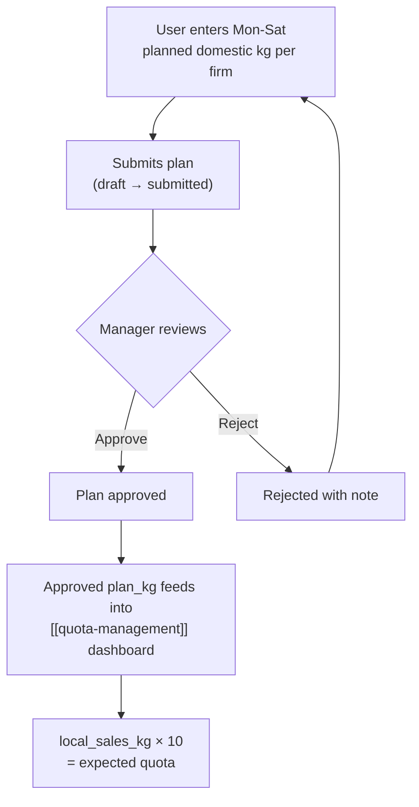

# Local Sell Plan

## What Is This Process?

Each export firm plans how many kg of tomatoes it will sell domestically per day of the week. These local sales are the basis for government export quota calculation — domestic sales × 10 = expected export quota. Plans go through an approval workflow (draft → submitted → approved/rejected), same pattern as [[weekly-harvest-planning]].

## How It Works (Business Flow)

```mermaid
flowchart TD
    A["User enters Mon-Sat\nplanned domestic kg per firm"] --> B["Submits plan\n(draft → submitted)"]
    B --> C{"Manager reviews"}
    C -->|Approve| D["Plan approved"]
    C -->|Reject| E["Rejected with note"]
    E --> A
    D --> F["Approved plan_kg feeds into\n[[quota-management]] dashboard"]
    F --> G["local_sales_kg × 10\n= expected quota"]
```

### Approval Workflow

Same `PLAN_TRANSITIONS` pattern as harvest plans:
- `draft` → `submitted`
- `submitted` → `approved`, `rejected`
- `rejected` → `submitted` (resubmit)

## Database

### Tables

| Table | Purpose | Key Columns |
|-------|---------|-------------|
| `export.weekly_local_sell_plans` | Per-firm weekly domestic sale plan | season, export_firm, week_number, year, Mon-Sat plan_kg, Mon-Sat actual_kg, status, approval fields |

### Fields (AD-3 pattern: 12 columns)

- `season` (FK), `export_firm` (FK), `week_number`, `year`
- `monday_plan_kg` through `saturday_plan_kg` (6 plan fields, Decimal, default=0)
- `monday_actual_kg` through `saturday_actual_kg` (6 actual fields, nullable)
- `status` ('draft'/'submitted'/'approved'/'rejected')
- `submitted_at/by`, `approved_at/by`, `rejected_at/by`, `rejection_note`
- `buyer_name` (CharField, nullable) — optional domestic buyer reference

## Backend Implementation

### Services

**File**: `backend/apps/export/services.py`

| Function | Logic |
|----------|-------|
| `submit_local_sell_plan(plan, user)` | Validates transition, requires ≥1 day with positive plan_kg, clears rejection fields, applies status change, creates audit entry |
| `approve_local_sell_plan(plan, user)` | Validates transition to 'approved', applies status change, creates audit entry |
| `reject_local_sell_plan(plan, user, rejection_note)` | Validates transition, requires non-empty rejection note, applies status change, creates audit entry |

These use the shared `core/services_workflow.py` helpers: `validate_transition()`, `apply_status_change()`, `create_audit_entry()`.

### ViewSet & Endpoints

| Method | Endpoint | Action |
|--------|----------|--------|
| GET | `/api/v1/export/local-sell-plans/` | List (filterable) |
| POST | `/api/v1/export/local-sell-plans/` | Create |
| PATCH | `/api/v1/export/local-sell-plans/{id}/` | Update |
| POST | `/api/v1/export/local-sell-plans/{id}/submit/` | Submit |
| POST | `/api/v1/export/local-sell-plans/{id}/approve/` | Approve |
| POST | `/api/v1/export/local-sell-plans/{id}/reject/` | Reject |
| POST | `/api/v1/export/local-sell-plans/bulk-submit/` | Submit every draft/rejected row by id |
| POST | `/api/v1/export/local-sell-plans/bulk-approve/` | Approve every submitted row by id |
| POST | `/api/v1/export/local-sell-plans/initialize-week/` | Seed an all-zero draft row per active export firm |

> [!warning] An ISO week belongs to exactly ONE season, and the season FK can drift from it
> `weekly_local_sell_plans` is **UNIQUE (export_firm_id, week_number, year)** — no season in
> the key. So a week entered under season A physically cannot be re-created under season B,
> while the LIST is season-scoped. Those two facts collided on 2026-08-23: all 25 W34/2026
> rows carried `season_id = 1` (2025-2026) because they were written before 2026-2027 existed,
> so the seller's season-3 grid showed nothing, and `initialize-week` returned **200 with those
> 25 invisible rows in the payload** — its dedupe and its response were both unscoped, so it
> found the week "already initialized" and reported success. It now returns
> **409 `week_exists_in_other_season`** (naming the season) and scopes its response to the
> season written. The dedupe itself stays unscoped **on purpose** — scoping it would build
> rows that violate the unique constraint on `bulk_create`.
>
> Re-stamping is a data fix, not a code one, and `backfill_season_fks` will NOT do it — that
> command only fills `season IS NULL`. Use
> `python manage.py fix_local_sell_plan_seasons [--dry-run]` (idempotent; skips and reports
> weeks no season covers rather than guessing). Run against live on 2026-08-23: 25 rows.
>
> The same drift was audited across every season-scoped table: **1 `QuotaIssuance` and
> 6 `WeeklyTruckAllocation`** rows still disagree with their own dates (owner decision: log,
> don't sweep), and **14 rows sit in the July 2026 calendar gap** between season 1's `end_date`
> (2026-06-30) and season 3's `start_date` (2026-08-01), which no season covers at all. Both are
> tracked as **S1 / S2** in [`docs/FINDINGS_BACKLOG.md`](../../FINDINGS_BACKLOG.md).

### Role gates (`backend/apps/core/roles.py`)

| Gate | Roles | Guards |
|------|-------|--------|
| `LOCAL_SELL_WRITE` | admin, export_manager, director, **seller** | create, update, `bulk-submit`, **`initialize-week`** |
| `LOCAL_SELL_APPROVE` | admin, export_manager, director | `approve`, `reject`, `bulk-approve`, editing a submitted/approved row |

> **`initialize-week` moved APPROVE → WRITE on 2026-08-23** (owner request). The seller
> owns the sell plan and must be able to open their own week rather than wait for an
> export_manager to seed it. Seeding all-zero drafts commits to nothing — every gate that
> *decides* something (submit-for-me, approve, reject) stays on `LOCAL_SELL_APPROVE`.
> `boss` is in neither set, which is why the grid uses `canDoBackendGated` rather than
> `canDo` (see [[permissions-system]]).

## Frontend Implementation

### Component: LocalSellPlanGrid

**File**: `frontend/src/pages/export/LocalSellPlanGrid.tsx`

Embedded within the [[quota-management]] QuotaDashboard page (not a standalone route).

**Grid structure**: Rows = export firms, Columns = Mon-Sat (plan + actual), Total, Status

**User interactions**: Same as [[weekly-harvest-planning]] but per firm instead of per block.

**A closed season beats every role.** `canEdit` and `isManager` are both ANDed with
`useSeasonReadOnly()`, the same rule the Sheet, the Weekly Plan grid and the shipment
screens apply. This grid had no such gate at all until 2026-08-23; it became load-bearing
when initialize-week started targeting the BROWSED season (see below) — without it the
button renders enabled on a closed season and `assert_season_id_open` 409s on click.

**Toolbar**: week stepper (◀ / week picker / ▶). "Initialize Week" appears only for a
current-or-future week with **zero** rows and is gated on `canEdit`
(`canDoBackendGated(user, 'local_sell_plan', 'edit')`) — the frontend mirror of
`LOCAL_SELL_WRITE`, so the seller sees it. "Submit all" is `canEdit`; "Approve all" stays
`isManager`.

**Which season it writes to**: `useSelectedSeason()` — the season the header switcher is
pointed at, the same id `useLocalSellPlans` lists by. It previously read
`useSeasons().find(is_active)`, which seeded rows into the ACTIVE season while the grid
listed the BROWSED one — an initialize that appeared to do nothing whenever the two
differed. It also cost a `GET /export/admin/seasons/` that **403s for the seller** (no
`season.can_view`); `useSelectedSeason()` reads `active_season` off `/auth/me/` instead,
so the grid needs no extra permission.

### How It Feeds Quota Dashboard

The `services_quota.py` functions `fetch_plan_rows()` and `aggregate_local_sales()` sum all approved local sell plan kg per firm, then multiply by 10 to get `expected_kg` — the baseline for quota coverage calculations.

## Roles & Permissions

| Role | View | Edit | Submit | Approve/Reject |
|------|------|------|--------|----------------|
| `export_manager` | Yes | Yes | Yes | Yes |
| `director` | Yes | Yes | Yes | Yes |
| `seller` | Own firm only | Own firm | Yes | No |
| Others | No | No | No | No |

`seller` may also **initialize a week** (since 2026-08-23) — see the role-gate table above.

### The seller's panel

`seller` is the narrowest role in the system: 5 pages, of which exactly one is real work —
`export.quota.local_sell`. It reaches that grid through the [[quota-management]] route
`/export/quota`, which since 2026-08-23 renders as a **bare grid** for them: no tab strip,
no KPI pipeline, no period filters, no kg/ton toggle, and the page title reads "Sell Plan"
(`quota_dashboard.title_local_sell`) rather than "Quota Dashboard". The Fleet Map nav entry
was dropped for this role at the same time — see [[fleet-map]].

## Connections to Other Processes

- **[[quota-management]]** — `local_sales_kg × 10 = expected_kg` (the input to quota calculation)
- **[[domestic-sales]]** — Actual domestic sale records validate/inform planned figures
- **[[weekly-harvest-planning]]** — Harvest plan determines total available tomatoes, part goes to domestic, part to export
