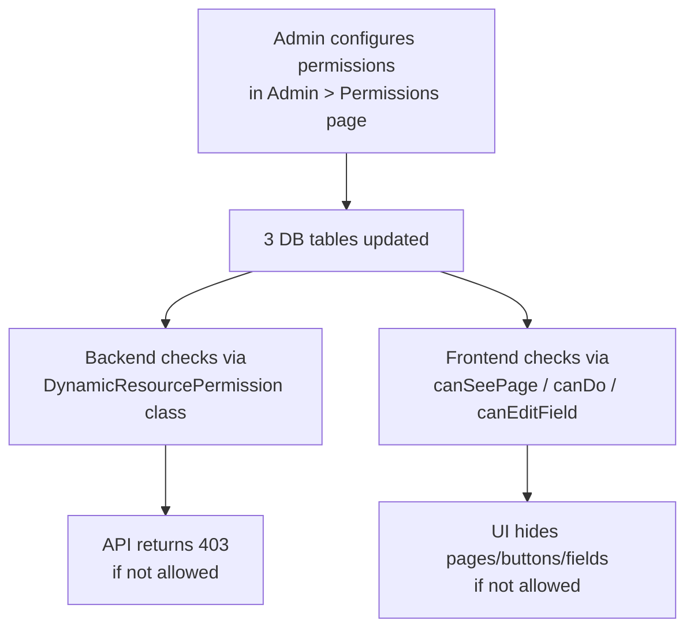
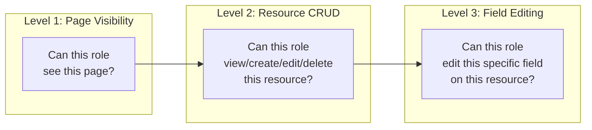

# Permissions System

## What Is This Process?

YGT uses a dynamic, database-driven RBAC (Role-Based Access Control) system. Instead of hardcoded permission checks, permissions are stored in 3 database tables and can be configured by **the `admin` role** through the admin UI. The system controls access at 3 levels: page visibility, resource CRUD, and field-level editing.

> **AD-15 (Apr 2026):** Permission-matrix and user-management endpoints are now restricted to `role='admin'` (or `is_superuser`). `director` and `export_manager` keep all operational power but cannot edit who-can-do-what. Reference-data writes (countries, cities, customers, blocks, etc.) remain available to admin / director / export_manager.

## How It Works (Business Flow)



### Three Permission Levels



## Database

### Tables

| Table | Purpose | Key Columns |
|-------|---------|-------------|
| `core.role_page_permissions` | Page visibility per role | role, page_code, can_view |
| `core.role_resource_permissions` | CRUD per role per resource | role, resource_code, can_view, can_create, can_edit, can_delete |
| `core.role_field_permissions` | Field-level edit per role | role, resource_code, field_name, can_edit |

### Permission Registry

**File**: `backend/apps/core/permission_registry.py`

**PAGE_REGISTRY** (~20 pages):
- `dashboard`, `export.shipments`, `export.overdue`, `export.quota`, `export.plan`, `export.prices`, `export.advances`, `export.trucks`, `export.blocks`, `export.domestic_sales`
- `admin.users`, `admin.seasons`, `admin.firms`, `admin.import_firms`, `admin.permissions`, `admin.blocks`, `admin.truck_destinations`, `admin.customers`, `admin.shipment_settings`

**RESOURCE_REGISTRY** (13 resources):
- `shipment`, `quota_issuance`, `quota_usage`, `local_sell_plan`, `weekly_plan`, `price_entry`, `advance`, `truck_allocation`, `domestic_sale`, `export_firm`, `import_firm`, `season`, `greenhouse_block`

**RESOURCE_FIELDS** (granular editable fields):
- `shipment`: box_count, pallet_count, weight_net, weight_gross, price_per_kg, total_amount_usd, notes, vehicle_condition, vehicle_condition_note, route_note
- `weekly_plan`: plan_kg, actual_kg
- `quota_issuance`: issue_date, validity, notes
- `quota_usage`: kg_used, usage_date, product_type, notes
- `local_sell_plan`: planned_kg, actual_kg, buyer_name
- Resources not listed: `'*'` (all-or-nothing field access)

## Backend Implementation

### DynamicResourcePermission Class

A DRF permission class that:
1. Identifies the resource_code from the ViewSet
2. Looks up `RoleResourcePermission` for `(user.role, resource_code)`
3. Maps HTTP method to permission: GET→can_view, POST→can_create, PATCH/PUT→can_edit, DELETE→can_delete
4. Returns 403 if not allowed
5. **60-second cache** per `(role, resource)` to avoid DB hits on every request

### Seed Permissions Command

**File**: `backend/apps/core/management/commands/seed_permissions.py`

`python manage.py seed_permissions [--reset]`

Creates default permission rows for all roles × pages × resources. The `--reset` flag deletes and recreates all rows (useful after adding new pages/resources to the registry).

### Endpoints

| Method | Endpoint | Action | Auth |
|--------|----------|--------|------|
| GET / PUT | `/api/v1/core/admin/page-permissions/` | Page-permission matrix CRUD | **admin** |
| GET / PUT | `/api/v1/core/admin/resource-permissions/` | Resource-permission matrix CRUD | **admin** |
| GET / PUT | `/api/v1/core/admin/field-permissions/` | Field-permission matrix CRUD | **admin** |
| GET | `/api/v1/core/admin/permission-registry/` | Read available pages / resources / fields | **admin** |
| PUT | `/api/v1/export/admin/users/{id}/permissions/` | Grant export-app Django permissions to a user | **admin** |
| PATCH | `/api/v1/export/admin/users/{id}/` | Change role / activate / deactivate | **admin** (last-admin guard applies) |
| GET | `/api/v1/export/admin/users/` | List users | admin or export_manager |
| GET | `/api/v1/export/audit-log/` | Audit log | admin / director / export_manager |

The permissions endpoint returns/accepts all 3 levels for a given user's role. Backend gate is `_AdminOnlyPermission` (predicate: `is_superuser OR role=='admin'`).

**Bootstrap admin:** `python manage.py bootstrap_admin` — idempotent, promotes every `is_superuser` user to `role='admin'`. Run on every deploy / staging refresh / restore-from-backup. Replaces the previous `manage.py shell -c "..."` one-liner.

## Frontend Implementation

### Permission Helpers

Available throughout the app after login:

| Helper | Purpose | Example |
|--------|---------|---------|
| `canSeePage(pageCode)` | Check page visibility | `canSeePage('export.quota')` |
| `canDo(resource, action)` | Check resource CRUD | `canDo('shipment', 'create')` |
| `canEditField(resource, field)` | Check field edit | `canEditField('shipment', 'weight_net')` |

These read from the `ICurrentUser` object returned by `/api/v1/auth/me/`:
- `page_permissions: Record<string, boolean>`
- `resource_permissions: Record<string, IResourcePermission>`
- `field_permissions: Record<string, Record<string, boolean>>`

### Page: PermissionsPage

**File**: `frontend/src/pages/admin/PermissionsPage.tsx`

**3 Tabs** (one per permission level):

**Tab 1 — Page Permissions**: Matrix table, rows = pages, columns = roles, cells = checkbox (can_view)

**Tab 2 — Resource Permissions**: Matrix table, rows = resources, columns = roles × 4 (view/create/edit/delete), cells = checkbox

**Tab 3 — Field Permissions**: Expandable rows per resource, sub-rows per field, columns = roles, cells = checkbox (can_edit)

**Access**: Admin only (backend gate is `_AdminOnlyPermission`).

### Route Protection

**ProtectedRoute** component wraps all routes in App.tsx:
```
<ProtectedRoute pageCode="export.shipments">
  <ShipmentList />
</ProtectedRoute>
```
If `canSeePage(pageCode)` returns false, redirects to Unauthorized page.

### Conditional UI Elements

Throughout the app, buttons/columns/fields are conditionally rendered:
- Create buttons: `canDo('shipment', 'create') && <Button>Create</Button>`
- Edit fields: `canEditField('shipment', 'weight_net') ? <Input /> : <span>{value}</span>`
- Delete buttons: `canDo('quota_usage', 'delete') && <Button danger>Delete</Button>`

## Roles & Permissions

| Role | Configure Permissions | Manage Users (role / pw / activate) | View Permissions |
|------|----------------------|-------------------------------------|------------------|
| `admin` | Yes | Yes | Yes |
| `director` | No | No | Yes (own + via /auth/me/) |
| `export_manager` | No | No | Yes (own + via /auth/me/) |
| Others | No | No | Own permissions only (via /auth/me/) |

A **last-admin guard** in `UserManagementViewSet.partial_update` prevents demoting or deactivating the only active admin in the system (403 + explanatory message). Promote another user to admin first.

## Connections to Other Processes

- **[[authentication]]** — Login returns user info including all permission data
- **[[shipment-lifecycle]]** — Field-level permissions control which shipment fields each role can edit
- All processes — Every page and resource check goes through this system
