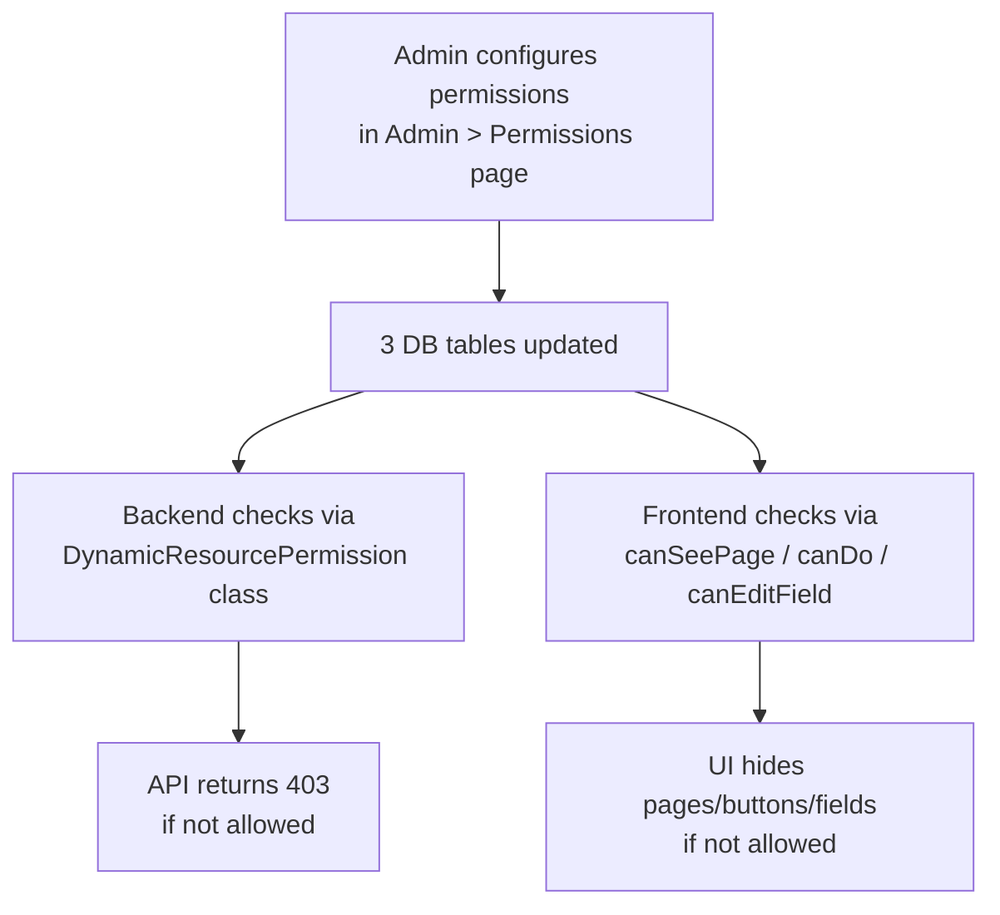
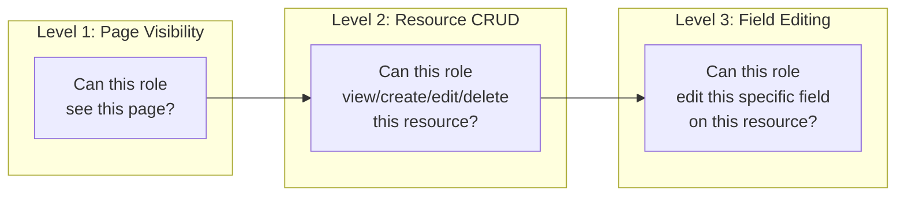

# Permissions System

## What Is This Process?

YGT uses a dynamic, database-driven RBAC (Role-Based Access Control) system. Instead of hardcoded permission checks, permissions are stored in 3 database tables and can be configured by **the `admin` role** through the admin UI. The system controls access at 3 levels: page visibility, resource CRUD, and field-level editing.

> **AD-15 (Apr 2026):** Permission-matrix and user-management endpoints are now restricted to `role='admin'` (or `is_superuser`). `director` and `export_manager` keep all operational power but cannot edit who-can-do-what. Reference-data writes (countries, cities, customers, blocks, etc.) remain available to admin / director / export_manager.

> **AD-16 (Aug 2026) — Season lifecycle:** New `closed_season` resource (view-only) gates which roles may browse a closed season read-only via the header switcher; separate from the pre-existing `season` resource, which gates the admin Seasons page (list/CRUD + close/open). See [[#Browsing closed seasons (AD-16)]] below and `docs/ADR.md` (AD-16).

> **ADR-022 (Jun 2026) — Delegated user management:** A bounded exception to AD-15. The `loading_dept_head` role may **create / edit / delete / reset-password** users of the `loading_dept_head_deputy` and `weight_master` roles ONLY, and may grant those two roles a **subset of his own visible (non-`admin.*`) pages** via a dedicated scoped endpoint. The full permission-matrix CRUD stays admin-only. Who-may-manage-whom lives in `MANAGEABLE_BY_ROLE` (`apps/core/roles.py`); enforcement is entirely server-side in `UserManagementViewSet` + `ManagedPagePermissionsView`. The head's deputy does **not** inherit this power. See the [[#Delegated user management (ADR-022)]] section below.

## How It Works (Business Flow)


```mermaid
flowchart TD
    A["Admin configures permissions\nin Admin > Permissions page"] --> B["3 DB tables updated"]
    B --> C["Backend checks via\nDynamicResourcePermission class"]
    B --> D["Frontend checks via\ncanSeePage / canDo / canEditField"]
    C --> E["API returns 403\nif not allowed"]
    D --> F["UI hides pages/buttons/fields\nif not allowed"]
```

### Three Permission Levels


```mermaid
flowchart LR
    subgraph Page["Level 1: Page Visibility"]
        PV["Can this role\nsee this page?"]
    end
    subgraph Resource["Level 2: Resource CRUD"]
        RC["Can this role\nview/create/edit/delete\nthis resource?"]
    end
    subgraph Field["Level 3: Field Editing"]
        FE["Can this role\nedit this specific field\non this resource?"]
    end
    PV --> RC --> FE
```

## Database

### Tables

| Table | Purpose | Key Columns |
|-------|---------|-------------|
| `core.role_page_permissions` | Page visibility per role | role, page_code, can_view |
| `core.role_resource_permissions` | CRUD per role per resource | role, resource_code, can_view, can_create, can_edit, can_delete |
| `core.role_field_permissions` | Field-level edit per role | role, resource_code, field_name, can_edit |

### Permission Registry

**File**: `backend/apps/core/permission_registry.py`

**PAGE_REGISTRY** (every navigable page):
- `dashboard`, `export.shipments`, `export.shipments.board` (Kanban), `export.overdue`, `export.quota`, `export.quota.local_sell`, `export.plan`, `export.prices`, `export.advances`, `export.trucks`, `export.blocks`, `export.domestic_sales`, `export.drafts`, `export.assign`, `export.pallet_manifest`
- `me.board` (My Tasks), `analytics.boss`, `director.stuck_shipments`, `audit_log`
- `feedback.submit`, `feedback.my_tickets`, `feedback.public`, `feedback.admin_inbox`
- `contracts.list` (Contracts), `contracts.sales` (Contract Sales) — P4 module; **non-`admin.` prefix on purpose** so delegated managers may also be granted them. Default visibility is **management-only** (`admin` / `director` / `export_manager`), inherited from `_ALL_PAGES`; all other roles start hidden (mirrors `_CONTRACT_WRITE_ROLES`). Page *visibility* only — contract/sale write enforcement still uses the hardcoded `_CONTRACT_WRITE_ROLES` in `apps/contracts/views.py` (not yet a registered *resource*).
- `admin.users`, `admin.staff_access` (delegated page-access editor — ADR-022), `admin.seasons`, `admin.firms`, `admin.import_firms`, `admin.permissions`, `admin.blocks`, `admin.truck_dest`, `admin.customers`, `admin.shipment_settings`

> **Audit log naming:** the page_code is `audit_log` (NOT `admin.audit_log`) on purpose. `director` and `export_manager` must see it, but their defaults are computed as `_ALL_PAGES - _ALL_ADMIN`, which strips every `admin.*` page (AD-15). A non-prefixed code keeps the audit log visible to them without re-granting admin pages.

> **Adding a new page — both sides must change.** A page is gated by `canSeePage(user, route)` only when its menu item / route has **no** hardcoded `roles` array. For that to resolve, you must (1) add the `page_code` to `PAGE_REGISTRY` here, (2) add the `route → page_code` entry to `ROUTE_PAGE_MAP` in `frontend/src/utils/permissions.ts`, (3) seed defaults in `seed_permissions.py`, and (4) **run `python manage.py seed_permissions` on the deployment** (no `--reset` needed — `get_or_create` inserts only the missing rows). Skipping step 4 makes the page fail-closed (invisible to every non-superuser). A route in `ROUTE_PAGE_MAP` but missing from `PAGE_REGISTRY` (or unseeded) is the classic "page invisible for everyone" bug.

**RESOURCE_REGISTRY**:
- `shipment`, `shipment_firm_split`, `shipment_block_source`, `shipment_assign`, `quality_document`, `sales_report`, `shipment_comment`, `quota_issuance`, `quota_usage`, `local_sell_plan`, `weekly_plan`, `price_entry`, `advance`, `truck_allocation`, `domestic_sale`, `export_firm`, `import_firm`, `season`, `closed_season`, `greenhouse_block`, `truck_split_default`, `pallet`, `manifest_close`
- `contract`, `sale` — P4 module, all-or-nothing (no `RESOURCE_FIELDS` entry). `ContractViewSet` / `ContractSaleViewSet` gate on these via `DynamicResourcePermission` (replaced the old hardcoded `_CONTRACT_WRITE_ROLES`). Defaults: full CRUD for `admin` / `director` / `export_manager` on `contract`; on `sale` the same three create/edit but **delete is `admin`-only** (`director` / `export_manager` get view+create+edit); `boss` view-only on both; all other roles no access. Matches the management-only page visibility of `contracts.list` / `contracts.sales`.

**RESOURCE_FIELDS** (granular editable fields):
- `shipment`: box_count, pallet_count, weight_net, weight_gross, price_per_kg, total_amount_usd, notes, vehicle_condition, vehicle_condition_note, route_note
- `weekly_plan`: plan_kg, actual_kg
- `quota_issuance`: issue_date, validity, notes
- `quota_usage`: kg_used, usage_date, product_type, notes
- `local_sell_plan`: planned_kg, actual_kg, buyer_name
- Resources not listed: `'*'` (all-or-nothing field access)

## Backend Implementation

### DynamicResourcePermission Class

A DRF permission class that:
1. Identifies the resource_code from the ViewSet
2. Looks up `RoleResourcePermission` for `(user.role, resource_code)`
3. Maps HTTP method to permission: GET→can_view, POST→can_create, PATCH/PUT→can_edit, DELETE→can_delete
4. Returns 403 if not allowed
5. **60-second cache** per `(role, resource)` to avoid DB hits on every request

### Seed Permissions Command

**File**: `backend/apps/core/management/commands/seed_permissions.py`

`python manage.py seed_permissions [--reset]`

Creates default permission rows for all roles × pages × resources. The `--reset` flag deletes and recreates all rows (useful after adding new pages/resources to the registry).

### Endpoints

| Method | Endpoint | Action | Auth |
|--------|----------|--------|------|
| GET / PUT | `/api/v1/core/admin/page-permissions/` | Page-permission matrix CRUD | **admin** |
| GET / PUT | `/api/v1/core/admin/resource-permissions/` | Resource-permission matrix CRUD | **admin** |
| GET / PUT | `/api/v1/core/admin/field-permissions/` | Field-permission matrix CRUD | **admin** |
| GET | `/api/v1/core/admin/permission-registry/` | Read available pages / resources / fields | **admin** |
| PUT | `/api/v1/export/admin/users/{id}/permissions/` | Grant export-app Django permissions to a user | **admin** |
| PATCH | `/api/v1/export/admin/users/{id}/` | Change role / activate / deactivate | **admin** (last-admin guard applies); **loading_dept_head** within his set (ADR-022) |
| POST / DELETE / set-password | `/api/v1/export/admin/users/` (+ `{id}/`, `{id}/set-password/`) | Create / delete / reset-password | **superuser**; **loading_dept_head** for deputy + weight_master only (ADR-022) |
| GET | `/api/v1/export/admin/users/` | List users | admin or export_manager (full); **loading_dept_head** sees only deputy + weight_master |
| GET / PUT | `/api/v1/export/admin/managed-page-permissions/` | Delegated staff page-access editor — grant a subset of own pages to managed roles | **loading_dept_head** (any delegated manager); admin/superuser too (ADR-022) |
| GET | `/api/v1/export/audit-log/` | Audit log | admin / director / export_manager |

The permissions endpoint returns/accepts all 3 levels for a given user's role. Backend gate is `_AdminOnlyPermission` (predicate: `is_superuser OR role=='admin'`).

**Bootstrap admin:** `python manage.py bootstrap_admin` — idempotent, promotes every `is_superuser` user to `role='admin'`. Run on every deploy / staging refresh / restore-from-backup. Replaces the previous `manage.py shell -c "..."` one-liner.

## Frontend Implementation

### Permission Helpers

Available throughout the app after login:

| Helper | Purpose | Example |
|--------|---------|---------|
| `canSeePage(pageCode)` | Check page visibility | `canSeePage('export.quota')` |
| `canDo(resource, action)` | Check resource CRUD | `canDo('shipment', 'create')` |
| `canEditField(resource, field)` | Check field edit | `canEditField('shipment', 'weight_net')` |

These read from the `ICurrentUser` object returned by `/api/v1/auth/me/`:
- `page_permissions: Record<string, boolean>`
- `resource_permissions: Record<string, IResourcePermission>`
- `field_permissions: Record<string, Record<string, boolean>>`

### Page: PermissionsPage

**File**: `frontend/src/pages/admin/PermissionsPage.tsx`

**3 Tabs** (one per permission level):

**Tab 1 — Page Permissions**: Matrix table, rows = pages, columns = roles, cells = checkbox (can_view)

**Tab 2 — Resource Permissions**: Matrix table, rows = resources, columns = roles × 4 (view/create/edit/delete), cells = checkbox

**Tab 3 — Field Permissions**: Expandable rows per resource, sub-rows per field, columns = roles, cells = checkbox (can_edit)

**Access**: Admin only (backend gate is `_AdminOnlyPermission`).

### Route Protection

**ProtectedRoute** component wraps all routes in App.tsx:
```
<ProtectedRoute pageCode="export.shipments">
  <ShipmentList />
</ProtectedRoute>
```
If `canSeePage(pageCode)` returns false, redirects to Unauthorized page.

### Conditional UI Elements

Throughout the app, buttons/columns/fields are conditionally rendered:
- Create buttons: `canDo('shipment', 'create') && <Button>Create</Button>`
- Edit fields: `canEditField('shipment', 'weight_net') ? <Input /> : <span>{value}</span>`
- Delete buttons: `canDo('quota_usage', 'delete') && <Button danger>Delete</Button>`

## Roles & Permissions

| Role | Configure Permissions | Manage Users (role / pw / activate) | View Permissions |
|------|----------------------|-------------------------------------|------------------|
| `admin` | Yes | Yes (all roles) | Yes |
| `director` | No | No | Yes (own + via /auth/me/) |
| `export_manager` | No | No | Yes (own + via /auth/me/) |
| `loading_dept_head` | No (matrix); Yes (own pages → managed roles, ADR-022) | Yes — **deputy + weight_master only** (ADR-022) | Own + grants pages to his 2 managed roles |
| Others | No | No | Own permissions only (via /auth/me/) |

A **last-admin guard** in `UserManagementViewSet.partial_update` prevents demoting or deactivating the only active admin in the system (403 + explanatory message). Promote another user to admin first.

### Delegated user management (ADR-022)

The `loading_dept_head` (head of packaging + loading) runs his own corner of the org without involving the admin for every hire or password reset — but strictly inside the slice of the app he can see himself.

**What he can do**
- **List / create / edit / delete / reset-password** users — but only for the `loading_dept_head_deputy` and `weight_master` roles. The Users page list is auto-scoped server-side; he never sees other roles' accounts.
- **Grant page access** to those two roles via *Admin → Staff Page Access* (`admin.staff_access`, `ManagedPagePermissionsView`). The pages he can grant are exactly the **non-`admin.*` pages his own role can currently see** — he can never grant more than he has, and never a user/permission-administration page.

**Where the boundary lives**
- `MANAGEABLE_BY_ROLE` in `apps/core/roles.py` — the single source of truth (`loading_dept_head → {loading_dept_head_deputy, weight_master}`). Helpers: `manageable_roles(user)`, `can_manage_users(user)`.
- `UserManagementViewSet` guards: `_assert_can_manage(actor, target)` checks the target's **current** role; `_assert_can_assign_role(actor, role)` checks the **new** role on create + role-change (blocks escalation to `admin`).
- `ManagedPagePermissionsView.put` is a **surgical `update_or_create`** — it writes only the `(managed_role, grantable_page)` pairs in the payload; rows for other roles/pages (including admin-granted ones) are never deleted. `admin.*` pages are excluded from the grantable set (privilege-leak guard).
- Page grants are **role-wide** (perms are stored per role, not per user) — granting a page to `weight_master` affects every weight_master. The UI states this.
- The frontend mirror of `MANAGEABLE_BY_ROLE` is **UX only** (which buttons / dropdown options to render); the server is the security boundary.
- The head's **deputy does not** get this management power — only the head manages staff.

Reachability is seeded by data migration `core.0020` (sets `admin.users` + `admin.staff_access` visible for `loading_dept_head`). Tests: `apps/export/tests_delegated_user_mgmt.py` (18).

### Browsing closed seasons (AD-16)

`closed_season` is a resource with only `can_view` ever seeded — create/edit/delete are meaningless for it (closed seasons are read-only). It answers one question: **may this role select a closed season in the header switcher and read it?** It is intentionally a separate resource from `season` (which governs the season CRUD/close/open admin page), because `RoleResourcePermission`'s fixed action vocabulary (`can_view`/`can_create`/`can_edit`/`can_delete`) has no room for a custom "view only when closed" action on an existing resource without a schema change.

- Seeded to `admin`, `director`, `boss`, `export_manager`, `finansist` — the same set as `_ARCHIVE_VIEW_ROLES` (`apps/export/views.py`) — but admin-editable afterwards with no code change, which is the point.
- **Does NOT imply archive-level read.** The original design (spec §9) said browsing a closed season bypasses the `is_archived` operational/archive split unconditionally for anyone holding `closed_season.can_view`. Implementation review found this makes the permission a silent superset of archive-view access — granting `closed_season` to a sixth role would hand it archived rows (including historical buyer prices) nobody decided it should see. **Reversed (D8):** inside a closed season, archived rows are visible only to users who are ALSO in `_ARCHIVE_VIEW_ROLES`. Everyone else sees a partial view (non-archived rows only) of that season — a UI problem, disclosed in the frontend's `ClosedSeasonBanner`, not a permission escalation.
- A user holding `closed_season.can_view` but not `season.can_view` cannot populate the switcher's own option list (`GET /admin/seasons/` needs `season.can_view`) — `finansist` hit exactly this gap and was seeded `season: view-only` alongside its existing `closed_season.can_view` (Task 15b) so the switcher works for it without granting any season write access.
- **Known live-DB drift, not caused by this feature but newly consequential:** `seed_permissions` only `get_or_create`s, never overwrites. On the current dev database, `boss`'s `season` row shows full CRUD where the seeder's blanket `_VIEW` intends read-only — so `boss` can currently close/open seasons, a capability the design never intended for that role. Separately, `loading_dept_head` and `loading_dept_head_deputy` carry stray all-False `season` rows that neither role's `RESOURCE_DEFAULTS` entry would create — low real-world consequence (all-False grants nothing), but neither drift self-heals on a re-seed, so both are disclosed rather than assumed harmless.

## Connections to Other Processes

- **[[authentication]]** — Login returns user info including all permission data
- **[[shipment-lifecycle]]** — Field-level permissions control which shipment fields each role can edit
- All processes — Every page and resource check goes through this system
