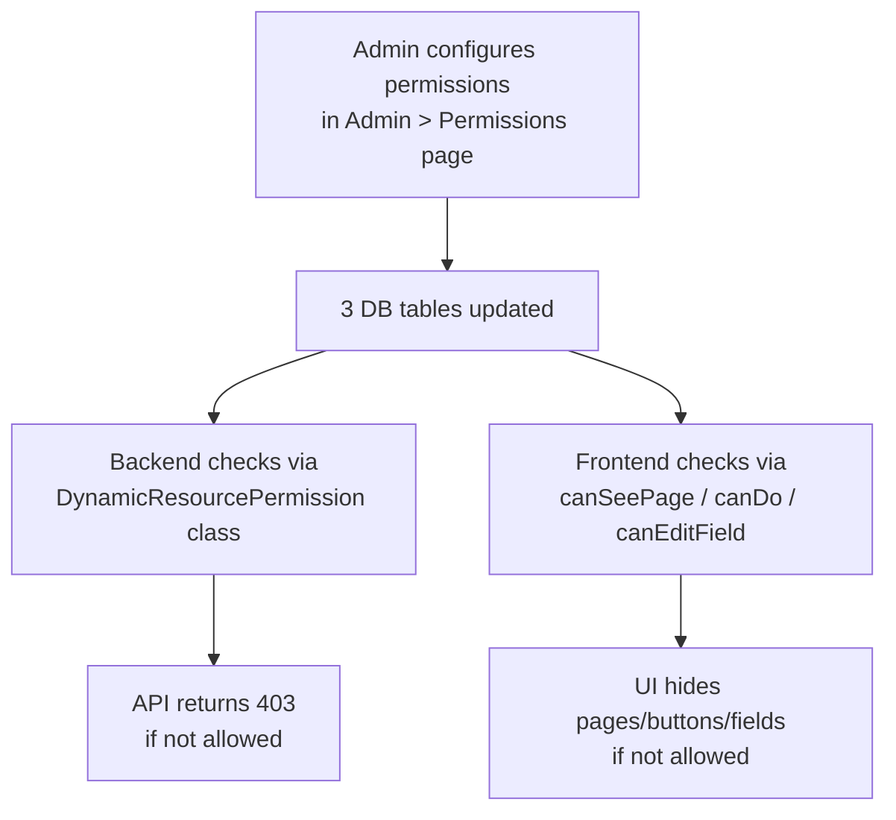
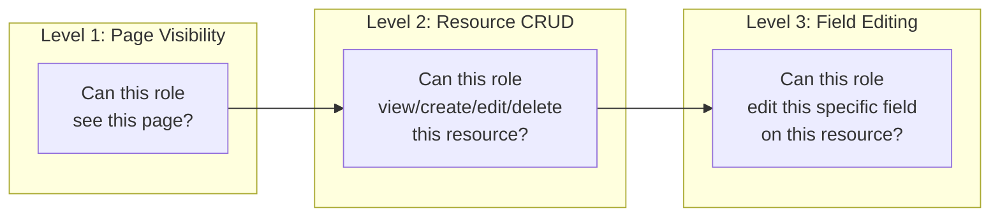

# Permissions System

## What Is This Process?

YGT uses a dynamic, database-driven RBAC (Role-Based Access Control) system. Instead of hardcoded permission checks, permissions are stored in 3 database tables and can be configured by **the `admin` role** through the admin UI. The system controls access at 3 levels: page visibility, resource CRUD, and field-level editing.

> **AD-15 (Apr 2026):** Permission-matrix and user-management endpoints are now restricted to `role='admin'` (or `is_superuser`). `director` and `export_manager` keep all operational power but cannot edit who-can-do-what. Reference-data writes (countries, cities, customers, blocks, etc.) remain available to admin / director / export_manager.

> **AD-16 (Aug 2026) — Season lifecycle:** New `closed_season` resource (view-only) gates which roles may browse a closed season read-only via the header switcher; separate from the pre-existing `season` resource, which gates the admin Seasons page (list/CRUD + close/open). See [[#Browsing closed seasons (AD-16)]] below and `docs/ADR.md` (AD-16).

> **ADR-022 (Jun 2026) — Delegated user management:** A bounded exception to AD-15. The `loading_dept_head` role may **create / edit / delete / reset-password** users of the `loading_dept_head_deputy` and `weight_master` roles ONLY, and may grant those two roles a **subset of his own visible (non-`admin.*`) pages** via a dedicated scoped endpoint. The full permission-matrix CRUD stays admin-only. Who-may-manage-whom lives in `MANAGEABLE_BY_ROLE` (`apps/core/roles.py`); enforcement is entirely server-side in `UserManagementViewSet` + `ManagedPagePermissionsView`. The head's deputy does **not** inherit this power. See the [[#Delegated user management (ADR-022)]] section below.

> **Boss widened to full access, gated in the UI instead (2026-08-05, boss process visibility feature).** `boss` moved from 3 read-only pages to `_ALL_PAGES - _BOSS_DEAD_PAGES` (38 of 42 pages, `seed_permissions.py`) and from strictly-read-only to full CRUD (`_VCRUD`) on every resource **except three carve-outs**: `closed_season` (view-only, D1 write-freeze, same carve-out `admin` has), `truck_split_default` (view-only — only the director changes the official kg-per-firm constants, Gap 7 / ADR-016; `export_manager` is read-only here too, so `boss` must not exceed him) and `sale` (view+create+edit, **no delete** — sale deletion is `admin`-only for `director` and `export_manager` as well, and deleting a `ContractSale` re-rolls the parent `Contract`'s totals). `FIELD_DEFAULTS['boss'] = {r: ['*'] for r in _ALL_RESOURCES}` was added alongside it — without a field-level wildcard, every field would render locked even though the resource grant allows the write. This runs against the grain of **AD-15**: `director` and `export_manager`, the other near-full-access roles, are explicitly denied every `admin.*` page because `admin` is meant to be the sole top-tier system administrator. Granting `boss` the remaining `admin.*` pages was nonetheless a deliberate, user-approved decision for this feature — treat it as a decision with a tension attached, not settled architecture. Four pages are excluded (`admin.permissions`, `admin.users`, `admin.staff_access`, `feedback.admin_inbox`) — see below.
>
> **Four pages are excluded from the grant — `_BOSS_DEAD_PAGES` (2026-08-05, extended 2026-08-07).** Each is refused by a gate that never consults the permission matrix, so granting the page ships a nav entry that opens something broken. `PAGE_DEFAULTS['boss'] = _ALL_PAGES - _BOSS_DEAD_PAGES`; the same list is duplicated as `EXCLUDED_PAGES` in `core/0033` and a test (`tests_boss_access`) asserts the two are identical.
>
> | Page | Gate | Symptom for `boss` |
> |------|------|--------------------|
> | `admin.permissions` | `_AdminOnlyPermission` (`core/views_permissions.py`), hardcoded to `role=='admin'`/superuser, rejects even GET | all four matrix endpoints 403 |
> | `admin.users` | `UserManagementViewSet.get_queryset` (`export/views_admin.py`) raises for a role that manages nobody; `boss` is not in `MANAGEABLE_BY_ROLE` | 403 on the user list |
> | `admin.staff_access` | `ManagedPagePermissionsView` (`export/views_admin.py`) admits full admins and delegated managers only | 403 on GET |
> | `feedback.admin_inbox` | `FeedbackTicketViewSet.get_queryset` (`feedback/views.py`) scopes the inbox on `role == 'admin'` | **silently** shows only his own tickets — reads as "no feedback", not as an error |
>
> AD-15's enforcement was never weakened by the widening; the menu now matches it.
>
> **Routes with no `page_code` at all are a separate blind spot.** A handful of screens are
> gated by an inline `roles` array in `App.tsx` + `AppLayout.tsx` rather than by a page_code,
> so the matrix cannot reach them however wide the boss's grant is — and no `_BOSS_DEAD_PAGES`
> entry catches them either, since they were never registered pages. `/admin/fleet` was one:
> it sat in `BOSS_MENU_GROUPS` but its inline `roles` list omitted `boss`, so the link never
> rendered for a real boss account, and `CanEditShipment` (`SHIPMENT_EDITOR_ROLES`, another
> hardcoded set) would have 403'd every write. Both were widened on 2026-08-20 — see
> [[../screens/fleet-admin#Access]]. `AppLayout.menuGroups.test.tsx` could not catch it,
> because its fixture sets `is_superuser: true` and takes the bypass branch; the guard is now
> a test that renders a **non-superuser** boss. When auditing boss access, grep for inline
> `roles={[` / `roles: [` alongside the page_code registry.
>
> The DB grant above is also only half the access story for `boss` — see "Boss view/edit toggle (UI guard only)" under Frontend Implementation. The backend accepts `boss` writes regardless of that toggle; only the frontend respects it.

> **Deploying the widening needs the migration, not the seed command.** `seed_permissions` uses `get_or_create(..., defaults={...})` and `defaults` applies **only on INSERT** — on any database seeded before 2026-08-05 the boss's 42 page rows and 25 resource rows already exist, so re-running the command finds them and changes nothing. `core/migrations/0033_boss_process_visibility_perms.py` does the `.update()` (plus a reverse function that restores the pre-widening 7-page, view-only state). The seed dicts and that migration must stay in sync — both carry a comment saying so, and the same three resource carve-outs and the same four excluded pages are encoded in both (a test asserts the page lists match).

> **`0033` skips on the test DATABASE, not on an environment variable (corrected 2026-08-07).** It originally returned early when `DJANGO_TESTING=true` — the convention migrations 0018 / 0020 / 0026 established — **but Django records a migration as applied whether or not its body did anything**. A `migrate` run with that variable left set in the shell therefore no-opped the migration *permanently*: the row lands in `django_migrations` and no later run re-executes it. Every documented backend test command in this repo exports `DJANGO_TESTING=true`, so it is routinely already present in a developer's shell, and this project has already sent a migration to the wrong database through exactly this mechanism (`export.0058`, 2026-08-05). The guard is now `schema_editor.connection.settings_dict['NAME'].startswith('test_')` — the Django test runner always names its database `test_…` (`TEST_DB_NAME`, default `test_YIGIT_PLATFROM`), and no shell variable can spoof that or leave it set by accident. `migrate` is safe to run with `DJANGO_TESTING` set. Migrations 0018 / 0020 / 0026 still use the old env-var guard; `export/0060` never had one.
> ```bash
> python manage.py migrate core
> ```
> Then **verify it actually landed** — do not trust the "applied" line:
> ```python
> # manage.py shell
> from apps.core.models import RolePagePermission, RoleResourcePermission
> RolePagePermission.objects.filter(role='boss', is_visible=True).count()      # -> 38
> RoleResourcePermission.objects.filter(role='boss', can_edit=True).count()    # -> 23
> ```
> 38 = the 42 registered pages minus the four in `_BOSS_DEAD_PAGES`; 23 = the 25 registered resources minus `closed_season` and `truck_split_default`. If you get **3** visible pages and **0** editable resources, the migration ran as a no-op. Recovery: delete the `('core', '0033_boss_process_visibility_perms')` row from `django_migrations`, then re-run `migrate core` against the real database.

## How It Works (Business Flow)


```mermaid
flowchart TD
    A["Admin configures permissions\nin Admin > Permissions page"] --> B["3 DB tables updated"]
    B --> C["Backend checks via\nDynamicResourcePermission class"]
    B --> D["Frontend checks via\ncanSeePage / canDo / canEditField"]
    C --> E["API returns 403\nif not allowed"]
    D --> F["UI hides pages/buttons/fields\nif not allowed"]
```

### Three Permission Levels


```mermaid
flowchart LR
    subgraph Page["Level 1: Page Visibility"]
        PV["Can this role\nsee this page?"]
    end
    subgraph Resource["Level 2: Resource CRUD"]
        RC["Can this role\nview/create/edit/delete\nthis resource?"]
    end
    subgraph Field["Level 3: Field Editing"]
        FE["Can this role\nedit this specific field\non this resource?"]
    end
    PV --> RC --> FE
```

## Database

### Tables

| Table | Purpose | Key Columns |
|-------|---------|-------------|
| `core.role_page_permissions` | Page visibility per role | role, page_code, can_view |
| `core.role_resource_permissions` | CRUD per role per resource | role, resource_code, can_view, can_create, can_edit, can_delete |
| `core.role_field_permissions` | Field-level edit per role | role, resource_code, field_name, can_edit |

### Permission Registry

**File**: `backend/apps/core/permission_registry.py`

**PAGE_REGISTRY** (every navigable page):
- `dashboard`, `export.shipments` (list), `export.shipments_sheet` (Sheet), `export.shipments_dashboard` (Shipment Dashboard), `export.shipments.board` (Kanban), `export.overdue`, `export.quota`, `export.quota.local_sell`, `export.plan`, `export.prices`, `export.advances`, `export.trucks`, `export.blocks`, `export.domestic_sales`, `export.drafts`, `export.assign`, `export.pallet_manifest`
- `me.board` (My Tasks), `analytics.boss`, `director.stuck_shipments`, `audit_log`
- `feedback.submit`, `feedback.my_tickets`, `feedback.public`, `feedback.admin_inbox`
- `contracts.list` (Contracts), `contracts.sales` (Contract Sales) — P4 module; **non-`admin.` prefix on purpose** so delegated managers may also be granted them. Default visibility is **management-only** (`admin` / `director` / `export_manager`), inherited from `_ALL_PAGES`; all other roles start hidden (mirrors `_CONTRACT_WRITE_ROLES`). Page *visibility* only — contract/sale write enforcement still uses the hardcoded `_CONTRACT_WRITE_ROLES` in `apps/contracts/views.py` (not yet a registered *resource*).
- `admin.users`, `admin.staff_access` (delegated page-access editor — ADR-022), `admin.seasons`, `admin.firms`, `admin.import_firms`, `admin.permissions`, `admin.blocks`, `admin.truck_dest`, `admin.customers`, `admin.shipment_settings`

> **Why `export.shipments_sheet` is flat, not `export.shipments.sheet`.** `canSeePage` (`frontend/src/utils/permissions.ts`) grants a *parent* page whenever ANY child code under `parent.` is visible — that rule is load-bearing for `seller`, who reaches `/export/quota` only through `export.quota.local_sell`. A nested `export.shipments.sheet` would therefore re-open the Shipments list for anyone granted only the Sheet, i.e. the new checkbox could never be used to grant Sheet-without-list. Flat codes sidestep the rule entirely and still group under `export` in the admin UI (`groupPages` splits on the FIRST dot). `export.shipments.board` keeps the nested form and its latent version of this quirk — left alone deliberately, not migrated.

> **Audit log naming:** the page_code is `audit_log` (NOT `admin.audit_log`) on purpose. `director` and `export_manager` must see it, but their defaults are computed as `_ALL_PAGES - _ALL_ADMIN`, which strips every `admin.*` page (AD-15). A non-prefixed code keeps the audit log visible to them without re-granting admin pages.

> **Adding a new page — both sides must change.** A page is gated by `canSeePage(user, route)` only when its menu item / route has **no** hardcoded `roles` array. For that to resolve, you must (1) add the `page_code` to `PAGE_REGISTRY` here, (2) add the `route → page_code` entry to `ROUTE_PAGE_MAP` in `frontend/src/utils/permissions.ts`, (3) seed defaults in `seed_permissions.py`, and (4) **run `python manage.py seed_permissions` on the deployment** (no `--reset` needed — `get_or_create` inserts only the missing rows). Skipping step 4 makes the page fail-closed (invisible to every non-superuser). A route in `ROUTE_PAGE_MAP` but missing from `PAGE_REGISTRY` (or unseeded) is the classic "page invisible for everyone" bug.

**RESOURCE_REGISTRY**:
- `shipment`, `shipment_firm_split`, `shipment_block_source`, `shipment_assign`, `quality_document`, `sales_report`, `shipment_comment`, `sheet_row_setting`, `quota_issuance`, `quota_usage`, `local_sell_plan`, `weekly_plan`, `price_entry`, `advance`, `truck_allocation`, `domestic_sale`, `export_firm`, `import_firm`, `season`, `closed_season`, `greenhouse_block`, `truck_split_default`, `pallet`, `manifest_close`
- `contract`, `sale` — P4 module, all-or-nothing (no `RESOURCE_FIELDS` entry). `ContractViewSet` / `ContractSaleViewSet` gate on these via `DynamicResourcePermission` (replaced the old hardcoded `_CONTRACT_WRITE_ROLES`). Defaults: full CRUD for `admin` / `director` / `export_manager` on `contract`; on `sale` the same three create/edit but **delete is `admin`-only** (`director` / `export_manager` get view+create+edit); `boss` gets full CRUD on `contract` and view+create+edit on `sale` since the 2026-08-05 widening (was view-only on both) — his `sale` delete was removed to match `director`/`export_manager`; all other roles no access. Matches the management-only page visibility of `contracts.list` / `contracts.sales`.
- `sheet_row_setting` (added 2026-09-02, core migration 0038) — admin-only, all-or-nothing (no `RESOURCE_FIELDS` entry: `RESOURCE_FIELDS['sheet_row_setting'] = []`). Gates `SheetRowSettingViewSet` (`/admin/sheet-rows/`), which used to declare `resource_code = 'shipment'` — that let `document_team`, `transport`, `sales_rep`, `finansist` and `weight_master` write Sheet row config (labels, lock state, permission triggers) because `shipment.can_edit` is broad, with only the hidden admin page keeping them off it. `admin` / `director` / `export_manager` / `boss` get full CRUD (including delete — Sheet rows are soft-deleted through the row's own `is_visible`/`deleted_at` fields, not a separate resource-level flag) — the migration's own `grant()` function writes a `RoleResourcePermission` row directly for each name in its `ROLES` list, independent of `seed_permissions`. **`boss` was briefly missing from `ROLES`, fixed 2026-09-03** — the original design here reasoned he'd "inherit it too, unavoidably" from `RESOURCE_DEFAULTS`'s `**{r: _VCRUD for r in _ALL_RESOURCES}` wildcard the way every other unfootnoted `boss` resource cell does, but that wildcard only ever fires when `seed_permissions` runs, and production only runs `migrate` — so `boss` held the `admin.shipment_settings` page (from an earlier migration, `core/0033`) with zero `sheet_row_setting` grant and every save 403'd, until `4a47be2` added him to `ROLES` directly, same as the other three (see [[../roles/roles-matrix]] footnote 8). `export_manager` was also granted the `admin.shipment_settings` **page** so he can reach the tab without an `admin` account. **The `sheet_row_setting` resource gates who may TOUCH row config (labels, style, `is_locked`, triggers); AD-17 (`docs/ADR.md`) is the separate decision that a row's trigger config, once touched, IS the edit permission for that Sheet-owned field** — see [[../screens/shipment-sheet#Permissions]] for the full gate and [[../screens/shipment-sheet#Row access tab (2026-09-02, AD-17)]] for where roles are actually granted. `RoleFieldPermission` stays the sole authority for the handful of shipment fields with no Sheet row (`notes`, `loading_location`, `peregruz_city`, `price_per_kg`, `total_amount_usd`, `product_type`, `shelf_life_days`, `variety_confidence`) and for every other resource in this registry — the Permissions admin (`/admin/permissions`) is unchanged for those.

> **Deploying AD-17 needs the backfill migration before the write-gate switch, not just the resource grant above.** `export/0065_backfill_sheet_row_triggers` mirrors every current `RoleFieldPermission` grant into `SheetRowRoleTrigger` — same shape as the AD-15/AD-16 precedent above ("deploying the widening needs the migration, not the seed command"). For the two junction rows (`firm_splits` / `block_sources`) it ALSO mirrors `RoleResourcePermission.can_edit` on the junction's own resource (`shipment_firm_split` / `shipment_block_source`) — a role can hold junction write access that way with no matching `RoleFieldPermission` row at all (pre-AD-17, that was the *only* thing `junction_write_permission` ever read), and `can_edit_sheet_fields`' own `_has_junction_resource_grant` fallback for that case stops firing the instant the row gets its first trigger from ANYONE, including this same backfill — so the resource grant must be mirrored explicitly or it is silently dropped the moment the migration runs (fixed 2026-09-03 after a live-DB check found `document_team` holding `shipment_block_source` this way). Run `python manage.py migrate`, then verify the backfill actually landed rather than trusting the "applied" line: a second `python manage.py backfill_sheet_row_triggers` run must report `Added 0 role triggers` (idempotent — a nonzero count means the first run didn't finish or the migration was skipped). If `seed_permissions --reset` is ever run afterwards, it deletes and recreates every `RoleFieldPermission` row while leaving `SheetRowRoleTrigger` untouched, so the two can drift apart again — re-run `backfill_sheet_row_triggers` to reconcile. Out of order (write-gate code deployed before `0065` runs), a role that edits a Sheet-owned field today purely through a `RoleFieldPermission` grant loses write access the moment `ShipmentPatchSerializer` starts asking the Sheet gate instead of `RoleFieldPermission`.

**RESOURCE_FIELDS** (granular editable fields):
- `shipment`: box_count, pallet_count, weight_net, weight_gross, price_per_kg, total_amount_usd, notes, vehicle_condition, vehicle_condition_note, route_note
- `weekly_plan`: plan_kg, actual_kg
- `quota_issuance`: issue_date, validity, notes
- `quota_usage`: kg_used, usage_date, product_type, notes
- `local_sell_plan`: planned_kg, actual_kg, buyer_name
- Resources not listed: `'*'` (all-or-nothing field access — `can_edit_field()` is simply never called against them). `sheet_row_setting` is instead *listed with an empty list* — functionally the same (`RESOURCE_FIELDS.get(resource, [])` treats a missing key and an empty list identically), but the explicit `[]` entry makes the admin permission-matrix UI show it as a registered resource with no fields to grant, rather than a resource the registry has simply never heard of.

## Backend Implementation

### DynamicResourcePermission Class

A DRF permission class that:
1. Identifies the resource_code from the ViewSet
2. Looks up `RoleResourcePermission` for `(user.role, resource_code)`
3. Maps HTTP method to permission: GET→can_view, POST→can_create, PATCH/PUT→can_edit, DELETE→can_delete
4. Returns 403 if not allowed
5. **60-second cache** per `(role, resource)` to avoid DB hits on every request

**Step 3 is the class's one recurring trap.** Plenty of POSTs are not creations — a
status transition, a manifest close, a sales report, a junction replace — and mapping
them to `can_create` refuses exactly the operational role that owns the work, since
those roles hold `can_edit` and not `can_create` by design. Every such action needs its
own branch in `ShipmentViewSet.get_permissions()`. Current exemptions:

| Action | Gate instead | Why |
|---|---|---|
| `soft_delete`, `restore`, `set_column_color`, `set_cell_color` | `IsAuthenticated` | UI decoration / recoverable, open to every Sheet viewer |
| `pallets` POST, `manifest_close`, `import_weightmaster` | in-body `PALLET_WRITE_ROLES` | weight_master + warehouse_chief own the manifest, hold no `shipment.can_create` |
| `set_sales_report` | in-body role gate | writes the `sales_report` resource, not `shipment` |
| `set_firm_splits`, `set_block_sources` | `sheet_field_write_permission(<field_key>)` | **AD-17 (2026-09-02):** the row's own trigger config is the authority now, not a junction resource flag. Replaced `junction_write_permission`, which read only `RoleResourcePermission` on the junction's resource — a role ticked on Shipment Settings would otherwise still 403 here. `sheet_field_write_permission()` asks `can_edit_sheet_fields()`, the same batch gate the shipment PATCH uses |
| `transition` | `resource_edit_permission('shipment')` | a transition **edits** a shipment; `transition_to()` keeps the per-edge role gate (added 2026-09-01, ROLE_ACCESS_AUDIT F12) |
| `comment` | `resource_write_permission('shipment_comment')` | the POST creates a comment, not a shipment — same flag `CommentViewSet` checks (added 2026-09-01, FINDINGS_BACKLOG F18) |
| `swap` | `resource_edit_permission('shipment')` | a swap **edits** two shipments; the per-field `can_edit_sheet_fields()` batch call in the body is the real authority and could never run without this (added 2026-09-01, FINDINGS_BACKLOG F19) |

`resource_edit_permission(code)` and `junction_write_permission(code)` are still the same
check — POST → `can_edit` on `code`, fail-closed, superuser bypass — under two names
that read correctly at their call sites; one implementation, so they cannot drift. `junction_write_permission`
itself has no current caller since AD-17 moved `set_firm_splits`/`set_block_sources` onto
`sheet_field_write_permission()` (table above) — it remains for any future junction resource
whose write permission genuinely lives on `RoleResourcePermission` rather than a Sheet row.

### Seed Permissions Command

**File**: `backend/apps/core/management/commands/seed_permissions.py`

`python manage.py seed_permissions [--reset]`

Creates default permission rows for all roles × pages × resources. The `--reset` flag deletes and recreates all rows (useful after adding new pages/resources to the registry).

### Boss transition authority (2026-08-05)

`PRIVILEGED_ROLES` in `apps/export/services/shipment.py` now includes `boss` — `{'export_manager', 'director', 'boss'}` — so the generic `POST /shipments/{id}/transition/` endpoint, which delegates fully to `transition_to()`, accepts `boss` on any valid status edge, the same as `export_manager`/`director`.

Two dedicated endpoints gate independently on a **different, same-named constant** — `apps.core.permissions.PRIVILEGED_ROLES`, re-exported from `apps.core.roles.PRIVILEGED_ROLES = {admin, export_manager, director}` — which is deliberately left unchanged (widening it has unknown blast radius at `serializers.py:1513`). They were handled one at a time, at the call site:

- `POST /shipments/{id}/assign/` (`apps/export/views.py:1978`) — **opened to `boss`** (2026-08-05 final review). `/export/assign` sits in his process sidebar, and assigning a draft is a genuine process step, so its only action had to work. The gate now reads `PRIVILEGED_ROLES | {'boss'}`.
- `POST /shipments/{id}/cancel/` (`apps/export/views.py:603`) — **still 403s for `boss`**, deliberately. `ShipmentDetailHero.tsx` hardcodes `CANCEL_ROLES` without `boss`, so the button never renders for him: no error, no surprise, zero user-visible damage. Left as a known, deferred gap.

Reconciling the two divergent `PRIVILEGED_ROLES` constants is still out of scope.

### `ADMIN_LIKE` — boss holds operational admin authority (2026-08-20)

`boss` kept hitting 403s on screens his permission matrix said he owned. The matrix was never the blocker: `seed_permissions` gives him `FIELD_DEFAULTS['boss'] = {r: ['*']}` and full CRUD on 23 of 25 resources. The blocker was a **second, invisible permission layer** — hardcoded `role == 'admin'` string compares inside views and services that never consult the matrix at all. The weekly harvest plan was built entirely on those compares, so boss could open `/export/plan`, see the grid, and be denied on every write.

`apps/core/roles.py` now carries the fix:

```python
ADMIN_LIKE = frozenset({'admin', 'boss'})

def is_admin_like(user) -> bool:
    if getattr(user, 'is_superuser', False):
        return True
    return getattr(user, 'role', None) in ADMIN_LIKE
```

**`is_admin_like()` authorizes operational data only.** User management and the permission matrix stay admin-only per **AD-15** — those gates keep `role == 'admin'` / `ADMIN_ONLY` and were deliberately not touched. The helper honours `is_superuser`, matching the boss+superuser shape of the earlier `/shipments/{id}/join/` fix.

Converted on 2026-08-20 (the weekly-plan surface, in full):

| Site | Was | Now |
|------|-----|-----|
| `WeeklyHarvestPlanViewSet._check_plan_permission` | `role == 'admin'` | `is_admin_like(user)` |
| `initialize_week` | `role in ('admin', 'director')` | `is_admin_like(user) or role == 'director'` |
| `grant` / `revoke` / `bulk-grant` / `bulk-revoke-late-edit` | `role != 'admin'` → 403 | `not is_admin_like(user)` → 403 |
| `harvest_day_service.set_plan_value` / `set_forecast_value` | `role == 'admin'` branch | `is_admin_like(user)` branch |
| `harvest_day_service.set_actual_value` / `admin_override` | `role != 'admin'` → `PermissionError` | `not is_admin_like(user)` |
| `HARVEST_DAY_WRITE` (used by `POST /export/harvest-forecast/`) | literal set without boss | `ADMIN_LIKE | {greenhouse_manager, loading_dept_head, …}` |
| `POST /export/tasks/generate-weekly-plan/` | `PRIVILEGED_ROLES` | `PRIVILEGED_ROLES | {'boss'}` (call-site widening, same pattern as `/assign`) |

**Boss inherits the admin *override contract*, not just the grant.** He is folded into the same branch, so overwriting an already-filled plan/forecast/actual cell requires a non-empty `reason` and writes a `last_override_*` snapshot attributed to him. Frontend and backend must move together here: widening the backend without widening the reason prompt trades a 403 for a 400.

**Scope stops at the weekly plan.** Roughly twenty other one-off `| {'boss'}` widenings remain scattered across `export/views.py`, and other surfaces still hold un-widened `role == 'admin'` compares. Sweeping them onto `is_admin_like()` is a separate, deliberate pass — not something to do opportunistically while touching a nearby file.

### Process node links — inline admin gate, not the resource matrix (2026-08-06)

`ProcessNodeLinkViewSet` (`/api/v1/export/admin/process-node-links/`, list + PATCH only, backs the [[../roles/boss#BPMN diagram click-through|boss BPMN diagram's]] node→route mapping) is gated the same way `UserManagementViewSet` is — an inline `if not _is_full_admin(request.user): raise PermissionDenied(...)` in `check_permissions`, not `DynamicResourcePermission` against a registered `resource_code`.

This is deliberate, not an oversight to "clean up" later. `seed_permissions.py`'s `RESOURCE_DEFAULTS` gives `director`, `export_manager` and `boss` `**{r: _VCRUD for r in _ALL_RESOURCES}` — full CRUD on every resource — where `_ALL_RESOURCES = set(RESOURCE_REGISTRY.keys())` is computed **dynamically from whatever is currently registered**. Registering a `process_node_link` resource_code would land inside that set the moment it's added, and the next `seed_permissions` run would `get_or_create` full-CRUD rows for those three roles automatically (its `defaults=` only skips existing rows — a brand-new resource_code has none yet). That would silently turn "admin full CRUD, everyone else nothing" into "admin, director, export_manager and boss all get full CRUD" — none of which anyone decided for this feature. An inline check sidesteps the matrix entirely, so there is no per-role override row for a future registry entry to accidentally create.

Same pattern, same reasoning, on the frontend: `/admin/process-links` is gated with `roles={['admin']}` on `ProtectedRoute`, not a `pageCode` — a `pageCode` would go through the same page-permission matrix and could be independently granted to a non-admin role.

### Endpoints

| Method | Endpoint | Action | Auth |
|--------|----------|--------|------|
| GET / PUT | `/api/v1/core/admin/page-permissions/` | Page-permission matrix CRUD | **admin** |
| GET / PUT | `/api/v1/core/admin/resource-permissions/` | Resource-permission matrix CRUD | **admin** |
| GET / PUT | `/api/v1/core/admin/field-permissions/` | Field-permission matrix CRUD | **admin** |
| GET | `/api/v1/core/admin/permission-registry/` | Read available pages / resources / fields | **admin** |
| PUT | `/api/v1/export/admin/users/{id}/permissions/` | Grant export-app Django permissions to a user | **admin** |
| PATCH | `/api/v1/export/admin/users/{id}/` | Change role / activate / deactivate | **admin** (last-admin guard applies); **loading_dept_head** within his set (ADR-022) |
| POST / DELETE / set-password | `/api/v1/export/admin/users/` (+ `{id}/`, `{id}/set-password/`) | Create / delete / reset-password | **superuser**; **loading_dept_head** for deputy + weight_master only (ADR-022) |
| GET | `/api/v1/export/admin/users/` | List users | admin or export_manager (full); **loading_dept_head** sees only deputy + weight_master |
| GET / PUT | `/api/v1/export/admin/managed-page-permissions/` | Delegated staff page-access editor — grant a subset of own pages to managed roles | **loading_dept_head** (any delegated manager); admin/superuser too (ADR-022) |
| GET / PATCH | `/api/v1/export/admin/process-node-links/` (+ `{id}/`) | List / edit BPMN node→route mapping — no create/delete, `node_id` read-only | **admin** (inline `_is_full_admin`, not the resource matrix — see above) |
| GET | `/api/v1/export/audit-log/` | Audit log | admin / director / export_manager |

The permissions endpoint returns/accepts all 3 levels for a given user's role. Backend gate is `_AdminOnlyPermission` (predicate: `is_superuser OR role=='admin'`).

**Bootstrap admin:** `python manage.py bootstrap_admin` — idempotent, promotes every `is_superuser` user to `role='admin'`. Run on every deploy / staging refresh / restore-from-backup. Replaces the previous `manage.py shell -c "..."` one-liner.

## Frontend Implementation

### Permission Helpers

Available throughout the app after login:

| Helper | Purpose | Example |
|--------|---------|---------|
| `canSeePage(pageCode)` | Check page visibility | `canSeePage('export.quota')` |
| `canDo(resource, action)` | Check resource CRUD | `canDo('shipment', 'create')` |
| `canEditField(resource, field)` | Check field edit | `canEditField('shipment', 'weight_net')` |

These read from the `ICurrentUser` object returned by `/api/v1/auth/me/`:
- `page_permissions: Record<string, boolean>`
- `resource_permissions: Record<string, IResourcePermission>`
- `field_permissions: Record<string, Record<string, boolean>>`

### Boss view/edit toggle (UI guard only) — 2026-08-05

`boss` now has full CRUD at the DB permission layer (see the callout above), but the app still wants a `boss` session to start read-only. That gate lives entirely on the frontend, on top of the DB grant:

- `bossEditMode` (`frontend/src/stores/uiStore.ts`) — boolean, defaults `false`, deliberately **not persisted** (no localStorage/sessionStorage entry). Every page reload puts `boss` back in view mode.
- `canDo()` and `canEditField()` (`frontend/src/utils/permissions.ts`) both short-circuit to `false` for `role==='boss'` whenever `bossEditMode` is off, regardless of what the DB permission rows say.
- `isCellEditable()` (`frontend/src/utils/sheetPermissions.ts`) carries a **third copy** of the same guard, and it is load-bearing. The Sheet payload ships a pre-computed `can_current_user_edit` boolean per row (`apps/export/views.py:1418` and `:1440`) which the helper trusts *instead of* calling `canDo`/`canEditField`; because that value is a bool in both branches for every row, the `?? canEditCell(...)` fallback never fires. Without its own guard the entire grid — inline editing plus Ctrl+C / Ctrl+X / Ctrl+V / Delete over a range — stayed live for `boss` while the header read **Просмотр**. The guard sits **above** the `can_current_user_edit` read.
- Two backend-shaped exceptions are handled by hiding the control rather than widening the API: `canDoBackendGated()` (shipment create, local sell plan) and `canWriteReferenceData()` (customers, truck destinations) both return `false` for `boss` in *either* toggle position, because those endpoints gate on hardcoded role allowlists his matrix grant cannot satisfy.
- A `Segmented` control in the app header (`AppLayout.tsx`, boss-only) flips the toggle. Switching **into** edit mode shows a `Modal.confirm` first; switching back to view is immediate, no confirm.

**This is a UI guard, not a security boundary.** `DynamicResourcePermission` and `transition_to()` on the backend know nothing about `bossEditMode` — `boss` writes are accepted at the API in either toggle position. Only the files that call `canDo()`/`canEditField()`/`isCellEditable()` actually hide their edit controls in view mode; any screen that renders a form or an editable field without going through one of those helpers stays editable for `boss` even while the toggle shows Просмотр. **Do not infer coverage from the helper list** — the feature's design doc claimed "no component reads `resource_permissions` directly", which was false (`ContractDetail.tsx` did, and its document upload/delete stayed live in view mode until it was routed through `canDo`). Verify per screen. Closing that gap on every screen is a separate, larger sweep, not part of this feature.

### Mirroring `ADMIN_LIKE` on the frontend (2026-08-20)

`WeeklyPlanGrid.tsx` deliberately keeps **two** flags rather than widening one:

- `isAdminLike` = `admin | boss` — mirrors the backend `ADMIN_LIKE`. Drives the harvest grid's override-with-reason flow (the `isAdmin` prop on `HarvestCell`), the actual-value override, and the late-edit extension controls.
- `isAdmin` = `admin | director` — **left alone on purpose.** It feeds `canEditTrucks`, whose backend gate is `TRUCK_WRITE` (`admin`/`export_manager`/`director`, no boss). Widening it would render truck-editing UI for boss that 403s on save.
- `canEditHarvest` = `isAdmin || isAdminLike` — the grid + Initialize Week gate.

**`/export/plan` is outside the boss view/edit toggle (2026-08-20).** Verified by grep, not assumed: `WeeklyPlanGrid.tsx`, `HarvestCell.tsx` and `usePlanning.ts` contain **no** call to `canDo`, `canEditField`, `isCellEditable`, `canDoBackendGated` or `bossEditMode` — every gate on this screen is a raw `user?.role === '…'` compare. The toggle therefore does nothing here in either position. It was invisible until now because `boss` had no write access on this page at all; widening the flags to include him makes his edit controls live even while the header reads **Просмотр**. Left that way deliberately — the owner's complaint was the friction of not being able to enter the plan, and requiring a toggle flip first would reintroduce it — but this is the documented exception, and it is exactly the "do not infer coverage from the helper list" hazard the [[#Boss view/edit toggle (UI guard only) — 2026-08-05]] section warns about. Wiring the toggle in is a one-line change if the owner wants the guard to hold uniformly.

**Not every "boss can't do X" is a permission bug.** When the widening above was tested, the owner reported boss could initialize a week but still could not enter data. That was **not** a gate — `useInitializeWeek` invalidated only `['harvest-plans']`, so `['day-entries']` kept its stale empty cache and every grid cell rendered as a dead `—` span with no click handler (`WeeklyPlanGrid.tsx`: `if (!entry) return <span>—</span>`). It hits `admin` and `director` the same way. Before chasing a role gate on this page, check whether the day-entry rows actually reached the client — a page reload that "fixes" it points at cache invalidation, not permissions.

**Pre-existing mismatch, unresolved:** `director` passes `canEditHarvest` on the frontend but `_check_plan_permission` denies him, so a director sees plan cells as editable and gets a 403 on save. That predates this change and was left as-is rather than silently picking a side.

### Page: PermissionsPage

**File**: `frontend/src/pages/admin/PermissionsPage.tsx`

**3 Tabs** (one per permission level):

**Tab 1 — Page Permissions**: Matrix table, rows = pages, columns = roles, cells = checkbox (can_view)

**Tab 2 — Resource Permissions**: Matrix table, rows = resources, columns = roles × 4 (view/create/edit/delete), cells = checkbox

**Tab 3 — Field Permissions**: Expandable rows per resource, sub-rows per field, columns = roles, cells = checkbox (can_edit)

**Access**: Admin only (backend gate is `_AdminOnlyPermission`).

**Since AD-17 (2026-09-02), Tab 3's `shipment` field rows no longer govern a Sheet-owned field.**
Sheet-row access — every field with a row in `DEFAULT_SHEET_ROWS` or its reverse-delegate map, see
[[../screens/shipment-sheet#Permissions]] — is granted in exactly one place, **Shipment Settings →
Row access** (`admin.shipment_settings`, gated on the `sheet_row_setting` resource, held by
`admin` / `director` / `export_manager` / `boss`). `director` holds the resource but not the
`admin.shipment_settings` page (`admin`, `export_manager` and `boss` all hold both — see
[[../screens/shipment-sheet#Row access tab (2026-09-02, AD-17)]] and `docs/FINDINGS_BACKLOG.md`
F22 for how each got there), so he never actually opens the tab. Ticking a `shipment`
field here for a role that also has no matching Sheet-row trigger changes nothing for that role on
the Sheet, the Shipment Detail page, or the Edit Drawer — the checkbox still saves, it is simply
no longer consulted for that field. This page's Tab 3 remains the sole authority only for the
handful of shipment fields with no Sheet row (`notes`, `loading_location`, `peregruz_city`,
`price_per_kg`, `total_amount_usd`, `product_type`, `shelf_life_days`, `variety_confidence`) and
for every field on every other resource in the registry.

### Route Protection

**ProtectedRoute** component wraps all routes in App.tsx:
```
<ProtectedRoute pageCode="export.shipments">
  <ShipmentList />
</ProtectedRoute>
```
If `canSeePage(pageCode)` returns false, redirects to Unauthorized page.

### Conditional UI Elements

Throughout the app, buttons/columns/fields are conditionally rendered:
- Create buttons: `canDo('shipment', 'create') && <Button>Create</Button>`
- Edit fields: `canEditField('shipment', 'weight_net') ? <Input /> : <span>{value}</span>`
- Delete buttons: `canDo('quota_usage', 'delete') && <Button danger>Delete</Button>`

## Roles & Permissions

| Role | Configure Permissions | Manage Users (role / pw / activate) | View Permissions |
|------|----------------------|-------------------------------------|------------------|
| `admin` | Yes | Yes (all roles) | Yes |
| `director` | No | No | Yes (own + via /auth/me/) |
| `export_manager` | No | No | Yes (own + via /auth/me/) |
| `loading_dept_head` | No (matrix); Yes (own pages → managed roles, ADR-022) | Yes — **deputy + weight_master only** (ADR-022) | Own + grants pages to his 2 managed roles |
| Others | No | No | Own permissions only (via /auth/me/) |

A **last-admin guard** in `UserManagementViewSet.partial_update` prevents demoting or deactivating the only active admin in the system (403 + explanatory message). Promote another user to admin first.

### Delegated user management (ADR-022)

The `loading_dept_head` (head of packaging + loading) runs his own corner of the org without involving the admin for every hire or password reset — but strictly inside the slice of the app he can see himself.

**What he can do**
- **List / create / edit / delete / reset-password** users — but only for the `loading_dept_head_deputy` and `weight_master` roles. The Users page list is auto-scoped server-side; he never sees other roles' accounts.
- **Grant page access** to those two roles via *Admin → Staff Page Access* (`admin.staff_access`, `ManagedPagePermissionsView`). The pages he can grant are exactly the **non-`admin.*` pages his own role can currently see** — he can never grant more than he has, and never a user/permission-administration page.

**Where the boundary lives**
- `MANAGEABLE_BY_ROLE` in `apps/core/roles.py` — the single source of truth (`loading_dept_head → {loading_dept_head_deputy, weight_master}`). Helpers: `manageable_roles(user)`, `can_manage_users(user)`.
- `UserManagementViewSet` guards: `_assert_can_manage(actor, target)` checks the target's **current** role; `_assert_can_assign_role(actor, role)` checks the **new** role on create + role-change (blocks escalation to `admin`).
- `ManagedPagePermissionsView.put` is a **surgical `update_or_create`** — it writes only the `(managed_role, grantable_page)` pairs in the payload; rows for other roles/pages (including admin-granted ones) are never deleted. `admin.*` pages are excluded from the grantable set (privilege-leak guard).
- Page grants are **role-wide** (perms are stored per role, not per user) — granting a page to `weight_master` affects every weight_master. The UI states this.
- The frontend mirror of `MANAGEABLE_BY_ROLE` is **UX only** (which buttons / dropdown options to render); the server is the security boundary.
- The head's **deputy does not** get this management power — only the head manages staff.

Reachability is seeded by data migration `core.0020` (sets `admin.users` + `admin.staff_access` visible for `loading_dept_head`). Tests: `apps/export/tests_delegated_user_mgmt.py` (18).

### Browsing closed seasons (AD-16)

`closed_season` is a resource with only `can_view` ever seeded — create/edit/delete are meaningless for it (closed seasons are read-only). It answers one question: **may this role select a closed season in the header switcher and read it?** It is intentionally a separate resource from `season` (which governs the season CRUD/close/open admin page), because `RoleResourcePermission`'s fixed action vocabulary (`can_view`/`can_create`/`can_edit`/`can_delete`) has no room for a custom "view only when closed" action on an existing resource without a schema change.

- Seeded to `admin`, `director`, `boss`, `export_manager`, `finansist` — the same set as `_ARCHIVE_VIEW_ROLES` (`apps/export/views.py`) — but admin-editable afterwards with no code change, which is the point.
- **Does NOT imply archive-level read.** The original design (spec §9) said browsing a closed season bypasses the `is_archived` operational/archive split unconditionally for anyone holding `closed_season.can_view`. Implementation review found this makes the permission a silent superset of archive-view access — granting `closed_season` to a sixth role would hand it archived rows (including historical buyer prices) nobody decided it should see. **Reversed (D8):** inside a closed season, archived rows are visible only to users who are ALSO in `_ARCHIVE_VIEW_ROLES`. Everyone else sees a partial view (non-archived rows only) of that season — a UI problem, disclosed in the frontend's `ClosedSeasonBanner`, not a permission escalation.
- A user holding `closed_season.can_view` but not `season.can_view` cannot populate the switcher's own option list (`GET /admin/seasons/` needs `season.can_view`) — `finansist` hit exactly this gap and was seeded `season: view-only` alongside its existing `closed_season.can_view` (Task 15b) so the switcher works for it without granting any season write access.
- **Known live-DB drift, not caused by this feature but newly consequential:** `seed_permissions` only `get_or_create`s, never overwrites. On the current dev database, `boss`'s `season` row shows full CRUD where the seeder's blanket `_VIEW` intends read-only — so `boss` can currently close/open seasons, a capability the design never intended for that role. Separately, `loading_dept_head` and `loading_dept_head_deputy` carry stray all-False `season` rows that neither role's `RESOURCE_DEFAULTS` entry would create — low real-world consequence (all-False grants nothing), but neither drift self-heals on a re-seed, so both are disclosed rather than assumed harmless.

## Sidebar Navigation (2026-08-05)

`frontend/src/components/AppLayout.tsx` holds **two** menu definitions, selected by role via the pure `pickMenuComposition()` helper in `utils/menuComposition.ts`:

- **`BOSS_MENU_GROUPS`** — eleven groups ordered by **export process phase**: Overview → 1. Planning → 2. Prep → 3. Shipping → 4. Docs & Customs → 5. Sales & Contracts → 6. Finance, then Analytics, Reference, System, Feedback.
- **`STAFF_MENU_GROUPS`** — the original eight module groups (Main, Analytics, Export, Contracts, Management, System, Team, Feedback) that every non-boss role had before this work. An earlier revision briefly gave the process order to everyone; that was reverted on the owner's instruction so only `boss` sees it.

Menu **items are declared once** in an `ITEMS` record keyed by route, and each composition is a list of route keys — so the two menus cannot drift on an item's icon or label, only on grouping and order. A missing key is a compile error: `ITEMS` is declared with `satisfies Record<string, MenuItem>`, which preserves the literal key union, and the group helper takes `(keyof typeof ITEMS)[]`.

Both compositions covered the **same route set** until 2026-08-20, when the owner asked for `/export/drafts` (Draft Shipments) and `/export/assign` (Assignment Board) to be dropped from the boss sidebar — the boss composition became the staff set **minus those two**. On 2026-08-24 the owner asked for the same two to be dropped from **every** sidebar, so `STAFF_MENU_GROUPS` lost them as well; the two compositions are key-for-key identical again (46 routes each) and `AppLayout.menuGroups.test.tsx` asserts that. Otherwise only the grouping differs. See [[../roles/boss#Page visibility]]. Each role still sees only the pages `canSeePage` allows, and a group with zero visible children collapses entirely. This is documented alongside the visibility rules because visibility and ordering are driven by the same page registry and menu-build pass.

Three group label keys (`nav.group_analytics`, `nav.group_system`, `nav.group_feedback`) are **shared between the two menus with different membership** — renaming one silently retitles the other. Comments in the component and its tests flag this.

This work surfaced five pages that previously existed only as typed URLs with no menu entry: Truck Forecast (`/export/trucks`), Drafts (`/export/drafts`), Assignment (`/export/assign`), Domestic Sales (`/export/domestic-sales`), Prices (`/export/prices`) — appended to the staff menu's Export group, and placed in the relevant process groups for the boss, so restoring the old grouping did not re-orphan them at the time. Three of the five have since been withdrawn again, this time from every sidebar rather than re-orphaned: Truck Forecast on 2026-08-23 ([[truck-allocation#Page: TruckForecast]] — it duplicates the *Truck allocation* section on `/export/plan`), Drafts and Assignment on 2026-08-24 (see above). Only Domestic Sales and Prices remain from this batch. Every route, its page permission, and the page itself stay intact in all three cases — only the nav entry is gone.

Only `boss` sees the process order. Every other role keeps the menu it had before this work, so nobody outside the boss had to relearn where their screens live.

**Deferred:** per-role configurable sidebar ordering (a `role × page_code × sort_order` table + drag-and-drop admin UI + fallback to the global default). Ship the single global order first; build the configurable version only if a role's workflow proves it wrong.

## Connections to Other Processes

- **[[authentication]]** — Login returns user info including all permission data
- **[[shipment-lifecycle]]** — Field-level permissions control which shipment fields each role can edit
- All processes — Every page and resource check goes through this system
