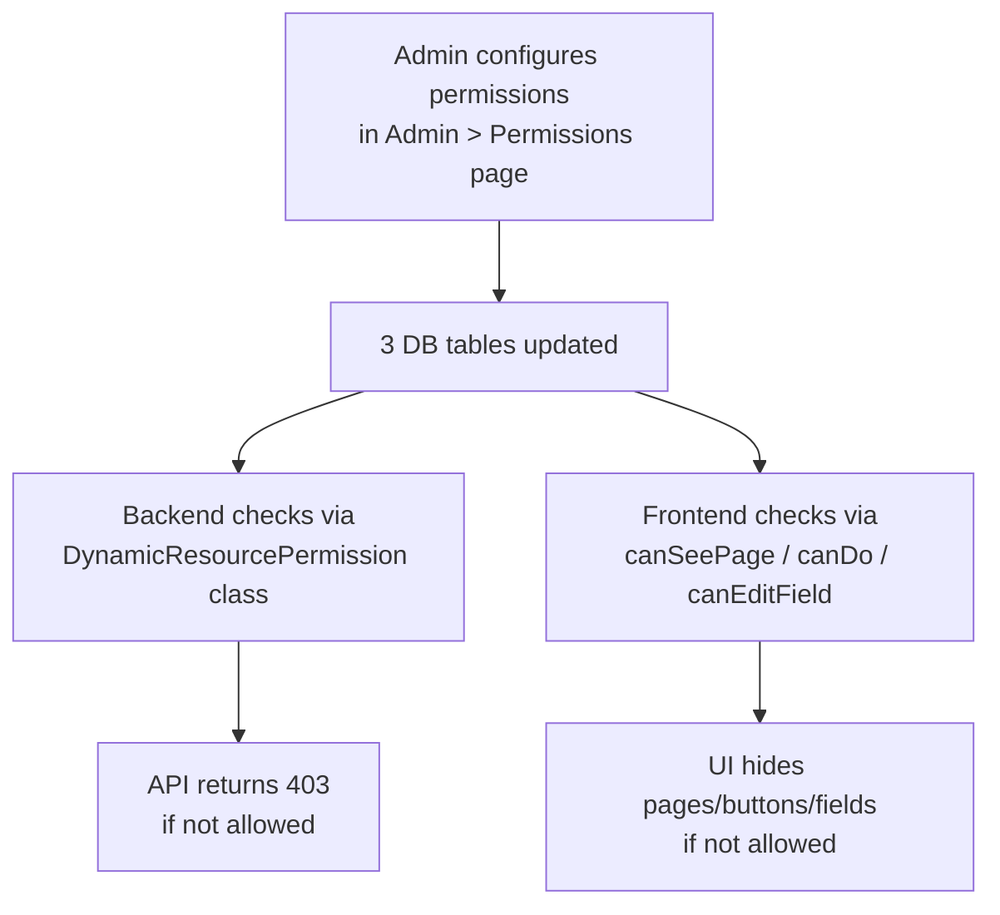
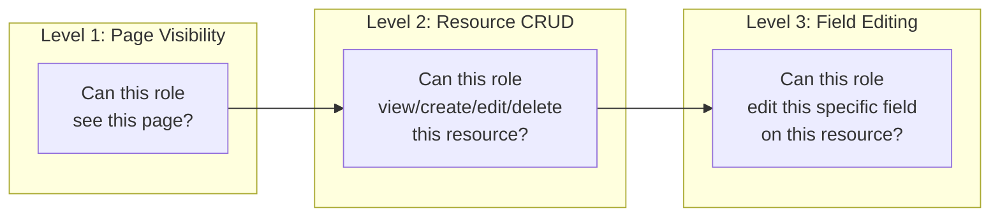

# Permissions System

## What Is This Process?

YGT uses a dynamic, database-driven RBAC (Role-Based Access Control) system. Instead of hardcoded permission checks, permissions are stored in 3 database tables and can be configured by **the `admin` role** through the admin UI. The system controls access at 3 levels: page visibility, resource CRUD, and field-level editing.

> **AD-15 (Apr 2026):** Permission-matrix and user-management endpoints are now restricted to `role='admin'` (or `is_superuser`). `director` and `export_manager` keep all operational power but cannot edit who-can-do-what. Reference-data writes (countries, cities, customers, blocks, etc.) remain available to admin / director / export_manager.

> **ADR-022 (Jun 2026) — Delegated user management:** A bounded exception to AD-15. The `loading_dept_head` role may **create / edit / delete / reset-password** users of the `loading_dept_head_deputy` and `weight_master` roles ONLY, and may grant those two roles a **subset of his own visible (non-`admin.*`) pages** via a dedicated scoped endpoint. The full permission-matrix CRUD stays admin-only. Who-may-manage-whom lives in `MANAGEABLE_BY_ROLE` (`apps/core/roles.py`); enforcement is entirely server-side in `UserManagementViewSet` + `ManagedPagePermissionsView`. The head's deputy does **not** inherit this power. See the [[#Delegated user management (ADR-022)]] section below.

> **Boss widened to full access, gated in the UI instead (2026-08-05, boss process visibility feature).** `boss` moved from 3 read-only pages to `_ALL_PAGES - {'admin.permissions'}` (41 of 42 pages, `seed_permissions.py`) and from strictly-read-only to full CRUD (`_VCRUD`) on every resource **except three carve-outs**: `closed_season` (view-only, D1 write-freeze, same carve-out `admin` has), `truck_split_default` (view-only — only the director changes the official kg-per-firm constants, Gap 7 / ADR-016; `export_manager` is read-only here too, so `boss` must not exceed him) and `sale` (view+create+edit, **no delete** — sale deletion is `admin`-only for `director` and `export_manager` as well, and deleting a `ContractSale` re-rolls the parent `Contract`'s totals). `FIELD_DEFAULTS['boss'] = {r: ['*'] for r in _ALL_RESOURCES}` was added alongside it — without a field-level wildcard, every field would render locked even though the resource grant allows the write. This runs against the grain of **AD-15**: `director` and `export_manager`, the other near-full-access roles, are explicitly denied every `admin.*` page because `admin` is meant to be the sole top-tier system administrator. Granting `boss` the remaining nine `admin.*` pages plus `feedback.admin_inbox` was nonetheless a deliberate, user-approved decision for this feature — treat it as a decision with a tension attached, not settled architecture. `admin.permissions` itself is the one exclusion (see below).
>
> **`admin.permissions` is excluded from the grant (corrected 2026-08-05).** An earlier pass granted it and noted that the page's four backing endpoints (`page-permissions`, `resource-permissions`, `field-permissions`, `permission-registry` — see the Endpoints table below) gate on `_AdminOnlyPermission`, hardcoded to `role=='admin'` or superuser and **not touched** by this feature, so every call the page makes 403s for `boss`. Rather than ship a nav entry that opens a functionally inert page, the seed and migration now subtract it: `PAGE_DEFAULTS['boss'] = _ALL_PAGES - {'admin.permissions'}`. AD-15's enforcement was never weakened; the menu now matches it.
>
> The DB grant above is also only half the access story for `boss` — see "Boss view/edit toggle (UI guard only)" under Frontend Implementation. The backend accepts `boss` writes regardless of that toggle; only the frontend respects it.

> **Deploying the widening needs the migration, not the seed command.** `seed_permissions` uses `get_or_create(..., defaults={...})` and `defaults` applies **only on INSERT** — on any database seeded before 2026-08-05 the boss's 42 page rows and 25 resource rows already exist, so re-running the command finds them and changes nothing. `core/migrations/0033_boss_process_visibility_perms.py` does the `.update()` (plus a reverse function that restores the pre-widening 7-page, view-only state). The seed dicts and that migration must stay in sync — both carry a comment saying so, and the same three resource carve-outs and the `admin.permissions` exclusion are encoded in both.

> **⚠ `DJANGO_TESTING` must be unset when you run `manage.py migrate`.** `0033`'s forward function returns early when `DJANGO_TESTING=true` (the convention migrations 0018 / 0020 / 0026 established), **but Django still records the migration as applied**. A `migrate` run with that variable set therefore no-ops *permanently*: the row lands in `django_migrations` and a later run in the correct environment will not re-execute it. Every documented backend test command in this repo exports `DJANGO_TESTING=true`, so it is routinely already present in a developer's shell — and this project has already sent a migration to the wrong database through exactly this mechanism (`export.0058`, 2026-08-05). Check the shell before you migrate:
> ```bash
> echo "$DJANGO_TESTING"        # must be empty, not 'true'
> unset DJANGO_TESTING
> python manage.py migrate core
> ```
> Then **verify it actually landed** — do not trust the "applied" line:
> ```python
> # manage.py shell
> from apps.core.models import RolePagePermission, RoleResourcePermission
> RolePagePermission.objects.filter(role='boss', is_visible=True).count()      # -> 41
> RoleResourcePermission.objects.filter(role='boss', can_edit=True).count()    # -> 23
> ```
> 41 = the 42 registered pages minus `admin.permissions`; 23 = the 25 registered resources minus `closed_season` and `truck_split_default`. If you get **3** visible pages and **0** editable resources, the migration ran as a no-op. Recovery: delete the `('core', '0033_boss_process_visibility_perms')` row from `django_migrations`, then re-run `migrate core` with `DJANGO_TESTING` unset.

## How It Works (Business Flow)


```mermaid
flowchart TD
    A["Admin configures permissions\nin Admin > Permissions page"] --> B["3 DB tables updated"]
    B --> C["Backend checks via\nDynamicResourcePermission class"]
    B --> D["Frontend checks via\ncanSeePage / canDo / canEditField"]
    C --> E["API returns 403\nif not allowed"]
    D --> F["UI hides pages/buttons/fields\nif not allowed"]
```

### Three Permission Levels


```mermaid
flowchart LR
    subgraph Page["Level 1: Page Visibility"]
        PV["Can this role\nsee this page?"]
    end
    subgraph Resource["Level 2: Resource CRUD"]
        RC["Can this role\nview/create/edit/delete\nthis resource?"]
    end
    subgraph Field["Level 3: Field Editing"]
        FE["Can this role\nedit this specific field\non this resource?"]
    end
    PV --> RC --> FE
```

## Database

### Tables

| Table | Purpose | Key Columns |
|-------|---------|-------------|
| `core.role_page_permissions` | Page visibility per role | role, page_code, can_view |
| `core.role_resource_permissions` | CRUD per role per resource | role, resource_code, can_view, can_create, can_edit, can_delete |
| `core.role_field_permissions` | Field-level edit per role | role, resource_code, field_name, can_edit |

### Permission Registry

**File**: `backend/apps/core/permission_registry.py`

**PAGE_REGISTRY** (every navigable page):
- `dashboard`, `export.shipments`, `export.shipments.board` (Kanban), `export.overdue`, `export.quota`, `export.quota.local_sell`, `export.plan`, `export.prices`, `export.advances`, `export.trucks`, `export.blocks`, `export.domestic_sales`, `export.drafts`, `export.assign`, `export.pallet_manifest`
- `me.board` (My Tasks), `analytics.boss`, `director.stuck_shipments`, `audit_log`
- `feedback.submit`, `feedback.my_tickets`, `feedback.public`, `feedback.admin_inbox`
- `contracts.list` (Contracts), `contracts.sales` (Contract Sales) — P4 module; **non-`admin.` prefix on purpose** so delegated managers may also be granted them. Default visibility is **management-only** (`admin` / `director` / `export_manager`), inherited from `_ALL_PAGES`; all other roles start hidden (mirrors `_CONTRACT_WRITE_ROLES`). Page *visibility* only — contract/sale write enforcement still uses the hardcoded `_CONTRACT_WRITE_ROLES` in `apps/contracts/views.py` (not yet a registered *resource*).
- `admin.users`, `admin.staff_access` (delegated page-access editor — ADR-022), `admin.seasons`, `admin.firms`, `admin.import_firms`, `admin.permissions`, `admin.blocks`, `admin.truck_dest`, `admin.customers`, `admin.shipment_settings`

> **Audit log naming:** the page_code is `audit_log` (NOT `admin.audit_log`) on purpose. `director` and `export_manager` must see it, but their defaults are computed as `_ALL_PAGES - _ALL_ADMIN`, which strips every `admin.*` page (AD-15). A non-prefixed code keeps the audit log visible to them without re-granting admin pages.

> **Adding a new page — both sides must change.** A page is gated by `canSeePage(user, route)` only when its menu item / route has **no** hardcoded `roles` array. For that to resolve, you must (1) add the `page_code` to `PAGE_REGISTRY` here, (2) add the `route → page_code` entry to `ROUTE_PAGE_MAP` in `frontend/src/utils/permissions.ts`, (3) seed defaults in `seed_permissions.py`, and (4) **run `python manage.py seed_permissions` on the deployment** (no `--reset` needed — `get_or_create` inserts only the missing rows). Skipping step 4 makes the page fail-closed (invisible to every non-superuser). A route in `ROUTE_PAGE_MAP` but missing from `PAGE_REGISTRY` (or unseeded) is the classic "page invisible for everyone" bug.

**RESOURCE_REGISTRY**:
- `shipment`, `shipment_firm_split`, `shipment_block_source`, `shipment_assign`, `quality_document`, `sales_report`, `shipment_comment`, `quota_issuance`, `quota_usage`, `local_sell_plan`, `weekly_plan`, `price_entry`, `advance`, `truck_allocation`, `domestic_sale`, `export_firm`, `import_firm`, `season`, `greenhouse_block`, `truck_split_default`, `pallet`, `manifest_close`
- `contract`, `sale` — P4 module, all-or-nothing (no `RESOURCE_FIELDS` entry). `ContractViewSet` / `ContractSaleViewSet` gate on these via `DynamicResourcePermission` (replaced the old hardcoded `_CONTRACT_WRITE_ROLES`). Defaults: full CRUD for `admin` / `director` / `export_manager` on `contract`; on `sale` the same three create/edit but **delete is `admin`-only** (`director` / `export_manager` get view+create+edit); `boss` gets full CRUD on `contract` and view+create+edit on `sale` since the 2026-08-05 widening (was view-only on both) — his `sale` delete was removed to match `director`/`export_manager`; all other roles no access. Matches the management-only page visibility of `contracts.list` / `contracts.sales`.

**RESOURCE_FIELDS** (granular editable fields):
- `shipment`: box_count, pallet_count, weight_net, weight_gross, price_per_kg, total_amount_usd, notes, vehicle_condition, vehicle_condition_note, route_note
- `weekly_plan`: plan_kg, actual_kg
- `quota_issuance`: issue_date, validity, notes
- `quota_usage`: kg_used, usage_date, product_type, notes
- `local_sell_plan`: planned_kg, actual_kg, buyer_name
- Resources not listed: `'*'` (all-or-nothing field access)

## Backend Implementation

### DynamicResourcePermission Class

A DRF permission class that:
1. Identifies the resource_code from the ViewSet
2. Looks up `RoleResourcePermission` for `(user.role, resource_code)`
3. Maps HTTP method to permission: GET→can_view, POST→can_create, PATCH/PUT→can_edit, DELETE→can_delete
4. Returns 403 if not allowed
5. **60-second cache** per `(role, resource)` to avoid DB hits on every request

### Seed Permissions Command

**File**: `backend/apps/core/management/commands/seed_permissions.py`

`python manage.py seed_permissions [--reset]`

Creates default permission rows for all roles × pages × resources. The `--reset` flag deletes and recreates all rows (useful after adding new pages/resources to the registry).

### Boss transition authority (2026-08-05)

`PRIVILEGED_ROLES` in `apps/export/services/shipment.py` now includes `boss` — `{'export_manager', 'director', 'boss'}` — so the generic `POST /shipments/{id}/transition/` endpoint, which delegates fully to `transition_to()`, accepts `boss` on any valid status edge, the same as `export_manager`/`director`.

Two dedicated endpoints gate independently on a **different, same-named constant** — `apps.core.permissions.PRIVILEGED_ROLES`, re-exported from `apps.core.roles.PRIVILEGED_ROLES = {admin, export_manager, director}` — which is deliberately left unchanged (widening it has unknown blast radius at `serializers.py:1513`). They were handled one at a time, at the call site:

- `POST /shipments/{id}/assign/` (`apps/export/views.py:1978`) — **opened to `boss`** (2026-08-05 final review). `/export/assign` sits in his process sidebar, and assigning a draft is a genuine process step, so its only action had to work. The gate now reads `PRIVILEGED_ROLES | {'boss'}`.
- `POST /shipments/{id}/cancel/` (`apps/export/views.py:603`) — **still 403s for `boss`**, deliberately. `ShipmentDetailHero.tsx` hardcodes `CANCEL_ROLES` without `boss`, so the button never renders for him: no error, no surprise, zero user-visible damage. Left as a known, deferred gap.

Reconciling the two divergent `PRIVILEGED_ROLES` constants is still out of scope.

### Endpoints

| Method | Endpoint | Action | Auth |
|--------|----------|--------|------|
| GET / PUT | `/api/v1/core/admin/page-permissions/` | Page-permission matrix CRUD | **admin** |
| GET / PUT | `/api/v1/core/admin/resource-permissions/` | Resource-permission matrix CRUD | **admin** |
| GET / PUT | `/api/v1/core/admin/field-permissions/` | Field-permission matrix CRUD | **admin** |
| GET | `/api/v1/core/admin/permission-registry/` | Read available pages / resources / fields | **admin** |
| PUT | `/api/v1/export/admin/users/{id}/permissions/` | Grant export-app Django permissions to a user | **admin** |
| PATCH | `/api/v1/export/admin/users/{id}/` | Change role / activate / deactivate | **admin** (last-admin guard applies); **loading_dept_head** within his set (ADR-022) |
| POST / DELETE / set-password | `/api/v1/export/admin/users/` (+ `{id}/`, `{id}/set-password/`) | Create / delete / reset-password | **superuser**; **loading_dept_head** for deputy + weight_master only (ADR-022) |
| GET | `/api/v1/export/admin/users/` | List users | admin or export_manager (full); **loading_dept_head** sees only deputy + weight_master |
| GET / PUT | `/api/v1/export/admin/managed-page-permissions/` | Delegated staff page-access editor — grant a subset of own pages to managed roles | **loading_dept_head** (any delegated manager); admin/superuser too (ADR-022) |
| GET | `/api/v1/export/audit-log/` | Audit log | admin / director / export_manager |

The permissions endpoint returns/accepts all 3 levels for a given user's role. Backend gate is `_AdminOnlyPermission` (predicate: `is_superuser OR role=='admin'`).

**Bootstrap admin:** `python manage.py bootstrap_admin` — idempotent, promotes every `is_superuser` user to `role='admin'`. Run on every deploy / staging refresh / restore-from-backup. Replaces the previous `manage.py shell -c "..."` one-liner.

## Frontend Implementation

### Permission Helpers

Available throughout the app after login:

| Helper | Purpose | Example |
|--------|---------|---------|
| `canSeePage(pageCode)` | Check page visibility | `canSeePage('export.quota')` |
| `canDo(resource, action)` | Check resource CRUD | `canDo('shipment', 'create')` |
| `canEditField(resource, field)` | Check field edit | `canEditField('shipment', 'weight_net')` |

These read from the `ICurrentUser` object returned by `/api/v1/auth/me/`:
- `page_permissions: Record<string, boolean>`
- `resource_permissions: Record<string, IResourcePermission>`
- `field_permissions: Record<string, Record<string, boolean>>`

### Boss view/edit toggle (UI guard only) — 2026-08-05

`boss` now has full CRUD at the DB permission layer (see the callout above), but the app still wants a `boss` session to start read-only. That gate lives entirely on the frontend, on top of the DB grant:

- `bossEditMode` (`frontend/src/stores/uiStore.ts`) — boolean, defaults `false`, deliberately **not persisted** (no localStorage/sessionStorage entry). Every page reload puts `boss` back in view mode.
- `canDo()` and `canEditField()` (`frontend/src/utils/permissions.ts`) both short-circuit to `false` for `role==='boss'` whenever `bossEditMode` is off, regardless of what the DB permission rows say.
- `isCellEditable()` (`frontend/src/utils/sheetPermissions.ts`) carries a **third copy** of the same guard, and it is load-bearing. The Sheet payload ships a pre-computed `can_current_user_edit` boolean per row (`apps/export/views.py:1418` and `:1440`) which the helper trusts *instead of* calling `canDo`/`canEditField`; because that value is a bool in both branches for every row, the `?? canEditCell(...)` fallback never fires. Without its own guard the entire grid — inline editing plus Ctrl+C / Ctrl+X / Ctrl+V / Delete over a range — stayed live for `boss` while the header read **Просмотр**. The guard sits **above** the `can_current_user_edit` read.
- Two backend-shaped exceptions are handled by hiding the control rather than widening the API: `canDoBackendGated()` (shipment create, local sell plan) and `canWriteReferenceData()` (customers, truck destinations) both return `false` for `boss` in *either* toggle position, because those endpoints gate on hardcoded role allowlists his matrix grant cannot satisfy.
- A `Segmented` control in the app header (`AppLayout.tsx`, boss-only) flips the toggle. Switching **into** edit mode shows a `Modal.confirm` first; switching back to view is immediate, no confirm.

**This is a UI guard, not a security boundary.** `DynamicResourcePermission` and `transition_to()` on the backend know nothing about `bossEditMode` — `boss` writes are accepted at the API in either toggle position. Only the files that call `canDo()`/`canEditField()`/`isCellEditable()` actually hide their edit controls in view mode; any screen that renders a form or an editable field without going through one of those helpers stays editable for `boss` even while the toggle shows Просмотр. **Do not infer coverage from the helper list** — the feature's design doc claimed "no component reads `resource_permissions` directly", which was false (`ContractDetail.tsx` did, and its document upload/delete stayed live in view mode until it was routed through `canDo`). Verify per screen. Closing that gap on every screen is a separate, larger sweep, not part of this feature.

### Page: PermissionsPage

**File**: `frontend/src/pages/admin/PermissionsPage.tsx`

**3 Tabs** (one per permission level):

**Tab 1 — Page Permissions**: Matrix table, rows = pages, columns = roles, cells = checkbox (can_view)

**Tab 2 — Resource Permissions**: Matrix table, rows = resources, columns = roles × 4 (view/create/edit/delete), cells = checkbox

**Tab 3 — Field Permissions**: Expandable rows per resource, sub-rows per field, columns = roles, cells = checkbox (can_edit)

**Access**: Admin only (backend gate is `_AdminOnlyPermission`).

### Route Protection

**ProtectedRoute** component wraps all routes in App.tsx:
```
<ProtectedRoute pageCode="export.shipments">
  <ShipmentList />
</ProtectedRoute>
```
If `canSeePage(pageCode)` returns false, redirects to Unauthorized page.

### Conditional UI Elements

Throughout the app, buttons/columns/fields are conditionally rendered:
- Create buttons: `canDo('shipment', 'create') && <Button>Create</Button>`
- Edit fields: `canEditField('shipment', 'weight_net') ? <Input /> : <span>{value}</span>`
- Delete buttons: `canDo('quota_usage', 'delete') && <Button danger>Delete</Button>`

## Roles & Permissions

| Role | Configure Permissions | Manage Users (role / pw / activate) | View Permissions |
|------|----------------------|-------------------------------------|------------------|
| `admin` | Yes | Yes (all roles) | Yes |
| `director` | No | No | Yes (own + via /auth/me/) |
| `export_manager` | No | No | Yes (own + via /auth/me/) |
| `loading_dept_head` | No (matrix); Yes (own pages → managed roles, ADR-022) | Yes — **deputy + weight_master only** (ADR-022) | Own + grants pages to his 2 managed roles |
| Others | No | No | Own permissions only (via /auth/me/) |

A **last-admin guard** in `UserManagementViewSet.partial_update` prevents demoting or deactivating the only active admin in the system (403 + explanatory message). Promote another user to admin first.

### Delegated user management (ADR-022)

The `loading_dept_head` (head of packaging + loading) runs his own corner of the org without involving the admin for every hire or password reset — but strictly inside the slice of the app he can see himself.

**What he can do**
- **List / create / edit / delete / reset-password** users — but only for the `loading_dept_head_deputy` and `weight_master` roles. The Users page list is auto-scoped server-side; he never sees other roles' accounts.
- **Grant page access** to those two roles via *Admin → Staff Page Access* (`admin.staff_access`, `ManagedPagePermissionsView`). The pages he can grant are exactly the **non-`admin.*` pages his own role can currently see** — he can never grant more than he has, and never a user/permission-administration page.

**Where the boundary lives**
- `MANAGEABLE_BY_ROLE` in `apps/core/roles.py` — the single source of truth (`loading_dept_head → {loading_dept_head_deputy, weight_master}`). Helpers: `manageable_roles(user)`, `can_manage_users(user)`.
- `UserManagementViewSet` guards: `_assert_can_manage(actor, target)` checks the target's **current** role; `_assert_can_assign_role(actor, role)` checks the **new** role on create + role-change (blocks escalation to `admin`).
- `ManagedPagePermissionsView.put` is a **surgical `update_or_create`** — it writes only the `(managed_role, grantable_page)` pairs in the payload; rows for other roles/pages (including admin-granted ones) are never deleted. `admin.*` pages are excluded from the grantable set (privilege-leak guard).
- Page grants are **role-wide** (perms are stored per role, not per user) — granting a page to `weight_master` affects every weight_master. The UI states this.
- The frontend mirror of `MANAGEABLE_BY_ROLE` is **UX only** (which buttons / dropdown options to render); the server is the security boundary.
- The head's **deputy does not** get this management power — only the head manages staff.

Reachability is seeded by data migration `core.0020` (sets `admin.users` + `admin.staff_access` visible for `loading_dept_head`). Tests: `apps/export/tests_delegated_user_mgmt.py` (18).

## Sidebar Navigation (2026-08-05)

The sidebar (`frontend/src/components/AppLayout.tsx`) is grouped by **export process phase** instead of by module: Overview → Planning → Prep → Shipping → Docs → Sales, followed by unnumbered support groups (Finance, Analytics, Reference, System, Feedback). The order is a **single global sequence** — there is no per-role ordering table. Each role still only sees the pages `canSeePage` allows it, and a group with zero visible children collapses entirely, so in practice every role sees its own slice of the sequence in process order. This is documented alongside the visibility rules above because visibility and ordering are driven by the same page registry and menu-build pass.

This reorder surfaced five pages that previously existed only as typed URLs with no menu entry: Truck Forecast (`/export/trucks`), Drafts (`/export/drafts`), Assignment (`/export/assign`), Domestic Sales (`/export/domestic-sales`), Prices (`/export/prices`).

The reorder changes the menu for **every role**, not just `boss` — this was explicitly approved, not a side effect.

**Deferred:** per-role configurable sidebar ordering (a `role × page_code × sort_order` table + drag-and-drop admin UI + fallback to the global default). Ship the single global order first; build the configurable version only if a role's workflow proves it wrong.

## Connections to Other Processes

- **[[authentication]]** — Login returns user info including all permission data
- **[[shipment-lifecycle]]** — Field-level permissions control which shipment fields each role can edit
- All processes — Every page and resource check goes through this system
