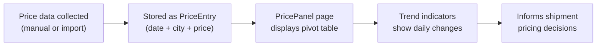

# Price Monitoring

## What Is This Process?

YGT tracks tomato prices across 8+ cities in destination countries (Kazakhstan, Russia). Prices are recorded daily in both local currency and USD. The PricePanel page shows a pivot table of prices over time with trend indicators, helping export managers decide pricing and routing.

## How It Works (Business Flow)

## Database

### Tables

| Table | Purpose | Key Columns |
|-------|---------|-------------|
| `export.price_entries` | One row per city per date | date, city (FK), price_local, price_usd, currency, source |
| `export.domestic_market_prices` | Domestic market reference prices | _(similar structure)_ |

## Backend Implementation

### ViewSet & Endpoints

| Method | Endpoint | Action |
|--------|----------|--------|
| GET | `/api/v1/export/prices/` | List prices (filterable by days) |
| POST | `/api/v1/export/prices/` | Create price entry |
| PATCH | `/api/v1/export/prices/{id}/` | Update |

**Query params**: `?days=7` (default), returns last N days of prices.

### Management Commands

- `import_prices.py` — Bulk import from Excel
- `import_domestic_prices.py` — Import domestic market prices

## Frontend Implementation

### Page: PricePanel

**File**: `frontend/src/pages/export/PricePanel.tsx`

**Time Range Toggle**: Segmented control: 7 / 14 / 30 days

**Pivot Table**:
| Dimension | Values |
|-----------|--------|
| Rows | Cities (8+) |
| Columns | Dates (newest first) |
| Cells | USD price (bold) + local price + currency |

**Trend Indicators** (per city):
- Compares today vs yesterday price
- Red ↑ if price went up
- Green ↓ if price went down
- No indicator if flat or insufficient data

### Hooks

| Hook | Endpoint | Params | Returns | Stale Time |
|------|----------|--------|---------|------------|
| `usePriceEntries` | `GET /export/prices/?days=N&page_size=500` | days (7/14/30) | `IPriceEntry[]` | 300s (5 min) |

### TypeScript Types

**`IPriceEntry`**: id, date, city_name, price_local, price_usd, currency, source

## Roles & Permissions

| Role | View | Edit |
|------|------|------|
| `export_manager` | Yes | Yes |
| `director` | Yes | Yes |
| `sales_rep` | Yes | Yes (own entries) |
| Others | Yes (read-only) | No |

## Connections to Other Processes

- **[[shipment-lifecycle]]** — `price_per_kg` and `total_amount_usd` on shipments; sales report references current market prices
