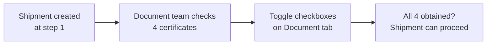

# Quality Documents

## What Is This Process?

Every shipment requires 4 quality/compliance certificates before crossing borders. The Document tab on ShipmentDetail tracks whether each certificate is obtained. This is primarily managed by the `document_team` role at steps 1-6 of the [[shipment-lifecycle]].

## How It Works (Business Flow)

## Database

### Tables

| Table | Purpose | Key Columns |
|-------|---------|-------------|
| `export.quality_documents` | 4 boolean flags per shipment | shipment_id, azyk_maglumatnama, suriji_gozukdiriji, hil_sertifikaty, kalibrowka_analiz |

### The 4 Certificates

| Field | Certificate Name | Purpose |
|-------|-----------------|---------|
| `azyk_maglumatnama` | Azyk Maglumatnama | Food safety certificate |
| `suriji_gozukdiriji` | Suriji Gozukdiriji | Origin certificate |
| `hil_sertifikaty` | Hil Sertifikaty | Quality certificate |
| `kalibrowka_analiz` | Kalibrowka Analiz | Calibration analysis |

## Backend Implementation

### Model

**QualityDocument** (part of export models):
- `shipment` (OneToOne FK CASCADE)
- `azyk_maglumatnama`, `suriji_gozukdiriji`, `hil_sertifikaty`, `kalibrowka_analiz` (all BooleanField, default=False)

### Endpoint

| Method | Endpoint | Action | Auth |
|--------|----------|--------|------|
| PATCH | `/api/v1/export/shipments/{id}/quality/` | Toggle quality flags | export_manager, document_team, director |

The `set_quality` action on ShipmentViewSet creates or updates the QualityDocument record.

## Frontend Implementation

### Where It Appears

**ShipmentDetail** → **Tab 2: Document**

**Display**:
- 4 checkboxes, each togglable if user has permission
- Checked = certificate obtained (green checkmark)
- Unchecked = pending (empty box)

**On Toggle**: PATCH to `/quality/` endpoint with updated boolean values.

### Also visible on ShipmentSheet

The sheet view includes quality flags as read-only columns.

## Roles & Permissions

| Role | View | Toggle Checkboxes |
|------|------|-------------------|
| `document_team` | Yes | Yes (their primary job) |
| `export_manager` | Yes | Yes |
| `director` | Yes | Yes |
| Others | Yes (read-only) | No |

## Connections to Other Processes

- **[[shipment-lifecycle]]** — Quality docs are checked at steps 1-6 (LOADING/CUSTOMS phases)
- **[[document-team]]** — Primary role responsible for obtaining these certificates
