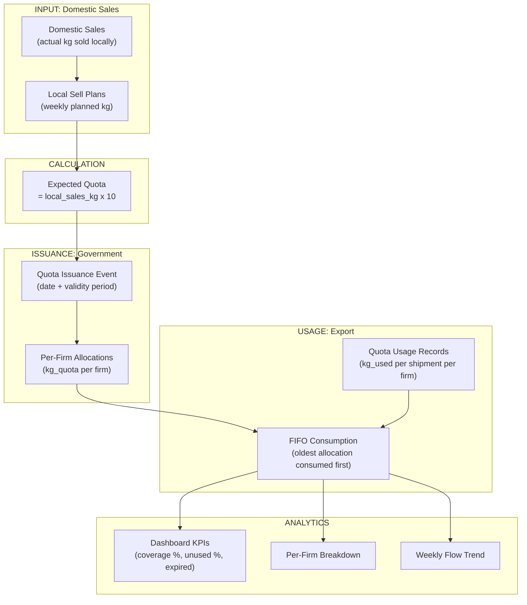
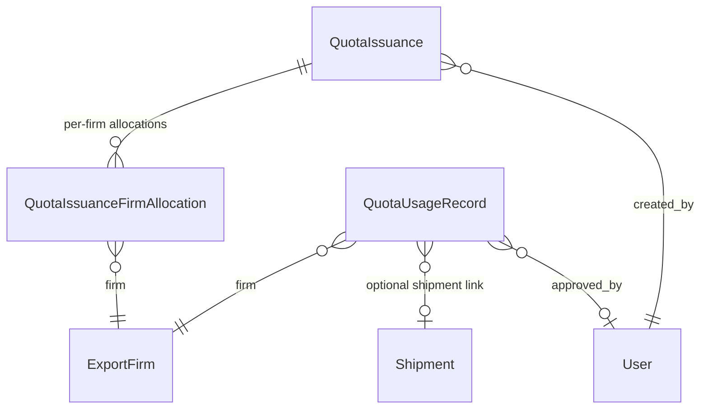

# Quota Management

## What Is This Process?

The Turkmenistan government issues export quotas based on how much each firm sells domestically. The rule: for every 1 kg sold domestically, the firm gets ~10 kg of export quota. Quotas expire (~1 month). When a firm exports tomatoes (shipment), quota is consumed. The system tracks issuance, allocation per firm, usage per shipment, and remaining balance using FIFO (oldest quota consumed first).

## How It Works (Business Flow)

### Three Data Streams

1. **Local Sell Plans** → `local_sales_kg` per firm per week (from [[local-sell-plan]])
2. **Quota Issuances** → `kg_quota` allocated per firm per issuance event (from government)
3. **Quota Usage** → `kg_used` consumed per firm per shipment (from [[shipment-lifecycle]] firm splits)

### FIFO Consumption Logic

When calculating how much of each allocation is consumed:
1. Per firm: sort all allocations by `issue_date` ASC (oldest first)
2. Sum total approved usage for that firm
3. Consume from oldest allocation first, then next, etc.
4. Result: each `allocation_id` has a `consumed_kg` amount

### Quota Expiry

Each issuance has a `validity` field:
- `this_month` — expires end of issue month
- `this_and_next` — expires end of month after issue month
- `next_month` — expires end of next month

Frontend computes expiry date from `issue_date + validity` and shows status: **active** (>7 days), **expiring** (0-7 days), **expired** (<0 days).

### Auto-Created Usage Records

When a user sets firm splits on a shipment (POST `/shipments/{id}/firm-splits/`), the system auto-creates **draft** `QuotaUsageRecord` entries for each firm using `get_default_truck_weight(num_firms)`:
- 1 firm: 18,100 kg
- 2 firms: 9,000 kg each
- 3+ firms: 18,100 / N kg each

These drafts must be **approved** by export_manager/director before they count in FIFO calculations.

## Database

### Tables

| Table | Purpose | Key Columns |
|-------|---------|-------------|
| `export.quota_issuances` | One government issuance event | `issue_date`, `product_type`, `validity`, `matched_week`, `matched_year` |
| `export.quota_issuance_firm_allocations` | Per-firm allocation within issuance | `issuance_id`, `export_firm_id`, `kg_quota` |
| `export.quota_usage_records` | Per-firm usage per shipment | `usage_date`, `export_firm_id`, `kg_used`, `shipment_id`, `status` (draft/approved) |

### Relationships

### Key Constraints

- `(issuance, export_firm)` unique in allocations
- `kg_quota > 0` check constraint on allocations
- `kg_used > 0` check constraint on usage records
- Usage `status` is 'draft' or 'approved' — only approved records count in FIFO

## Backend Implementation

### Models

**File**: `backend/apps/export/models/quota.py`

**QuotaIssuance**:
- `issue_date`, `product_type` ('tomato'/'pepper'), `validity` ('this_month'/'this_and_next'/'next_month')
- `matched_week`, `matched_year` — auto-computed from `issue_date` ISO week on save, editable for manual reassignment
- `is_manually_reassigned` (bool) — if true, `save()` won't auto-recompute week
- `notes`, `created_at`, `created_by`
- **Property**: `total_kg` — aggregated sum of allocations

**QuotaIssuanceFirmAllocation**:
- `issuance` (FK CASCADE), `export_firm` (FK PROTECT), `kg_quota`

**QuotaUsageRecord**:
- `usage_date`, `export_firm` (FK PROTECT), `kg_used`, `product_type`, `notes`
- `shipment` (FK SET_NULL, nullable) — links to shipment, null for historical imports
- `status` ('draft'/'approved'), `approved_by` (FK User), `approved_at`
- `created_by`, `created_at`

**Helper**: `get_default_truck_weight(num_firms) → Decimal` — returns kg per firm for auto-created usage records

### Services

**File**: `backend/apps/export/services_quota.py`

| Function | Purpose |
|----------|---------|
| `fetch_plan_rows(date_from, date_to)` | Get WeeklyLocalSellPlan rows in date range |
| `fetch_issuances(date_from, date_to, product_type)` | Get QuotaIssuance with prefetched allocations |
| `aggregate_local_sales(plan_rows)` | Sum Mon-Sat plan_kg per firm → `dict[firm_id, Decimal]` |
| `aggregate_quota_issued(date_from, date_to, product_type)` | Sum kg_quota per firm → `dict[firm_id, Decimal]` |
| `aggregate_quota_used(date_from, date_to)` | Sum approved kg_used per firm → `dict[firm_id, Decimal]` |
| `compute_fifo_usage(product_type)` | Per firm FIFO: returns `dict[allocation_id, consumed_kg]` |
| `_compute_kpis(local_sales, quota_issued, quota_used)` | Top-level KPIs: local_sales_kg, expected_kg, issued_kg, not_given_kg/%, used_kg, unused_kg/% |
| `_build_per_firm(...)` | Per-firm breakdown rows with is_blocked flag |
| `_build_week_entry(year, week, ...)` | Single week entry with coverage_pct, firm breakdown |
| `build_quota_dashboard(date_from, date_to, product_type)` | Main orchestrator → `{kpis, per_firm, weekly_flow}` |

#### KPI Formulas

| KPI | Formula |
|-----|---------|
| `local_sales_kg` | Sum of local sell plan kg |
| `expected_kg` | `local_sales_kg * 10` |
| `issued_kg` | Sum of all quota allocations in period |
| `not_given_kg` | `expected_kg - issued_kg` |
| `not_given_pct` | `not_given_kg / expected_kg * 100` |
| `used_kg` | Sum of approved usage in period |
| `unused_kg` | `issued_kg - used_kg` |
| `unused_pct` | `unused_kg / issued_kg * 100` |

### Serializers

**File**: `backend/apps/export/serializers_quota.py`

**QuotaIssuanceFirmAllocationSerializer** (read):
- Fields: id, export_firm, export_firm_name, kg_quota, used_kg (from FIFO context)
- `used_kg` is injected from `context['usage_map']` — the FIFO consumption per allocation

**QuotaIssuanceSerializer** (read + update):
- Fields: id, issue_date, product_type, validity, matched_week, matched_year, is_manually_reassigned, notes, created_at, total_kg, allocations (nested)
- `update()`: accepts `allocations` list, deletes existing, bulk-creates replacements in transaction
- Auto-recomputes matched_week/year if not manually reassigned

**QuotaIssuanceCreateSerializer** (POST):
- Fields: issue_date, product_type, validity, notes, allocations
- `create()`: bulk-creates issuance with nested allocations in transaction
- Returns full QuotaIssuanceSerializer representation

**QuotaUsageRecordSerializer** (read/write):
- Fields: id, usage_date, export_firm, export_firm_name, kg_used, product_type, status, notes, shipment, cargo_code, approved_by/name, approved_at, created_by/name, created_at
- Status, approved_by, approved_at are read-only (set via approve action)

### ViewSet & Endpoints

**File**: `backend/apps/export/views_quota.py`

| Method | Endpoint | Action | Auth |
|--------|----------|--------|------|
| GET | `/api/v1/export/quota-issuances/` | List issuances | IsAuthenticated |
| POST | `/api/v1/export/quota-issuances/` | Create issuance with allocations | export_manager, director |
| PUT | `/api/v1/export/quota-issuances/{id}/` | Full update (replace allocations) | export_manager, director |
| DELETE | `/api/v1/export/quota-issuances/{id}/` | Delete issuance | export_manager, director |
| PATCH | `/api/v1/export/quota-issuances/{id}/reassign/` | Manual week reassignment | export_manager, director |
| GET | `/api/v1/export/quota-usage/` | List usage records | IsAuthenticated |
| PUT | `/api/v1/export/quota-usage/{id}/` | Edit (draft only) | IsAuthenticated |
| DELETE | `/api/v1/export/quota-usage/{id}/` | Delete (draft only) | IsAuthenticated |
| POST | `/api/v1/export/quota-usage/approve/` | Bulk approve drafts | export_manager, director |
| GET | `/api/v1/export/quota-dashboard/` | Dashboard analytics | IsAuthenticated |

**Dashboard query params**: `season` (required), `product_type` (default='tomato'), `date_from`, `date_to`

**Filters on issuances**: `?product_type=`, `?date_from=`, `?date_to=`
**Filters on usage**: `?status=`, `?product_type=`, `?date_from=`, `?date_to=`

## Frontend Implementation

### Page: QuotaDashboard

**File**: `frontend/src/pages/export/QuotaDashboard.tsx`

**Role-Based View**:
- `document_team`: sees "All Quotas" tab only (read-only)
- `export_manager` / `director`: all tabs + analytics
- `seller`: only "Local Sell Plan" section

**Filter Panel**:
| Filter | Component | Options |
|--------|-----------|---------|
| Season | Select | Available seasons |
| Product Type | Segmented | Tomato / Pepper |
| Period Mode | Segmented | Season / Month / Week / Custom |
| Month | MonthPicker | Months within selected season |
| Week | WeekPicker | W1-W52 |
| Date Range | RangePicker | Custom start-end dates |

**KPI Pipeline** (3 sections, left to right):

| Section | KPIs | Visual |
|---------|------|--------|
| INPUT | Local Sales (kg) | Blue number |
| ALLOCATION | Expected (kg), Issued (kg), Not Given (kg), Coverage % | Green/purple/red, progress bar |
| OUTCOME | Used (kg), Unused (kg), Expired Unused (kg) | Cyan/orange/red |

Coverage progress bar color: green >=80%, orange >=50%, red <50%.

**5 Tabs**:

| Tab | Component | What It Shows |
|-----|-----------|--------------|
| 1. Firm Breakdown | QuotaPerFirmTable | Per-firm table: sales_kg, expected, issued, used, diff, is_blocked |
| 2. Firm Chart | QuotaVisualBars | Bar chart visualization of firm allocations |
| 3. Weekly Trend | QuotaWeeklyFlow | Week-by-week issuance trend with coverage % |
| 4. Issuance Log | QuotaIssuancesList | Detailed allocation table (see below) |
| 5. Quota Usage | QuotaUsageTab | Usage records with approval workflow (see below) |

### Sub-Page: QuotaIssuancesList

**File**: `frontend/src/pages/export/QuotaIssuancesList.tsx`

Flattens nested allocations into individual rows.

**Columns**:
| # | Column | Width | Notes |
|---|--------|-------|-------|
| 1 | Allocation ID | 60px | |
| 2 | Firm Name | 160px | Bold, sortable |
| 3 | Issued (kg) | 120px | Right-aligned, sortable |
| 4 | Used (kg) | 120px | Right-aligned, sortable |
| 5 | Usage Bar | 130px | Progress %, color: green >=80%, orange >=30%, red <30% |
| 6 | Issue Date | 110px | Sortable |
| 7 | Expiry Date | 110px | Computed from issue_date + validity, sortable |
| 8 | Status | 100px | active (green) / expiring (gold) / expired (red) |
| 9 | Days Left | 100px | "X days" / "expired X days ago" / "expires today" |
| 10 | Batch ID | 65px | Issuance ID, sortable |
| 11 | Actions | 60px | Delete button (if permission) |

**Status logic**: active (>7 days left), expiring (0-7 days), expired (<0 days)

**Sorting**: Default sort by status (active→expiring→expired), then by issue_date descending.

### Sub-Page: QuotaUsageTab

**File**: `frontend/src/pages/export/QuotaUsageTab.tsx`

**Columns**:
| # | Column | Width | Notes |
|---|--------|-------|-------|
| 1 | Usage Date | 110px | |
| 2 | Firm Name | 160px | Bold |
| 3 | Cargo Code | 130px | Optional link |
| 4 | Kg Used | 130px | **Inline-editable** InputNumber if draft + canEdit |
| 5 | Product Type | 100px | tomato/pepper |
| 6 | Status | 110px | draft (pencil icon) / approved (checkmark icon) |
| 7 | Created By | 120px | |
| 8 | Approved By | 120px | |
| 9 | Delete | 50px | Only for draft records |

**Toolbar**:
- Status filter dropdown: all / draft / approved
- Record count + "X pending draft" note
- **Bulk Approve** button (shows count, only if drafts selected and canEdit)

**Inline Edit**: Click kg_used cell → InputNumber → blur saves (PATCH)

**Bulk Approve**: Select draft rows via checkboxes → click Approve → POST `/quota-usage/approve/` with ids

### Hooks

| Hook | Endpoint | Params | Returns | Stale Time |
|------|----------|--------|---------|------------|
| `useQuotaDashboard` | `GET /export/quota-dashboard/` | season, date_from, date_to, product_type | `IQuotaDashboardResponse` | 60s |
| `useQuotaIssuances` | `GET /export/quota-issuances/` | product_type, date_from, date_to | `IQuotaIssuance[]` | 60s |
| `useQuotaUsageRecords` | `GET /export/quota-usage/?page_size=2000` | status, product_type, date_from, date_to | `IQuotaUsageRecord[]` | 30s |
| `useBulkApproveQuotaUsage` | `POST /export/quota-usage/approve/` | `{ids: []}` | `{approved: number}` | mutation |

### TypeScript Types

**`IQuotaDashboardResponse`**: `{kpis: IQuotaDashboardKPIs, per_firm: IQuotaDashboardFirm[], weekly_flow: IQuotaWeeklyFlowEntry[]}`

**`IQuotaDashboardKPIs`**: local_sales_kg, expected_kg, issued_kg, not_given_kg, not_given_pct, used_kg, unused_kg, unused_pct

**`IQuotaIssuance`**: id, issue_date, product_type, validity, matched_week, matched_year, notes, total_kg, allocations[] (each: id, export_firm, export_firm_name, kg_quota, used_kg)

**`IQuotaUsageRecord`**: id, usage_date, export_firm, export_firm_name, kg_used, product_type, status, cargo_code, approved_by_name, created_by_name

## Roles & Permissions

| Role | Dashboard | Create Issuance | Edit Usage | Approve Usage | Delete |
|------|-----------|----------------|------------|---------------|--------|
| `export_manager` | Full | Yes | Yes | Yes | Yes |
| `director` | Full | Yes | Yes | Yes | Yes |
| `document_team` | Read-only tab | No | No | No | No |
| `seller` | Local Sell Plan only | No | No | No | No |
| Others | No access | No | No | No | No |

## Connections to Other Processes

- **[[local-sell-plan]]** — Local sales kg is the **input** to quota calculation (× 10 = expected quota)
- **[[shipment-lifecycle]]** — Setting firm splits on a shipment auto-creates **draft** usage records; approved usage consumes quota via FIFO
- **[[domestic-sales]]** — Historical domestic sales data feeds into local sell plan figures
