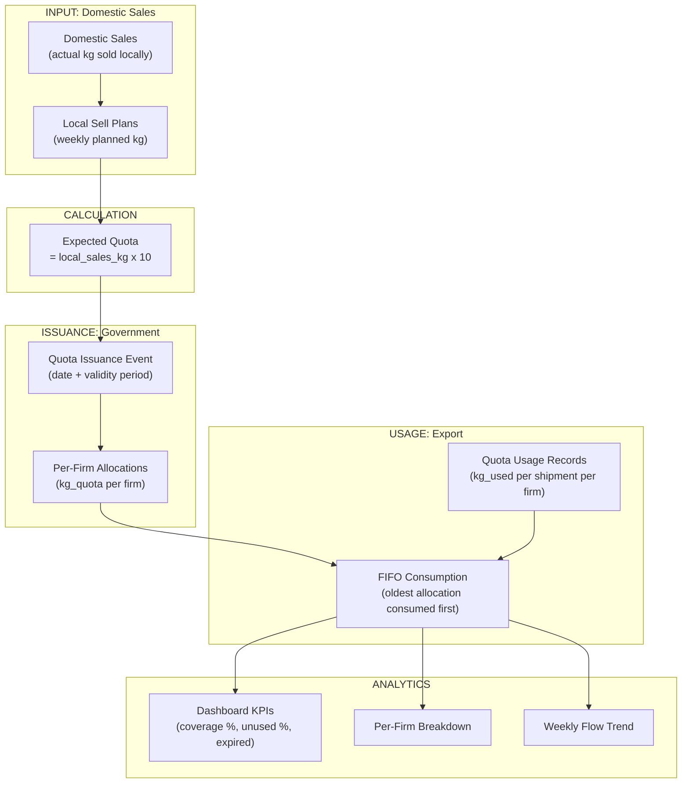
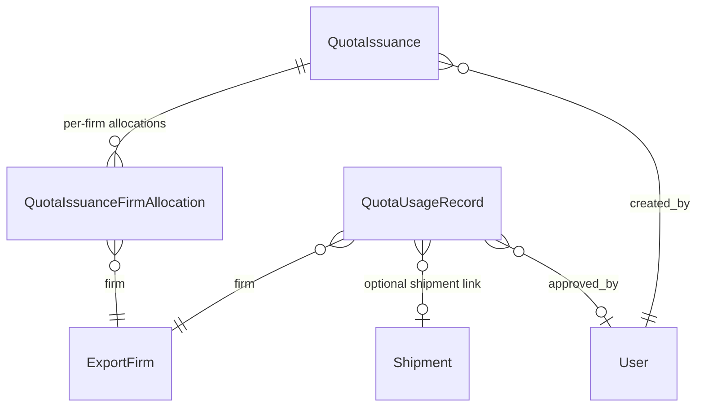

# Quota Management

## What Is This Process?

The Turkmenistan government issues export quotas based on how much each firm sells domestically. The rule: for every 1 kg sold domestically, the firm gets ~10 kg of export quota. Quotas expire (~1 month). When a firm exports tomatoes (shipment), quota is consumed. The system tracks issuance, allocation per firm, usage per shipment, and remaining balance using FIFO (oldest quota consumed first).

> [!important] Quota never crosses a season boundary (D11, ruled 2026-08-06)
> Both **display** and **consumption** stop at the season line. `/quota-issuances/`, `/quota-usage/` and `/quota-firm-balances/` are season-scoped (`?season=<id>`), and the FIFO walk only matches a season's usage against that same season's allocations — leftover issuance **expires with its season** rather than carrying forward. This reverses D10, which had exempted quota from read-scoping on the assumption that FIFO ran across seasons.
> 
> Two things to know before touching this code. **`QuotaUsageRecord` has no `season` FK and no `issuance` FK** — only `usage_date` and a nullable `shipment` (575 of 711 rows have no shipment) — so its season is derived by `services_quota.usage_season_q()`; use that helper rather than hand-rolling the predicate. Because the anchor is derived, `POST`/`PATCH` on `/quota-usage/` **400 when the row would land outside every season** (`season_of_usage()` is the row-level inverse, and the two must stay in step); the manual-entry modal surfaces that 400 verbatim. And **an issuance whose `issue_date` falls in the gap between two seasons has `season = NULL` and is invisible on every list** (direct link only); `POST /quota-issuances/` now 400s during the close→open gap so no more can be created. `QuotaIssuance#34` on the dev database (25,000 kg, 2026-07-06, *Eziz Doganlar*) is one such row, awaiting an owner ruling.

## How It Works (Business Flow)


```mermaid
flowchart TD
    subgraph Input["INPUT: Domestic Sales"]
        DS["Domestic Sales\n(actual kg sold locally)"]
        LSP["Local Sell Plans\n(weekly planned kg)"]
    end
    
    subgraph Calculation["CALCULATION"]
        EXP["Expected Quota\n= local_sales_kg x 10"]
    end
    
    subgraph Issuance["ISSUANCE: Government"]
        QI["Quota Issuance Event\n(date + validity period)"]
        QA["Per-Firm Allocations\n(kg_quota per firm)"]
    end
    
    subgraph Usage["USAGE: Export"]
        QU["Quota Usage Records\n(kg_used per shipment per firm)"]
        FIFO["FIFO Consumption\n(oldest allocation consumed first)"]
    end
    
    subgraph Analytics["ANALYTICS"]
        KPI["Dashboard KPIs\n(coverage %, unused %, expired)"]
        PF["Per-Firm Breakdown"]
        WF["Weekly Flow Trend"]
    end
    
    DS --> LSP
    LSP --> EXP
    EXP --> QI
    QI --> QA
    QA --> FIFO
    QU --> FIFO
    FIFO --> KPI
    FIFO --> PF
    FIFO --> WF
```

### Three Data Streams

1. **Local Sell Plans** → `local_sales_kg` per firm per week (from [[local-sell-plan]])
2. **Quota Issuances** → `kg_quota` allocated per firm per issuance event (from government)
3. **Quota Usage** → `kg_used` consumed per firm per shipment (from [[shipment-lifecycle]] firm splits)

### FIFO Consumption Logic

When calculating how much of each allocation is consumed:
1. Per firm: sort all allocations by `issue_date` ASC (oldest first)
2. Sum total approved usage for that firm
3. Consume from oldest allocation first, then next, etc.
4. Result: each `allocation_id` has a `consumed_kg` amount

### Quota Expiry

Each issuance has a `validity` field:
- `this_month` — expires end of issue month
- `this_and_next` — expires end of month after issue month
- `next_month` — expires end of next month

Frontend computes expiry date from `issue_date + validity` and shows status: **active** (>7 days), **expiring** (0-7 days), **expired** (<0 days).

### Auto-Created Usage Records

Draft `QuotaUsageRecord` entries are auto-created any time a shipment's firm splits are set, via the shared `sync_draft_quota_usage_for_shipment(shipment, user)` service in `apps/export/services/quota_sync.py`:

| Trigger | Behavior |
|---------|----------|
| `POST /shipments/` (draft path) with `firm_splits` in body | Drafts created in the same atomic transaction as the shipment + splits |
| `POST /shipments/{id}/firm-splits/` | Every existing row for the shipment is replaced |
| `PATCH /contracts/sales/{id}/` changing `quantity_kg` | The firm's split weight is rewritten to the invoice NET, then quota re-runs |

> **The split weight IS the invoice number (2026-08-11).** `ContractSale.quantity_kg` and `ShipmentFirmSplit.weight_kg` are documented as the same figure — the firm's official export weight (AD-016) — but were kept in step in only one direction: applying a `PackingTemplate` wrote the share net down onto the split, while editing `quantity_kg` on the sale did not. Two of the 18 linked sales on the dev database had drifted (`0807003/26`: split 7,000 / 11,000 against invoice 9,000 / 9,000 — same truck total, different per-firm split, and **quota is counted per firm**). `ContractSaleViewSet.perform_create/perform_update` now call `sync_split_weight_from_sale()`, which rewrites that one firm's split (others keep their weights) and re-runs quota.
>
> Direction is architectural: `export` may not import `contracts`, so quota cannot read the sale — `contracts` reaching down into `export` is the allowed direction, which is why the helper lives in `contracts/views.py` and not in `quota_sync`. A firm with no split on the truck is **skipped, not added**: putting a firm on a truck is a separate decision with its own no-remaining-quota hard block. `sync_split_weights_from_sales` (management command, `--dry-run`) repairs rows that drifted before this existed.
>
> Coverage caveat: only **9 of 90** shipments with firm splits have a contract sale carrying `quantity_kg`, so for the rest the split remains the only source.

Per-firm `kg_used` mirrors each firm's **actual `ShipmentFirmSplit.weight_kg`** — so changing a firm's split weight reassigns that firm's quota usage to the new number. It falls back to the admin-configurable `TruckSplitDefault` only when a split carries no weight (the firm-splits input allows `weight_kg` to be omitted, in which case the split itself is auto-filled from the same defaults):
- 1 firm: 18,100 kg
- 2 firms: 9,000 kg each
- 3+ firms: 18,100 / N kg each

**`usage_date`** = the real date encoded in the operator's **export code** (`DD` + 2-letter month + `NNN` + `/YY`, e.g. `12JN121/26` → 12 Jun 2026), parsed by `apps/export/services/export_code.py::parse_export_code_date`. `Shipment.date` is only the creation/import day, so it's the **fallback** when the export code is missing or unparseable. Operator month codes are English 2-letter (`JA FB MR AP MY JN JL AG SP OC NV DC` — note **November = NV**), distinct from the Turkmen scheme in the now-disabled `validators.py`. Manually-added usage records (no shipment) keep their user-picked date.

The Quota Usage **list view** shows a **Source** badge per row — `Auto` (created from a shipment, has a shipment code) vs `Manual` (user-entered, no shipment). Since the approval step was removed it has no status column, no status filter and no row selection; `kg_used` is inline-editable for anyone with `quota_usage.can_edit`.

> **No approval step since 2026-08-10.** Rows are created `status='approved'` and count in FIFO, the firm balances and the dashboard the instant they exist. `POST /quota-usage/approve/` is gone; `perform_update` / `perform_destroy` no longer gate on `status`; the bulk-approve UI, the status filter and the status columns are removed.
>
> **`status='approved'` now means "counted", not "signed".** `approved_by` / `approved_at` stay NULL on everything the system creates — stamping the operator would put a false signature in the audit trail. The column survives to carry pre-cutover history.
>
> **The guard that had to go with it.** `sync_draft_quota_usage_for_shipment` raised `ApprovedQuotaExistsError` (→ 400) when approved rows existed, because approved meant a signature automation must not overwrite. Once every row is born approved, that fires on *every* split edit after the first — it would have 400'd routine work platform-wide. Three call sites carried it (`ShipmentViewSet.set_firm_splits` plus two in `contracts.views`); all three removed. Resync now replaces every row on the shipment. Manually-entered rows carry no shipment and are never in that queryset.
>
> **Knock-on, documented not changed:** `POST /shipments/{id}/cancel/` still reports `draft_quota_deleted` and `approved_quota_to_reconcile`. The first is now structurally 0 and the second lists every row on the shipment. No kg is stranded — `counted()` already drops rows tied to a cancelled shipment, so the release stays automatic; only the response's field names now read oddly.

### Release-on-Delete Semantics

When a shipment is removed from the operational pool, its approved kg should return to the firm's available quota balance. This is implemented at the **aggregation layer** via `QuotaUsageRecord.objects.counted()` — a manager method that filters out rows tied to soft-deleted or cancelled shipments. Every FIFO / KPI / dashboard aggregation calls `.counted()` first.

| Action | Row state | Counts in FIFO? | Reversible? |
|--------|-----------|----------------|-------------|
| Shipment is alive | Approved row exists, `shipment.deleted_at IS NULL`, status != cancelled | ✅ Yes | — |
| `POST /shipments/{id}/soft-delete/` | Row preserved | ❌ No | ✅ `POST /restore/` re-counts the same row |
| `POST /shipments/{id}/cancel/` | Row preserved (draft rows deleted; approved rows kept) | ❌ No | Only via un-cancel transition |
| `POST /shipments/bulk-delete/` (admin) | **Row hard-deleted** (drafts + approveds) | ❌ No | ❌ Permanent — shipment is gone |
| `POST /shipments/{id}/hard-delete/` (admin, draft only) | **Row hard-deleted** (same cleanup as bulk-delete) | ❌ No | ❌ Permanent — draft is gone |
| Historical Excel import (no `shipment_id`) | Row exists, `shipment` is NULL | ✅ Yes | — |

Every action above busts **both** the `fifo_usage:*` and `quota_firm_balances:*` caches (both now keyed `:<product_type>:<season_id>` — `invalidate_quota_caches()` enumerates the seasons, since Django's default cache backend has no pattern-delete) via the canonical `invalidate_quota_caches()` (in `services/quota_sync.py`) so the firm's balance updates immediately — FIFO backs the dashboard/issuance list, `quota_firm_balances` backs the Sheet firm-split "no quota" hard-block, and any change to consumption or issuance moves both. Issuance create/update/delete call the same helper; `QuotaUsageViewSet.approve` defers it via `transaction.on_commit(...)` so the cache is dropped *after* the approval commits (avoiding a stale-repopulation race). The quota dashboard cache (60s TTL, parametrised by season/date) is left to expire on its own.

**Why hard-delete is different.** Soft-delete and cancel keep the row so restore / un-cancel can re-consume the kg automatically (including the approved status). Bulk-delete severs the shipment FK (`SET_NULL`), which `counted()` would treat as a historical import and re-include — so the action explicitly hard-deletes the usage rows before destroying the shipment.

## Database

### Tables

| Table | Purpose | Key Columns |
|-------|---------|-------------|
| `export.quota_issuances` | One government issuance event | `issue_date`, `product_type`, `validity`, `matched_week`, `matched_year` |
| `export.quota_issuance_firm_allocations` | Per-firm allocation within issuance | `issuance_id`, `export_firm_id`, `kg_quota` |
| `export.quota_usage_records` | Per-firm usage per shipment | `usage_date`, `export_firm_id`, `kg_used`, `shipment_id`, `status` (draft/approved) |

### Relationships


```mermaid
erDiagram
    QuotaIssuance ||--o{ QuotaIssuanceFirmAllocation : "per-firm allocations"
    QuotaIssuanceFirmAllocation }o--|| ExportFirm : "firm"
    QuotaUsageRecord }o--|| ExportFirm : "firm"
    QuotaUsageRecord }o--o| Shipment : "optional shipment link"
    QuotaIssuance }o--|| User : "created_by"
    QuotaUsageRecord }o--o| User : "approved_by"
```

### Key Constraints

- `(issuance, export_firm)` unique in allocations
- `kg_quota > 0` check constraint on allocations
- `kg_used > 0` check constraint on usage records
- Usage `status` is always 'approved' since 2026-08-10 — it means "counted"; 'draft' only appears in pre-cutover rows, which `approve_legacy_quota_usage` converts

## Backend Implementation

### Models

**File**: `backend/apps/export/models/quota.py`

**QuotaIssuance**:
- `issue_date`, `product_type` ('tomato'/'pepper'), `validity` ('this_month'/'this_and_next'/'next_month')
- `matched_week`, `matched_year` — auto-computed from `issue_date` ISO week on save, editable for manual reassignment
- `is_manually_reassigned` (bool) — if true, `save()` won't auto-recompute week
- `notes`, `created_at`, `created_by`
- **Property**: `total_kg` — aggregated sum of allocations

**QuotaIssuanceFirmAllocation**:
- `issuance` (FK CASCADE), `export_firm` (FK PROTECT), `kg_quota`

**QuotaUsageRecord**:
- `usage_date`, `export_firm` (FK PROTECT), `kg_used`, `product_type`, `notes`
- `shipment` (FK SET_NULL, nullable) — links to shipment, null for historical imports
- `status` ('draft'/'approved'), `approved_by` (FK User), `approved_at`
- `created_by`, `created_at`

**Helper**: `get_default_truck_weight(num_firms) → Decimal` — returns kg per firm for auto-created usage records

### Services

**File**: `backend/apps/export/services_quota.py`

| Function | Purpose |
|----------|---------|
| `fetch_plan_rows(date_from, date_to)` | Get WeeklyLocalSellPlan rows in date range |
| `fetch_issuances(date_from, date_to, product_type)` | Get QuotaIssuance with prefetched allocations |
| `aggregate_local_sales(plan_rows)` | Sum Mon-Sat plan_kg per firm → `dict[firm_id, Decimal]` |
| `aggregate_quota_issued(date_from, date_to, product_type)` | Sum kg_quota per firm → `dict[firm_id, Decimal]` |
| `aggregate_quota_used(date_from, date_to)` | Sum approved kg_used per firm → `dict[firm_id, Decimal]` |
| `compute_fifo_usage(product_type, season)` | Per firm FIFO **within one season** (D11): returns `dict[allocation_id, consumed_kg]` for that season's allocations only. `season=None` (the close→open gap) returns `{}` |
| `season_of_usage(shipment, usage_date)` | Row-level inverse of `usage_season_q()` — the one season a row belongs to, or `None`. Write paths reject `None` |
| `usage_season_q(season)` | The single definition of which `QuotaUsageRecord` rows belong to a season — `shipment.season` when linked, else `usage_date` inside the season's range. Used by FIFO, the firm balances, AND the `/quota-usage/` list, so the grid and the ledger can never disagree |
| `_compute_kpis(local_sales, quota_issued, quota_used, quota_expired)` | Top-level KPIs: local_sales_kg, expected_kg, issued_kg, not_given_kg/%, used_kg, unused_kg/%, expired_kg |
| `quota_expiry_date(issue_date, validity)` | Last day the quota may be used. Port of `computeExpiry()` in `QuotaIssuancesList.helpers.ts` — keep the two in step. `next_month` and `this_and_next` share an expiry (end of the following month); they differ only in when the quota *starts* |
| `aggregate_quota_expired(issuances, today, firm_usage)` | Per-firm **unused remainder** of allocations already lapsed at `today`, over the SAME `issuances` list `build_weekly_flow` consumes. `firm_usage` must be scoped like the allocations (same window AND product_type) — the dashboard passes `aggregate_quota_used(..., product_type=...)` for exactly this |
| `_fifo_consume(firm_allocs, firm_usage)` | The single FIFO walk — oldest allocation first. Shared by `compute_fifo_usage()` (season-scoped, issuance ledger) and `aggregate_quota_expired()` (window-scoped, firm breakdown), so the two can never disagree about which allocation a kg was spent from |
| `_allocs_by_firm(issuances, today)` | Flattens issuances into per-firm allocation lists in FIFO order + the set of lapsed allocation ids |
| `compute_firm_quota_balances(product_type, season, today=None)` | Per-firm LIVE balance → `dict[firm_id, {issued_kg, used_kg, remaining_kg, active_issuance_count, nearest_expiry}]`. The three kg figures and the count consider unexpired allocations only; `active_issuance_count` counts allocations that are live **and** not yet fully drawn down by FIFO, and `nearest_expiry` is the earliest expiry among exactly those (ISO string, or `None`). The two non-kg fields were added 2026-08-23 for the Firm Quota tab and also surface on `/quota-firm-balances/`, whose consumer (the firm-split gate) reads `remaining_kg` only |
| `compute_firm_quota_summary(product_type, season, today=None)` | "Which firm holds how much quota right now" → a **list** of `{export_firm, export_firm_name, issued_kg, used_kg, remaining_kg, active_issuance_count, nearest_expiry}` sorted by `remaining_kg` desc then name. A naming layer over `compute_firm_quota_balances()` — same season, same expiry rule, same FIFO walk, so the Firm Quota tab and the firm-split hard block can never disagree. Deliberately **not** date-windowed: quota lives ~a month, so a period filter would hide the live balance. `[]` when `season is None` (D7). Firms whose allocations have all lapsed keep an all-zero row |
| `_build_per_firm(...)` | Per-firm breakdown rows with is_blocked flag and expired_kg |
| `_build_week_entry(year, week, ...)` | Single week entry with coverage_pct, firm breakdown |
| `build_quota_dashboard(date_from, date_to, product_type, today=None)` | Main orchestrator → `{kpis, per_firm, weekly_flow}`. `today` defaults to `timezone.localdate()` and exists so tests can pin expiry — the one figure that moves on its own with the calendar |

#### KPI Formulas

| KPI | Formula |
|-----|---------|
| `local_sales_kg` | Sum of local sell plan kg |
| `expected_kg` | `local_sales_kg * 10` |
| `issued_kg` | Sum of all quota allocations in period |
| `not_given_kg` | `expected_kg - issued_kg` |
| `not_given_pct` | `not_given_kg / expected_kg * 100` |
| `used_kg` | Sum of approved usage in period |
| `unused_kg` | `issued_kg - used_kg` |
| `unused_pct` | `unused_kg / issued_kg * 100` |

### Serializers

**File**: `backend/apps/export/serializers_quota.py`

**QuotaIssuanceFirmAllocationSerializer** (read):
- Fields: id, export_firm, export_firm_name, kg_quota, used_kg (from FIFO context)
- `used_kg` is injected from `context['usage_map']` — the FIFO consumption per allocation

**QuotaIssuanceSerializer** (read + update):
- Fields: id, issue_date, product_type, validity, matched_week, matched_year, is_manually_reassigned, notes, created_at, total_kg, allocations (nested)
- `update()`: accepts `allocations` list, deletes existing, bulk-creates replacements in transaction
- Auto-recomputes matched_week/year if not manually reassigned

**QuotaIssuanceCreateSerializer** (POST):
- Fields: issue_date, product_type, validity, notes, allocations
- `create()`: bulk-creates issuance with nested allocations in transaction
- Returns full QuotaIssuanceSerializer representation

**QuotaUsageRecordSerializer** (read/write):
- Fields: id, usage_date, export_firm, export_firm_name, kg_used, product_type, status, notes, shipment, shipment_code, approved_by/name, approved_at, created_by/name, created_at
- Status, approved_by, approved_at are read-only (set via approve action)

### ViewSet & Endpoints

**File**: `backend/apps/export/views_quota.py`

| Method | Endpoint | Action | Auth |
|--------|----------|--------|------|
| GET | `/api/v1/export/quota-issuances/` | List issuances | IsAuthenticated |
| POST | `/api/v1/export/quota-issuances/` | Create issuance with allocations | export_manager, director |
| PUT | `/api/v1/export/quota-issuances/{id}/` | Full update (replace allocations) | export_manager, director |
| DELETE | `/api/v1/export/quota-issuances/{id}/` | Delete issuance | export_manager, director |
| PATCH | `/api/v1/export/quota-issuances/{id}/reassign/` | Manual week reassignment | export_manager, director |
| GET | `/api/v1/export/quota-usage/` | List usage records | IsAuthenticated |
| POST | `/api/v1/export/quota-usage/` | Create a manual row (born `approved`) | `quota_usage` create |
| PUT | `/api/v1/export/quota-usage/{id}/` | Edit | `quota_usage` edit |
| DELETE | `/api/v1/export/quota-usage/{id}/` | Delete | `quota_usage` delete |
| GET | `/api/v1/export/quota-dashboard/` | Dashboard analytics | `quota_issuance` view |
| GET | `/api/v1/export/quota-firm-balances/` | Per-firm LIVE (unexpired) remaining quota — firm-split gate | `quota_issuance` view |
| GET | `/api/v1/export/quota-firm-summary/` | Per-firm LIVE quota summary (list, named firms) — the Firm Quota tab | `quota_issuance` view |

**Dashboard query params**: `season` (**optional** — defaults to the active season), `product_type` (default='tomato'), `date_from`, `date_to` (default: the resolved season's `start_date`/`end_date`)

> **Season resolution (fixed 2026-08-07)**: `?season=` goes through `resolve_season()` like every other read path (AD-16). It used to be read directly off the query string, so `closed_season.can_view` was never enforced — `document_team` and `loading_dept_head`(+deputy) hold `quota_issuance` but not `closed_season`, so they were 403'd on `/quota-issuances/?season=<closed>` yet could still read that season's aggregates here. Unknown id → **404** (was 400); closed season without `closed_season.can_view` → **403**; no season at all (the close→open gap) → the empty payload with its shape preserved (D7 fail-closed), not the just-closed season's numbers. Resolution runs **before** the 60s cache read, and the cache key carries `season.pk`. The page's own season filter (`QuotaDashboard.tsx`) hides closed seasons from anyone without the permission — see `seasonsVisibleTo()` in `QuotaDashboard.helpers.ts` — so the option that would 403 is never offered.
>
> `?date_from=`/`?date_to=` are **clamped** to the resolved season (`max`/`min`), not merely defaulted to it. A default alone left the gate bypassable — `build_quota_dashboard()` aggregates on dates alone, so sending a closed season's own range with **no** `?season=` passed the check on the active season and returned the closed season's numbers anyway (`document_team` holds `quota_issuance` but not `closed_season`, and the page's `RangePicker` has no season bounds). A window wholly outside the season inverts and reads as empty — fail closed.
>
> `build_quota_dashboard()` itself stays **date-driven**: the resolved season supplies the clamped window and the permission gate, not a `season` predicate on the aggregates. Pushing the FK in would change published numbers rather than just visibility and needs its own ruling — the clamp is what makes deferring that safe.

> **One anchor per row (2026-08-23).** Because the window is the only anchor, every figure in the firm breakdown must come through it. `expired_kg` did not: the browser computed the "Expired unused" column from its own `useQuotaIssuances()` fetch, which reads the **global** season switcher (`useSelectedSeason()`), while sales/issued/used followed the page's own season dropdown. Moving one selector and not the other made half of every row describe a different season — and with all 25 issuances stamped to 2025/2026, the column showed the prior season's expired quota on the 2026/2027 breakdown. `expired_kg` is now computed server-side by `aggregate_quota_expired()` off the same `fetch_issuances()` list `weekly_flow` already uses, and shipped per row plus as a KPI. The frontend no longer fetches issuances on this page. Pinned by `tests_quota_dashboard_expiry.py`.

> The same bug had a second half: `QuotaPerFirmTable`'s footer summed `expiredPerFirm` across **every** firm the browser had fetched, while the column only rendered firms present in `per_firm`, so the total could not be reconciled against the visible rows. The footer now sums the rendered rows.

> **Expired means expired UNUSED (2026-08-23, same day).** The column first shipped summing the whole lapsed allocation — used or not — because that is what the browser did, so quota that had already done its job was reported as waste. It now counts only the remainder: `kg_quota − consumed`, where `consumed` comes from `_fifo_consume()`, the same oldest-first walk behind the Issuances tab's `used_kg`. **The published figure drops** wherever quota was used before lapsing — expect smaller numbers than the day before, not missing data. Two scoping traps the tests pin: usage is read through the same date window as the allocations, and it is filtered by `product_type` — `aggregate_quota_used()` is product-agnostic by default (the `used_kg` KPI's historical definition), and production holds 16 pepper usage rows that would otherwise draw down tomato quota.

> **Permission note**: the read-only dashboard is gated by `DynamicResourcePermission` with `resource_code = 'quota_issuance'` (the resource it aggregates) — NOT a `'quota'` resource, which does not exist in `RESOURCE_REGISTRY`. Pointing it at the non-existent `'quota'` resource makes `get_resource_perm()` return `None` and 403s every non-superuser role; this was a real regression. The roles that hold `quota_issuance` view (export_manager, director, document_team, admin) are exactly those granted the `export.quota` page.

**Filters on issuances**: `?product_type=`, `?date_from=`, `?date_to=`
**Filters on usage**: `?status=`, `?product_type=`, `?date_from=`, `?date_to=`, `?shipment=`

> **`?shipment=` relaxes the season scope — but only for a role that may view closed seasons.** It backs the quota card on ShipmentDetail, and the logic is copied verbatim from `CustomsExpenseViewSet.get_queryset()`, which solved the same problem for the expenses panel on the same page. Rule A (§4.5) is the reason: a detail page resolves for any season, so a prior-season shipment opened by direct link must show its own quota rather than an empty card contradicting the rows that plainly exist.
>
> The relaxation is **gated on `can_view_closed()`**, not unconditional. A role holding `quota_usage` but not `closed_season` (e.g. `document_team`) stays season-scoped even with `?shipment=` — otherwise the param would route around the 403 that `/quota-usage/?season=<closed>` returns, which is the exact shape of the 2026-08-07 quota-dashboard date-window bypass. `resolve_season()` runs unconditionally either way, so the close→open gap still fails closed and a bad/closed `?season=` still 404s/403s. Pinned by `tests_quota_usage_by_shipment.py` (8 tests): the permitted role sees a closed season's truck, the unpermitted one gets nothing, the same unpermitted role's `?season=<closed>` 403 is asserted as the control, and the unfiltered list is checked for leakage.

### Firm-split "no quota" gate

When an operator assigns export firms to a shipment via the **Sheet `firm_splits` cell**, a firm holding no live quota is **blocked**, not merely flagged — the dropdown option is disabled and the API refuses a newly-added firm.

- **Endpoint**: `GET /api/v1/export/quota-firm-balances/?product_type=tomato` → `{ "<firm_id>": {issued_kg, used_kg, remaining_kg} }`. Service: `compute_firm_quota_balances(product_type, season, today=None)` in `services_quota.py`. All three figures count **live (unexpired)** allocations of the **resolved** season only (anchored on the `QuotaIssuance.season` FK and `usage_season_q()`, not a date range — D11). `used_kg` is **committed** = draft + approved usage (NOT approved-only like the dashboard): assigning firm splits auto-creates *draft* usage rows that stay draft until document_team approves, so at assignment time drafts are the live commitment — counting approved-only would under-warn until after the decision is made. Firms with no allocation are absent (treated as zero). 60 s cache (`quota_firm_balances:<product_type>:<season_id>`), invalidated alongside the FIFO cache by the canonical `invalidate_quota_caches()` on **every** balance-moving action — issuance create/update/delete, firm-split assignment/edit, usage approval, and shipment cancel/restore/soft-delete.
- **Expiry is applied (2026-08-23).** A lapsed issuance (past its `validity` month window, per `quota_expiry_date()`) drops out of `issued_kg` and `used_kg` entirely. Before this the balance summed the whole season, so on 2026-08-23 the sheet offered ~20 firms as having quota when only one held a live allocation — every June leftover still counted. The lapse test is `expiry < today`, so quota is still usable **on** its expiry date. `today` defaults to `timezone.localdate()` — the same source `build_quota_dashboard` uses, so this gate and the dashboard's *expired* column flip on the same day.
- **FIFO charges usage to the oldest allocation, lapsed ones included.** `_fifo_consume()` walks every allocation the firm holds in the season, so August kg are drawn from a June allocation first and the live August quota reads untouched — `remaining_kg` is optimistic by that much. Deliberate: walking live allocations only would count the same kg twice, once here and once as *expired unused* in `aggregate_quota_expired()`.
- A firm is "no quota" when it is absent from the map **or** `remaining_kg <= 0` (covers never-allocated, fully-used, and expired-only firms). Per-allocation accounting floors at zero — an over-committed firm reads `0`, not negative.
- **UI**: two pickers gate on the same map through `utils/quotaFirms.ts`'s `firmHasNoQuota()`. `SheetCellEditor.tsx` (R9 multi-select) tags no-quota firms `⚠ no quota`, **disables** them, and strips a selection that still carries one with a `toast.error` (`sheet.firm_no_quota_error`). `ExportFirmSelect.tsx` does the same behind an opt-in **`checkQuota`** prop — set by the Sheet's destination-draft modal, deliberately **not** by the contract screens (`ContractCreate`, `ContractSaleList`), which pick a firm for a different reason. Both dropdowns show `<QuotaPageLink/>` ("Open quota page →", `sheet.firm_no_quota_link`) when the list holds a blocked firm: an anchor with `target="_blank"`, never an in-app `navigate()`, which would unmount the picker and drop the selection. The link is hidden from users without `canSeePage('export.quota')`.
- **Backend** (`ShipmentViewSet.firm_splits`, `views.py`): mirrors the block — a **newly-added** firm with `remaining_kg <= 0` gets a `400`. Firms already on the split are exempt, so an existing (now expired or over-committed) split stays editable. Evaluated against the **shipment's** season, not the resolved one.
- **Backend, draft creation** (`ShipmentViewSet._create_draft_shipment`, `views.py`): `POST /export/shipments/` with `is_draft: true` applies the same block to its `firm_splits`, **without** the exemption — every firm on a new draft is newly added. The check runs *inside* the atomic block, immediately before the split rows and the quota-usage sync that counts them, so two concurrent creates cannot both draw a firm's last kg. Refusal is a `ValueError` surfacing as the same `400 {"error": "<firms> has no remaining quota and cannot be added to the split."}`, and the shipment header rolls back with it. Season is the draft's own. Covered by `tests_draft_quota_block.py`.
- **When the gate blocks everyone**, the cause is almost always the season stamp, not expiry: an issuance is stamped with the season that was ACTIVE when it was entered, and quota for a new season routinely arrives before an admin opens that season — so it lands in the old one, and under D11 the active season has no quota at all. Repair with `python manage.py fix_quota_issuance_seasons --dry-run` (then without the flag): it re-stamps each issuance to the season its own `issue_date` falls in, skips dates no season covers, never writes across a **closed** season, and busts the quota caches afterwards. Sibling of `fix_local_sell_plan_seasons`; see `docs/FINDINGS_BACKLOG.md` S1.
- **Known limits (deliberate)**: product type defaults to `tomato` (not on the sheet payload; pepper is a rare separate quota domain) — pepper splits are therefore gated by nothing. The **join** path (`POST /shipments/{id}/join/`) still does not check quota: it merges splits that already exist rather than assigning new ones, and whether a merge should be re-gated is an open product question. Non-draft `POST /shipments/` takes no `firm_splits` at all, so it needs no gate.

## Frontend Implementation

### Page: QuotaDashboard

**File**: `frontend/src/pages/export/QuotaDashboard.tsx`

**Role-Based View**:
- `document_team`: quota tabs, read-only — no comparison charts (holds quota, not the sell plan)
- `export_manager` / `director`: all tabs + analytics
- `seller`: the Local Sell Plan grid alone — no tab strip, no KPI row, no filters, no kg/ton toggle

> **The three gates come from `quotaPanelAccess(user)`**
> (`QuotaDashboard.helpers.ts`, tested in `QuotaDashboard.helpers.test.ts`), NOT from
> `canSeePage(user, 'export.quota')`. `canSeePage` treats access to any CHILD page as
> access to the parent, so the seller's one page — `export.quota.local_sell` — made
> `export.quota` resolve **true**. Right for the sidebar (the seller must reach this
> route), wrong for everything on it: until 2026-08-23 the seller got the KPI pipeline,
> the usage and issuance tabs, and a `GET /export/quota-dashboard/` the backend 403s —
> rendering "Failed to load quota data" on every visit. `canSeeQuota` now reads
> `canDo(user, 'quota_issuance', 'view')`, the exact `resource_code` that endpoint
> enforces, so the UI asks the question the API answers. Verified against the live
> matrix (2026-08-23): no role holds `quota_usage` without `quota_issuance`, so one
> flag covers both tabs. `canSeeAnalytics = canSeeQuota && canDo(user,
> 'local_sell_plan', 'view')` — first term "this is quota data", second excludes
> `document_team`.
>
> **A lone visible tab renders bare**, without the `<Tabs>` strip: a tab strip offering
> no choice is pure chrome, and `activeTab` is seeded by `useState(defaultTab)` — captured
> on the FIRST render, when `user` may still be resolving — so a single-item `<Tabs>` can
> point at a key absent from `items` and render nothing at all.

**Filter Panel**:
| Filter | Component | Options |
|--------|-----------|---------|
| Season | Select | Available seasons |
| Product Type | Segmented | Tomato / Pepper |
| Period Mode | Segmented | Season / Month / Week / Custom |
| Month | MonthPicker | Months within selected season |
| Week | WeekPicker | W1-W52 |
| Date Range | RangePicker | Custom start-end dates |

**KPI Pipeline** (3 sections, left to right):

| Section | KPIs | Visual |
|---------|------|--------|
| INPUT | Local Sales (kg) | Blue number |
| ALLOCATION | Expected (kg), Issued (kg), Not Given (kg), Coverage % | Green/purple/red, progress bar |
| OUTCOME | Used (kg), Unused (kg), Expired Unused (kg) | Cyan/orange/red |

Coverage progress bar color: green >=80%, orange >=50%, red <50%.

**7 Tabs**, in render order:

| Tab | Component | Gate | What It Shows |
|-----|-----------|------|--------------|
| 1. Quota Usage | QuotaUsageTab | `canSeeQuota` | What each truck spent — the default tab (see below) |
| 2. Firm Quota | QuotaFirmSummaryTable | `canSeeQuota` | Which firm holds how much quota RIGHT NOW — live remaining per firm (see below) |
| 3. Issuance Log | QuotaIssuancesList | `canSeeQuota` | Detailed allocation table (see below) |
| 4. Local Sell | LocalSellPlanGrid | `canSeeLocalSell` | Weekly local-sale plan — what earns the quota. Cells autosave and the first non-zero save sends the week for approval; an approved week is locked for **every** role (see [[local-sell-plan]]) |
| 5. Firm Breakdown | QuotaPerFirmTable | `canSeeQuota` | Per-firm: sales_kg, expected, issued, used, diff, expired_kg, is_blocked |
| 6. Firm Chart | QuotaVisualBars | `canSeeAnalytics` | Bar chart of firm allocations |
| 7. Weekly Trend | QuotaWeeklyFlow | `canSeeAnalytics` | Week-by-week issuance trend with coverage % |

> **Quota Usage leads and opens by default since 2026-08-11** — it is the day-to-day screen, while the issuance log is consulted occasionally. Two places must agree: `tabItems` (render order) and `tabOrder` (which supplies `defaultTab`). `tabOrder` deliberately lists only `quota_usage` and `local_sell`, the two gates that can differ per role, so the default can never land on a tab the user cannot see — a role with `canSeeLocalSell` alone opens on Local Sell.

### Sub-Page: QuotaFirmSummaryTable

**File**: `frontend/src/pages/export/QuotaFirmSummaryTable.tsx` (+ pure helpers in `QuotaFirmSummary.helpers.ts`, tested in `QuotaFirmSummary.helpers.test.ts`)

Answers the question the Firm Breakdown tab does **not**: *which firms hold how much quota right now.* Firm Breakdown is a period-scoped sales → expected → issued → used → not-given funnel; this is a live balance sheet.

**Columns**: Firm · Active quotas (count) · Issued (active) · Used (active) · **Remaining** (headline, sorted desc, red when `<= 0`) · Nearest expiry (date + a green/orange/red `Tag`, `<= 7` days = orange, or a muted "No live quota"). Footer totals sum the **rendered** rows.

- **Season-scoped, NOT period-filtered.** The tab shows the season + product selectors and hides the period row: quota expires in roughly a month, so a week/month filter would hide exactly the live quota being asked about.
- **Season comes from the page's own dropdown**, passed to `useQuotaFirmSummary(seasonId, ...)` as a parameter — never `useSelectedSeason()`. Mixing the page dropdown with the global switcher is the split-season bug commit 92480a9 fixed on the Firm Breakdown tab; the sibling hook `useQuotaFirmBalances` sits directly above it and *does* use the global switcher, so this is a live copy-paste hazard.
- **Three different "used" columns now live on this page** and are not meant to reconcile: here it is *consumed from still-live quota, draft + approved*; the Issuance Log's is approved-only FIFO per allocation; Firm Breakdown's is period-scoped. Both kg headers here therefore read "(active)", and Used carries a tooltip. What makes this tab worth the ambiguity is that `remaining_kg` is byte-for-byte the figure the Sheet's firm-split editor blocks on.
- **Side effect of live-only scoping**: a firm whose allocations have all lapsed shows `0 / 0 / 0` and "No live quota" despite real historical consumption — its row is kept (it *was* in the quota system this season) and sinks to the bottom of the remaining-desc sort.
- The endpoint is **uncached** while its two siblings cache 60 s, so a cross-check against the Sheet gate can disagree for up to a minute after an issuance. If it is ever cached, the key MUST be registered in `invalidate_quota_caches()`.

### Sub-Page: QuotaIssuancesList

**File**: `frontend/src/pages/export/QuotaIssuancesList.tsx`

Flattens nested allocations into individual rows.

**Columns**:
| # | Column | Width | Notes |
|---|--------|-------|-------|
| 1 | Allocation ID | 60px | |
| 2 | Firm Name | 160px | Bold, sortable |
| 3 | Issued (kg) | 120px | Right-aligned, sortable |
| 4 | Used (kg) | 120px | Right-aligned, sortable |
| 5 | Usage Bar | 130px | Progress %, color: green >=80%, orange >=30%, red <30% |
| 6 | Issue Date | 110px | Sortable |
| 7 | Expiry Date | 110px | Computed from issue_date + validity, sortable |
| 8 | Status | 100px | active (green) / expiring (gold) / expired (red) |
| 9 | Days Left | 100px | "X days" / "expired X days ago" / "expires today" |
| 10 | Batch ID | 65px | Issuance ID, sortable |
| 11 | Actions | 60px | Delete button (if permission) |

**Status logic**: active (>7 days left), expiring (0-7 days), expired (<0 days)

**Sorting**: Default sort by status (active→expiring→expired), then by issue_date descending.

### Sub-Page: QuotaUsageTab

**File**: `frontend/src/pages/export/QuotaUsageTab.tsx`

**Columns**:
| # | Column | Width | Notes |
|---|--------|-------|-------|
| 1 | Usage Date | 110px | |
| 2 | Firm Name | 160px | Bold |
| 3 | Shipment Code | 130px | Optional link |
| 4 | Kg Used | 130px | **Inline-editable** InputNumber when `canEdit` |
| 5 | Product Type | 100px | tomato/pepper |
| 6 | Created By | 120px | |
| 7 | Delete | 50px | Any row, when `canDelete` |

**Toolbar**: record count + the grid/list view toggle.

**Inline Edit**: Click kg_used cell → InputNumber → blur saves (PATCH)

> Status column, Approved-By column, status filter, row-selection checkboxes and the Bulk Approve button were all removed on 2026-08-10 with the approval step. Editing and deleting are no longer restricted to drafts — there are none.

### Sub-Page: QuotaUsageByShipment (the default view)

**Files**: `QuotaUsageByShipment.tsx`, `QuotaUsageByShipment.helpers.ts`, `QuotaUsageFirmRows.tsx`

One row per **truck**, month-picked: shipment code (linked) · date · firm count · total kg. Expand → the per-firm rows, each with an inline-editable `kg_used` and a delete button. Total across all groups sits in the toolbar.

Records with **no shipment** — 575 of 711 on the dev database, historical Excel imports plus hand-entered rows — collapse into one bucket keyed `MANUAL_GROUP_KEY`, pinned last regardless of its dates. Dropping them would hide 80% of the table by default.

> **Replaced the date × firm matrix on 2026-08-11** (`QuotaUsageGrid.tsx`, `QuotaUsageGrid.helpers.ts`, `QuotaUsageCellDetail.tsx` — deleted). Quota is consumed per truck, so the truck is the unit an operator reconciles against; a firm's share only means anything next to the other firms on the same truck. The matrix could not show which shipment a number came from at all, and it had keyed records by `date + firm` into a `Map`, silently rendering one record of up to eight (fixed 2026-08-10, then removed outright).
>
> **Manual entry moved with it.** Typing into an empty matrix cell used to POST a row; the by-shipment view has no empty cells, so `QuotaUsageCreateModal` (date / firm / kg) is reached from an **Add manual row** button in the flat list view. It surfaces the backend's `usage_date`-outside-every-season 400 verbatim, since that is the likely failure.

#### Invariant: one `usage_date` per truck

The month picker filters on `usage_date`, so the obvious worry is a truck whose rows sit either side of a month boundary — showing up twice, each time with a partial firm set and a total that is not the truck's total. **It cannot happen.** `sync_draft_quota_usage_for_shipment` computes the date **once per shipment** and stamps every row in the same `bulk_create`:

```python
usage_date = parse_export_code_date(shipment.export_code) or shipment.date
QuotaUsageRecord.objects.bulk_create([
    QuotaUsageRecord(usage_date=usage_date, ...)   # identical for every firm
    for firm_id, weight_kg in splits
])
```

Measured on the dev database (2026-08-11): **86 shipments carry usage rows, all 86 have a single date across their rows — 0 with mixed dates, 0 crossing a month.** `fix_quota_usage_dates` preserves the invariant too, since it re-derives the date from the same shipment's export code. The only way to break it is a direct `PATCH /quota-usage/{id}/` moving one row of a multi-firm truck; neither usage view exposes the date for editing, so it is unreachable from the UI.

What *is* real, and is correct behaviour rather than a defect: `usage_date` differs from `shipment.date` on **47 of the 86** shipments, because the export code carries the real loading day while `shipment.date` is only the day the record was created. A truck loaded on 31 July with export code `01AG…` therefore lands wholly in **August**. Whole truck, one month — not a split. Quota is spent on the day the truck actually went, so keying the filter off the export-code date is the honest choice.

> This paragraph exists because the caveat was first written the other way round — commit `ac9bebc`'s message claims a straddling truck "appears in both months with a partial firm set", which the code and the data both contradict. The commit message stands as history; this is the correction.

### Section: ShipmentQuotaCard (the shipment side of the link)

**File**: `frontend/src/components/shipment/ShipmentQuotaCard.tsx`, mounted on ShipmentDetail

The mirror of the usage list's shipment column: quota is spent by trucks, so the shipment is where operators ask "did this cost quota, whose, and is it approved?". Reads `useQuotaUsageRecords({ shipment: id })`, renders firm / kg / status / date with a total in the footer, and an empty state when the truck consumed none. Read-only — approval still happens on the quota screen.

### Hooks

| Hook | Endpoint | Params | Returns | Stale Time |
|------|----------|--------|---------|------------|
| `useQuotaDashboard` | `GET /export/quota-dashboard/` | season (from the page's own picker, which hides closed seasons the user may not view), date_from, date_to, product_type | `IQuotaDashboardResponse` | 60s |
| `useQuotaIssuances` | `GET /export/quota-issuances/` | product_type, date_from, date_to (season comes from the **global** switcher via `useSelectedSeason()`) | `IQuotaIssuance[]` | 60s |
| `useQuotaUsageRecords` | `GET /export/quota-usage/?page_size=2000` | status, product_type, date_from, date_to, **shipment** | `IQuotaUsageRecord[]` | 30s |
| `useQuotaFirmSummary` | `GET /export/quota-firm-summary/` | `seasonId` (**a parameter**, from the page's own dropdown — NOT `useSelectedSeason()`), product_type. No date params by design | `IQuotaFirmSummaryRow[]` | 60s |
| `useQuotaFirmBalances` | `GET /export/quota-firm-balances/` | product_type (season from the **global** switcher) | `Record<firmId, IFirmQuotaBalance>` | 60s |

### TypeScript Types

**`IQuotaDashboardResponse`**: `{kpis: IQuotaDashboardKPIs, per_firm: IQuotaDashboardFirm[], weekly_flow: IQuotaWeeklyFlowEntry[]}`

**`IQuotaDashboardKPIs`**: local_sales_kg, expected_kg, issued_kg, not_given_kg, not_given_pct, used_kg, unused_kg, unused_pct, expired_kg

**`IQuotaIssuance`**: id, issue_date, product_type, validity, matched_week, matched_year, notes, total_kg, allocations[] (each: id, export_firm, export_firm_name, kg_quota, used_kg)

**`IQuotaUsageRecord`**: id, usage_date, export_firm, export_firm_name, kg_used, product_type, status, shipment_code, approved_by_name, created_by_name

**`IQuotaFirmSummaryRow`**: export_firm, export_firm_name, active_issuance_count, issued_kg, used_kg, remaining_kg, nearest_expiry (`string | null`, ISO date)

## Roles & Permissions

| Role | Dashboard | Create Issuance | Edit Usage | Approve Usage | Delete |
|------|-----------|----------------|------------|---------------|--------|
| `export_manager` | Full | Yes | Yes | Yes | Yes |
| `director` | Full | Yes | Yes | Yes | Yes |
| `document_team` | Read-only tab | No | No | No | No |
| `seller` | Local Sell Plan only (bare grid, no quota chrome) | No | No | No | No |
| Others | No access | No | No | No | No |

## Connections to Other Processes

- **[[local-sell-plan]]** — Local sales kg is the **input** to quota calculation (× 10 = expected quota)
- **[[shipment-lifecycle]]** — Setting firm splits on a shipment auto-creates **draft** usage records; approved usage consumes quota via FIFO
- **[[domestic-sales]]** — Historical domestic sales data feeds into local sell plan figures
