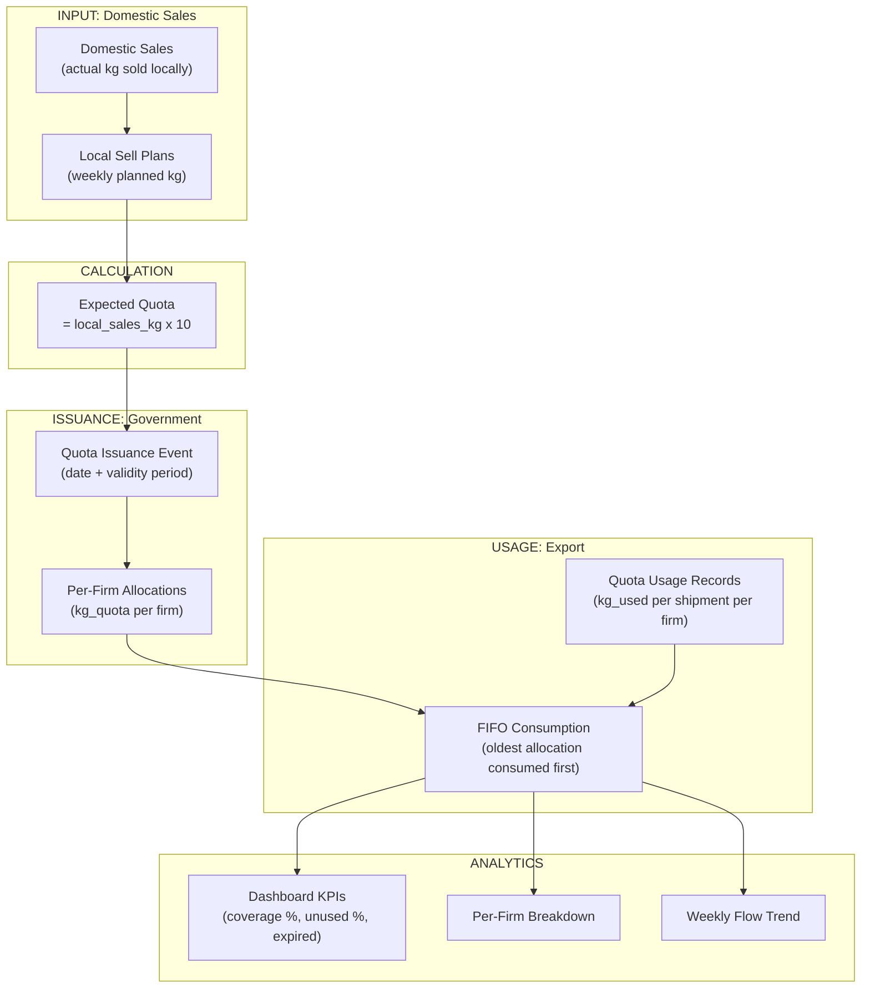
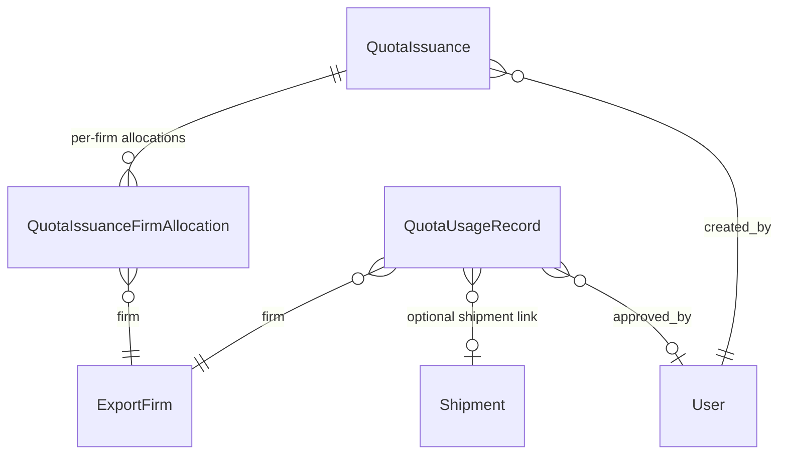

# Quota Management

## What Is This Process?

The Turkmenistan government issues export quotas based on how much each firm sells domestically. The rule: for every 1 kg sold domestically, the firm gets ~10 kg of export quota. Quotas expire (~1 month). When a firm exports tomatoes (shipment), quota is consumed. The system tracks issuance, allocation per firm, usage per shipment, and remaining balance using FIFO (oldest quota consumed first).

> [!important] Quota never crosses a season boundary (D11, ruled 2026-08-06)
> Both **display** and **consumption** stop at the season line. `/quota-issuances/`, `/quota-usage/` and `/quota-firm-balances/` are season-scoped (`?season=<id>`), and the FIFO walk only matches a season's usage against that same season's allocations — leftover issuance **expires with its season** rather than carrying forward. This reverses D10, which had exempted quota from read-scoping on the assumption that FIFO ran across seasons.
> 
> Two things to know before touching this code. **`QuotaUsageRecord` has no `season` FK and no `issuance` FK** — only `usage_date` and a nullable `shipment` (575 of 711 rows have no shipment) — so its season is derived by `services_quota.usage_season_q()`; use that helper rather than hand-rolling the predicate. Because the anchor is derived, `POST`/`PATCH` on `/quota-usage/` **400 when the row would land outside every season** (`season_of_usage()` is the row-level inverse, and the two must stay in step); the usage grid's month picker disables such months so the dead end is unreachable from the UI. And **an issuance whose `issue_date` falls in the gap between two seasons has `season = NULL` and is invisible on every list** (direct link only); `POST /quota-issuances/` now 400s during the close→open gap so no more can be created. `QuotaIssuance#34` on the dev database (25,000 kg, 2026-07-06, *Eziz Doganlar*) is one such row, awaiting an owner ruling.

## How It Works (Business Flow)

```mermaid
flowchart TD
    subgraph Input["INPUT: Domestic Sales"]
        DS["Domestic Sales\n(actual kg sold locally)"]
        LSP["Local Sell Plans\n(weekly planned kg)"]
    end
    
    subgraph Calculation["CALCULATION"]
        EXP["Expected Quota\n= local_sales_kg x 10"]
    end
    
    subgraph Issuance["ISSUANCE: Government"]
        QI["Quota Issuance Event\n(date + validity period)"]
        QA["Per-Firm Allocations\n(kg_quota per firm)"]
    end
    
    subgraph Usage["USAGE: Export"]
        QU["Quota Usage Records\n(kg_used per shipment per firm)"]
        FIFO["FIFO Consumption\n(oldest allocation consumed first)"]
    end
    
    subgraph Analytics["ANALYTICS"]
        KPI["Dashboard KPIs\n(coverage %, unused %, expired)"]
        PF["Per-Firm Breakdown"]
        WF["Weekly Flow Trend"]
    end
    
    DS --> LSP
    LSP --> EXP
    EXP --> QI
    QI --> QA
    QA --> FIFO
    QU --> FIFO
    FIFO --> KPI
    FIFO --> PF
    FIFO --> WF
```

### Three Data Streams

1. **Local Sell Plans** → `local_sales_kg` per firm per week (from [[local-sell-plan]])
2. **Quota Issuances** → `kg_quota` allocated per firm per issuance event (from government)
3. **Quota Usage** → `kg_used` consumed per firm per shipment (from [[shipment-lifecycle]] firm splits)

### FIFO Consumption Logic

When calculating how much of each allocation is consumed:
1. Per firm: sort all allocations by `issue_date` ASC (oldest first)
2. Sum total approved usage for that firm
3. Consume from oldest allocation first, then next, etc.
4. Result: each `allocation_id` has a `consumed_kg` amount

### Quota Expiry

Each issuance has a `validity` field:
- `this_month` — expires end of issue month
- `this_and_next` — expires end of month after issue month
- `next_month` — expires end of next month

Frontend computes expiry date from `issue_date + validity` and shows status: **active** (>7 days), **expiring** (0-7 days), **expired** (<0 days).

### Auto-Created Usage Records

Draft `QuotaUsageRecord` entries are auto-created any time a shipment's firm splits are set, via the shared `sync_draft_quota_usage_for_shipment(shipment, user)` service in `apps/export/services/quota_sync.py`:

| Trigger | Behavior |
|---------|----------|
| `POST /shipments/` (draft path) with `firm_splits` in body | Drafts created in the same atomic transaction as the shipment + splits |
| `POST /shipments/{id}/firm-splits/` | Existing drafts replaced; approved rows untouched (request rejected if any exist) |

Per-firm `kg_used` mirrors each firm's **actual `ShipmentFirmSplit.weight_kg`** — so changing a firm's split weight reassigns that firm's quota usage to the new number. It falls back to the admin-configurable `TruckSplitDefault` only when a split carries no weight (the firm-splits input allows `weight_kg` to be omitted, in which case the split itself is auto-filled from the same defaults):
- 1 firm: 18,100 kg
- 2 firms: 9,000 kg each
- 3+ firms: 18,100 / N kg each

**`usage_date`** = the real date encoded in the operator's **export code** (`DD` + 2-letter month + `NNN` + `/YY`, e.g. `12JN121/26` → 12 Jun 2026), parsed by `apps/export/services/export_code.py::parse_export_code_date`. `Shipment.date` is only the creation/import day, so it's the **fallback** when the export code is missing or unparseable. Operator month codes are English 2-letter (`JA FB MR AP MY JN JL AG SP OC NV DC` — note **November = NV**), distinct from the Turkmen scheme in the now-disabled `validators.py`. Manually-added usage records (no shipment) keep their user-picked date.

The Quota Usage **list view** shows a **Source** badge per row — `Auto` (created from a shipment, has a shipment code) vs `Manual` (user-entered, no shipment).

These drafts must be **approved** by export_manager/director before they count in FIFO calculations.

### Release-on-Delete Semantics

When a shipment is removed from the operational pool, its approved kg should return to the firm's available quota balance. This is implemented at the **aggregation layer** via `QuotaUsageRecord.objects.counted()` — a manager method that filters out rows tied to soft-deleted or cancelled shipments. Every FIFO / KPI / dashboard aggregation calls `.counted()` first.

| Action | Row state | Counts in FIFO? | Reversible? |
|--------|-----------|----------------|-------------|
| Shipment is alive | Approved row exists, `shipment.deleted_at IS NULL`, status != cancelled | ✅ Yes | — |
| `POST /shipments/{id}/soft-delete/` | Row preserved | ❌ No | ✅ `POST /restore/` re-counts the same row |
| `POST /shipments/{id}/cancel/` | Row preserved (draft rows deleted; approved rows kept) | ❌ No | Only via un-cancel transition |
| `POST /shipments/bulk-delete/` (admin) | **Row hard-deleted** (drafts + approveds) | ❌ No | ❌ Permanent — shipment is gone |
| `POST /shipments/{id}/hard-delete/` (admin, draft only) | **Row hard-deleted** (same cleanup as bulk-delete) | ❌ No | ❌ Permanent — draft is gone |
| Historical Excel import (no `shipment_id`) | Row exists, `shipment` is NULL | ✅ Yes | — |

Every action above busts **both** the `fifo_usage:*` and `quota_firm_balances:*` caches (both now keyed `:<product_type>:<season_id>` — `invalidate_quota_caches()` enumerates the seasons, since Django's default cache backend has no pattern-delete) via the canonical `invalidate_quota_caches()` (in `services/quota_sync.py`) so the firm's balance updates immediately — FIFO backs the dashboard/issuance list, `quota_firm_balances` backs the Sheet firm-split "no quota" hard-block, and any change to consumption or issuance moves both. Issuance create/update/delete call the same helper; `QuotaUsageViewSet.approve` defers it via `transaction.on_commit(...)` so the cache is dropped *after* the approval commits (avoiding a stale-repopulation race). The quota dashboard cache (60s TTL, parametrised by season/date) is left to expire on its own.

**Why hard-delete is different.** Soft-delete and cancel keep the row so restore / un-cancel can re-consume the kg automatically (including the approved status). Bulk-delete severs the shipment FK (`SET_NULL`), which `counted()` would treat as a historical import and re-include — so the action explicitly hard-deletes the usage rows before destroying the shipment.

## Database

### Tables

| Table | Purpose | Key Columns |
|-------|---------|-------------|
| `export.quota_issuances` | One government issuance event | `issue_date`, `product_type`, `validity`, `matched_week`, `matched_year` |
| `export.quota_issuance_firm_allocations` | Per-firm allocation within issuance | `issuance_id`, `export_firm_id`, `kg_quota` |
| `export.quota_usage_records` | Per-firm usage per shipment | `usage_date`, `export_firm_id`, `kg_used`, `shipment_id`, `status` (draft/approved) |

### Relationships

```mermaid
erDiagram
    QuotaIssuance ||--o{ QuotaIssuanceFirmAllocation : "per-firm allocations"
    QuotaIssuanceFirmAllocation }o--|| ExportFirm : "firm"
    QuotaUsageRecord }o--|| ExportFirm : "firm"
    QuotaUsageRecord }o--o| Shipment : "optional shipment link"
    QuotaIssuance }o--|| User : "created_by"
    QuotaUsageRecord }o--o| User : "approved_by"
```

### Key Constraints

- `(issuance, export_firm)` unique in allocations
- `kg_quota > 0` check constraint on allocations
- `kg_used > 0` check constraint on usage records
- Usage `status` is 'draft' or 'approved' — only approved records count in FIFO

## Backend Implementation

### Models

**File**: `backend/apps/export/models/quota.py`

**QuotaIssuance**:
- `issue_date`, `product_type` ('tomato'/'pepper'), `validity` ('this_month'/'this_and_next'/'next_month')
- `matched_week`, `matched_year` — auto-computed from `issue_date` ISO week on save, editable for manual reassignment
- `is_manually_reassigned` (bool) — if true, `save()` won't auto-recompute week
- `notes`, `created_at`, `created_by`
- **Property**: `total_kg` — aggregated sum of allocations

**QuotaIssuanceFirmAllocation**:
- `issuance` (FK CASCADE), `export_firm` (FK PROTECT), `kg_quota`

**QuotaUsageRecord**:
- `usage_date`, `export_firm` (FK PROTECT), `kg_used`, `product_type`, `notes`
- `shipment` (FK SET_NULL, nullable) — links to shipment, null for historical imports
- `status` ('draft'/'approved'), `approved_by` (FK User), `approved_at`
- `created_by`, `created_at`

**Helper**: `get_default_truck_weight(num_firms) → Decimal` — returns kg per firm for auto-created usage records

### Services

**File**: `backend/apps/export/services_quota.py`

| Function | Purpose |
|----------|---------|
| `fetch_plan_rows(date_from, date_to)` | Get WeeklyLocalSellPlan rows in date range |
| `fetch_issuances(date_from, date_to, product_type)` | Get QuotaIssuance with prefetched allocations |
| `aggregate_local_sales(plan_rows)` | Sum Mon-Sat plan_kg per firm → `dict[firm_id, Decimal]` |
| `aggregate_quota_issued(date_from, date_to, product_type)` | Sum kg_quota per firm → `dict[firm_id, Decimal]` |
| `aggregate_quota_used(date_from, date_to)` | Sum approved kg_used per firm → `dict[firm_id, Decimal]` |
| `compute_fifo_usage(product_type, season)` | Per firm FIFO **within one season** (D11): returns `dict[allocation_id, consumed_kg]` for that season's allocations only. `season=None` (the close→open gap) returns `{}` |
| `season_of_usage(shipment, usage_date)` | Row-level inverse of `usage_season_q()` — the one season a row belongs to, or `None`. Write paths reject `None` |
| `usage_season_q(season)` | The single definition of which `QuotaUsageRecord` rows belong to a season — `shipment.season` when linked, else `usage_date` inside the season's range. Used by FIFO, the firm balances, AND the `/quota-usage/` list, so the grid and the ledger can never disagree |
| `_compute_kpis(local_sales, quota_issued, quota_used)` | Top-level KPIs: local_sales_kg, expected_kg, issued_kg, not_given_kg/%, used_kg, unused_kg/% |
| `_build_per_firm(...)` | Per-firm breakdown rows with is_blocked flag |
| `_build_week_entry(year, week, ...)` | Single week entry with coverage_pct, firm breakdown |
| `build_quota_dashboard(date_from, date_to, product_type)` | Main orchestrator → `{kpis, per_firm, weekly_flow}` |

#### KPI Formulas

| KPI | Formula |
|-----|---------|
| `local_sales_kg` | Sum of local sell plan kg |
| `expected_kg` | `local_sales_kg * 10` |
| `issued_kg` | Sum of all quota allocations in period |
| `not_given_kg` | `expected_kg - issued_kg` |
| `not_given_pct` | `not_given_kg / expected_kg * 100` |
| `used_kg` | Sum of approved usage in period |
| `unused_kg` | `issued_kg - used_kg` |
| `unused_pct` | `unused_kg / issued_kg * 100` |

### Serializers

**File**: `backend/apps/export/serializers_quota.py`

**QuotaIssuanceFirmAllocationSerializer** (read):
- Fields: id, export_firm, export_firm_name, kg_quota, used_kg (from FIFO context)
- `used_kg` is injected from `context['usage_map']` — the FIFO consumption per allocation

**QuotaIssuanceSerializer** (read + update):
- Fields: id, issue_date, product_type, validity, matched_week, matched_year, is_manually_reassigned, notes, created_at, total_kg, allocations (nested)
- `update()`: accepts `allocations` list, deletes existing, bulk-creates replacements in transaction
- Auto-recomputes matched_week/year if not manually reassigned

**QuotaIssuanceCreateSerializer** (POST):
- Fields: issue_date, product_type, validity, notes, allocations
- `create()`: bulk-creates issuance with nested allocations in transaction
- Returns full QuotaIssuanceSerializer representation

**QuotaUsageRecordSerializer** (read/write):
- Fields: id, usage_date, export_firm, export_firm_name, kg_used, product_type, status, notes, shipment, shipment_code, approved_by/name, approved_at, created_by/name, created_at
- Status, approved_by, approved_at are read-only (set via approve action)

### ViewSet & Endpoints

**File**: `backend/apps/export/views_quota.py`

| Method | Endpoint | Action | Auth |
|--------|----------|--------|------|
| GET | `/api/v1/export/quota-issuances/` | List issuances | IsAuthenticated |
| POST | `/api/v1/export/quota-issuances/` | Create issuance with allocations | export_manager, director |
| PUT | `/api/v1/export/quota-issuances/{id}/` | Full update (replace allocations) | export_manager, director |
| DELETE | `/api/v1/export/quota-issuances/{id}/` | Delete issuance | export_manager, director |
| PATCH | `/api/v1/export/quota-issuances/{id}/reassign/` | Manual week reassignment | export_manager, director |
| GET | `/api/v1/export/quota-usage/` | List usage records | IsAuthenticated |
| PUT | `/api/v1/export/quota-usage/{id}/` | Edit (draft only) | IsAuthenticated |
| DELETE | `/api/v1/export/quota-usage/{id}/` | Delete (draft only) | IsAuthenticated |
| POST | `/api/v1/export/quota-usage/approve/` | Bulk approve drafts | export_manager, director |
| GET | `/api/v1/export/quota-dashboard/` | Dashboard analytics | `quota_issuance` view |
| GET | `/api/v1/export/quota-firm-balances/` | Per-firm remaining quota (firm-split soft warning) | `quota_issuance` view |

**Dashboard query params**: `season` (**optional** — defaults to the active season), `product_type` (default='tomato'), `date_from`, `date_to` (default: the resolved season's `start_date`/`end_date`)

> **Season resolution (fixed 2026-08-07)**: `?season=` goes through `resolve_season()` like every other read path (AD-16). It used to be read directly off the query string, so `closed_season.can_view` was never enforced — `document_team` and `loading_dept_head`(+deputy) hold `quota_issuance` but not `closed_season`, so they were 403'd on `/quota-issuances/?season=<closed>` yet could still read that season's aggregates here. Unknown id → **404** (was 400); closed season without `closed_season.can_view` → **403**; no season at all (the close→open gap) → the empty payload with its shape preserved (D7 fail-closed), not the just-closed season's numbers. Resolution runs **before** the 60s cache read, and the cache key carries `season.pk`. The page's own season filter (`QuotaDashboard.tsx`) hides closed seasons from anyone without the permission — see `seasonsVisibleTo()` in `QuotaDashboard.helpers.ts` — so the option that would 403 is never offered.
>
> `?date_from=`/`?date_to=` are **clamped** to the resolved season (`max`/`min`), not merely defaulted to it. A default alone left the gate bypassable — `build_quota_dashboard()` aggregates on dates alone, so sending a closed season's own range with **no** `?season=` passed the check on the active season and returned the closed season's numbers anyway (`document_team` holds `quota_issuance` but not `closed_season`, and the page's `RangePicker` has no season bounds). A window wholly outside the season inverts and reads as empty — fail closed.
>
> `build_quota_dashboard()` itself stays **date-driven**: the resolved season supplies the clamped window and the permission gate, not a `season` predicate on the aggregates. Pushing the FK in would change published numbers rather than just visibility and needs its own ruling — the clamp is what makes deferring that safe.

> **Permission note**: the read-only dashboard is gated by `DynamicResourcePermission` with `resource_code = 'quota_issuance'` (the resource it aggregates) — NOT a `'quota'` resource, which does not exist in `RESOURCE_REGISTRY`. Pointing it at the non-existent `'quota'` resource makes `get_resource_perm()` return `None` and 403s every non-superuser role; this was a real regression. The roles that hold `quota_issuance` view (export_manager, director, document_team, admin) are exactly those granted the `export.quota` page.

**Filters on issuances**: `?product_type=`, `?date_from=`, `?date_to=`
**Filters on usage**: `?status=`, `?product_type=`, `?date_from=`, `?date_to=`

### Firm-split "no quota" soft warning

When an operator assigns export firms to a shipment via the **Sheet `firm_splits` cell**, the editor flags any chosen firm that has **no remaining quota** — but never blocks the save (quota is *tracked*, not hard-enforced).

- **Endpoint**: `GET /api/v1/export/quota-firm-balances/?product_type=tomato` → `{ "<firm_id>": {issued_kg, used_kg, remaining_kg} }`. Service: `compute_firm_quota_balances(product_type, season)` in `services_quota.py`. `remaining_kg = issued − committed` for the **resolved** season (anchored on the `QuotaIssuance.season` FK and `usage_season_q()`, not a date range — D11), where **committed = draft + approved** usage (NOT approved-only like the dashboard). This is deliberate: assigning firm splits auto-creates *draft* usage rows that stay draft until document_team approves, so at assignment time drafts are the live commitment — counting approved-only would under-warn until after the decision is made. Firms with no allocation are absent (treated as zero). 60 s cache (`quota_firm_balances:<product_type>:<season_id>`), invalidated alongside the FIFO cache by the canonical `invalidate_quota_caches()` on **every** balance-moving action — issuance create/update/delete, firm-split assignment/edit, usage approval, and shipment cancel/restore/soft-delete.
- A firm is "no quota" when it is absent from the map **or** `remaining_kg <= 0` (covers both never-allocated and fully-used firms).
- **UI** (`SheetCellEditor.tsx`): firms with no quota are tagged `⚠ no quota` in the multi-select dropdown; committing a selection that *adds* such a firm shows a non-blocking `toast.warning` (`sheet.firm_no_quota_warning`). The split still saves.
- **Known limits (v1, deliberate)**: product type defaults to `tomato` (not on the sheet payload; pepper is a rare separate quota domain), and per-issuance **expiry** (`validity` month window) is *not* applied — this is a coarse "has any balance" signal, not the authoritative FIFO/expiry ledger. Only the Sheet firm-split cell is covered; backend create/`set_firm_splits` still does not block or warn.

## Frontend Implementation

### Page: QuotaDashboard

**File**: `frontend/src/pages/export/QuotaDashboard.tsx`

**Role-Based View**:
- `document_team`: sees "All Quotas" tab only (read-only)
- `export_manager` / `director`: all tabs + analytics
- `seller`: only "Local Sell Plan" section

**Filter Panel**:
| Filter | Component | Options |
|--------|-----------|---------|
| Season | Select | Available seasons |
| Product Type | Segmented | Tomato / Pepper |
| Period Mode | Segmented | Season / Month / Week / Custom |
| Month | MonthPicker | Months within selected season |
| Week | WeekPicker | W1-W52 |
| Date Range | RangePicker | Custom start-end dates |

**KPI Pipeline** (3 sections, left to right):

| Section | KPIs | Visual |
|---------|------|--------|
| INPUT | Local Sales (kg) | Blue number |
| ALLOCATION | Expected (kg), Issued (kg), Not Given (kg), Coverage % | Green/purple/red, progress bar |
| OUTCOME | Used (kg), Unused (kg), Expired Unused (kg) | Cyan/orange/red |

Coverage progress bar color: green >=80%, orange >=50%, red <50%.

**5 Tabs**:

| Tab | Component | What It Shows |
|-----|-----------|--------------|
| 1. Firm Breakdown | QuotaPerFirmTable | Per-firm table: sales_kg, expected, issued, used, diff, is_blocked |
| 2. Firm Chart | QuotaVisualBars | Bar chart visualization of firm allocations |
| 3. Weekly Trend | QuotaWeeklyFlow | Week-by-week issuance trend with coverage % |
| 4. Issuance Log | QuotaIssuancesList | Detailed allocation table (see below) |
| 5. Quota Usage | QuotaUsageTab | Usage records with approval workflow (see below) |

### Sub-Page: QuotaIssuancesList

**File**: `frontend/src/pages/export/QuotaIssuancesList.tsx`

Flattens nested allocations into individual rows.

**Columns**:
| # | Column | Width | Notes |
|---|--------|-------|-------|
| 1 | Allocation ID | 60px | |
| 2 | Firm Name | 160px | Bold, sortable |
| 3 | Issued (kg) | 120px | Right-aligned, sortable |
| 4 | Used (kg) | 120px | Right-aligned, sortable |
| 5 | Usage Bar | 130px | Progress %, color: green >=80%, orange >=30%, red <30% |
| 6 | Issue Date | 110px | Sortable |
| 7 | Expiry Date | 110px | Computed from issue_date + validity, sortable |
| 8 | Status | 100px | active (green) / expiring (gold) / expired (red) |
| 9 | Days Left | 100px | "X days" / "expired X days ago" / "expires today" |
| 10 | Batch ID | 65px | Issuance ID, sortable |
| 11 | Actions | 60px | Delete button (if permission) |

**Status logic**: active (>7 days left), expiring (0-7 days), expired (<0 days)

**Sorting**: Default sort by status (active→expiring→expired), then by issue_date descending.

### Sub-Page: QuotaUsageTab

**File**: `frontend/src/pages/export/QuotaUsageTab.tsx`

**Columns**:
| # | Column | Width | Notes |
|---|--------|-------|-------|
| 1 | Usage Date | 110px | |
| 2 | Firm Name | 160px | Bold |
| 3 | Shipment Code | 130px | Optional link |
| 4 | Kg Used | 130px | **Inline-editable** InputNumber if draft + canEdit |
| 5 | Product Type | 100px | tomato/pepper |
| 6 | Status | 110px | draft (pencil icon) / approved (checkmark icon) |
| 7 | Created By | 120px | |
| 8 | Approved By | 120px | |
| 9 | Delete | 50px | Only for draft records |

**Toolbar**:
- Status filter dropdown: all / draft / approved
- Record count + "X pending draft" note
- **Bulk Approve** button (shows count, only if drafts selected and canEdit)

**Inline Edit**: Click kg_used cell → InputNumber → blur saves (PATCH)

**Bulk Approve**: Select draft rows via checkboxes → click Approve → POST `/quota-usage/approve/` with ids

### Hooks

| Hook | Endpoint | Params | Returns | Stale Time |
|------|----------|--------|---------|------------|
| `useQuotaDashboard` | `GET /export/quota-dashboard/` | season (from the page's own picker, which hides closed seasons the user may not view), date_from, date_to, product_type | `IQuotaDashboardResponse` | 60s |
| `useQuotaIssuances` | `GET /export/quota-issuances/` | product_type, date_from, date_to | `IQuotaIssuance[]` | 60s |
| `useQuotaUsageRecords` | `GET /export/quota-usage/?page_size=2000` | status, product_type, date_from, date_to | `IQuotaUsageRecord[]` | 30s |
| `useBulkApproveQuotaUsage` | `POST /export/quota-usage/approve/` | `{ids: []}` | `{approved: number}` | mutation |

### TypeScript Types

**`IQuotaDashboardResponse`**: `{kpis: IQuotaDashboardKPIs, per_firm: IQuotaDashboardFirm[], weekly_flow: IQuotaWeeklyFlowEntry[]}`

**`IQuotaDashboardKPIs`**: local_sales_kg, expected_kg, issued_kg, not_given_kg, not_given_pct, used_kg, unused_kg, unused_pct

**`IQuotaIssuance`**: id, issue_date, product_type, validity, matched_week, matched_year, notes, total_kg, allocations[] (each: id, export_firm, export_firm_name, kg_quota, used_kg)

**`IQuotaUsageRecord`**: id, usage_date, export_firm, export_firm_name, kg_used, product_type, status, shipment_code, approved_by_name, created_by_name

## Roles & Permissions

| Role | Dashboard | Create Issuance | Edit Usage | Approve Usage | Delete |
|------|-----------|----------------|------------|---------------|--------|
| `export_manager` | Full | Yes | Yes | Yes | Yes |
| `director` | Full | Yes | Yes | Yes | Yes |
| `document_team` | Read-only tab | No | No | No | No |
| `seller` | Local Sell Plan only | No | No | No | No |
| Others | No access | No | No | No | No |

## Connections to Other Processes

- **[[local-sell-plan]]** — Local sales kg is the **input** to quota calculation (× 10 = expected quota)
- **[[shipment-lifecycle]]** — Setting firm splits on a shipment auto-creates **draft** usage records; approved usage consumes quota via FIFO
- **[[domestic-sales]]** — Historical domestic sales data feeds into local sell plan figures
