# Realtime Presence

## What Is This Process?

A WebSocket-driven indicator showing **which users are currently viewing the [[../screens/shipment-sheet|Shipment Sheet]]** — small coloured avatars in the sheet toolbar, Google-Sheets style. The Sheet is the only screen where multiple roles (warehouse_chief, export_manager, document_team) typically edit overlapping cells within the same hour, so collision-awareness has real operational value.

Phase 1 (plumbing) shipped first; Phase 2 (this doc) layers presence on top.

> Replaces — nothing. This is net-new infrastructure. Until now the whole app was polling-only (notifications every 60 s, comments every 30 s). Presence is the first feature that demanded push.

## How It Works (Business Flow)

```mermaid
flowchart LR
    A["User opens Sheet"] --> B["usePresenceSheet() fires"]
    B --> C["WS frame: presence.sheet / join"]
    C --> D["AppConsumer adds channel<br/>to presence.sheet group"]
    D --> E["Redis hash presence:sheet<br/>updated with user metadata"]
    E --> F["Group broadcast:<br/>type=presence.sheet.roster"]
    F --> G["Every other Sheet viewer's<br/>WS receives the frame"]
    G --> H["realtimeStore.sheetRoster set"]
    H --> I["PresenceAvatars re-renders<br/>new avatar appears"]
```



Leave (unmount, tab close, or WS drop) takes the same path in reverse — `leave_sheet()` removes the channel from the group and the Redis hash, then re-broadcasts the shrunken roster.

## Architecture

### One socket per browser tab

Opened in [`AppLayout`](../../../frontend/src/components/AppLayout.tsx) the moment `useAuth()` resolves; closed on logout or `beforeunload`. Multiplexes channels via the envelope `{channel, type, payload}` so future features (work-time logging, push notifications) can ride the same connection.

Path: `ws://<host>/ws/app/` (`wss://` over HTTPS). Cookies travel with the handshake automatically — no JS-side token plumbing.

### Server topology

- **gunicorn** supervises **uvicorn workers** (set in `backend/Dockerfile`).
- Same uvicorn worker handles both `/api/` HTTP and `/ws/` WebSocket on port 8000.
- **nginx** ([`frontend/nginx.conf`](../../../frontend/nginx.conf)) forwards `/ws/` with `Upgrade` + `Connection` headers and a 3600 s read timeout (so an idle WS isn't reaped between heartbeats — relevant when Phase 3 work-time logging lands).

### Channel layer

`channels-redis` backed by the existing `redis:7-alpine` service (`docker-compose.yml`). Tests use `channels.layers.InMemoryChannelLayer` (auto-selected when `RUNNING_TESTS`).

### Presence state

Lives in **one Redis hash** keyed by `presence:sheet`, mapping each WS `channel_name` → JSON of `{user_id, username, name, role, color, joined_at}`. Channel-layer group membership (`presence.sheet`) drives broadcast; the hash carries the metadata. Both are wiped on consumer disconnect, so a crashed daphne/uvicorn worker leaves no stale roster.

For tests, an in-process dict mirrors the same API — see `_memory_roster` in [`backend/apps/core/services/presence.py`](../../../backend/apps/core/services/presence.py).

### Room scoping — one global room

Group name is the literal `presence.sheet`. Only one season is active at a time and the Sheet shows that season; filtering presence by season filter or column-set would split rooms artificially ("why don't I see Bahar when she's right there?"). One room, period.

## Code Map

| Concern | File |
|---------|------|
| WS routing | [`backend/config/routing.py`](../../../backend/config/routing.py) |
| ASGI app | [`backend/config/asgi.py`](../../../backend/config/asgi.py) |
| Cookie-JWT WS auth | [`backend/apps/core/channels_auth.py`](../../../backend/apps/core/channels_auth.py) |
| AppConsumer (multiplex) | [`backend/apps/core/consumers.py`](../../../backend/apps/core/consumers.py) |
| Presence service | [`backend/apps/core/services/presence.py`](../../../backend/apps/core/services/presence.py) |
| Integration tests | [`backend/apps/core/tests/test_app_consumer.py`](../../../backend/apps/core/tests/test_app_consumer.py) |
| WS client singleton | [`frontend/src/services/realtime.ts`](../../../frontend/src/services/realtime.ts) |
| Realtime store | [`frontend/src/stores/realtimeStore.ts`](../../../frontend/src/stores/realtimeStore.ts) |
| `useRealtime` (mount) | [`frontend/src/hooks/useRealtime.ts`](../../../frontend/src/hooks/useRealtime.ts) |
| `usePresenceSheet` | [`frontend/src/hooks/usePresenceSheet.ts`](../../../frontend/src/hooks/usePresenceSheet.ts) |
| Avatar group UI | [`frontend/src/components/PresenceAvatars.tsx`](../../../frontend/src/components/PresenceAvatars.tsx) |
| Connection dot (WS-aware) | [`frontend/src/components/ConnectionStatus.tsx`](../../../frontend/src/components/ConnectionStatus.tsx) |

## Edge Cases Handled

| Case | Handling |
|---|---|
| Tab refresh | `beforeunload` closes the WS → consumer's `disconnect()` calls `leave_sheet()`. Stale channel never lingers. |
| Browser kill / crash | TCP RST → channel layer evicts the channel; the hash still holds the entry but it's never broadcast to anyone (no one's in the room any more). Phase 3's reaper will clean the orphan as a side effect; until then it's harmless. |
| WS drop with browser still online | Reconnect with exponential backoff (1 s → 2 s → … cap 30 s). On `open`, `usePresenceSheet` re-emits `join` so the user re-enters the roster. |
| Browser offline | Reconnect deferred until `navigator.onLine === true` fires. Connection-status dot goes yellow → red. |
| Auth failure (cookie expired) | Server closes with code 4401. Client treats this as terminal (no reconnect); user has to log in again. |
| Multi-tab same user | Each tab has its own WS and own roster entry. User sees themselves once via the `(you)` marker; other viewers see two entries. Acceptable — same as Google Docs. |

## Verification

End-to-end checks for Phase 2:

1. **Two browsers**: log in as user A in Chrome → Sheet. Log in as user B in Firefox → Sheet. Within ~1 s, A's toolbar shows B's avatar and vice versa.
2. **Leave**: close B's tab → A's roster drops B within ~1 s. Reopen → B reappears.
3. **Scope**: B on Sheet, A on Dashboard → A sees nothing; B sees only themselves. Navigate A to Sheet → A appears in B's roster.
4. **Reconnect**: kill the backend container while a tab is open. Connection dot goes yellow. Restart backend → dot returns green within ~5 s. Roster recovers.
5. **Auth gate**: from devtools open `ws://…/ws/app/` with cookies cleared → server closes with 4401.

## Backend Tests

[`backend/apps/core/tests/test_app_consumer.py`](../../../backend/apps/core/tests/test_app_consumer.py) — 5 cases:

1. Anonymous handshake → 4401.
2. Cookie-JWT handshake → `system.connected` frame.
3. `system.ping` → `system.pong`.
4. Two clients join → both receive a roster including both users.
5. One client disconnects → the other receives a shrunken roster.

```bash
python manage.py test apps.core.tests.test_app_consumer
```

## Future Work (Tracked)

- **Phase 3 — work-time logging.** Reuses the same WS; adds `worklog.heartbeat` channel and a `core.work_sessions` table. Decisions already locked in: every user can see everyone's hours, "tab open at all" counts as working, reaper runs as a cron-driven management command.
- **Cell-cursor sharing.** Show "user B is editing `weight_net` on row 47" as a coloured ring around the cell. Same WS, new channel `presence.sheet.cursor`.
- **Push notifications.** Retire the 60 s `useNotifications` poll once the WS is proven in production.
