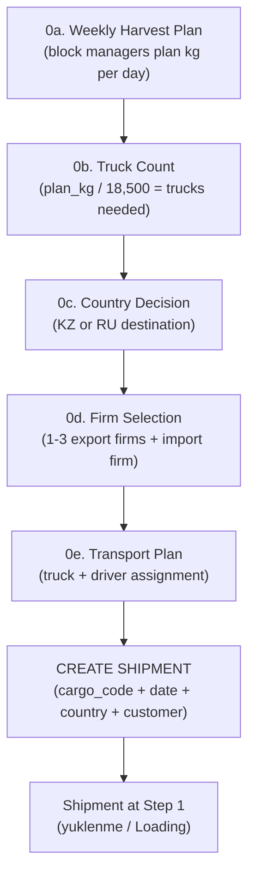

# Shipment Creation

## What Is This Process?

Before a shipment exists in the system, a 5-stage pre-shipment planning flow happens. The actual creation in the system is the final step — a user fills a modal form and the system creates a Shipment at step 1 (yuklenme/Loading) with the initial audit trail.

## How It Works (Business Flow)



**Key facts**:
- Stages 0a-0e happen outside the system (verbal/Excel-based decisions)
- Only the final "Create Shipment" action enters the system
- Cargo code format: `DDMM###/YY` (e.g., `0201045/25` = Feb 1st, shipment 045, year 2025)
- Standard truck capacity: 18,500 kg
- `is_gapy_satys` (side sales) trucks can exceed standard capacity

## Database

The creation writes to:

| Table | What's Written |
|-------|---------------|
| `export.shipments` | New row with cargo_code, date, season, country, customer, status=yuklenme, loading_started_at=now |
| `export.shipment_status_log` | Initial entry: status=yuklenme, comment="Shipment created" |

### Cargo Code Uniqueness

`cargo_code` has a `UNIQUE` constraint. Attempting to create a duplicate returns a 400 error.

## Backend Implementation

### Service: `create_shipment()`

**File**: `backend/apps/export/services.py`

```
create_shipment(cargo_code, date, user, country=None, customer=None, season=None) → Shipment
```

**Logic**:
1. If no season provided → resolve `Season.objects.filter(is_active=True).first()` → raises `ValueError` if none active
2. Look up `ShipmentStatusType` with `step_order=1` (yuklenme) → raises `ValueError` if not found
3. `Shipment.objects.create(cargo_code=cargo_code, date=date, country=country, customer=customer, season=resolved_season, status=first_status, created_by=user)`
4. Set `loading_started_at = timezone.now()` and `save(update_fields=['loading_started_at'])`
   - Note: Can't use `transition_to()` here because shipment is created WITH status already set
5. Create `ShipmentStatusLog(shipment=shipment, status=first_status, changed_by=user, comment='Shipment created')`
6. Return shipment

### ViewSet

**File**: `backend/apps/export/views.py` — `ShipmentViewSet.create()`

| Method | Endpoint | Auth |
|--------|----------|------|
| POST | `/api/v1/export/shipments/` | `export_manager` or `director` only |

**Request payload**:
```json
{
  "cargo_code": "0201045/25",
  "date": "2025-02-01",
  "country": 1,
  "customer": 5,
  "season": null
}
```

**Response**: Full ShipmentDetail serializer (same as GET detail).

**Errors**:
- 400: Duplicate cargo_code, invalid format, no active season
- 403: Role not allowed to create

## Frontend Implementation

### Component: ShipmentCreateModal

**File**: `frontend/src/components/ShipmentCreateModal.tsx`

**Props**: `open: boolean`, `onClose: () => void`, `onSuccess: () => void`

**Form Fields**:
| Field | Component | Required | Notes |
|-------|-----------|----------|-------|
| cargo_code | Input | Yes | Format validation: DDMM###/YY |
| date | DatePicker | Yes | Default: today |
| country | CountrySelect | No | Self-fetching dropdown |
| customer | CustomerSelect | No | Self-fetching dropdown |
| season | - | No | Auto-resolved by backend |

**On Submit**:
1. POST to `/api/v1/export/shipments/` with form data
2. On success: show toast, close modal, invalidate shipments cache (`onSuccess`)
3. On error: display validation errors in form

**Visibility**: Only shown if user has `shipment.create` resource permission (checked via `canDo('shipment', 'create')`)

### Where It's Triggered

The create button appears on:
- **ShipmentList** page — top-right action button
- Only visible to `export_manager` and `director` roles

### TypeScript Types

```typescript
// Create payload (sent to API)
interface IShipmentCreatePayload {
  cargo_code: string;
  date: string;       // ISO date
  country?: number;   // Country ID
  customer?: number;  // Customer ID
}
```

## Roles & Permissions

| Role | Can Create | Notes |
|------|-----------|-------|
| `export_manager` | Yes | Primary creator |
| `director` | Yes | Oversight access |
| All others | No | Cannot create shipments |

## Connections to Other Processes

- **[[weekly-harvest-planning]]** — Plan kg determines how many trucks are needed (pre-system planning)
- **[[truck-allocation]]** — Trucks allocated per day feed into how many shipments can be created
- **[[shipment-lifecycle]]** — Created shipment starts at step 1 (yuklenme), then follows the 13-step state machine
