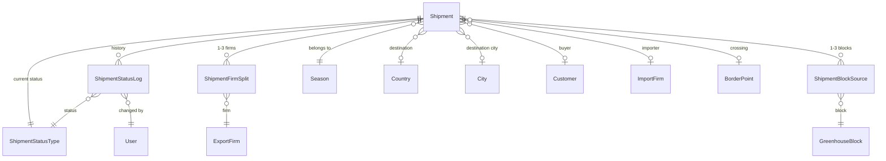

# Shipment Lifecycle

## What Is This Process?

The shipment lifecycle is the **central process** of the YGT Platform. Every truck load of tomatoes leaving the Turkmenistan greenhouses goes through a 13-step state machine from Loading to Completed. Each step is owned by a specific role, and transitioning between steps writes an immutable audit trail.

One Shipment = one truck load. The cargo code (format `DDMM###/YY`) is the universal identifier used across all systems (Logo Tiger ERP, Trip Management, GPS tracking).

## How It Works (Business Flow)

```mermaid
stateDiagram-v2
    direction LR
    
    [*] --> yuklenme: Create shipment
    
    state "LOADING Phase" as loading {
        yuklenme: 1. Yuklenme (Loading)
        gumruk_girish: 2. Gumruk Girish (Customs Entry)
    }
    
    state "CUSTOMS Phase" as customs {
        gumruk_chykysh: 3. Gumruk Chykysh (Customs Exit)
        yola_chykdy: 4. Yola Chykdy (Departed)
    }
    
    state "TRANSIT Phase" as transit {
        serhet_tm: 5. Serhet TM (TM Border)
        serhet_gechdi: 6. Serhet Gechdi (Border Crossed)
        barysh_gumrugi: 7. Barysh Gumrugi (Dest. Customs)
    }
    
    state "BORDER Phase" as border {
        yolda: 8. Yolda (En Route)
        bardy: 9. Bardy (Arrived)
    }
    
    state "SALES Phase" as sales {
        satylyar: 10. Satylyar (Selling)
        satyldy: 11. Satyldy (Sold)
        hasabat: 12. Hasabat (Report)
    }
    
    tamamlandy: 13. Tamamlandy (Completed)
    
    yuklenme --> gumruk_girish
    gumruk_girish --> gumruk_chykysh
    gumruk_chykysh --> yola_chykdy
    yola_chykdy --> serhet_tm
    serhet_tm --> serhet_gechdi
    serhet_gechdi --> barysh_gumrugi
    barysh_gumrugi --> yolda
    yolda --> bardy
    bardy --> satylyar
    satylyar --> satyldy
    satyldy --> hasabat
    hasabat --> tamamlandy
    tamamlandy --> [*]
```

### Transition Rules

Each transition is strictly linear (no skipping steps, no going back). The `TRANSITIONS` dict in `services.py` defines which role can trigger each transition:

| Step | Code | Name (TM) | Required Role | AD-1 Timestamp Field |
|------|------|-----------|---------------|---------------------|
| 1 | `yuklenme` | Loading | `warehouse_chief` | `loading_started_at` |
| 2 | `gumruk_girish` | Customs Entry | `warehouse_chief` | `customs_entry_at` |
| 3 | `gumruk_chykysh` | Customs Exit | `document_team` | `customs_exit_at` |
| 4 | `yola_chykdy` | Departed | `document_team` | `departed_at` |
| 5 | `serhet_tm` | TM Border | `transport` | _(no AD-1 field)_ |
| 6 | `serhet_gechdi` | Border Crossed | `transport` | `border_crossed_at` |
| 7 | `barysh_gumrugi` | Dest. Customs | `sales_rep` | _(no AD-1 field)_ |
| 8 | `yolda` | En Route | `sales_rep` | _(no AD-1 field)_ |
| 9 | `bardy` | Arrived | `sales_rep` | `arrived_at` |
| 10 | `satylyar` | Selling | `sales_rep` | `sale_started_at` |
| 11 | `satyldy` | Sold | `sales_rep` | `sale_ended_at` |
| 12 | `hasabat` | Report | `sales_rep` | _(no AD-1 field)_ |
| 13 | `tamamlandy` | Completed | `finansist` | _(no AD-1 field)_ |

**Privileged roles**: `export_manager` and `director` can trigger **any** transition regardless of the required role.

### Cancellation (the one off-ramp)

The forward chain is linear, but a shipment can be **cancelled** from any non-terminal status (everything except `tamamlandy`). `cancelled` is a 14th terminal status (`step_order=99`, `phase='CANCELLED'`) — once cancelled it has no outgoing edges and never auto-advances (its `trigger_field` is null). See [[../../ADR#ADR-019]] for the decision record.

- **Endpoint**: `POST /api/v1/export/shipments/{id}/cancel/` with body `{ "reason": "<non-empty>" }`. A dedicated action, not `/transition/`, so the reason is mandatory and the destructive UI stays separate from the forward TransitionButton.
- **Who**: `export_manager` and `director` only (the `PRIVILEGED_ROLES`). All other roles get 403.
- **Reason**: required free-text, stored as the `ShipmentStatusLog` comment on the cancel transition — no extra schema column.
- **Side effects**: open / in-progress / blocked `Task` rows on the shipment are bulk-set to `CANCELLED`; comments are preserved; draft `QuotaUsageRecord` rows are deleted and approved ones are surfaced in the response (`draft_quota_deleted`, `approved_quota_to_reconcile`) for manual reconciliation.
- **Visibility**: cancelled shipments are excluded from the operational list by default — reveal them with `?show_cancelled=true` or an explicit `?status_code=cancelled` filter. They never appear on the Kanban board (no `CANCELLED` phase column). Detail pages remain reachable.

`cancelled` is not included in `allowed_transitions`, so the forward TransitionButton never offers it.

## Database

### Tables

| Table | Schema | Purpose | Key Columns |
|-------|--------|---------|-------------|
| `export.shipments` | export | Main shipment record (1 per truck) | `code` (cargo_code), `status_id`, 8 AD-1 timestamps, weight, transport, finance |
| `export.shipment_status_log` | export | Audit trail (1 row per transition) | `shipment_id`, `status_id`, `changed_by_id`, `changed_at`, `comment` |
| `core.shipment_status_types` | core | 13 status definitions | `code`, `step_order`, `phase`, `name_tk/en/ru` |
| `export.shipment_firm_splits` | export | 1-3 export firms per shipment | `shipment_id`, `export_firm_id`, `weight_kg`, `amount_usd` |
| `export.shipment_block_sources` | export | Source greenhouse blocks | `shipment_id`, `block_id`, `weight_kg` |

### Relationships

### Key Constraints

- `cargo_code` is **unique** across all shipments
- `(shipment, export_firm)` is unique in firm_splits
- `(shipment, block)` is unique in block_sources
- All FKs to reference tables use `on_delete=PROTECT` (can't delete a country that has shipments)
- AD-1 timestamp fields are nullable (only set when shipment reaches that step)

## Backend Implementation

### Models

**File**: `backend/apps/export/models/shipment.py`

**Shipment** — 30+ fields organized by purpose:

| Group | Fields | Notes |
|-------|--------|-------|
| Identifiers | `cargo_code` (CharField, unique, db_column='code'), `date`, `season` (FK) | Cargo code is the universal key |
| Geography | `country`, `city`, `border_point`, `loading_location` (all FK, nullable) | Destination info |
| Customer | `customer` (FK), `import_firm` (FK) | Buyer and importing company |
| Product | `product_type`, `variety` (FKs, nullable) | What's being shipped |
| Weight | `weight_gross` (db_column='weight_gross_kg'), `weight_net` (db_column='weight_net_kg'), `packaging_kg`, `pallet_count`, `pallet_weight_kg`, `box_count`, `rejected_weight_kg` | All DecimalField, nullable |
| Transport | `truck_head_id`, `trailer_id`, `driver_id`, `trip_id` (raw BigIntegerField — Trip Mgmt not Django-managed), `vehicle_responsible`, `transport_temp_c`, `transit_days`, `shelf_life_days`, `has_peregruz`, `peregruz_city`, `peregruz_date` | Transport details |
| Status | `status` (FK to ShipmentStatusType), `is_gapy_satys` (bool) | Current lifecycle step |
| Operational | `customs_clearance`, `documents_status`, `harvest_status` (CharFields) | Sheet row status codes |
| Finance | `price_per_kg`, `total_amount_usd` (DecimalField) | Pricing |
| AD-1 Timestamps | `loading_started_at`, `customs_entry_at`, `customs_exit_at`, `departed_at`, `border_crossed_at`, `arrived_at`, `sale_started_at`, `sale_ended_at` | **Written ONLY by `transition_to()`** |
| AD-2 Vehicle | `vehicle_condition` (choices: OK/ISSUE/BREAKDOWN/RETURNED), `vehicle_condition_note`, `route_note`, `vehicle_status_note` (DEPRECATED) | Structured replacement for free-text |
| Audit | `created_by`, `updated_by` (FK User), `created_at`, `updated_at`, `notes` | Tracking |

**ShipmentStatusLog** — one row per transition:
- `shipment` (FK CASCADE), `status` (FK PROTECT), `changed_by` (FK PROTECT), `changed_at` (auto), `comment`, `is_manual_override`

**ShipmentFirmSplit** — 1-3 export firms per shipment:
- `shipment` (FK CASCADE), `export_firm` (FK PROTECT), `weight_kg`, `amount_usd`, `invoice_number`, `split_order`

**ShipmentBlockSource** — source greenhouse blocks:
- `shipment` (FK CASCADE), `block` (FK PROTECT), `weight_kg`

### Services

**File**: `backend/apps/export/services.py`

#### `transition_to(shipment, new_status_code, user, comment='')`

**The ONLY function that may update `shipment.status` and AD-1 timestamp fields.**

Logic:
1. Get current status code (or `None` if no status)
2. Look up allowed transitions from `TRANSITIONS[current_code]`
3. Validate that `new_status_code` is in allowed list → raises `ValueError` if not
4. Check user role permission (privileged roles bypass) → raises `PermissionError` if denied
5. Look up `ShipmentStatusType` by code → raises `ValueError` if not found
6. Set `shipment.status = new_status`, `shipment.updated_by = user`, `shipment.updated_at = now`
7. If status has AD-1 timestamp mapping → set that field to `now`
8. `shipment.save(update_fields=[...])` — explicit fields only
9. Create `ShipmentStatusLog` entry with comment
10. Create `AuditLog` entry (immutable trail)
11. Log the transition

#### `create_shipment(cargo_code, date, user, country=None, customer=None, season=None)`

Creates a new shipment at step 1 (yuklenme):
1. Resolve active season if not provided
2. Look up step_order=1 status (yuklenme)
3. `Shipment.objects.create(...)` with status=yuklenme
4. Set `loading_started_at = now` (AD-1 for first step — can't use transition_to here)
5. Create initial `ShipmentStatusLog` entry
6. Return new Shipment

### Serializers

**File**: `backend/apps/export/serializers.py`

- **ShipmentListSerializer** (read-only, lightweight): cargo_code, date, status + status_display, country_name, customer_name, weight_net, weight_gross, departed_at, arrived_at, is_gapy_satys, updated_at
- **ShipmentDetailSerializer** (read-only, full): all list fields + firm_splits (nested), block_sources (nested), status_log (nested), comments (nested), quality (nested), sales_report, editable_fields, allowed_transitions
- **ShipmentCreateSerializer** (write): cargo_code, date, country, customer, season
- **ShipmentPatchSerializer** (write, role-based): dynamically restricts writable fields based on user's role field permissions

### ViewSet & Endpoints

**File**: `backend/apps/export/views.py` — `ShipmentViewSet`

| Method | Endpoint | Action | Auth |
|--------|----------|--------|------|
| GET | `/api/v1/export/shipments/` | List (paginated, filterable) | IsAuthenticated |
| GET | `/api/v1/export/shipments/{id}/` | Detail | IsAuthenticated |
| POST | `/api/v1/export/shipments/` | Create | export_manager, director |
| PATCH | `/api/v1/export/shipments/{id}/` | Partial update | Role-based field restrictions |
| POST | `/api/v1/export/shipments/{id}/transition/` | Status transition | Per-step role check |
| GET | `/api/v1/export/shipments/overdue/` | Overdue shipments | IsAuthenticated |
| GET | `/api/v1/export/shipments/sheet/` | Sheet view (all, no pagination) | IsAuthenticated |
| PATCH | `/api/v1/export/shipments/{id}/quality/` | Set quality docs | export_manager, document_team, director |
| POST | `/api/v1/export/shipments/{id}/comment/` | Add comment | IsAuthenticated |
| POST | `/api/v1/export/shipments/{id}/sales-report/` | Set/update sales report | sales_rep, export_manager, director (step >= 12) |
| POST | `/api/v1/export/shipments/{id}/block-sources/` | Replace block sources | IsAuthenticated |
| POST | `/api/v1/export/shipments/{id}/firm-splits/` | Replace firm splits | IsAuthenticated |

### Custom Actions Detail

**`transition(POST)`**: Receives `{new_status: "gumruk_girish", comment: "Docs ready"}`. Calls `transition_to()`. Returns updated shipment detail. Errors: 400 (invalid transition), 403 (wrong role).

**`my_work filter`**: `?my_work=true` restricts results by `ROLE_PHASE_MAP`:
- `warehouse_chief` → LOADING phase only
- `document_team` → LOADING + CUSTOMS
- `transport` → LOADING + CUSTOMS + TRANSIT
- `sales_rep` → BORDER + SALES
- `finansist`, `export_manager`, `director` → all phases

**`overdue(GET)`**: `?threshold=N` returns SALES-phase shipments stuck for >N days (calculated as `today - arrived_at`).

**`set_firm_splits(POST)`**: Replaces all firm splits. **Also auto-creates draft QuotaUsageRecord entries** for each firm using `get_default_truck_weight()` — this is the bridge to [[quota-management]].

## Frontend Implementation

### Pages

The shipment lifecycle is displayed across **5 different views**, each optimized for a different workflow:

#### 1. ShipmentList (`frontend/src/pages/export/ShipmentList.tsx`)

**Purpose**: Primary list view for finding and monitoring shipments.

**Columns Displayed**:
| # | Column | Width | Notes |
|---|--------|-------|-------|
| 1 | Cargo Code | 140px | Monospace, clickable → detail page |
| 2 | Customer Name | 150px | |
| 3 | Country | 130px | With flag emoji |
| 4 | Status | 150px | StatusTag component (color-coded by phase) |
| 5 | Weight Net | 120px | Right-aligned, thousands formatted, responsive md+ |
| 6 | Departed At | 130px | Format: DD.MM.YY HH:mm |
| 7 | Arrived At | 130px | Format: DD.MM.YY HH:mm, responsive md+ |

**Filters**:
- Search input (cargo_code, customer_name)
- Phase dropdown (planlanyan, yuklenme, bardy, gumruk_girish, satylyor, satyldy, tamamlandy)
- View mode segmented: "All" vs "My Work"
- Page size: 20 / 50 (default) / 100

**Actions**:
- Create shipment button → opens ShipmentCreateModal (if user has `shipment.create` permission)
- Export to Excel button
- Row click → navigates to `/shipments/{id}`

#### 2. ShipmentDetail (`frontend/src/pages/export/ShipmentDetail.tsx`)

**Purpose**: Full shipment information with 4 tabs.

**Layout**: 2-column grid (main content 1fr + sidebar 340px on md+, single column on mobile)

**Tab 1 — Overview**:
- Logistika section: customer, firm_splits, import_firm, country, loading_point
- Transport section: vehicle, driver, transport_firm, border_point, current_location
- Haryt (Goods) section: block_sources, variety, harvest_date, weight_net, weight_gross, pallets
- Hil (Quality) section: transit_days, temperature

**Tab 2 — Document**:
- Quality certificate checkboxes (editable if permitted): azyk_maglumatnama, suriji_gozukdiriji, hil_sertifikaty, kalibrowka_analiz
- Logistics timestamps timeline: loading_started_at through sale_ended_at

**Tab 3 — Finance**:
- Weight & price summary, firm splits table, sales report form (only at step >= 12)

**Tab 4 — History**:
- Visual status route (13 steps with checkmarks/current/pending indicators)
- Status log entries with timestamps and user
- Comments section with CommentComposer

**Right Sidebar**:
- Status route card: visual 13-step progress
- External links: Logo Tiger, Trip Management, GPS Tracking

#### 3. ShipmentSheet (`frontend/src/pages/export/ShipmentSheet.tsx`)

**Purpose**: Excel-like spreadsheet view for bulk data entry.
- Fetches ALL active-season shipments via `useShipmentSheet()` (no pagination)
- `SheetGrid` component with inline cell editing
- Zustand `SheetStore` manages: searchText, showGapyOnly
- Filters in memory by cargo_code and customer_name

#### 4. ShipmentBoard (`frontend/src/pages/export/ShipmentBoard.tsx`)

**Purpose**: Visual pipeline of active shipments grouped by lifecycle phase. Route: `/export/shipments/board`.

**7 Columns** (horizontally scrollable, follow `ShipmentPhase`): PLAN, PREP, DOCS, LOAD, TRANSIT, DEST, CLOSE.

**Filters**: country, customer, Gapy Satys (any/yes/no), owner role, free-text search.

**Card Content**: cargo_code, customer, StatusTag, weight, days in phase. Each column footer shows the average time spent in that phase (`phase_avg_seconds` from the API).

Single grouped fetch via `useShipmentBoard(filters)` → `GET /export/shipments/board/`. Reuses `KanbanColumn` + `ShipmentKanbanCard` from `components/kanban/`.

#### 5. ShipmentDashboard (`frontend/src/pages/export/ShipmentDashboard.tsx`)

**Purpose**: Filterable shipment list with slide-out detail you can act on.
- DashboardHeader with stats + filter controls (all/active/completed, search)
- ShipmentTable (full-width) — filtered list (the UrgencyPanel sidebar was removed; the "Missing Reports" count lives in DashboardHeader)
- DetailSlide (right drawer) — selected shipment detail on click, with an **Edit** button that opens the shared `ShipmentEditDrawer` for permission-aware inline field edits (via `useShipmentPatchMulti`)

### Components Used

- **StatusTag** (`components/StatusTag.tsx`): Ant Design Tag with color mapped to status phase (LOADING=blue, CUSTOMS=orange, TRANSIT=cyan, BORDER=geekblue, SALES=green)
- **TransitionButton** (`components/TransitionButton.tsx`): Opens modal with status dropdown + comment textarea, POSTs to `/transition/` endpoint
- **ShipmentCreateModal** (`components/ShipmentCreateModal.tsx`): Form with cargo_code, date, country (CountrySelect), customer (CustomerSelect), season
- **CommentComposer** (`components/CommentComposer.tsx`): TextArea + send button (Ctrl+Enter), POSTs to `/comment/` endpoint
- **SheetGrid** (`components/sheet/SheetGrid.tsx`): Custom table with inline cell editing, uses SheetCell, SheetCellEditor, SheetLabelColumn, SheetToolbar

### Hooks

| Hook | Endpoint | Params | Returns | Stale Time |
|------|----------|--------|---------|------------|
| `useShipments` | `GET /export/shipments/` | page, page_size, status, country, phase, my_work, search | `IApiListResponse<IShipmentListItem>` | 30s |
| `useShipmentDetail` | `GET /export/shipments/{id}/` | id | `IShipmentDetail` | 30s |
| `useShipmentSheet` | `GET /export/shipments/sheet/` | _(none)_ | `IShipmentSheetItem[]` | 30s |
| `useShipmentPatch` | `PATCH /export/shipments/{id}/` | id, partial fields | `IShipmentDetail` | mutation |

### TypeScript Types

**`IShipmentListItem`** (list view):
- `id`, `cargo_code`, `date`, `status`, `status_display`, `status_step`, `country_name`, `customer_name`, `weight_net`, `weight_gross`, `departed_at`, `arrived_at`, `is_gapy_satys`, `updated_at`

**`IShipmentDetail`** (extends IShipmentListItem):
- `status_code`, `allowed_transitions[]`, `box_count`, `pallet_count`, `packaging_kg`
- `vehicle_condition`, `vehicle_condition_note`, `route_note`
- `price_per_kg`, `total_amount_usd`
- AD-1 timestamps: `loading_started_at`, `customs_entry_at`, `customs_exit_at`, `border_crossed_at`, `sale_started_at`, `sale_ended_at`
- `notes`, `firm_splits[]`, `block_sources[]`, `status_log[]`, `comments[]`, `quality`, `sales_report`

**`IShipmentSheetItem`** (spreadsheet, 50+ fields): all shipment data in flat structure

**`IFirmSplit`**: `export_firm_id`, `export_firm_name`, `weight_kg`, `amount_usd`, `invoice_number`

**`IBlockSource`**: `block_id`, `block_code`, `weight_kg`

**`IStatusLogEntry`**: `status_display`, `changed_by_name`, `changed_at`, `comment`

### User Interactions

1. **View shipments**: List/Kanban/Sheet/Dashboard — multiple entry points
2. **Create shipment**: Click create button → fill modal → POST creates at step 1 (yuklenme)
3. **Transition status**: Click TransitionButton → select next status + optional comment → POST `/transition/`
4. **Edit fields**: Inline on Sheet, or PATCH on Detail — restricted by role's field permissions
5. **Set quality**: Toggle checkboxes on Document tab → PATCH `/quality/`
6. **Add comment**: Type in CommentComposer → POST `/comment/`
7. **Set firm splits**: On Overview tab → POST `/firm-splits/` (also auto-creates quota usage records)
8. **Set block sources**: On Overview tab → POST `/block-sources/`
9. **Submit sales report**: On Finance tab (step >= 12) → POST `/sales-report/`

## Roles & Permissions

| Role | Steps | List View | Detail View | Can Transition | Can Create | Can Edit |
|------|-------|-----------|-------------|----------------|------------|----------|
| `export_manager` | 1-13 | All shipments | Full access | Any step (privileged) | Yes | All editable fields |
| `director` | 1-13 | All shipments | Full access | Any step (privileged) | Yes | All editable fields |
| `warehouse_chief` | 1-2 | My Work = LOADING | Full read | Steps 1→2 | No | Limited fields |
| `document_team` | 1-6 | My Work = LOADING+CUSTOMS | Full read | Steps 3→4 | No | Quality docs |
| `transport` | 1-9 | My Work = LOADING-TRANSIT | Full read | Steps 5→6 | No | Transport fields |
| `sales_rep` | 7-12 | My Work = BORDER+SALES | Full read | Steps 7→12 | No | Sales report, prices |
| `finansist` | 1-13 | All shipments | Full read | Step 13 only | No | Finance fields |

## Connections to Other Processes

- **[[shipment-creation]]** — How shipments are born (pre-shipment planning → create at step 1)
- **[[quota-management]]** — Setting firm splits auto-creates draft QuotaUsageRecord entries; quota consumption is tracked per firm
- **[[quality-documents]]** — Quality certificate checkboxes managed on ShipmentDetail Document tab
- **[[advances-reconciliation]]** — Advances are linked to shipments via FinansistAdvanceShipment
- **[[price-monitoring]]** — `price_per_kg` and `total_amount_usd` on shipment, sales report at step 12+
- **[[weekly-harvest-planning]]** — Harvest data feeds into shipment creation (block sources)
- **[[permissions-system]]** — Dynamic RBAC controls which fields each role can edit
