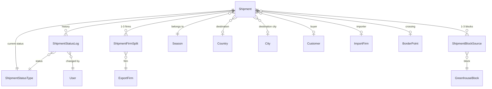

# Shipment Lifecycle

> 📊 **Interactive BPMN diagram:** [`docs/diagrams/export-process-bpmn.html`](../../diagrams/export-process-bpmn.html) — swimlanes per role, the `has_peregruz` gateway, click-for-detail nodes, and sub-process modals (draft join, quota sync, auto-advance, sales report, customs ledger, cancel). Open in any browser; fully offline.

## What Is This Process?

The shipment lifecycle is the **central process** of the YGT Platform. Every truck load of tomatoes leaving the Turkmenistan greenhouses goes through a **12-step state machine** (`draft` → `tamamlandy`) plus a terminal `cancelled` off-ramp. Each step is owned by a specific role, and transitioning between steps writes an immutable audit trail.

One Shipment = one truck load. The shipment code (format `DDMM###/YY`) is the universal identifier used across all systems (Logo Tiger ERP, Trip Management, GPS tracking).

> **State machine v2 — the Sheet drives the lifecycle.** Nobody clicks a transition button in normal
> operation. Operators fill cells on the [[../screens/shipment-sheet|Shipment Sheet]]; the task engine
> resolves the step's tasks and `auto_advance_if_ready()` fires the transition. See
> [[#Sheet-Driven Auto-Advance (v2)]]. Full status reference: [[../reference/status-codes]].

## How It Works (Business Flow)

```mermaid
stateDiagram-v2
    direction LR

    [*] --> draft: Create shipment

    state "DRAFT" as d {
        draft: 0. Draft (Garalama)
    }

    state "CUSTOMS Phase" as customs {
        gumruk_girish: 1. Gumruk Girish (Customs Entry)
        gumruk_chykysh: 2. Gumruk Chykysh (Customs Exit)
    }

    state "LOADING Phase" as loading {
        yuklenme: 3. Yuklenme (Loading)
    }

    state "TRANSIT Phase" as transit {
        yola_chykdy: 4. Yola Chykdy (Departed)
    }

    state "BORDER Phase" as border {
        serhet_gechdi: 5. Serhet Gechdi (Crossed TM Border)
        dest_entry: 6. Dest Entry (Destination Entry)
        barysh_gumrugi: 7. Barysh Gumrugi (Dest. Customs)
    }

    state "SALES Phase" as sales {
        transshipment: 8. Transshipment (Peregruz)
        bardy: 9. Bardy (Arrived)
        satylyar: 10. Satylyar (Selling)
        satyldy: 11. Satyldy (Sold, waiting for Report)
    }

    tamamlandy: 12. Tamamlandy (Report received & Completed)
    cancelled: 99. Cancelled

    draft --> gumruk_girish
    gumruk_girish --> gumruk_chykysh
    gumruk_chykysh --> yuklenme
    yuklenme --> yola_chykdy
    yola_chykdy --> serhet_gechdi
    serhet_gechdi --> dest_entry
    dest_entry --> barysh_gumrugi
    barysh_gumrugi --> transshipment: has_peregruz = true
    barysh_gumrugi --> bardy: has_peregruz = false
    transshipment --> bardy
    bardy --> satylyar
    satylyar --> satyldy
    satyldy --> tamamlandy
    tamamlandy --> [*]
    cancelled --> [*]
```

> Any non-terminal status also has an edge to `cancelled` (omitted above for readability).
> Retired v1 codes `serhet_tm`, `yolda` and `hasabat` survive in the DB with `is_active=False`
> for audit reference only.

### Transition Rules

Each transition is strictly linear (no skipping steps, no going back). The `TRANSITIONS` dict in `services/shipment.py` defines the edges, the role allowed on each edge, and — for the `has_peregruz` fork — a predicate that auto-advance uses to pick the target. Manual transitions ignore predicates (the user picks explicitly).

| Step | Code | Name (EN) | Edge role | Trigger field(s) filled on the Sheet | → Next |
|------|------|-----------|-----------|--------------------------------------|--------|
| 0 | `draft` | Draft | `document_team` | see [[#Leaving `draft` — four triggers plus a join guard]] | `gumruk_girish` |
| 1 | `gumruk_girish` | Customs Entry | `document_team` | `customs_exit_at` (R25) | `gumruk_chykysh` |
| 2 | `gumruk_chykysh` | Customs Exit | `warehouse_chief` | `loading_started_at` (R19) | `yuklenme` |
| 3 | `yuklenme` | Loading | `document_team` | `shipment_code` + `block_sources` (R8) + `variety` (R38) + `weight_net` (R37), and `departed_at` (R21) | `yola_chykdy` |
| 4 | `yola_chykdy` | Departed | `transport` | `border_crossed_at` (R30) | `serhet_gechdi` |
| 5 | `serhet_gechdi` | Crossed TM Border | `sales_rep` | `dest_entry_at` (R31) | `dest_entry` |
| 6 | `dest_entry` | Destination Entry | `sales_rep` | `customs_entry_at` (R32) | `barysh_gumrugi` |
| 7 | `barysh_gumrugi` | Dest. Customs | `sales_rep` | `peregruz_date` **or** `arrived_at` (R35) | `transshipment` if `has_peregruz`, else `bardy` |
| 8 | `transshipment` | Transshipment | `sales_rep` | `arrived_at` (R35) | `bardy` |
| 9 | `bardy` | Arrived | `sales_rep` | `city` (R12), and `sale_started_at` (R41) | `satylyar` |
| 10 | `satylyar` | Selling | `sales_rep` | `sale_ended_at` (R42) | `satyldy` |
| 11 | `satyldy` | Sold (waiting for Report) | `finansist` | `sales_report` | `tamamlandy` |
| 12 | `tamamlandy` | Report received & Completed | — | _(terminal)_ | — |

> ⚠️ **Customs comes BEFORE loading.** In v2 `gumruk_girish` / `gumruk_chykysh` are steps 1–2 and
> `yuklenme` is step 3 — customs paperwork is pre-cleared while the truck loads at the greenhouse,
> matching operational reality. This is the reverse of v1, and it is not a typo.

> ⚠️ **`customs_entry_at` changed meaning.** In v1 it was step 2 (TM customs entry, `warehouse_chief`).
> In v2 it is the **destination** customs trigger on `dest_entry`, owned by `sales_rep`. Same column,
> different step, different role.

**Privileged roles**: `PRIVILEGED_ROLES` in `services/shipment.py` = `export_manager`, `director`, `boss`
— they bypass the per-edge role check on forward steps. (`boss` was added 2026-08-05 so he can unstick a
step without logging in as each role. Note `apps/core/roles.py` has a same-named constant with different
members — they are deliberately divergent.)

### Sheet-Driven Auto-Advance (v2)

**Nobody clicks a transition button in normal operation.** Every step has at least one auto-resolving
`TaskRule` whose `target_fields` is the trigger for advancing. The loop:

1. Operator edits a cell on the [[../screens/shipment-sheet|Sheet]] → `PATCH /shipments/{id}/` → `Shipment.save()`
2. The task engine resolves any newly satisfied tasks on the current step (`resolve_for_shipment`)
3. `auto_advance_if_ready()` checks whether **every non-`MANUAL_DONE` task on the current step is DONE**
4. If yes → `transition_to(..., is_auto=True, notify=False)`, then **loop again** — the cascade walks
   through every step whose trigger is already satisfied, not just one (`MAX_CHAIN=13` defensive cap)
5. After the loop, `_notify_action_required()` fires **once** for the role of the final step

Each cascaded transition still writes its own `ShipmentStatusLog` (`is_auto=True`) and `AuditLog` row.

**`MANUAL_DONE` rules do NOT gate auto-advance.** They are operational reminders only —
`tasks.give_documents` (draft) and `tasks.submit_sales_report` (yola_chykdy) will never block a step.

The declarative source of truth for every trigger is
`backend/apps/export/management/commands/seed_task_rules.py::TASK_RULES`. See [[../reference/task-rules]].

#### Leaving `draft` — four triggers plus a join guard

`draft` is the only step gated by a *set* of triggers rather than one field. All four auto-resolving
rules must be DONE before `gumruk_girish`:

| Task | Assignee | Trigger | Rule |
|------|----------|---------|------|
| `tasks.set_destination` | `export_manager` | `country` + `customer` + `import_firm` | ALL_FIELDS_FILLED |
| `tasks.pick_export_firms` | `document_team` | `firm_splits` (R9) | ANY_FIELD_FILLED |
| `tasks.assign_driver` | `transport` (gapy → `document_team`) | `driver_name` + `driver_phone` + `truck_plate` (R27/R28/R23) | ALL_FIELDS_FILLED |
| `tasks.start_documents_prep` | `document_team` | `documents_status == 'ready'` (R6) | FIELD_EQUALS |
| `tasks.give_documents` | `transport` / `document_team` | — | MANUAL_DONE (does **not** gate) |

`documents_status` targets `'ready'`, **not** `'in_progress'`. FIELD_EQUALS is a literal `==` with no
ordering, so a value operators naturally walk past (`pending → in_progress → ready`) could never
re-fire and left drafts stuck. (Two stale comments still say `in_progress` — the module header of
`seed_task_rules.py` and the `create_shipment()` docstring. The rule body is correct.)

**Two-row join guard.** On top of the tasks, `transition_to()` refuses to leave `draft` unless
`block_sources`, `country` **and** `customer` are all set. A pure supply draft (`loading_dept_head`,
blocks only) or a pure destination draft (`export_manager`, destination only) raises `ValueError` —
they must `/join/` first. This applies uniformly to manual `/transition/`, `/assign/`, and the
auto-advance cascade. See [[draft-shipments]]. **This is the usual answer to "why is my draft stuck".**

### Cancellation (the one off-ramp)

The forward chain is linear, but a shipment can be **cancelled** from any non-terminal status (everything except `tamamlandy`). `cancelled` is a 14th terminal status (`step_order=99`, `phase='CANCELLED'`) — once cancelled it has no outgoing edges and never auto-advances (its `trigger_field` is null). See [[../../ADR#ADR-019]] for the decision record.

- **Endpoint**: `POST /api/v1/export/shipments/{id}/cancel/` with body `{ "reason": "<non-empty>" }`. A dedicated action, not `/transition/`, so the reason is mandatory and the destructive UI stays separate from the forward TransitionButton.
- **Who**: `CANCEL_ROLES` in `services/shipment.py` = `admin`, `export_manager`, `director`. All other roles get 403. This set is a **deliberate literal**, NOT derived from `PRIVILEGED_ROLES` — adding `boss` to the latter must not silently make him an allowed canceller.
- **Reason**: required free-text, stored as the `ShipmentStatusLog` comment on the cancel transition — no extra schema column.
- **Side effects**: open / in-progress / blocked `Task` rows on the shipment are bulk-set to `CANCELLED`; comments are preserved; draft `QuotaUsageRecord` rows are deleted and approved ones are surfaced in the response (`draft_quota_deleted`, `approved_quota_to_reconcile`) for manual reconciliation.
- **Visibility**: cancelled shipments are excluded from the operational list by default — reveal them with `?show_cancelled=true` or an explicit `?status_code=cancelled` filter. They never appear on the Kanban board (no `CANCELLED` phase column). Detail pages remain reachable.

`cancelled` is not included in `allowed_transitions`, so the forward TransitionButton never offers it.

### Soft delete (trash flag)

Distinct from cancellation: a **reversible "deactivate" flag** that hides a shipment from every list / sheet / board / dashboard without touching the lifecycle status, the status log, or any business semantics. Closest analogy: Gmail trash. Originally admin-only; now open to every authenticated Sheet viewer (per stakeholder ask — "any role who can see the sheet table").

- **Fields**: `Shipment.deleted_at` (`DateTimeField`, null = active) and `deleted_by` (FK User, `SET_NULL`). Migration `0025`.
- **Endpoints**: `POST /api/v1/export/shipments/{id}/soft-delete/` and `POST /api/v1/export/shipments/{id}/restore/`. **Open to every authenticated user** (listed in `ShipmentViewSet._OPEN_ACTIONS`; `get_permissions()` substitutes `IsAuthenticated` for `DynamicResourcePermission` so roles without `shipment.can_create` / `can_delete` such as `transport` / `sales_rep` / `document_team` still pass — the page-perm gate on `/export/shipments` is the only access check). Both idempotent. Both write an `AuditLog` row (`action='soft_delete'` / `'restore'`). No body required, no reason.
- **Visibility**: rows with `deleted_at IS NOT NULL` are filtered out of `ShipmentViewSet.get_queryset()` for all list-style actions, the `/sheet/` queryset, and the dashboard `active_shipments` panel. Detail-style actions (retrieve, cancel, transition, soft_delete, restore) bypass the filter so the row is always reachable by ID. The `?show_deleted=true` query param flips the list to show **only** deleted rows; it's open to all authenticated users (the UI checkbox on the Shipments page is admin-only via `canHardDelete`, but a non-admin who soft-deleted a Sheet column can recover it by hitting the URL directly → restore).
- **Write protection**: `partial_update` returns 403 on a soft-deleted row (mirror of the archived-row guard), so the only mutation allowed is `restore`.
- **vs cancel**: cancel writes to `ShipmentStatusLog`, changes lifecycle phase to `CANCELLED`, requires a reason, and pollutes lifecycle stats. Soft-delete is a side-flag with no lifecycle effect — use it when the row was created in error / is junk / needs to be hidden without explaining why.
- **vs bulk-delete**: bulk-delete is permanent + cascade-removes related rows. Soft-delete preserves everything and can be undone.
- **vs hard-delete-draft**: `POST /shipments/{id}/hard-delete/` (`ShipmentViewSet.hard_delete_draft`) is the per-shipment, **draft-only** twin of bulk-delete — admin/superuser only, refuses any non-draft with 400. Surfaced as the "Delete draft" button on `ShipmentDetailHero`. Both it and bulk-delete share `ShipmentViewSet._hard_delete_targets(user, targets)` for the quota cleanup + audit + cascade. Use it to purge a junk draft scratch row outright; use cancel/soft-delete once a shipment has left `draft`.

## Database

### Tables

| Table | Schema | Purpose | Key Columns |
|-------|--------|---------|-------------|
| `export.shipments` | export | Main shipment record (1 per truck) | `code` (shipment_code), `status_id`, `status_changed_at`, 10 operator-entered lifecycle timestamps, weight, transport, finance |
| `export.shipment_status_log` | export | Audit trail (1 row per transition) | `shipment_id`, `status_id`, `changed_by_id`, `changed_at`, `comment` |
| `core.shipment_status_types` | core | 12 active + `cancelled` + 3 retired status definitions | `code`, `step_order`, `phase`, `is_active`, `name_tk/en/ru` |
| `export.shipment_firm_splits` | export | 1-3 export firms per shipment | `shipment_id`, `export_firm_id`, `weight_kg`, `amount_usd` |
| `export.shipment_block_sources` | export | Source greenhouse blocks | `shipment_id`, `block_id`, `weight_kg` |

### Relationships

```mermaid
erDiagram
    Shipment ||--|| ShipmentStatusType : "current status"
    Shipment ||--o{ ShipmentStatusLog : "history"
    Shipment ||--o{ ShipmentFirmSplit : "1-3 firms"
    Shipment ||--o{ ShipmentBlockSource : "1-3 blocks"
    Shipment }o--|| Season : "belongs to"
    Shipment }o--o| Country : "destination"
    Shipment }o--o| City : "destination city"
    Shipment }o--o| Customer : "buyer"
    Shipment }o--o| ImportFirm : "importer"
    Shipment }o--o| BorderPoint : "crossing"
    ShipmentStatusLog }o--|| ShipmentStatusType : "status"
    ShipmentStatusLog }o--|| User : "changed by"
    ShipmentFirmSplit }o--|| ExportFirm : "firm"
    ShipmentBlockSource }o--|| GreenhouseBlock : "block"
```

### Key Constraints

- `shipment_code` is **unique** across all shipments
- `(shipment, export_firm)` is unique in firm_splits
- `(shipment, block)` is unique in block_sources
- All FKs to reference tables use `on_delete=PROTECT` (can't delete a country that has shipments)
- Lifecycle timestamp fields are nullable and **operator-entered** — reaching a step no longer guarantees the timestamp exists

## Backend Implementation

### Models

**File**: `backend/apps/export/models/shipment.py`

**Shipment** — 30+ fields organized by purpose:

| Group | Fields | Notes |
|-------|--------|-------|
| Identifiers | `shipment_code` (CharField, unique, db_column='code'), `date`, `season` (FK) | Shipment code is the universal key |
| Geography | `country`, `city`, `border_point`, `loading_location` (all FK, nullable) | Destination info |
| Customer | `customer` (FK), `import_firm` (FK) | Buyer and importing company |
| Product | `product_type`, `variety` (FKs, nullable) | What's being shipped |
| Weight | `weight_gross` (db_column='weight_gross_kg'), `weight_net` (db_column='weight_net_kg'), `packaging_kg`, `pallet_count`, `pallet_weight_kg`, `box_count`, `rejected_weight_kg` | All DecimalField, nullable |
| Transport | `truck_head_id`, `trailer_id`, `driver_id`, `trip_id` (raw BigIntegerField — Trip Mgmt not Django-managed), `vehicle_responsible`, `transport_temp_c`, `transit_days`, `shelf_life_days`, `has_peregruz`, `peregruz_city`, `peregruz_date` | Transport details. For non-Gapy-Satys shipments, `truck_head_id`/`trailer_id` are picked from the TIR fleet registry via `ShipmentTruckSelector` (also derives `truck_plate`); Gapy-Satys shipments keep the free-text `truck_plate` instead — see [[fleet-map#TIR Fleet Registry & Shipment Truck Selection]] |
| Status | `status` (FK to ShipmentStatusType), `is_gapy_satys` (bool) | Current lifecycle step |
| Operational | `customs_clearance`, `documents_status`, `harvest_status` (CharFields) | Sheet row status codes |
| Finance | `price_per_kg`, `total_amount_usd` (DecimalField) | Pricing |
| Lifecycle Timestamps | `loading_started_at`, `customs_entry_at`, `customs_exit_at`, `departed_at`, `border_crossed_at`, `dest_entry_at`, `peregruz_date`, `arrived_at`, `sale_started_at`, `sale_ended_at` | **v2: operator-entered on the Sheet — they are the auto-advance TRIGGERS, not outputs.** `STATUS_TIMESTAMP_MAP` is empty; `transition_to()` writes only `status` + `status_changed_at`. (Inverts the v1 AD-1 rule still quoted in `CLAUDE.md`.) |
| AD-2 Vehicle | `vehicle_condition` (choices: OK/ISSUE/BREAKDOWN/RETURNED), `vehicle_condition_note`, `route_note`, `vehicle_status_note` (DEPRECATED) | Structured replacement for free-text |
| Audit | `created_by`, `updated_by` (FK User), `created_at`, `updated_at`, `notes` | Tracking |

**ShipmentStatusLog** — one row per transition:
- `shipment` (FK CASCADE), `status` (FK PROTECT), `changed_by` (FK PROTECT), `changed_at` (auto), `comment`, `is_manual_override`

**ShipmentFirmSplit** — 1-3 export firms per shipment:
- `shipment` (FK CASCADE), `export_firm` (FK PROTECT), `weight_kg`, `amount_usd`, `invoice_number`, `split_order`

**ShipmentBlockSource** — source greenhouse blocks:
- `shipment` (FK CASCADE), `block` (FK PROTECT), `weight_kg`

### Services

**File**: `backend/apps/export/services.py`

#### `transition_to(shipment, new_status_code, user, comment='', is_auto=False, notify=True)`

**The ONLY function that may update `shipment.status`.** In v2 it no longer writes lifecycle timestamps — `STATUS_TIMESTAMP_MAP` is empty and it updates only `status` + `status_changed_at`.

Logic:
1. Get current status code (or `None` if no status)
2. Look up allowed transitions from `TRANSITIONS[current_code]`
3. Validate that `new_status_code` is in allowed list → raises `ValueError` if not
4. **Two-row join guard** — when leaving `draft` (and not cancelling): require `block_sources`, `country`, and `customer` all to be set. Pure supply drafts (loading_dept_head, has blocks only) and pure destination drafts (export_manager, has destination only) raise `ValueError` here — they must `/join/` first. Applies uniformly to manual `/transition/`, `/assign/`, and the auto-advance cascade.
5. Check user role permission (privileged roles bypass; `is_auto=True` also bypasses) → raises `PermissionError` if denied
6. Look up `ShipmentStatusType` by code → raises `ValueError` if not found
7. Set `shipment.status = new_status`, `shipment.updated_by = user`, `shipment.updated_at = now`
8. Set `status_changed_at = now` (`STATUS_TIMESTAMP_MAP` is empty in v2 — no per-status timestamp is written)
9. `shipment.save(update_fields=[...])` — explicit fields only
10. Create `ShipmentStatusLog` entry with comment (flagged `is_auto`)
11. Generate tasks for the new status (and auto-resolve any whose triggers are already filled)
12. Create `AuditLog` entry (immutable trail)
13. Fire `_notify_action_required(new_status_code)` if `notify=True`

#### `auto_advance_if_ready(shipment, resolved_tasks)` — cascading auto-advance

Called from `Shipment.save()` after the task engine resolves any newly satisfied tasks. **Walks the shipment forward through every step whose trigger is already satisfied**, not just one. Most saves fill one trigger and advance one step, but cascades through multiple when several triggers are pre-filled (TaskRule edit + reconcile, backfill, or a long-stuck draft whose downstream operator timestamps were filled before a rule fix landed).

Loop:
1. Check `is_step_trigger_satisfied(shipment, current_status)` — all non-MANUAL_DONE auto-tasks DONE?
2. Resolve next status via `_resolve_next_status` (honours `has_peregruz` fork at `barysh_gumrugi`)
3. Call `transition_to(..., is_auto=True, notify=False)` — the intermediate notification is suppressed; only the final step's role gets pinged
4. Repeat until trigger unsatisfied / no next step / `MAX_CHAIN=13` (defensive cap — the graph is acyclic so the cap should never fire)
5. After the loop, call `_notify_action_required` once for the final step

Each cascaded transition still writes its own `ShipmentStatusLog` (flagged `is_auto=True`) and `AuditLog` row — audit trail captures every step individually.

The thread-local re-entry guard in `Shipment.save()` prevents `transition_to`'s inner save from re-entering `auto_advance_if_ready` (which would cause infinite recursion via save). The cascade happens at the `auto_advance_if_ready` level, NOT via save recursion.

#### `create_shipment(shipment_code, date, user, country=None, customer=None, season=None)`

Creates a new shipment at step 0 (`draft`):
1. Resolve active season if not provided; `assert_season_open()` (D1 write freeze)
2. Look up the `draft` status
3. `Shipment.objects.create(...)` with `status=draft`
4. Create initial `ShipmentStatusLog` entry
5. Return new Shipment

From there the four `draft` task triggers ([[#Leaving `draft` — four triggers plus a join guard]])
advance it to `gumruk_girish`. No timestamp is written at creation.

### Serializers

**File**: `backend/apps/export/serializers.py`

- **ShipmentListSerializer** (read-only, lightweight): shipment_code, date, status + status_display, country_name, customer_name, weight_net, weight_gross, departed_at, arrived_at, is_gapy_satys, updated_at
- **ShipmentDetailSerializer** (read-only, full): all list fields + firm_splits (nested), block_sources (nested), status_log (nested), comments (nested), quality (nested), sales_report, editable_fields, allowed_transitions
- **ShipmentCreateSerializer** (write): shipment_code, date, country, customer, season
- **ShipmentPatchSerializer** (write, role-based): dynamically restricts writable fields based on user's role field permissions

### ViewSet & Endpoints

**File**: `backend/apps/export/views.py` — `ShipmentViewSet`

| Method | Endpoint | Action | Auth |
|--------|----------|--------|------|
| GET | `/api/v1/export/shipments/` | List (paginated, filterable) | IsAuthenticated |
| GET | `/api/v1/export/shipments/{id}/` | Detail | IsAuthenticated |
| POST | `/api/v1/export/shipments/` | Create | export_manager, director |
| PATCH | `/api/v1/export/shipments/{id}/` | Partial update | Role-based field restrictions |
| POST | `/api/v1/export/shipments/{id}/transition/` | Status transition | Per-step role check |
| GET | `/api/v1/export/shipments/overdue/` | Overdue shipments | IsAuthenticated |
| GET | `/api/v1/export/shipments/sheet/` | Sheet view (all, no pagination) | IsAuthenticated |
| PATCH | `/api/v1/export/shipments/{id}/quality/` | Set quality docs | export_manager, document_team, director |
| POST | `/api/v1/export/shipments/{id}/comment/` | Add comment | IsAuthenticated |
| POST | `/api/v1/export/shipments/{id}/sales-report/` | Set/update sales report | sales_rep, export_manager, director |
| POST | `/api/v1/export/shipments/{id}/block-sources/` | Replace block sources | IsAuthenticated |
| POST | `/api/v1/export/shipments/{id}/firm-splits/` | Replace firm splits | IsAuthenticated |

### Custom Actions Detail

**`transition(POST)`**: Receives `{new_status: "gumruk_girish", comment: "Docs ready"}`. Calls `transition_to()`. Returns updated shipment detail. Errors: 400 (invalid transition), 403 (wrong role).

**`my_work filter`**: `?my_work=true` restricts results by `ROLE_PHASE_MAP` (`views.py`), keyed on the
`ShipmentStatusType.phase` DB column — **not** the kanban phase vocabulary:
- `warehouse_chief`, `loading_dept_head`, `loading_dept_head_deputy` → LOADING
- `document_team` → LOADING + CUSTOMS
- `transport` → LOADING + CUSTOMS + TRANSIT + BORDER
- `sales_rep` → BORDER + TRANSIT + SALES
- `finansist` → SALES
- `export_manager`, `director` (not in the map) → all phases

**`overdue(GET)`**: `?threshold=N` (default 7) returns SALES-phase shipments (`bardy` / `satylyar` /
`satyldy`, steps 9-11) stuck for >N days. `days_overdue` is computed in Python as
`today − (arrived_at or updated_at)` — MSSQL can't subtract `DATETIMEOFFSET` in the ORM. Allowed roles:
`PRIVILEGED_ROLES` + `sales_rep` + `finansist` + `boss`.

**`set_firm_splits(POST)`**: Replaces all firm splits. **Also auto-creates draft QuotaUsageRecord entries** for each firm using `get_default_truck_weight()` — this is the bridge to [[quota-management]].

## Frontend Implementation

### Pages

The shipment lifecycle is displayed across **5 different views**, each optimized for a different workflow:

#### 1. ShipmentList (`frontend/src/pages/export/ShipmentList.tsx`)

**Purpose**: Primary list view for finding and monitoring shipments.

**Columns Displayed**:
| # | Column | Width | Notes |
|---|--------|-------|-------|
| 1 | Shipment Code | 140px | Monospace, clickable → detail page |
| 2 | Customer Name | 150px | |
| 3 | Country | 130px | With flag emoji |
| 4 | Status | 150px | StatusTag component (colour keyed on `status_display` — see the ⚠️ note under Components) |
| 5 | Weight Net | 120px | Right-aligned, thousands formatted, responsive md+ |
| 6 | Departed At | 130px | Format: DD.MM.YY HH:mm |
| 7 | Arrived At | 130px | Format: DD.MM.YY HH:mm, responsive md+ |

**Filters**:
- Search input (shipment_code, customer_name)
- Phase dropdown — `ShipmentStatusType.phase` **DB values**, not status codes (the endpoint filters `status__phase=`): DRAFT, CUSTOMS, LOADING, TRANSIT, BORDER, SALES, COMPLETE. CANCELLED is excluded; cancelled rows are toggled via the dedicated "show cancelled" checkbox
- View mode segmented: "All" vs "My Work"
- Page size: 20 / 50 (default) / 100

**Actions**:
- Create shipment button → opens ShipmentCreateModal (if user has `shipment.create` permission)
- Export to Excel button
- Row click → navigates to `/shipments/{id}`

#### 2. ShipmentDetail (`frontend/src/pages/export/ShipmentDetail.tsx`)

**Purpose**: Full shipment information with 4 tabs.

**Layout**: 2-column grid (main content 1fr + sidebar 340px on md+, single column on mobile)

**Tab 1 — Overview**:
- Logistika section: customer, firm_splits, import_firm, country, loading_point
- Transport section: vehicle, driver, transport_firm, border_point, current_location
- Haryt (Goods) section: block_sources, variety, harvest_date, weight_net, weight_gross, pallets
- Hil (Quality) section: transit_days, temperature

**Tab 2 — Document**:
- Quality certificate checkboxes (editable if permitted): azyk_maglumatnama, suriji_gozukdiriji, hil_sertifikaty, kalibrowka_analiz
- Logistics timestamps timeline: loading_started_at through sale_ended_at

**Tab 3 — Finance**:
- Weight & price summary, firm splits table, sales report form. Filing the report is the `satyldy → tamamlandy` trigger; `/my-sales-reports/` lists shipments at `step_order >= 4` (`yola_chykdy` onward)

**Tab 4 — History**:
- Visual status route (12 active steps with checkmarks/current/pending indicators)
- Status log entries with timestamps and user
- Comments section with CommentComposer

**Right Sidebar**:
- Status route card: visual 12-step progress
- External links: Logo Tiger, Trip Management, GPS Tracking

#### 3. ShipmentSheet (`frontend/src/pages/export/ShipmentSheet.tsx`)

**Purpose**: Excel-like spreadsheet view for bulk data entry.
- Fetches active-season shipments via `useShipmentSheet()` (no pagination); `?season=<id>` browses a different (permitted) season instead — see [[../screens/season-switcher]] (AD-16)
- `SheetGrid` component with inline cell editing
- Zustand `SheetStore` manages: searchText, showGapyOnly
- Filters in memory by shipment_code and customer_name

#### 4. ShipmentBoard (`frontend/src/pages/export/ShipmentBoard.tsx`)

**Purpose**: Visual pipeline of active shipments grouped by lifecycle phase. Route: `/export/shipments/board`.

**7 Columns** (horizontally scrollable, follow `ShipmentPhase`): PLAN, PREP, DOCS, LOAD, TRANSIT, DEST, CLOSE.

**Filters**: country, customer, Gapy Satys (any/yes/no), owner role, free-text search.

**Card Content**: shipment_code, owner role, time-in-phase, and a **task progress bar** with a `done/total` count. The top-border colour reflects the highest-priority task alert (late → blocked → in-progress). Each column footer shows the average time spent in that phase (`phase_avg_seconds` from the API).

**Task modal → act-in-drawer (in-board)**: **clicking a card** opens `BoardTasksModal` listing every task on that shipment (state icon + tag, localized title + assignee role, deadline overdue-in-red, sorted active-first then by deadline). Clicking a task row opens the **shared `SelfBoardTaskDrawer`** (the same surface used on `/me/board`) so the user can start it, fill its target fields, and mark it done **without leaving the board**. The card itself **no longer navigates to detail** — the full detail page is reachable only via the modal's explicit "Open shipment detail →" link (deliberate: the board is for doing tasks in place). The modal and drawer never overlap — the modal is hidden (its shipment id retained) while the drawer is open and reappears on close, avoiding an antd Drawer-over-Modal focus-trap clash. On close the modal list shows the fresh state because the page re-resolves the modal's item from the live board query and `useTaskActions` invalidates `['shipments','board']`. The data is a `tasks[]` array on each `BoardItemSerializer` row — the **full `TaskListSerializer` / `ITaskListItem` shape** so the drawer consumes it directly — read from the board queryset's `tasks` prefetch (with `select_related('shipment__status','assignee_user')`) so it costs **no extra DB queries** (the endpoint's `assertNumQueries ≤ 8` bound holds). The Detail page's `MyTaskCard` / `OtherTasksRow` remain the other entry points to the same tasks.

Single grouped fetch via `useShipmentBoard(filters)` → `GET /export/shipments/board/`. Reuses `KanbanColumn` + `ShipmentKanbanCard` from `components/kanban/`.

#### 5. ShipmentDashboard (`frontend/src/pages/export/ShipmentDashboard.tsx`)

**Purpose**: Filterable shipment list with slide-out detail you can act on.
- DashboardHeader with stats + filter controls (all/active/completed, search)
- ShipmentTable (full-width) — filtered list (the UrgencyPanel sidebar was removed; the "Missing Reports" count lives in DashboardHeader)
- DetailSlide (right drawer) — selected shipment detail on click, with an **Edit** button that opens the shared `ShipmentEditDrawer` for permission-aware inline field edits (via `useShipmentPatchMulti`)

### Components Used

- **StatusTag** (`components/StatusTag.tsx`): Ant Design Tag keyed on `status_display` (= `ShipmentStatusType.name_en`), **not** on phase. ⚠️ **Stale in v2** — the map still holds v1 English names, so only `Loading`, `Customs Entry`, `Customs Exit`, `Departed`, `Arrived` and `Cancelled` resolve; `Draft`, `Crossed TM Border`, `Destination Entry`, `Dest. Customs`, `Transshipment`, `Selling`, `Sold (waiting for Report)` and `Report received & Completed` fall through to grey `default`
- **TransitionButton** (`components/TransitionButton.tsx`): Opens modal with status dropdown + comment textarea, POSTs to `/transition/`. In v2 this is an **override**, not the normal path — statuses advance on their own when the Sheet trigger cell is filled
- **ShipmentCreateModal** (`components/ShipmentCreateModal.tsx`): Form with shipment_code, date, country (CountrySelect), customer (CustomerSelect), season
- **CommentComposer** (`components/CommentComposer.tsx`): TextArea + send button (Ctrl+Enter), POSTs to `/comment/` endpoint
- **SheetGrid** (`components/sheet/SheetGrid.tsx`): Custom table with inline cell editing, uses SheetCell, SheetCellEditor, SheetLabelColumn, SheetToolbar

### Hooks

| Hook | Endpoint | Params | Returns | Stale Time |
|------|----------|--------|---------|------------|
| `useShipments` | `GET /export/shipments/` | page, page_size, status, country, phase, my_work, search | `IApiListResponse<IShipmentListItem>` | 30s |
| `useShipmentDetail` | `GET /export/shipments/{id}/` | id | `IShipmentDetail` | 30s |
| `useShipmentSheet` | `GET /export/shipments/sheet/` | _(none)_ | `IShipmentSheetItem[]` | 30s |
| `useShipmentPatch` | `PATCH /export/shipments/{id}/` | id, partial fields | `IShipmentDetail` | mutation |

### TypeScript Types

**`IShipmentListItem`** (list view):
- `id`, `shipment_code`, `date`, `status`, `status_display`, `status_step`, `country_name`, `customer_name`, `weight_net`, `weight_gross`, `departed_at`, `arrived_at`, `is_gapy_satys`, `updated_at`

**`IShipmentDetail`** (extends IShipmentListItem):
- `status_code`, `allowed_transitions[]`, `box_count`, `pallet_count`, `packaging_kg`
- `vehicle_condition`, `vehicle_condition_note`, `route_note`
- `price_per_kg`, `total_amount_usd`
- Lifecycle timestamps (operator-entered): `loading_started_at`, `customs_entry_at`, `customs_exit_at`, `departed_at`, `border_crossed_at`, `dest_entry_at`, `peregruz_date`, `arrived_at`, `sale_started_at`, `sale_ended_at`
- `notes`, `firm_splits[]`, `block_sources[]`, `status_log[]`, `comments[]`, `quality`, `sales_report`

**`IShipmentSheetItem`** (spreadsheet, 50+ fields): all shipment data in flat structure

**`IFirmSplit`**: `export_firm_id`, `export_firm_name`, `weight_kg`, `amount_usd`, `invoice_number`

**`IBlockSource`**: `block_id`, `block_code`, `weight_kg`

**`IStatusLogEntry`**: `status_display`, `changed_by_name`, `changed_at`, `comment`

### User Interactions

1. **View shipments**: List/Kanban/Sheet/Dashboard — multiple entry points
2. **Create shipment**: Click create button → fill modal → POST creates at step 0 (`draft`)
3. **Transition status**: normally **automatic** — fill the trigger cell on the Sheet and auto-advance fires it. The manual TransitionButton (select next status + optional comment → POST `/transition/`) remains as an override for privileged roles unsticking a step.
4. **Edit fields**: Inline on Sheet, or PATCH on Detail — restricted by role's field permissions
5. **Set quality**: Toggle checkboxes on Document tab → PATCH `/quality/`
6. **Add comment**: Type in CommentComposer → POST `/comment/`
7. **Set firm splits**: On Overview tab → POST `/firm-splits/` (also auto-creates quota usage records)
8. **Set block sources**: On Overview tab → POST `/block-sources/`
9. **Submit sales report**: On Finance tab → POST `/sales-report/` — this is the `satyldy → tamamlandy` trigger

## Roles & Permissions

Two different things are gated per role and they do not line up — the **transition edge** a role owns
(`TRANSITIONS`) versus the **Sheet cell** whose fill actually triggers that edge (`TASK_RULES`
`assignee_role`). Auto-advance runs with `is_auto=True`, which **bypasses the edge role check**, so the
person who types the value need not own the edge. Example: `loading_started_at` is filled by
`loading_dept_head`, but the `gumruk_chykysh → yuklenme` edge is owned by `warehouse_chief`.

| Role | Owns edge(s) | Fills trigger cell(s) on the Sheet | My Work (DB phase) | Can Create |
|------|--------------|------------------------------------|--------------------|------------|
| `export_manager` | any (privileged) | `country`, `customer`, `import_firm` | all | Yes |
| `director` | any (privileged) | — | all | Yes |
| `boss` | any (privileged) | — | all | No |
| `warehouse_chief` | `gumruk_chykysh → yuklenme` | shares `loading_dept_head`'s fields | LOADING | No |
| `loading_dept_head` (+ deputy) | — | `loading_started_at`, `block_sources`, `variety`, `weight_net` | LOADING | No |
| `document_team` | `draft → gumruk_girish`, `gumruk_girish → gumruk_chykysh`, `yuklenme → yola_chykdy` | `documents_status='ready'`, `firm_splits`, `customs_exit_at`, `departed_at` | LOADING + CUSTOMS | No |
| `transport` | `yola_chykdy → serhet_gechdi` | `driver_name`, `driver_phone`, `truck_plate`, `border_crossed_at` | LOADING + CUSTOMS + TRANSIT + BORDER | No |
| `sales_rep` | `serhet_gechdi` → … → `satylyar → satyldy` | `dest_entry_at`, `customs_entry_at`, `peregruz_date`, `arrived_at`, `city`, `sale_started_at`, `sale_ended_at` | BORDER + TRANSIT + SALES | No |
| `finansist` | `satyldy → tamamlandy` | `sales_report` (filed by `sales_rep`) | SALES | No |

Field-level edit rights are data, not code — see [[permissions-system]] and the Sheet's four separate
enforcement points.

## Connections to Other Processes

- **[[shipment-creation]]** — How shipments are born (pre-shipment planning → create at step 1)
- **[[quota-management]]** — Setting firm splits auto-creates draft QuotaUsageRecord entries; quota consumption is tracked per firm
- **[[quality-documents]]** — Quality certificate checkboxes managed on ShipmentDetail Document tab
- **[[advances-reconciliation]]** — Advances are linked to shipments via FinansistAdvanceShipment
- **[[price-monitoring]]** — `price_per_kg` and `total_amount_usd` on shipment, sales report at step 12+
- **[[weekly-harvest-planning]]** — Harvest data feeds into shipment creation (block sources)
- **[[permissions-system]]** — Dynamic RBAC controls which fields each role can edit
