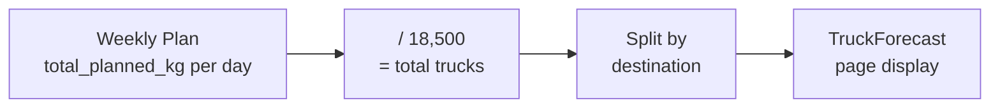
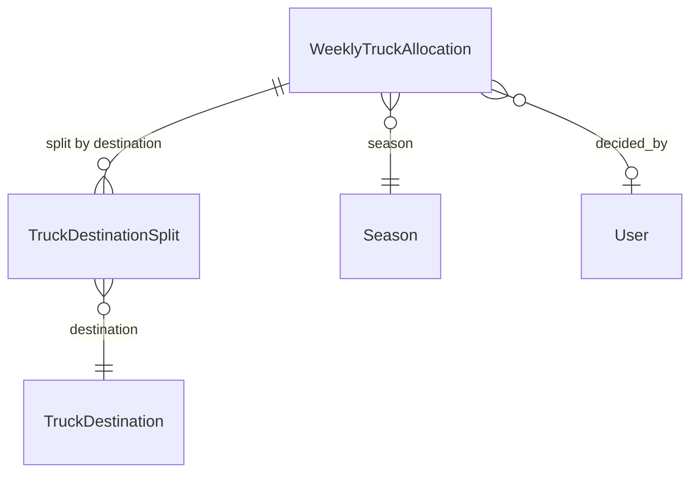

# Truck Allocation

## What Is This Process?

After the weekly harvest plan determines total planned kg per day, the truck allocation process splits those trucks across destinations (countries/cities). This answers: "How many trucks go where each day this week?"

Standard truck capacity: **18,500 kg**.

## How It Works (Business Flow)

## Database

### Tables

| Table | Purpose | Key Columns |
|-------|---------|-------------|
| `export.weekly_truck_allocations` | One row per day of week | season, week_number, year, day_of_week, total_planned_kg, decided_by |
| `export.truck_destination_splits` | N rows per allocation (one per destination) | allocation_id, destination_id, truck_count |
| `core.truck_destinations` | Reference: destination names | name, code, is_active |

### Relationships

## Backend Implementation

### Models

**File**: `backend/apps/export/models/` (truck allocation models)

**WeeklyTruckAllocation**:
- `season` (FK), `week_number`, `year`, `day_of_week` (1=Mon through 6=Sat)
- `total_planned_kg` (Decimal), `decided_by` (FK User, nullable)
- `total_trucks_calc` — computed as `total_planned_kg / 18500`

**TruckDestinationSplit**:
- `allocation` (FK CASCADE), `destination` (FK TruckDestination), `truck_count` (int)

### ViewSet & Endpoints

| Method | Endpoint | Action |
|--------|----------|--------|
| GET | `/api/v1/export/truck-allocations/` | List (filterable by season, year, week_number) |
| POST | `/api/v1/export/truck-allocations/` | Create |
| PATCH | `/api/v1/export/truck-allocations/{id}/` | Update |

## Frontend Implementation

### Page: TruckForecast

**File**: `frontend/src/pages/export/TruckForecast.tsx`

**Week Picker**: DatePickerInput with week format, defaults to current week.

**Stat Cards**:
- Total trucks (blue) — sum across all days
- Per destination — dynamic cards showing truck count per destination

**Table**:
| Column | Width | Notes |
|--------|-------|-------|
| Day of Week | 80px | Monday through Saturday |
| Total Planned kg | 140px | |
| Total Trucks | 100px | Bold, = planned_kg / 18500 |
| Per Destination | 110px each | Dynamic columns from destination list |
| Decided By | variable | Who made the allocation |

### Embedded in WeeklyPlanGrid

The `TruckAllocationTable` component is also embedded as a collapsible section at the bottom of the [[weekly-harvest-planning]] page, showing the same data inline with the harvest plan.

### Hooks

| Hook | Endpoint | Params | Returns | Stale Time |
|------|----------|--------|---------|------------|
| `useTruckAllocations` | `GET /export/truck-allocations/` | season, year, week_number | `IApiListResponse<IWeeklyTruckAllocation>` | 60s |
| `useTruckDestinations` | `GET /core/truck-destinations/?is_active=true` | _(none)_ | `ITruckDestination[]` | 300s |

### TypeScript Types

**`IWeeklyTruckAllocation`**: id, season, week_number, year, day_of_week, total_planned_kg, total_trucks_calc, destination_splits[]

**`ITruckDestinationSplit`**: id, destination, destination_name, truck_count

## Roles & Permissions

| Role | Can View | Can Edit |
|------|----------|----------|
| `export_manager` | Yes | Yes |
| `director` | Yes | Yes |
| `transport` | Yes | No |
| Others | Yes (read-only) | No |

## Connections to Other Processes

- **[[weekly-harvest-planning]]** — Total planned_kg comes from harvest plan sums; TruckAllocationTable is embedded in WeeklyPlanGrid
- **[[shipment-creation]]** — Allocated truck count determines how many shipments can be created per day
