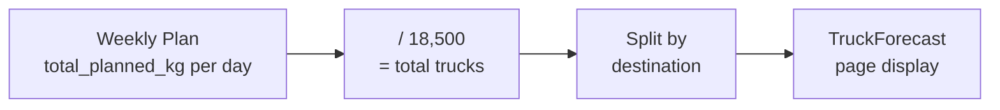
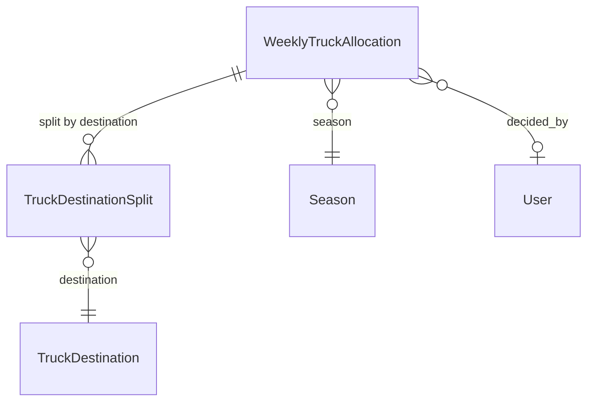

# Truck Allocation

## What Is This Process?

After the weekly harvest plan determines total planned kg per day, the truck allocation process splits those trucks across destinations (countries/cities). This answers: "How many trucks go where each day this week?"

Standard truck capacity: **18,500 kg**.

## How It Works (Business Flow)

```mermaid
flowchart LR
    A["Weekly Plan\ntotal_planned_kg per day"] --> B["/ 18,500\n= total trucks"]
    B --> C["Split by\ndestination"]
    C --> D["TruckForecast\npage display"]
```

## Database

### Tables

| Table | Purpose | Key Columns |
|-------|---------|-------------|
| `export.weekly_truck_allocations` | One row per day of week | season, week_number, year, day_of_week, total_planned_kg, decided_by |
| `export.truck_destination_splits` | N rows per allocation (one per destination) | allocation_id, destination_id, truck_count |
| `export.weekly_destination_selections` | Which destinations show as grid rows for a week | season, week_number, year, destination_id |
| `core.truck_destinations` | Reference: destination names | name, country, is_active, **is_default** |

### Destination selection (which rows appear)

The manager chooses which destinations appear as allocation rows for a given week
(feature: "select the export country instead of auto-deriving it"). The choice is
persisted in `weekly_destination_selections` — one row per selected destination per
(season, week, year). When a week has **no** saved selection, the grid falls back to
the destinations flagged `TruckDestination.is_default` (seeded to Russia, Kazakhstan,
Gapy Satys; Kyrgyzstan and any other destination are pickable but not default). Admins
toggle `is_default` from the Truck Destinations admin page.

### Relationships

```mermaid
erDiagram
    WeeklyTruckAllocation ||--o{ TruckDestinationSplit : "split by destination"
    TruckDestinationSplit }o--|| TruckDestination : "destination"
    WeeklyTruckAllocation }o--|| Season : "season"
    WeeklyTruckAllocation }o--o| User : "decided_by"
```

## Backend Implementation

### Models

**File**: `backend/apps/export/models/` (truck allocation models)

**WeeklyTruckAllocation**:
- `season` (FK), `week_number`, `year`, `day_of_week` (1=Mon through 6=Sat)
- `total_planned_kg` (Decimal), `decided_by` (FK User, nullable)
- `total_trucks_calc` — computed as `total_planned_kg / 18500`

**TruckDestinationSplit**:
- `allocation` (FK CASCADE), `destination` (FK TruckDestination), `truck_count` (int)

### ViewSet & Endpoints

| Method | Endpoint | Action |
|--------|----------|--------|
| GET | `/api/v1/export/truck-allocations/` | List (filterable by season, year, week_number) |
| POST | `/api/v1/export/truck-allocations/` | Create |
| PATCH | `/api/v1/export/truck-allocations/{id}/` | Update |
| GET | `/api/v1/export/truck-destination-selections/` | List a week's selected destinations (filter season, year, week_number) |
| POST | `/api/v1/export/truck-destination-selections/set/` | Replace a week's selection — body `{season, year, week_number, destination_ids[]}` |

### Over-allocation warning

The grid adds a **Planned Trucks** row = sum of the day's destination splits (across
selected destinations only). When planned > capacity (`round(dayKg / 18500)`) for a day,
that cell turns red; a week-level `Alert` lists the offending days. Non-blocking — plans
are estimates, so saving over-capacity is still allowed.

## Frontend Implementation

### Page: TruckForecast

**File**: `frontend/src/pages/export/TruckForecast.tsx`

**Not in the sidebar** (owner request, 2026-08-23). The page is read-only and duplicates
what the *Truck allocation* section of [[weekly-harvest-planning]] already shows, so it was
removed from both menu compositions in `AppLayout.tsx`. Route, page code `export.trucks` and
the page file are untouched — it stays reachable at `/export/trucks` by direct URL. Its only
capability the embedded table lacks is browsing an **arbitrary** week.

**Week Picker**: DatePickerInput with week format, defaults to current week.

**Stat Cards**:
- Total trucks (blue) — sum across all days
- Per destination — dynamic cards showing truck count per destination

**Table**:
| Column | Width | Notes |
|--------|-------|-------|
| Day of Week | 80px | Monday through Saturday |
| Total Planned kg | 140px | |
| Total Trucks | 100px | Bold, = planned_kg / 18500 |
| Per Destination | 110px each | Dynamic columns from destination list |
| Decided By | variable | Who made the allocation |

### Embedded in WeeklyPlanGrid

The `TruckAllocationTable` component is embedded as a collapsible section (open by default) at
the bottom of the [[weekly-harvest-planning]] page, showing the same data inline with the
harvest plan. Since the standalone page left the sidebar this is **the** way operators reach
truck allocation. It renders only when the week has at least one plan row, and only `admin` /
`export_manager` may edit it (`canEditTrucks`, dead over a closed season).

### Hooks

| Hook | Endpoint | Params | Returns | Stale Time |
|------|----------|--------|---------|------------|
| `useTruckAllocations` | `GET /export/truck-allocations/` | season, year, week_number | `IApiListResponse<IWeeklyTruckAllocation>` | 60s |
| `useTruckDestinations` | `GET /core/truck-destinations/?is_active=true` | _(none)_ | `ITruckDestination[]` | 300s |
| `useTruckDestinationSelection` | `GET /export/truck-destination-selections/` | season, year, week_number | `IWeeklyDestinationSelection[]` | 60s |
| `useSetTruckDestinationSelection` | `POST /export/truck-destination-selections/set/` | season, year, week_number, destination_ids | `IWeeklyDestinationSelection[]` | — |

### TypeScript Types

**`IWeeklyTruckAllocation`**: id, season, week_number, year, day_of_week, total_planned_kg, total_trucks_calc, destination_splits[]

**`ITruckDestinationSplit`**: id, destination, destination_name, truck_count

## Saturday plan-fill summary + "fill truck allocation" task (2026-09-18)

Every **Saturday 09:00** (Asia/Ashgabat), Celery beat runs `apps.export.tasks.send_saturday_plan_summary` for **next week**, the week whose plan was due Friday. Service: `backend/apps/export/services/truck_allocation_tasks.py`.

1. **Bell notification** (`kind='weekly_plan_summary'`) to every active `export_manager`, `boss` and `director`, e.g. `W39/2026: 78% · Maral 25% (B, C) · Toyly 100%`. The frontend prefixes it with `notifications.weekly_plan_summary` ("Indiki hepdäniň hasyl plany dolduryldy:").
   - Each greenhouse manager's % = filled Mon–Sat plan cells ÷ (6 × their active block assignments). A week nobody initialized reads **0%**, not complete. An explicit `0` counts as filled; Sunday is not measured.
   - Worst manager first; the blocks in brackets are that manager's incomplete blocks. The message is capped at 500 chars, and anything left over becomes `+N`.
   - Re-runs don't duplicate (dedupe on user + kind + link; the link carries the week).
2. **Task** (`kind='truck_allocation'`, `title_key='tasks.fill_truck_allocation'` = "Maşyn paýlanyşyny dolduryň"): one role-wide task per week for `export_manager` (`assignee_user=null`), link `/export/plan?week=…&year=…`. Shown on SelfBoard as a `PlanTaskCard`.
   - **Auto-closes** (lazily on `GET /me/tasks/`, `resolve_truck_allocation_tasks`) when every Mon–Sat day that **needs a truck** has at least one `TruckDestinationSplit` with `truck_count > 0`, and the week has at least one truck overall.
   - A day needs a truck when its summed `plan_value` rounds (half-up) to ≥ 1 truck at 18,500 kg. That's the same capacity the table shows, so a light day shown as 0 trucks never blocks the task.
   - **Known limit:** like the other plan cards, it has no manual Done button. A week with no plan and no trucks stays OPEN.

**Deploy:** `update.sh` rebuilds only backend/frontend/redis. After deploying new task code, rebuild the Celery containers too: `docker compose -f docker-compose.yml -f docker-compose.prod.yml -f docker-compose.deploy.yml up -d --build celery-worker celery-beat`.

## Roles & Permissions

| Role | Can View | Can Edit |
|------|----------|----------|
| `export_manager` | Yes | Yes |
| `director` | Yes | Yes |
| `transport` | Yes | No |
| Others | Yes (read-only) | No |

## Connections to Other Processes

- **[[weekly-harvest-planning]]** — Total planned_kg comes from harvest plan sums; TruckAllocationTable is embedded in WeeklyPlanGrid
- **[[shipment-creation]]** — Allocated truck count determines how many shipments can be created per day
