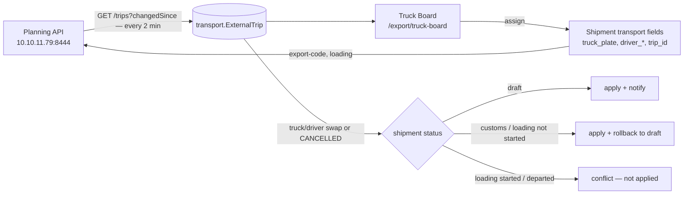

# Truck Board — Planning trips ↔ shipments

## What Is This Process?

Since 2026-09-29 the transport department plans trucks in **its own program ("Planning")**,
not in ours. For every **regular (non-gapy) shipment** the tractor, trailer and driver come from a
Planning **trip**. The export manager joins a trip to a shipment on the Truck Board; countries must
match. **Gapy satyş is unchanged** — its driver is still typed in (`SheetGapyDriverEditor`).

Spec: `docs/superpowers/specs/2026-09-29-transport-trips-design.md`.
Contract (Planning's): `docs/transport_api_docs/planning-integration-api.v1.yaml` (main tree, untracked).

## Flow



## Pieces

| Piece | Where |
|---|---|
| Mirror model | `apps/transport/models/external_trip.py` — `ExternalTrip` (one row per Planning trip, `shipment` OneToOne = our link), `ExternalTripSyncState` (cursor + health) |
| API client + mock | `apps/transport/services/trips_client.py` — `TripsClient`, `MockTripsClient`, `get_trips_client()` |
| Poller | `apps/transport/services/trip_sync.py` + Celery `poll_external_trips` (beat, 120 s). Polls from `cursor − 5 min` (strictly-after + same-timestamp safety), all pages; fills `destinationCountryCode` from `GET /trips/{id}` when the list lacks it |
| Assign / unassign / move / accept / react | `apps/transport/services/trip_assignment.py` |
| Rollback | `apps/export/services/rollback.py` + `transition_to(..., rollback=True)` (system-only `ROLLBACK_TRANSITIONS`, never in `TRANSITIONS`) |
| Pushes to Planning | `apps/transport/services/trip_push.py` + Celery `push_trip_update` |
| Sheet lock | `apps/export/services/trip_lock.py` (PATCH guard) + `isTripLockedCell` in `frontend/src/utils/sheetPermissions.ts` |
| Screen | `frontend/src/pages/export/TruckBoard.tsx` (+ `truckBoard/`), banner `components/shipment/ShipmentTripBanner.tsx` |

## What assigning writes on the shipment

`truck_plate = "{tractor}/{trailer}"`, `driver_name`, `driver_phone`, `driver_passport_serial`,
`driver_passport_issue_date` (**= Planning's passport EXPIRY date** — Planning does not send an issue
date; spec D3), `truck_head_id` / `trailer_id` (our fleet row matched by normalised plate — keeps GPS
matching working), `trip_id` (= `ExternalTrip.pk`). `driver_id` stays null — external drivers are not
`transport.Driver` rows; documents read `driver_passport_serial`.

## Reaction to a Planning change

Only a swap of tractor plate, trailer plate, driver name or passport — or status `CANCELLED` —
counts. Status moves (`CREATED → PLANNED …`) and our own export-code push do not.

| Shipment status | Truck/driver changed | Trip cancelled |
|---|---|---|
| `draft` | apply, comment "was → now", notify export_manager | unlink, reopen `choose_truck` |
| `gumruk_girish`, `gumruk_chykysh`, `yuklenme` without loading timestamps | apply **and roll back to draft** | unlink **and roll back** |
| `yuklenme` with `loading_started_at`/`loading_ended_at`, or later | **conflict** — not applied, red banner | **conflict** — stays linked |

Rollback re-gates the steps already passed, otherwise auto-advance would walk straight back:
`documents_status → in_progress` and `start_documents_prep` reopened; for every passed step its gate
task is reopened and its trigger field cleared (`customs_exit_at`, `loading_started_at`).
A conflict clears only by **Accept** (take Planning's values, no status change) or **Unlink**.

Our shipment cancelled → the next poll frees its trip (Planning is not told; no such operation).

## Pushes (MVP)

| Op | When | Body |
|---|---|---|
| `export-code` | on assign; again whenever `export_code` differs from `last_pushed_export_code` (checked every poll) | `exportCode` |
| `loading` | on assign only | `city` = loading location name, `place` = block codes |

`Idempotency-Key` = `eventId` = `ygt-{uuid}-{op}-{enqueue ms}`; retries reuse it. `TRIP_CLOSED` →
give up. `DUPLICATE_EXPORT_CODE` / 4xx → error shown on the shipment banner. Loading corrections after
assignment are **not** re-sent (out of MVP).

## Tasks & permissions

- `tasks.choose_truck` (export_manager, draft, target `trip_id`, non-gapy) replaces the retired
  non-gapy `tasks.assign_driver`.
- Page `export.truck_board` (core/0066): admin, director, export_manager, document_team, boss,
  transport. Writes need `shipment_assign.can_edit` → transport is read-only.

## Mock mode (demo safety)

`TRANSPORT_API_MODE=mock` → trips come from `apps/transport/fixtures/external_trips.json`, pushes are
only logged, PDF is a blank sample; the board shows a **Demo** tag. To stage a change:

```
python manage.py simulate_trip_change <uuid> --driver "New Name"   # or --tractor / --trailer / --cancel
```

The next poll (≤ 2 min) runs the full reaction. The command edits a tracked file — afterwards
`git checkout backend/apps/transport/fixtures/external_trips.json`.

## Deploy

1. Server `.env`: `TRANSPORT_API_URL`, `TRANSPORT_API_KEY`, `TRANSPORT_API_MODE=live`,
   `TRANSPORT_API_VERIFY_TLS` (CA path or `false`).
2. `python manage.py migrate core transport` (core 0066, transport 0009).
3. `python manage.py seed_task_rules` — only now. Deactivating the regular `assign_driver` cancels its
   open tasks, and a cancelled task counts as satisfied, so open regular drafts lose the driver gate
   (accepted by the owner 2026-09-29).
4. Rebuild the celery worker + beat containers (the poller is a beat job, not crontab).

## Known gaps

- Planning has a foreign passport for 1 of 95 own drivers — documents print blanks until they fill it.
- `destinationCountryCode` is missing from Planning's list response (they will add it); until then one
  detail call per new trip.
- Detail page transport selectors are not locked (only the Sheet); the backend PATCH guard refuses the
  write either way.
