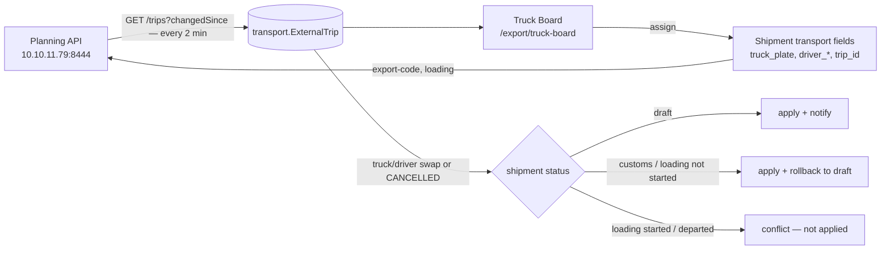

# Truck Board — Planning trips ↔ shipments

## What Is This Process?

Since 2026-09-29 the transport department plans trucks in **its own program ("Planning")**,
not in ours. For every **regular (non-gapy) shipment** the tractor, trailer and driver come from a
Planning **trip**. The export manager joins a trip to a shipment on the Truck Board; countries must
match. **Gapy satyş is unchanged** — its driver is still typed in (`SheetGapyDriverEditor`).

Spec: `docs/superpowers/specs/2026-09-29-transport-trips-design.md`.
Contract (Planning's): `docs/transport_api_docs/planning-integration-api.v1.yaml` (main tree, untracked).

## Flow



## Pieces

| Piece | Where |
|---|---|
| Mirror model | `apps/transport/models/external_trip.py` — `ExternalTrip` (one row per Planning trip, `shipment` OneToOne = our link), `ExternalTripSyncState` (cursor + health) |
| API client + mock | `apps/transport/services/trips_client.py` — `TripsClient`, `MockTripsClient`, `get_trips_client()` |
| Poller | `apps/transport/services/trip_sync.py` + Celery `poll_external_trips` (beat, 120 s). Polls from `cursor − 5 min` (strictly-after + same-timestamp safety), all pages; fills `destinationCountryCode` from `GET /trips/{id}` when the list lacks it |
| Assign / unassign / move | `apps/transport/services/trip_assignment.py` |
| React to Planning changes, Accept | `apps/transport/services/trip_changes.py` (`find_pending_changes`, `apply_trip_change`) |
| Notifications | `apps/transport/services/trip_notify.py` |
| Rollback | `apps/export/services/rollback.py` + `transition_to(..., rollback=True)` (system-only `ROLLBACK_TRANSITIONS`, never in `TRANSITIONS`) |
| Pushes to Planning | `apps/transport/services/trip_push.py` + Celery `push_trip_update` |
| Sheet / Detail lock | `apps/export/services/trip_lock.py` (PATCH guard) + `isTripLockedCell` in `frontend/src/utils/sheetPermissions.ts`; Detail: `ShipmentTransportBody` locks the truck/driver selectors and `lockedKeys` rows |
| Screen | `frontend/src/pages/export/TruckBoard.tsx` (+ `truckBoard/`), banner `components/shipment/ShipmentTripBanner.tsx` |

## What assigning writes on the shipment

`truck_plate = "{tractor}/{trailer}"`, `driver_name`, `driver_phone`, `driver_passport_serial`,
`driver_passport_expiry` (Planning sends the passport's expiry, never its issue date, so
`driver_passport_issue_date` stays empty and keeps its gapy meaning — migration `export/0091`), `truck_head_id` / `trailer_id` (our fleet row matched by normalised plate — keeps GPS
matching working), `trip_id` (= `ExternalTrip.pk`). `driver_id` stays null — external drivers are not
`transport.Driver` rows; documents read `driver_passport_serial`.

## Reaction to a Planning change

Only a swap of tractor plate, trailer plate, driver name or passport — or status `CANCELLED` —
counts. Status moves (`CREATED → PLANNED …`) and our own export-code push do not.

| Shipment status | Truck/driver changed | Trip cancelled |
|---|---|---|
| `draft` | apply, comment "was → now", notify export_manager | unlink, reopen `choose_truck` |
| `gumruk_girish`, `gumruk_chykysh`, `yuklenme` without loading timestamps | apply **and roll back to draft** | unlink **and roll back** |
| `yuklenme` with `loading_started_at`/`loading_ended_at`, or later | **conflict** — not applied, red banner | **conflict** — stays linked |

Rollback re-gates the steps already passed, otherwise auto-advance would walk straight back:
`documents_status → in_progress`; for every passed step its gate task is reopened and its trigger
field cleared (`customs_exit_at`, `loading_started_at`). **Since the PREP/DOCS chain (2026-09-30)**
it also reopens document tasks 11–21b, 22 and the advance (20 — a second advance is needed, the first
stays linked) and stamps `Shipment.documents_reset_at`; downloads and advances from before the stamp
do not count. See [[../reference/task-rules#PREP / DOCS chain (2026-09-30)]].

**Rollback mark.** While `documents_reset_at` is set the shipment shows an orange tag «Maşyn üýtgedi — resminamalar täzeden» / «Машина изменена — документы заново» (`components/shipment/DocumentsRedoTag.tsx`)
on the Linked trips tab (`ExternalTrip.shipment_documents_reset_at`), the Sheet column header (short
«Maşyn üýtgedi»), the «Подготовка» card and the shipment card; reopened tasks on My tasks show
«Täzeden: maşyn üýtgedi» (`Task.documents_redo`). It clears when «Gümrüge ugradyldy» (21b) closes.
A conflict clears only by **Accept** (take Planning's values, no status change) or **Unlink**.

Our shipment cancelled → the next poll frees its trip (Planning is not told; no such operation).

## Pushes (MVP)

| Op | When | Body |
|---|---|---|
| `export-code` | on assign; again whenever `export_code` differs from `last_pushed_export_code` (checked every poll) | `exportCode` |
| `loading` | on assign; again whenever loading location or blocks differ from `last_pushed_loading` (checked every poll) | `city` = loading location name, `place.name` = block names, `place.ref` = first block code |

`Idempotency-Key` = `eventId` = `ygt-{uuid}-{op}-{enqueue ms}`; retries reuse it. `TRIP_CLOSED` →
give up. Any other refusal → stored as `"<op>: <CODE>"` in `last_push_error`, shown (translated) on the
shipment banner, export managers notified. Retries running out clear the op's `last_pushed_*` marker, so
the next poll sends it again.

## Cards (2026-09-30)

- **Shipment card:** code, date, country, customer, blocks, export code (or "No export code"), documents
  status, export firms → importer, loading place → destination city (`candidate-shipments` returns
  `export_code`, `documents_status`, `import_firm(_name)`, `loading_location(_name)`, `city(_name)`,
  `export_firms[]`).
- **Trip card:** plates, date, driver, own/third-party, country, ⚠ visa, GPS place + age; **More ▾** expands in
  place — vehicles with brand/model/company, phone, passport + expiry, visas, Planning status and number, a mini
  map when there is GPS (`TripMiniMap`, shared with the drawer), trip PDF. **Details** still opens the drawer.

## Where conflicts and statuses are worded

The backend stores conflicts structured — `conflict_kind` (`changed` / `cancelled`), `conflict_from`,
`conflict_to` (migration `transport/0010`) — and the frontend words them per language
(`truck_board.conflict.*`, `truck_board.status.*`, `truck_board.push_error.*`,
`pages/export/truckBoard/useTripMessages.ts`). `conflict_note` is the English line kept for the shipment's
comment trail.

## Endpoints

`/api/v1/transport/external-trips/` (filters `free`, `linked`, `country`, `date`), `…/{id}/`,
`…/{id}/document/`, `…/{id}/assign|unassign|move|accept-change/`, `…/sync-state/`,
`…/candidate-shipments/`; `/api/v1/transport/shipments/{id}/trip/` (any signed-in user — the shipment
page banner). Errors: `{"error": "<code>"}`.

## Tasks & permissions

- `tasks.choose_truck` (export_manager, draft, target `trip_id`, non-gapy) replaces the retired
  non-gapy `tasks.assign_driver`.
- Page `export.truck_board` (core/0070): admin, director, export_manager, document_team, boss,
  transport. Writes need `shipment_assign.can_edit` → transport is read-only.

## Mock mode (demo safety)

`TRANSPORT_API_MODE=mock` → trips come from `apps/transport/fixtures/external_trips.json`, pushes are
only logged, PDF is a blank sample; the board shows a **Demo** tag. To stage a change:

```
python manage.py simulate_trip_change <uuid> --driver "New Name"   # or --tractor / --trailer / --cancel
```

The next poll (≤ 2 min) runs the full reaction. The command edits a tracked file — afterwards
`git checkout backend/apps/transport/fixtures/external_trips.json`.

## Deploy

1. Server `.env`: `TRANSPORT_API_URL`, `TRANSPORT_API_KEY`, `TRANSPORT_API_MODE=live`,
   `TRANSPORT_API_VERIFY_TLS` (CA path or `false`).
2. `python manage.py migrate core transport export` (core 0070, transport 0009–0010, export 0091 — all after main's latest).
3. `python manage.py seed_task_rules` — only now. Deactivating the regular `assign_driver` cancels its
   open tasks, and a cancelled task counts as satisfied, so open regular drafts lose the driver gate
   (accepted by the owner 2026-09-29).
4. Rebuild the celery worker + beat containers (the poller is a beat job, not crontab).

## Known gaps

- Planning has a foreign passport for 1 of 95 own drivers — documents print blanks until they fill it.
- `destinationCountryCode` is missing from Planning's list response (they will add it); until then one
  detail call per new trip.
- API errors on these endpoints follow the contract shape `{"error": "<code>"}` (e.g. `trip_taken`,
  `country_unknown`, `trip_locked` + `fields`); the frontend maps the code to `truck_board.error.*`.
