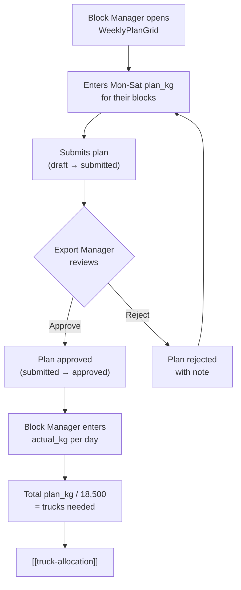
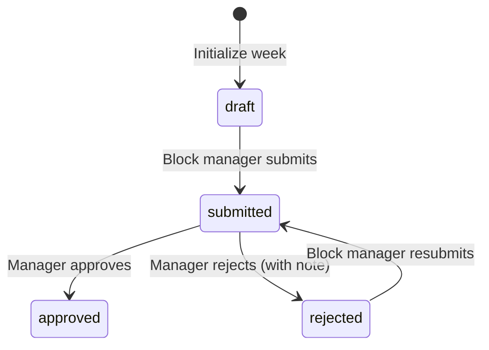
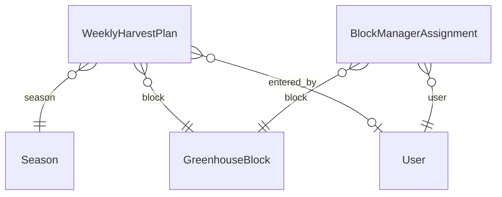

# Weekly Harvest Planning

## What Is This Process?

Block managers (7 people, each managing 1-3 greenhouse blocks out of 15 total) enter their planned tomato harvest in kg for each day of the week (Monday-Saturday). Plans go through an approval workflow (draft → submitted → approved/rejected). Once approved, actual harvest weights are recorded. The total planned kg determines how many trucks are needed ([[truck-allocation]]).

## How It Works (Business Flow)

### Approval Workflow States

**PLAN_TRANSITIONS**:
- `draft` → `submitted`
- `submitted` → `approved`, `rejected`
- `rejected` → `submitted` (resubmit after fixes)

## Database

### Tables

| Table | Schema | Purpose | Key Columns |
|-------|--------|---------|-------------|
| `greenhouse.weekly_harvest_plans` | greenhouse | 15 blocks × 1 week = up to 15 rows | season, block, week_number, year, 6 plan_kg, 6 actual_kg, status |
| `greenhouse.block_manager_assignments` | greenhouse | Which user manages which block | user_id, block_id, is_active |

### WeeklyHarvestPlan Fields (AD-3: 12 columns)

| Field | Type | Notes |
|-------|------|-------|
| `season` | FK → Season | Which growing season |
| `block` | FK → GreenhouseBlock | Which greenhouse block (A through O) |
| `week_number` | PositiveSmallInt | ISO week number (1-52) |
| `year` | PositiveSmallInt | Year |
| `monday_plan_kg` through `saturday_plan_kg` | Decimal(10,2) | Planned harvest per day, default=0 |
| `monday_actual_kg` through `saturday_actual_kg` | Decimal(10,2) | Actual harvest per day, nullable |
| `actual_weekly_total_kg` | Decimal(10,2) | Fallback total if daily actuals missing |
| `status` | CharField | draft / submitted / approved / rejected |
| `submitted_at`, `submitted_by` | DateTime, FK User | When/who submitted |
| `approved_at`, `approved_by` | DateTime, FK User | When/who approved |
| `rejected_at`, `rejected_by`, `rejection_note` | DateTime, FK User, Text | When/who/why rejected |
| `entered_by` | FK User | Who created the record |

### Key Constraints

- **Unique**: `(season, block, week_number, year)` — one plan per block per week
- **Check**: all `plan_kg >= 0`

### Relationships

## Backend Implementation

### Models

**File**: `backend/apps/greenhouse/models/harvest_plan.py`

- `WeeklyHarvestPlan` — 12 data columns (6 plan + 6 actual) per row, approval workflow fields
- `BlockManagerAssignment` — links users to blocks, `is_active` flag, unique `(user, block)`

### Services

**File**: `backend/apps/core/services_workflow.py` (shared approval workflow)

| Function | Input | Output | Logic |
|----------|-------|--------|-------|
| `validate_transition(current, target, transitions)` | Status strings + transitions dict | None or raises ValueError | Checks if transition is allowed |
| `apply_status_change(plan, target, user, ...)` | Plan instance + new status + user | List of updated field names | Sets status, timestamp, user fields; clears rejection fields on resubmit |
| `create_audit_entry(user, action, ...)` | User + action details | AuditLog row | Immutable audit trail |

Greenhouse-specific workflow uses these generic helpers with `PLAN_TRANSITIONS` dict.

### ViewSet & Endpoints

**File**: `backend/apps/greenhouse/views.py` — `WeeklyHarvestPlanViewSet`

| Method | Endpoint | Action | Auth |
|--------|----------|--------|------|
| GET | `/api/v1/greenhouse/harvest-plans/` | List (filterable) | IsAuthenticated |
| GET | `/api/v1/greenhouse/harvest-plans/{id}/` | Detail | IsAuthenticated |
| POST | `/api/v1/greenhouse/harvest-plans/` | Create | IsAuthenticated |
| PATCH | `/api/v1/greenhouse/harvest-plans/{id}/` | Update (status-locked) | IsAuthenticated + block auth |
| POST | `/api/v1/greenhouse/harvest-plans/{id}/submit/` | Submit for approval | Block owner / manager |
| POST | `/api/v1/greenhouse/harvest-plans/{id}/approve/` | Approve | director, export_manager |
| POST | `/api/v1/greenhouse/harvest-plans/{id}/reject/` | Reject (with note) | director, export_manager |
| POST | `/api/v1/greenhouse/harvest-plans/bulk-submit/` | Bulk submit | `{ids: []}` |
| POST | `/api/v1/greenhouse/harvest-plans/bulk-approve/` | Bulk approve | `{ids: []}` |
| POST | `/api/v1/greenhouse/harvest-plans/bulk-reject/` | Bulk reject | `{ids: [], rejection_note: "..."}` |
| POST | `/api/v1/greenhouse/harvest-plans/initialize-week/` | Create drafts for all blocks | director, export_manager |
| GET | `/api/v1/greenhouse/harvest-plans/block-summary/` | Block summary stats | `?year=&week=` |

**Filters**: `?season=`, `?block=`, `?year=`, `?week=`

### Per-Block Authorization

- `director` and `export_manager`: always allowed to view/edit all blocks
- `greenhouse_manager`: must have active `BlockManagerAssignment` for the block
- Other roles: read-only

### Status-Based Field Locking

| Status | Plan fields (plan_kg) | Actual fields (actual_kg) |
|--------|----------------------|--------------------------|
| `draft` | Editable | Locked |
| `submitted` | Locked (no edits at all) | Locked |
| `approved` | Locked | Editable (only for today or past days) |
| `rejected` | Editable (fix and resubmit) | Locked |

## Frontend Implementation

### Page: WeeklyPlanGrid

**File**: `frontend/src/pages/export/WeeklyPlanGrid.tsx`

**Layout**:
- Week picker (← prev, DatePicker week, next →)
- Pivot toggle button (normal ↔ transposed view)
- Initialize week button (if empty week, manager only)

**Stat Cards** (4 across top):
| Card | Value | Color |
|------|-------|-------|
| Total Plan | Sum of all plan_kg | Blue |
| Total Actual | Sum of all actual_kg | Green |
| Deficit | actual - plan | Green if ≥0, Red if <0 |
| Est. Trucks | plan / 18,500 | Purple |

**Status Summary Toolbar**:
- Status tags showing counts: X approved / Y submitted / Z draft / W rejected
- Bulk action buttons (visible based on role + data state):
  - Submit All Drafts (count badge)
  - Approve All Submitted (manager only)
  - Reject All Submitted (manager only, requires note)

**Normal View — Grid Table**:

| Column | Sub-columns | Notes |
|--------|-------------|-------|
| Block (fixed left) | block_code tag + block_name | Greenhouse manager's own blocks highlighted yellow |
| Monday | Plan (blue) + Actual (green) | Editable based on status + role |
| Tuesday | Plan + Actual | Same |
| Wednesday | Plan + Actual | Same |
| Thursday | Plan + Actual | Same |
| Friday | Plan + Actual | Same |
| Saturday | Plan + Actual | Same |
| Total | Plan total + Actual total | Calculated |
| Status (fixed right) | Badge with rejection note tooltip | Color-coded |

Summary row at bottom with day totals and grand totals.

**Transposed View**: Rows = Days (Mon-Sat), Columns = Blocks (A-O). Each cell shows plan/actual stacked.

**Embedded Component**: TruckAllocationTable (collapsible, expanded by default) — shows truck allocation per day/destination. See [[truck-allocation]].

### Hooks

| Hook | Endpoint | Params | Returns | Stale Time |
|------|----------|--------|---------|------------|
| `useHarvestPlans` | `GET /greenhouse/harvest-plans/` | season, year, week | `IApiListResponse<IWeeklyHarvestPlan>` | 60s |
| `useUpsertHarvestPlan` | `PATCH/POST /greenhouse/harvest-plans/` | id + partial fields | `IWeeklyHarvestPlan` | mutation |
| `useBulkSubmitHarvestPlans` | `POST /greenhouse/harvest-plans/bulk-submit/` | `{ids: []}` | `{submitted: [], errors: []}` | mutation |
| `useBulkApproveHarvestPlans` | `POST /greenhouse/harvest-plans/bulk-approve/` | `{ids: []}` | `{approved: [], errors: []}` | mutation |
| `useBulkRejectHarvestPlans` | `POST /greenhouse/harvest-plans/bulk-reject/` | `{ids: [], rejection_note}` | `{rejected: [], errors: []}` | mutation |

### TypeScript Types

**`IWeeklyHarvestPlan`**:
- `id`, `season`, `block`, `block_code`, `block_name`, `week_number`, `year`
- `monday_plan_kg` through `saturday_plan_kg` (6 plan fields)
- `monday_actual_kg` through `saturday_actual_kg` (6 actual fields)
- `total_plan_kg`, `total_actual_kg` (computed)
- `status` ('draft' | 'submitted' | 'approved' | 'rejected')
- `submitted_at`, `approved_at`, `rejected_at`, `rejection_note`

### User Interactions

1. **Navigate weeks**: Click ← / → or pick a week from DatePicker
2. **Initialize empty week**: Click "Initialize" → creates draft rows for all 15 active blocks
3. **Enter plan_kg**: Click cell → type number → blur saves (only if draft/rejected + own block)
4. **Enter actual_kg**: Click cell → type number → blur saves (only if approved + day ≤ today)
5. **Submit**: Click row submit or bulk submit → transitions draft → submitted
6. **Approve/Reject**: Manager clicks bulk approve/reject (reject requires note in modal)
7. **Toggle view**: Switch between normal and transposed pivot

## Roles & Permissions

| Role | View | Edit Plan | Edit Actual | Submit | Approve/Reject |
|------|------|-----------|-------------|--------|----------------|
| `greenhouse_manager` | Own blocks (highlighted) | Own blocks only (draft/rejected) | Own blocks (approved, past/today) | Own blocks | No |
| `export_manager` | All blocks | All blocks | All blocks | All blocks | Yes |
| `director` | All blocks | All blocks | All blocks | All blocks | Yes |
| Others | Read-only | No | No | No | No |

## Connections to Other Processes

- **[[truck-allocation]]** — Total plan_kg / 18,500 = estimated truck count. TruckAllocationTable is embedded directly in WeeklyPlanGrid
- **[[shipment-creation]]** — Harvest readiness feeds into decisions about when to create shipments
- **[[domestic-sales]]** — Domestic sale records track tomatoes sold locally (not exported)
