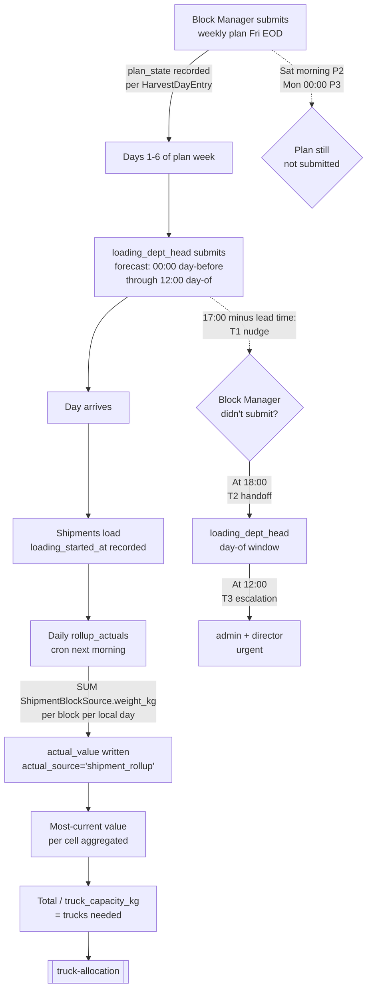
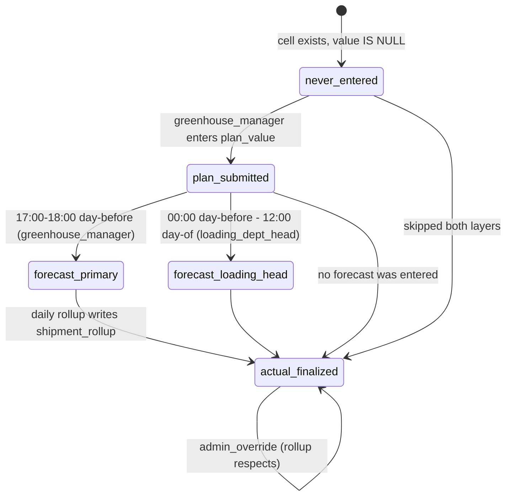

# Weekly Harvest Planning

## What Is This Process?

Block managers (7 people, each managing 1–3 of the 15 greenhouse blocks) plan, then refine, then record their tomato harvest at three layers per block per day:

1. **Plan** — submitted Friday for the next week (Mon–Sat); soft late-flag through Saturday/Sunday; critical-late flag on Monday morning.
2. **Forecast** — a daily revision submitted between 17:00 the day before and 09:00 the day-of, with explicit window state (`primary` / `fallback` / `same_day_red_flag`).
3. **Actual** — entered manually as today, until the pallet rollup phase replaces this with auto-aggregation.

Submission is final once recorded. There is no approve/reject step (per AD-15 / Apr 2026 design — the approval workflow was removed when the Forecast Layer landed). Admin can override any cell anytime with a required `reason` that writes to the audit log.

The total kg, computed per cell as **most-current value** (Actual if past, Forecast if present, Plan otherwise), divided by `truck_capacity_kg` from `GreenhouseConfig` (default 18,500), produces the truck estimate that feeds [[truck-allocation]].

## How It Works (Business Flow)



### Submission-window state machine (per HarvestDayEntry)



The state is implicit, derived from which of `plan_submitted_at` / `forecast_submitted_at` / `actual_finalized_at` are non-NULL. There is no enum status field on the row.

## Database

### Tables

| Table | Schema | Purpose | Key Columns |
|-------|--------|---------|-------------|
| `greenhouse.weekly_harvest_plans` | greenhouse | Per-week container, one row per `(season, block, week_number, year)` | locked_at, entered_by |
| `greenhouse.harvest_day_entries` | export | Daily-grain Plan/Forecast/Actual data, one row per `(weekly_plan, entry_date)` | see below |
| `greenhouse.block_manager_assignments` | greenhouse | Which user manages which block | user_id, block_id, is_active |
| `core.greenhouse_config` | core | Singleton (`pk=1`) for tunable deadlines, truck capacity, operating-days bitmask, timezone | see below |
| `core.operating_day_exceptions` | core | Ad-hoc holiday calendar | date UNIQUE, is_holiday, note |
| `export.harvest_dispatch_log` | export | Idempotency record for time-based notification triggers | UNIQUE(trigger_kind, target_user, scope_date) |

### `HarvestDayEntry` fields (the daily grain)

| Group | Fields | Notes |
|-------|--------|-------|
| Identity | `weekly_plan` (FK CASCADE), `season`, `block`, `entry_date`, `weekday` (0=Mon … 6=Sun) | UNIQUE(weekly_plan, entry_date). `weekday` allows 6 so end-of-season Sunday harvesting is supported. |
| Plan | `plan_value` (Decimal, nullable), `plan_submitted_at`, `plan_submitted_by`, `plan_state` (`on_time` / `late` / `critical_late` / `''`) | `plan_state` is computed from submit time vs `GreenhouseConfig` deadlines. |
| Forecast | `forecast_value`, `forecast_submitted_at`, `forecast_submitted_by`, `forecast_window` (`primary` / `fallback` / `same_day_red_flag` / `''`), `forecast_revision_count` (PositiveSmallInt) | Revision count increments on each edit. |
| Actual | `actual_value`, `actual_finalized_at`, `actual_source` (`manual` / `pallet_rollup_pending` / `shipment_rollup` / `admin_override` / `''`) | `shipment_rollup` is the daily computed source; `admin_override` blocks subsequent rollups from clobbering the manual value. |
| Override | `last_override_at`, `last_override_by`, `last_override_reason` (CharField 500, Cyrillic_General_CI_AS) | Snapshot of most-recent admin override; full history in `AuditLog`. |
| Audit | `created_at`, `updated_at` | Standard. |

**Empty-vs-zero rule**: `value IS NULL` ⇒ "not entered" (em-dash); `value = 0 AND *_submitted_at IS NOT NULL` ⇒ explicit confirmed zero (italic with checkmark). No extra boolean column needed.

### `WeeklyHarvestPlan` (post-rewrite — container only)

| Field | Type | Notes |
|-------|------|-------|
| `season`, `block`, `week_number`, `year` | FK + ints | UNIQUE(season, block, week_number, year) |
| `locked_at` | DateTime nullable | When set, all edits frozen; admin re-opens by clearing to NULL |
| `entered_by` | FK User | Who created the row |
| `created_at`, `updated_at` | DateTime | Standard |

The wide columns (`monday_plan_kg`…`saturday_actual_kg`, `actual_weekly_total_kg`) and approval workflow (`status`, `approved_at`, `approved_by`, `rejected_at`, `rejected_by`, `rejection_note`) were dropped in `greenhouse.0004_harvestdayentry_harvestdispatchlog_and_more`. See [[../../ADR|ADR-017]]. The container-level `submitted_at` / `submitted_by` columns were dropped in `greenhouse.0004_drop_weeklyharvestplan_submitted_fields` (May 2026) — every cell save already stamps its own per-day `plan_submitted_at`, so the week-level "submit" button became redundant. P1/P2/P3 dispatcher triggers now check "any HarvestDayEntry for this week+block has a plan_value" instead of `WeeklyHarvestPlan.submitted_at IS NOT NULL`.

### `GreenhouseConfig` (singleton)

| Field | Default | Purpose |
|-------|---------|---------|
| `plan_deadline_weekday` | 4 (Friday) | Plan must be submitted by EOD this weekday for `on_time` |
| `plan_late_until_weekday` | 6 (Sunday) | Submission allowed but flagged `late` through this weekday |
| `plan_critical_late_at_weekday` + `_at_time` | 0 + 00:00 (Monday) | After this, flag becomes `critical_late` |
| `forecast_primary_open` / `_close` | 17:00 / 18:00 | Block-manager primary window (day-before) |
| `forecast_fallback_close` | 09:00 | warehouse_chief fallback window closes (day-of) |
| `forecast_same_day_close` | 23:59 | After this, forecast is locked |
| `notification_lead_minutes` | 60 | T1 nudge fires at `forecast_primary_open − 60 min` |
| `truck_capacity_kg` | 18,500 | Used in Est. Trucks tile (was hardcoded in frontend) |
| `operating_days_bitmask` | 0b0111111 | Bits 0–6 = Mon–Sun; default Mon–Sat |
| `timezone_name` | `Asia/Ashgabat` | All deadline math in this local time |

## Backend Implementation

### Models

**Files**:
- `backend/apps/greenhouse/models/harvest_day_entry.py` — `HarvestDayEntry`
- `backend/apps/greenhouse/models/harvest_plan.py` — `WeeklyHarvestPlan` (container only)
- `backend/apps/greenhouse/models/dispatch_log.py` — `HarvestDispatchLog`
- `backend/apps/core/models/config.py` — `GreenhouseConfig`
- `backend/apps/core/models/operating_day.py` — `OperatingDayException`

### Services

**Package**: `backend/apps/greenhouse/services/`

| Function | Purpose |
|----------|---------|
| `set_plan_value(entry, value, user, reason='')` | Writes plan_value, plan_submitted_at/by, computes plan_state. Admin override path also writes `last_override_*` snapshot + `AuditLog.detail = "OVERRIDE: {reason}"`. |
| `set_forecast_value(entry, value, user, reason='')` | Writes forecast_value, computes forecast_window per current time, increments forecast_revision_count, audit. |
| `set_actual_value(entry, value, user, reason='')` | Admin-only manual override path. Stamps `actual_source='admin_override'` so the daily rollup respects it. |
| `rollup_actuals_for_date(target_date, force=False, dry_run=False)` | Daily rollup. Sums `ShipmentBlockSource.weight_kg` joined to `Shipment.loading_started_at` per block per local day, writes `actual_value` + `actual_source='shipment_rollup'`. Skips `admin_override` rows unless `force`. Returns `RollupResult` with counters and silent-gap shipment list. |
| `admin_override(entry, field, value, reason, user)` | Wraps the appropriate setter; required `reason` non-empty. |
| `compute_plan_state(submitted_at_local, plan_week_start, config)` | Returns `'on_time'` / `'late'` / `'critical_late'`. Pure function. |
| `compute_forecast_window(submitted_at_local, entry_date, config)` | Returns `'primary'` / `'fallback'` / `'same_day_red_flag'` / `None` (locked). Pure function. |

### ViewSets & Endpoints

**File**: `backend/apps/greenhouse/views.py`

| Method | Endpoint | Action | Auth |
|--------|----------|--------|------|
| GET | `/api/v1/greenhouse/harvest-plans/` | List weekly containers | IsAuthenticated |
| GET | `/api/v1/greenhouse/harvest-plans/{id}/` | Container detail | IsAuthenticated |
| PATCH | `/api/v1/greenhouse/harvest-plans/{id}/` | Update container fields (locked_at) | IsAuthenticated + block auth |
| POST | `/api/v1/greenhouse/harvest-plans/initialize-week/` | Create container rows for all active top-level blocks | greenhouse_manager / admin |
| GET | `/api/v1/greenhouse/harvest-plans/block-summary/` | Block summary stats | `?year=&week=` |
| GET | `/api/v1/greenhouse/day-entries/` | List daily entries | filter `?season=&block=&from_date=&to_date=` |
| GET | `/api/v1/greenhouse/day-entries/{id}/` | Day entry detail | IsAuthenticated |
| PATCH | `/api/v1/greenhouse/day-entries/{id}/` | Update plan_value / forecast_value / actual_value (with optional `reason` for admin) | Service-layer permission gate |
| GET | `/api/v1/greenhouse/day-entries/{id}/history/` | Audit log + override snapshot | IsAuthenticated |

**Submission endpoints REMOVED**: no more `submit/`, `approve/`, `reject/`, `bulk-submit/`, `bulk-approve/`, `bulk-reject/`, or `submit_week/`. Per-cell PATCHes through `/day-entries/{id}/` are the only write path; each save stamps its own `plan_submitted_at` / `forecast_submitted_at`. There is no week-level "submit" step.

**Config endpoints**:
| Method | Endpoint | Auth |
|--------|----------|------|
| GET / PATCH | `/api/v1/core/greenhouse-config/` | admin only on PATCH |
| GET / POST / PATCH / DELETE | `/api/v1/core/operating-day-exceptions/` | admin writes; all read |

### Time-based dispatcher

**Files**:
- `backend/apps/greenhouse/dispatcher.py` — pure logic
- `backend/apps/greenhouse/management/commands/run_harvest_dispatcher.py` — entry point

Six triggers, all idempotent via `HarvestDispatchLog(trigger_kind, target_user, scope_date)` UNIQUE:

| Trigger | When | To |
|---------|------|-----|
| **T1** `forecast_nudge` | `forecast_primary_open − notification_lead_minutes` | Block managers with missing forecasts for tomorrow |
| **T2** `forecast_handoff` | `forecast_primary_close` (18:00 day-before) | warehouse_chief, with gap list |
| **T3** `forecast_escalation` | `forecast_fallback_close` (09:00 day-of) | warehouse_chief + admin + director, urgent |
| **P1** `plan_deadline_reminder` | Friday morning | Block manager (plan not yet submitted for next week) |
| **P2** `plan_late` | Saturday morning | Block manager |
| **P3** `plan_critical_late` | Monday 00:00 of plan week | Block manager + admin |

Run from system cron every 5 min:
```
*/5 * * * * cd /opt/ygt/backend && /opt/ygt/backend/venv/bin/python manage.py run_harvest_dispatcher
```

In-app notifications only this iteration. SMS / Telegram / WhatsApp deferred. The personal-kanban auto-task hook is a TODO no-op call site in `dispatcher.fire(event)` — auto-tasks land when the parallel kanban work ships.

### Daily actual rollup

**Files**:
- `backend/apps/greenhouse/services/actual_rollup.py` — `rollup_actuals_for_date(target_date, force=False, dry_run=False) -> RollupResult`. Pure service.
- `backend/apps/greenhouse/management/commands/rollup_actuals.py` — entry point.

Runs once per day on a separate schedule from the 5-minute dispatcher. Defaults to yesterday in `GreenhouseConfig.timezone_name` (Asia/Ashgabat). Selection is by **timezone-aware UTC range** derived from the target local date — never `__date=` filter, which would evaluate in the connection's timezone (UTC) and shift the answer for shipments loaded near midnight.

```
30 2 * * * cd /opt/ygt/backend && /opt/ygt/backend/venv/bin/python manage.py rollup_actuals
```

Flags:
- `--date YYYY-MM-DD` — explicit date instead of yesterday
- `--force` — overwrite even rows with `actual_source='admin_override'`
- `--dry-run` — compute and log without writing

**Silent-gap reporting**: every shipment with `loading_started_at` on the target date but no `ShipmentBlockSource` rows is listed in stdout (and `RollupResult.shipments_without_blocks`). Those shipments contribute 0 kg to the rollup — operations should fill the block split or the day's actual will under-report.

See `docs/operations/cron.md` for Linux + Windows Task Scheduler setup.

## Frontend Implementation

### Page: WeeklyPlanGrid

**File**: `frontend/src/pages/export/WeeklyPlanGrid.tsx`

**Layout**: week picker, pivot toggle, Show/Hide Sunday toggle, "Initialize" + "Submit week" + "Fallback Mode" buttons (role-gated), header tile row, grid table.

**Sunday toggle**: Sunday is the 7th day column and is rarely used, so it is **hidden by default** to keep the grid narrower. A toolbar button (`plan.show_sunday` / `plan.hide_sunday`) reveals it; state lives in `uiStore.planShowSunday`. The toggle drives both the harvest grid and the truck-allocation table (`showSunday` prop) — Sunday is always the last day in `DAYS`, so slicing it off leaves every other day's index (`di`, used for date offsets and `day_of_week`) intact. Backend day-entry rows are still created for all 7 days; the toggle is display-only.

**Header tiles** (4 across top, replaces the old Plan/Actual/Deficit/Trucks):

| Tile | Value | Logic |
|------|-------|-------|
| Total Plan | Sum of `plan_value` across all entries in the week | Decimal sum |
| Total Forecast | Sum of `forecast_value` if non-null else `plan_value` | Falls back to plan |
| Total Actual | Sum of `actual_value` (NULL-skipped) | May be 0 for current/future weeks |
| Est. Trucks | Sum of "most-current value per cell" / `truck_capacity_kg` | actual → forecast → plan chain |

**Cell rendering** uses `<HarvestCell>` (`frontend/src/components/HarvestCell.tsx`) — context-determined display via cell date relative to today:

| Cell context | Display |
|--------------|---------|
| Future days (> tomorrow) | Plan value (blue), em-dash if NULL |
| Tomorrow during forecast primary window + role allows | Editable forecast input, pre-filled with `plan_value`, with grey "Plan: 12,000" hint underneath |
| Tomorrow forecast submitted | Forecast value, yellow background, locked |
| Today | Forecast value (yellow, locked) + editable Actual input next to it |
| Past days | Actual value (green); em-dash if NULL |

**Empty-vs-zero**: `value === null` → em-dash; `value === 0 && *_submitted_at` → italic `0 ✓`.

**Click any cell** → opens `<CellHistoryModal>` showing current values + AuditLog history + admin overrides with reason text.

### Admin override flow

When `currentUser.role === 'admin'` edits any cell, `<AdminOverrideReasonModal>` opens before the save fires. Required `reason` text, blocks save until non-empty. On confirm, the PATCH carries `{plan_value: …, reason: "..."}` and the backend writes to `last_override_*` snapshot + `AuditLog.detail = "OVERRIDE: {reason}"`.

### Fallback Mode view

**File**: `frontend/src/pages/export/FallbackForecastView.tsx` — route `/greenhouse/fallback-forecast`. Visible to warehouse_chief + admin during the fallback window (18:00 day-before – 09:00 day-of). Single-day vertical list of all 15 active blocks, each row: block name, reference plan_value, forecast input (read-only if manager already submitted), manager name + submission status badge, batch save button at the bottom.

### Hooks

| Hook | Endpoint | Returns |
|------|----------|---------|
| `useHarvestPlans({year, week})` | `GET /greenhouse/harvest-plans/?year=&week=` | `IApiListResponse<IWeeklyHarvestPlan>` |
| `useDayEntries({season, block, from_date, to_date})` | `GET /greenhouse/day-entries/...` | `IApiListResponse<IHarvestDayEntry>` |
| `useUpsertDayEntry()` | `PATCH /greenhouse/day-entries/{id}/` | mutation; body: `{plan_value? \| forecast_value? \| actual_value?, reason?}` |
| `useDayEntryHistory(id)` | `GET /greenhouse/day-entries/{id}/history/` | `IDayEntryHistoryItem[]` |
| `useGreenhouseConfig()` | `GET /core/greenhouse-config/` | `IGreenhouseConfig` (singleton) |
| `useUpdateGreenhouseConfig()` | `PATCH /core/greenhouse-config/` | mutation, admin only |
| `useOperatingDayExceptions({date_from, date_to})` | `GET /core/operating-day-exceptions/` | `IOperatingDayException[]` |
| `useSubmitHarvestPlan()` | `POST /greenhouse/harvest-plans/{id}/submit_week/` | mutation |
| `useInitializeWeek()` | `POST /greenhouse/harvest-plans/initialize-week/` | mutation, admin / greenhouse_manager |

**Removed**: `useApproveHarvestPlan`, `useRejectHarvestPlan`, `useBulkSubmitHarvestPlans`, `useBulkApproveHarvestPlans`, `useBulkRejectHarvestPlans` — those endpoints no longer exist.

### TypeScript types

| Type | File | Purpose |
|------|------|---------|
| `IHarvestDayEntry` | `frontend/src/types/index.ts` | Daily-grain entry mirroring the backend serializer |
| `IGreenhouseConfig` | same | Singleton config |
| `IOperatingDayException` | same | Holiday calendar entry |
| `IDayEntryHistoryItem` | same | AuditLog row for cell-history modal |
| `ForecastWindow`, `PlanState`, `ActualSource` | same | Discriminated string-union types |
| `IWeeklyHarvestPlan` | same | Stripped down to id, season, block, week_number, year, submitted_at, submitted_by_name, locked_at, entered_by_name, updated_at |

## Roles & Permissions

| Role | View | Plan | Forecast | Actual | Admin override |
|------|------|------|----------|--------|----------------|
| `greenhouse_manager` | Own blocks (highlighted) | Own blocks (until Monday hard cutoff) | Own blocks during primary window only | No | No |
| `loading_dept_head` (Soltanmyrat) | All blocks | No | Any block, 00:00 day-before through 12:00 day-of (`LOADING_HEAD_FORECAST_DAY_OF_CLOSE`) | No (computed daily from shipments) | No |
| `admin` | All blocks | Anytime, any block, with required reason | Anytime, any block, with required reason | Anytime, any block, with required reason | Yes (all paths) |
| `export_manager` (Gadam) | All blocks | View only | View only | View only | No |
| `director` | All blocks | View only | View only | View only | No |
| `warehouse_chief` | View only | No | No | No | No |
| Others | Read-only or denied | No | No | No | No |

Service-layer enforcement is not just role-based — it also gates by submission window (forecast) and block ownership (greenhouse_manager via `BlockManagerAssignment.is_active`).

**Forecast window for `loading_dept_head`** (May 2026): from 00:00 local on day-before through `LOADING_HEAD_FORECAST_DAY_OF_CLOSE` (default 12:00 noon) on day-of. Past noon, only admin can override. Replaces the previous warehouse_chief fallback / same-day windows entirely.

**Actuals are computed, not entered.** As of May 2026, `actual_value` is filled by the daily `rollup_actuals` management command — it sums `ShipmentBlockSource.weight_kg` joined to `Shipment.loading_started_at` (in the configured local timezone) per block per day, and writes the result with `actual_source='shipment_rollup'`. Admin manual edits stamp `actual_source='admin_override'`, which the rollup respects on subsequent runs.

## Connections to Other Processes

- **[[truck-allocation]]** — Est. Trucks tile uses the most-current value per cell / `truck_capacity_kg` from `GreenhouseConfig`. The TruckAllocationTable embeds in WeeklyPlanGrid as before.
- **[[shipment-creation]]** — Harvest readiness (Actual vs Plan) feeds shipment-creation decisions.
- **[[domestic-sales]]** — Domestic sale records track tomatoes sold locally (separate from this process).
- See [[../../ADR|ADR-017]] for the rationale on the daily-grain rewrite (supersedes ADR-012).
