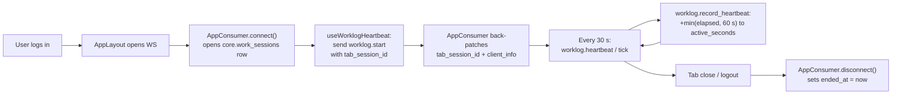
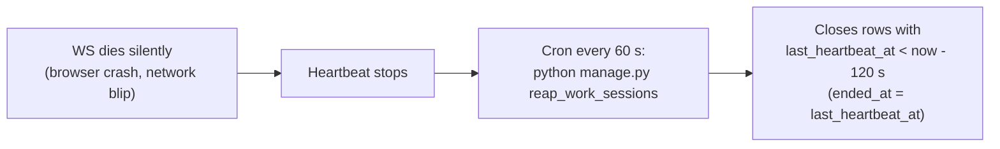

# Work-Time Logging

## What Is This Process?

Phase 3 of the realtime feature (Channels + Redis was Phase 1, Sheet presence was Phase 2). The platform records how many seconds each user is connected — one `core.work_sessions` row per browser-tab WS lifetime. A small chip in the header shows the signed-in user their hours today; a `/worklog` page shows the whole team's hours per day. Both surfaces are open to every authenticated user — **radical transparency**, the rule locked in during scoping.

> Why this is the simplest possible model: "tab open at all counts as working" was the chosen AFK rule, so the heartbeat is a pure liveness ping. No Page Visibility API, no input tracking. The whole feature lives on the same WebSocket the Sheet presence avatars use.

## How It Works (Business Flow)



Background path for crashed clients:



## Data Model

### Table — `core.work_sessions` (managed)

| Column | Type | Purpose |
|---|---|---|
| `id` | BIGINT IDENTITY PK | |
| `user_id` | BIGINT FK → `sys_users` (CASCADE) | indexed `(user, started_at DESC)` |
| `started_at` | DATETIMEOFFSET | WS handshake time |
| `last_heartbeat_at` | DATETIMEOFFSET | updated on every `tick` |
| `ended_at` | DATETIMEOFFSET NULL | WS close OR reaper |
| `active_seconds` | INT | sum of capped per-tick deltas |
| `last_state` | NVARCHAR(10) | `active`/`idle` (forward-compat — Phase 3 only emits `active`) |
| `tab_session_id` | NVARCHAR(40) | client-generated UUID (sessionStorage) |
| `client_info` | NVARCHAR(300) | UA + remote IP |
| `created_at` | DATETIMEOFFSET DEFAULT SYSDATETIMEOFFSET() | |

Secondary index `(ended_at, last_heartbeat_at)` supports the reaper's hot query.

### View — `core.work_session_daily` (`managed=False`)

```sql
CREATE VIEW core_work_session_daily AS
SELECT
    CAST(user_id AS VARCHAR(20)) + '_' + CONVERT(VARCHAR(10), CAST(started_at AS DATE), 23) AS id,
    user_id,
    CAST(started_at AS DATE) AS work_date,
    SUM(active_seconds) AS active_seconds_total,
    MIN(started_at) AS first_seen,
    MAX(COALESCE(ended_at, last_heartbeat_at)) AS last_seen
FROM core_work_sessions
GROUP BY user_id, CAST(started_at AS DATE);
```

`WorkSessionDaily` is the ORM model bound to this view. Django ignores it during migrations (`managed=False`).

## The heartbeat cap rule (the non-obvious bit)

Each `tick` adds `min(now - last_heartbeat_at, 2 × WS_HEARTBEAT_INTERVAL_SECONDS)` to `active_seconds`. The cap is what makes a laptop-sleep-and-resume gap honest: a tab that suspends for 6 h and sends one tick on wake adds ≤ 60 s, not 6 h. Implemented in [`backend/apps/core/services/worklog.py`](../../../backend/apps/core/services/worklog.py).

The default interval is **30 s**, the cap is **60 s**. Both are env-tunable: `WS_HEARTBEAT_INTERVAL_SECONDS`, `WS_IDLE_THRESHOLD_SECONDS`.

## The reaper (host cron, not an in-process timer)

```cron
* * * * * cd /app && /usr/bin/python manage.py reap_work_sessions >> /var/log/ygt/worklog-reaper.log 2>&1
```

`ended_at` is set to the row's `last_heartbeat_at`, not "now" — so a session that silently died at 14:32 isn't credited with the 3 minutes of dead time leading up to the reaper run at 14:35. In-process timers were ruled out: with `gunicorn --workers 3` they would race and double-write `ended_at`.

## REST Surface

All three endpoints require auth only; no role gate. Returned numbers are seconds — the frontend formats `h m`.

| Endpoint | Returns |
|---|---|
| `GET /api/v1/core/worklog/me/?from=&to=` | Self last-N-days with `today_active_seconds` + `total_active_seconds` |
| `GET /api/v1/core/worklog/?user=&from=&to=` | Any user's per-day rows, defaults to last 7 days |
| `GET /api/v1/core/worklog/team/?date=` | One row per active user for a single date (includes zero rows so the page shows the full roster) |

## Code Map

| Concern | File |
|---|---|
| Model + daily-view ORM | [`backend/apps/core/models/work_session.py`](../../../backend/apps/core/models/work_session.py) |
| Migration + view SQL | [`backend/apps/core/migrations/0017_work_sessions.py`](../../../backend/apps/core/migrations/0017_work_sessions.py) |
| Service (heartbeat cap, reaper) | [`backend/apps/core/services/worklog.py`](../../../backend/apps/core/services/worklog.py) |
| WS dispatch + auto open/close | [`backend/apps/core/consumers.py`](../../../backend/apps/core/consumers.py) |
| Reaper cron entry | [`backend/apps/core/management/commands/reap_work_sessions.py`](../../../backend/apps/core/management/commands/reap_work_sessions.py) |
| REST views | [`backend/apps/core/views_worklog.py`](../../../backend/apps/core/views_worklog.py) |
| URL routes | [`backend/apps/core/urls/core.py`](../../../backend/apps/core/urls/core.py) |
| Tests | [`backend/apps/core/tests/test_worklog.py`](../../../backend/apps/core/tests/test_worklog.py) |
| Heartbeat hook | [`frontend/src/hooks/useWorklogHeartbeat.ts`](../../../frontend/src/hooks/useWorklogHeartbeat.ts) |
| Query hooks | [`frontend/src/hooks/useWorklog.ts`](../../../frontend/src/hooks/useWorklog.ts) |
| Header chip | [`frontend/src/components/WorklogChip.tsx`](../../../frontend/src/components/WorklogChip.tsx) |
| Page | [`frontend/src/pages/worklog/WorklogPage.tsx`](../../../frontend/src/pages/worklog/WorklogPage.tsx) |

## Edge Cases Handled

| Case | Handling |
|---|---|
| Multi-tab same user | Each tab = its own WS = its own session row. `tab_session_id` distinguishes them; the daily view sums per user per day so the page shows the union. Tabs idle in the background still count — matches the "tab open" rule. |
| Browser crash (no close frame) | Heartbeats stop → reaper closes the row at the next cron tick, setting `ended_at = last_heartbeat_at`. |
| Laptop sleep > 1 min | Per-tick cap clips the delta to 2 × `HEARTBEAT_INTERVAL`. Session is also closed by the reaper if the sleep exceeds `WS_IDLE_THRESHOLD_SECONDS`; a fresh session opens when the WS reconnects. |
| WS reconnect | The frontend reuses the same `sessionStorage` UUID so analytics can dedupe; the backend opens a new row regardless. |
| Server restart | All open WS sockets drop → consumers' `disconnect` close their rows. Reaper covers any that didn't. |
| Anonymous handshake | Rejected at 4401 by `CookieJWTAuthMiddleware`; no row ever created. |

## Privacy / Transparency

The "everyone sees everyone" rule was a deliberate scoping decision over admin-only or manager-scoped alternatives. The header chip makes the tracking visible to the tracked user (they see their own number alongside everyone else's) — so the surveillance is symmetric.

## Verification

1. **Heartbeat flows**: log in, leave the tab open for 5 minutes, navigate to `/worklog`. Your row shows ~5m (within 1 m jitter).
2. **Sleep handling**: open the app, lock the laptop for 30 min, wake it. The chip should add ≤ 60 s (one tick at cap), not 30 min.
3. **Reaper**: kill the browser process. Wait 2 min, run `python manage.py reap_work_sessions` (or wait for cron). Your last session row's `ended_at` equals its `last_heartbeat_at`, not the reaper-run time.
4. **Page**: `/worklog` shows the team table, sorted most-active first. Inactive users appear with a dim `—`.
5. **Backend tests**: `python manage.py test apps.core.tests.test_worklog` — 8 cases.

## Out of Scope (Phase 3)

- **AFK / input tracking** — explicitly out per the locked AFK rule.
- **Per-page time breakdown** — analytics could add later by extending `WorkSession` with the current route, but not in scope here.
- **Charts** — the page is a table-first MVP. A small line chart for "self last 30 days" is a natural follow-up.
- **Notifications when a colleague crosses N hours** — out of scope; analytics-side concern.
