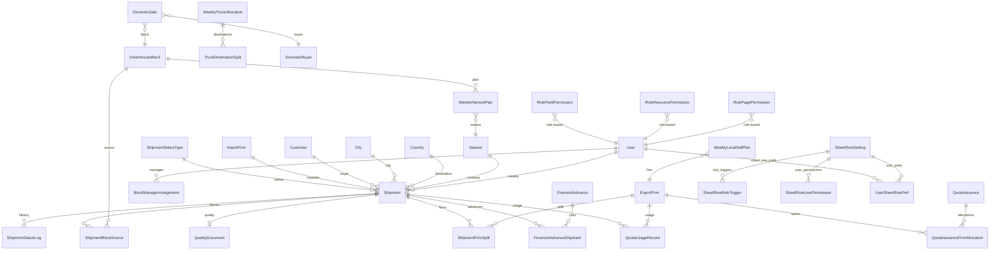

# Data Model Map

> All 40+ Django models organized by app with relationships.

## Entity Relationship Overview

## Core App Models

**File**: `backend/apps/core/models/`

| Model | Key Fields | Purpose |
|-------|-----------|---------|
| **User** | username, role (10 choices), phone, telegram_chat_id | Extends AbstractUser with YGT roles |
| **Country** | code, name_tk/ru/en | Destination countries (TM, KZ, RU) |
| **City** | name, country (FK) | Cities within countries |
| **BorderPoint** | name, country (FK) | Border crossing points |
| **Season** | code, name, start_date, end_date, is_active | Growing seasons |
| **ExportFirm** | code, name_tk/ru/en, tax_code, is_active, is_gapy_satys | YGT's export legal entities (~24) |
| **ImportFirm** | code, name_company, country, city, director_signature (file), is_active | Buyer companies (~111) |
| **Customer** | name (unique), phone, default_country, import_firms (M2M) | Individual buyers |
| **DomesticBuyer** | name, phone | Local market buyers |
| **GreenhouseBlock** | code (A-O), name, is_active | 15 greenhouse blocks |
| **TomatoVariety** | name, code | Tomato types |
| **ProductType** | name, code | Product categories |
| **LoadingLocation** | name | Where trucks load |
| **TruckDestination** | name, code, is_active | Destination routing options |
| **ShipmentStatusType** | code, name_tk/en/ru, step_order (1-13), phase, required_role | 13 lifecycle steps |
| **ShipmentOptionType** | category, code, label_tk/en/ru, icon, sort_order, is_active | Configurable dropdown options |
| **RolePagePermission** | role, page_code, can_view | Page visibility per role |
| **RoleResourcePermission** | role, resource_code, can_view/create/edit/delete | CRUD per role |
| **RoleFieldPermission** | role, resource_code, field_name, can_edit | Field-level edit per role |

## Export App Models

**File**: `backend/apps/export/models/`

| Model | Key Fields | Purpose |
|-------|-----------|---------|
| **Shipment** | cargo_code (unique), date, season, country, customer, status, 8 AD-1 timestamps + status_changed_at (Stream E), weight fields, transport fields, finance fields, vehicle condition | Main record — 1 per truck |
| **ShipmentStatusLog** | shipment (FK), status (FK), changed_by (FK), changed_at, comment | Audit trail per transition |
| **ShipmentFirmSplit** | shipment (FK), export_firm (FK), weight_kg, amount_usd, invoice_number | 1-3 firms per shipment |
| **ShipmentBlockSource** | shipment (FK), block (FK), weight_kg | Source blocks |
| **QualityDocument** | shipment (1:1), 4 boolean certificate flags | Quality certificates |
| **QuotaIssuance** | issue_date, product_type, validity, matched_week/year | Government quota event |
| **QuotaIssuanceFirmAllocation** | issuance (FK), export_firm (FK), kg_quota | Per-firm quota allocation |
| **QuotaUsageRecord** | usage_date, export_firm (FK), kg_used, shipment (FK nullable), status (draft/approved) | Export consumption |
| **WeeklyTruckAllocation** | season, week_number, year, day_of_week, total_planned_kg | Daily truck planning |
| **TruckDestinationSplit** | allocation (FK), destination (FK), truck_count | Trucks per destination |
| **WeeklyLocalSellPlan** | season, export_firm, week_number, year, Mon-Sat plan/actual_kg, status | Domestic sale plan per firm |
| **PriceEntry** | date, city (FK), price_local, price_usd, currency, source | Daily price per city |
| **DomesticMarketPrice** | _(similar to PriceEntry for domestic market)_ | Domestic prices |
| **FinansistAdvance** | batch_code, advance_date, total_amount, currency, purpose, reconciled | Cash advance record |
| **FinansistAdvanceShipment** | advance (FK), shipment (FK), allocated_amount | Advance-shipment link |
| **Notification** | user (FK), message, is_read, created_at | In-app notifications |
| **AuditLog** | user (FK), action, model_name, object_id, object_repr, detail, created_at | Immutable audit trail |
| **SheetRowSetting** | field_key (unique), label_tk/ru/en, description_tk/ru/en, style_color/background, triggered_user (FK nullable), is_locked, is_visible, display_order, version, deleted_at/by | Per-row display + access config for the Sheet (ADR-0008). Soft-deleted with `.active()` manager. |
| **SheetRowRoleTrigger** | row (FK→SheetRowSetting), role | One row per allowed role per setting. Replaces old single `triggered_role` column (ADR-0009). |
| **SheetRowUserPermission** | row (FK→SheetRowSetting), user (FK), deleted_at/by | Extra users who can edit the cell regardless of `is_locked` (ADR-0010). Soft-deleted. |
| **Comment** | shipment (FK), user (FK), content, field_key (nullable), parent_comment (FK nullable), assignee (FK nullable), is_done, is_system, is_deleted, mentions_users (M2M), role_mentions (M2M) | Cell-anchored comment or task with @mention support. |
| **SalesReport** | shipment (1:1), price_per_kg, total_usd, expense fields, currency, exchange_rate, created_by | Final sales reconciliation record per shipment. |
| **TruckSplitDefault** | firm_count (unique 1-3), weight_kg | Admin-configurable default official weight per firm count (used in R9 auto-split). |
| **UserSheetRowPref** | user (FK), row (FK→SheetRowSetting), position (int nullable, sparse), is_hidden (bool), updated_at | Per-user override for sheet row order + visibility. NULL position = inherit admin `display_order`. Part of ADR-0008 Phase 2a. |

## Greenhouse App Models

**File**: `backend/apps/greenhouse/models/`

| Model | Key Fields | Purpose |
|-------|-----------|---------|
| **WeeklyHarvestPlan** | season, block, week_number, year, 6 plan_kg, 6 actual_kg, status, approval fields | Weekly harvest per block |
| **BlockManagerAssignment** | user (FK), block (FK), is_active | Who manages which block |
| **DomesticSale** | date, buyer (FK), block (FK), export_firm (FK nullable), weight_kg, variety, price_per_kg | Local sale record |

## Key Patterns

- **All FKs to core models**: `on_delete=PROTECT` (can't delete referenced data)
- **Cross-app FKs**: String references (`'core.ExportFirm'`), never direct imports
- **Cyrillic fields**: `db_collation='Cyrillic_General_CI_AS'` on all text with TM/RU content
- **Money/weight**: `DecimalField(max_digits=12, decimal_places=2)`, never FloatField
- **No JSONField/ArrayField**: MSSQL incompatible — use related tables instead
- **bulk_create**: Always `batch_size=500`
