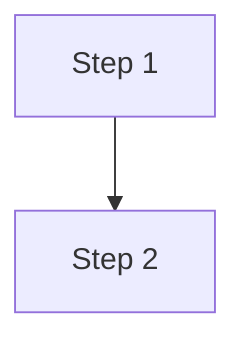
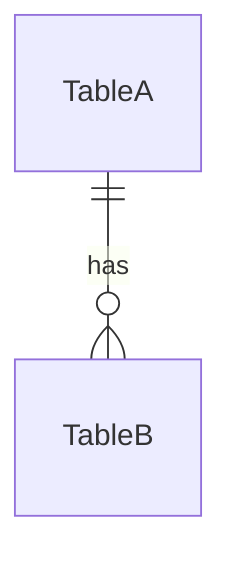

# {{Process Name}}

## What Is This Process?

{{Business explanation in plain language. What problem does it solve? Who uses it? When?}}

## How It Works (Business Flow)

## Database

### Tables

| Table | Purpose | Key Columns |
|-------|---------|-------------|
| ... | ... | ... |

### Relationships

### Key Constraints

- ...

## Backend Implementation

### Models

**File**: `backend/apps/.../models/...`

| Field | Type | Notes |
|-------|------|-------|
| ... | ... | ... |

### Services

**File**: `backend/apps/.../services.py`

| Function | Input | Output | Logic |
|----------|-------|--------|-------|
| ... | ... | ... | ... |

### Serializers

**File**: `backend/apps/.../serializers.py`

- **Read**: ...
- **Write**: ...

### ViewSet & Endpoints

| Method | Endpoint | Action | Auth |
|--------|----------|--------|------|
| GET | /api/v1/... | List | IsAuthenticated |

### Custom Actions

- ...

## Frontend Implementation

### Pages

**File**: `frontend/src/pages/.../...`

**Columns/Fields Displayed**:
1. ...

**Filters**: ...

**Actions**: ...

### Components Used

- ...

### Hooks

| Hook | Endpoint | Params | Returns | Stale Time |
|------|----------|--------|---------|------------|
| ... | ... | ... | ... | ... |

### TypeScript Types

- ...

### User Interactions

- ...

## Roles & Permissions

| Role | Can See | Can Do |
|------|---------|--------|
| ... | ... | ... |

## Connections to Other Processes

- [[...]] — ...
